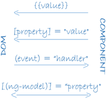

| [На головну](../)                                | [Розділ](README.md)             |
| ------------------------------------------------ | ------------------------------- |
| [<- Налаштування віджетів (Widgets)](Widgets.md) | [Button (Кнопка) ->](Button.md) |

## Основи AngularJS в Node-RED dashboard

### Про AngularJS

Модуль Node-RED Dashboard базується на шаблонах AngularJS. [AngularJS](https://uk.wikipedia.org/wiki/AngularJS) – це фреймворк для скриптів JavaScript, що вбудовуються в HTML і виконуються на стороні WEB-клієнта. AngularJS базується на концепції [MVC](https://uk.wikipedia.org/wiki/AngularJS) (Модель-вигляд-контролер), в якій застосунок умовно ділиться на три взаємопов’язані частини: модель даних; вигляд (зовнішній інтерфейс); модуль керування (контролер), що здійснює обробку подій від інтерфейсу користувача та зв’язує вигляд з даними. У AngularJS зовнішній вигляд сторінки є проекцією моделі даних через шаблон HTML. Це означає, що кожного разу, коли дані змінюються, AngularJS оновлює відповідні точки зв'язування, які змінюють вигляд. [Точки зв’язування](https://angular.io/guide/architecture-components) можуть проводитись через [прив’язування даних ](https://metanit.com/web/angular2/2.5.php)(data binding), канали (pipes) та директиви (directives).

Користуватися Dashboard в Node-RED можна і без розуміння AngularJS. Нижче пояснюються деякі основи синтаксису прив’язки даних та використання фільтрів, що потребується для налаштування зв’язування віджетів з даними та їх відображення. Більш глибокі знання AngularJS потрібні для створення власних віджетів та використання шаблонів.  

### Прив’язування даних ([Data binding](https://angular.io/guide/architecture-components#data-binding))

AngularJS підтримує прив'язування даних (як одностороннє так і двостороннє), механізм координації частин шаблону з частинами компонента. До шаблону HTML додається розмітка прив’язування (спеціальні символи), щоб сказати Angular де і як підключити дані. Наступна діаграма показує чотири форми розмітки прив’язування даних. Кожна форма має напрямок: до [DOM](https://uk.wikipedia.org/wiki/Об'єктна_модель_документа), від DOM або до обох (рис.3.11).



рис.3.11. Форми прив’язування даних та використовувана розмітка.

Один з видів прив’язування є підстановочні вирази ([Interpolation](https://angular.io/guide/template-syntax#interpolation----)), які знаходяться в потрібному місці HTML і виділяються подвійними фігурними дужками `{{value}}`. Таким чином, все що знаходиться в цих дужках буде вираховуватися як Angular вираз, а результат розміщуватися у вказаному місці.  У Node-RED, для прикладу Label (мітка) в налаштуваннях віджета може бути встановлена в 

`{{` `msg.topic` `}}`

, що буде значити, що значення властивості вхідного повідомлення msg.topic буде використовуватися у відображенні мітки. 

Кожен вузол віджета може парсити `msg.payload `щоб зробити його розміщення на дисплеї. Ця перетворена версія представляється як змінна що називається `value`. Таким чином в замість `{{msg.payload}}` можна використовувати підстановку `{{value}}`. 

Інші форми прив’язування описані в розділі [Template](#_3.20._Template_(Шаблон)).

**Angular** **вирази** – це вирази, написані на JavaScript, що можуть використовуватися в прив’язуваннях. Однак далеко не всі вирази JavaScript можуть використовуватися в якості підстановочних. Зокрема можна використовувати арифметичні операції, виклик деяких функцій. Не дозволяється використовувати:

·     присвоєння (`=`, `+=`, `-=`, ...)

- `new`
- послідовність виразів з символами `;` або `,`

- операції increment та decrement (`++` та `--`)

- побітові оператори «`|»` та «`&»`


- нові оператори такі як «`|»`, «`?» «.»` та «`!»`.

### Ангулярні фільтри 

У Node-RED, вирази можуть включати фільтри, які форматують (перетворюють) значення виразу для відображення його користувачеві. Це реалізовано через механізм AngularJS каналів ([pipe](https://angular.io/guide/architecture-components#pipes)). У Node-RED dashboard фільтри можуть бути використані в шаблонах представлень. Загальний запис застосування фільтра в виразах на сторінці представлення виглядає так:

```
{{ expression | filter }}
```

де `|` - це оператор каналу, `filter` – застосований фільтр 

Наприклад, якщо записати `{{12 | currency}}`, то буде застосований вбудований фільтр для відображення валюти. У результаті ми побачимо (в залежності від локальних налаштувань) - $12.00. 

Фільтрів може бути багато:

```
{{ expression | filter1 | filter2 | ... }}
```

У цьому випадку перший результат буде оброблений другим фільтром і т.д .. Такий тип запису і обробки називається 'chaining'.

Ще у фільтрів можуть бути аргументи.

```
{{ expression | filter: argument1: argument2:... }}
```

Наприклад для відображення числового значення може бути використаний фільтр `number, який` дозволяє форматувати числа. Наприклад, 

`{{234.5677 | number:1}}%`

Результатом роботи даного фільтра буде число 234,6 доповнено знаком %. Числовий параметр після двокрапки вказує, скільки залишиться чисел після коми (умовною, оскільки в даному випадку для поділу цілої і дробової частини використовується точка). Якщо числовий параметр більше кількості розрядів після коми, то при виведенні число доповнюється нулями. Для введення спеціальних символів можна використовувати їх [назву або код HTML](https://www.w3schools.com/charsets/ref_html_entities_4.asp), наприклад: &deg покаже символ градуса °.

Використовуючи фільтри `lowercase` і `uppercase`, ми можемо приводити вміст до нижнього і верхнього регістру відповідно. Наприклад,

 `{{question.text | lowercase}}`

Щоб вивести дату в певному форматі застосовується фільтр `date`. Як вираз використовується кількість мілісекунд, що пройшли з початку епохи Unix (тобто з 1 січня 1970 року). Наприклад, якщо в вузлі Text означити Value як вихід з вузла Inject типу Timestamp, використовуючи фільтр {{value | date:'dd.MM.yyyy hh:mm:ss'}} , то ми отримаємо значення дати та часу (рис.3.12).  


рис.3.12. Приклад використання фільтру для виведення відмітки часу у форматі дати та часу.

Повний перелік AngularJS каналів даний за [цим посиланням](https://angular.io/api?type=pipe). 

[Button (Кнопка) ->](Button.md)