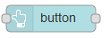

| [На головну](../) | [Розділ](README.md)                      |
| ----------------- | ---------------------------------------- |
|                   | [Dropdown (Спадне меню) ->](Dropdown.md) |

## Button (Кнопка)

Додає до інтерфейсу користувача кнопку. Натискання кнопки генерує повідомлення з встановленим `msg.payload` рівним значенню в полі Payload (рис.3.13). Якщо в налаштуваннях це поле не вказано, використовується ідентифікатор вузла (node id). 

рис.3.13. Налаштування та зовнішній вигляд кнопки.

Можна встановити кольори тексту та фону введенням їх символьної назви або [числового представлення в HTML](https://htmlcolorcodes.com/). Їх також можна змінювати властивістю повідомлення, встановивши в полі значення ім'я властивості, наприклад `{{msg.background}}`. 

Якщо встановлено опцію `If msg arrives on input, pass through to output:` то повідомлення на вході буде ініціювати дію, аналогічну натисканню кнопки. Вихід payload при цьому буде таким, як означено в конфігурації вузла.

[Dropdown (Спадне меню) ->](Dropdown.md)