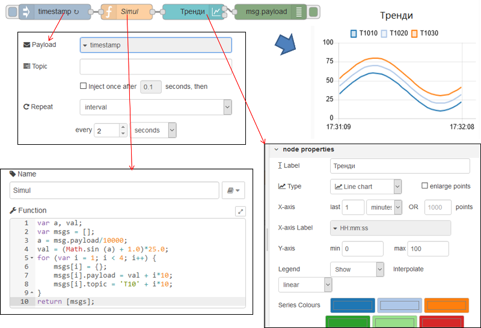
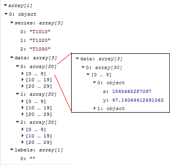
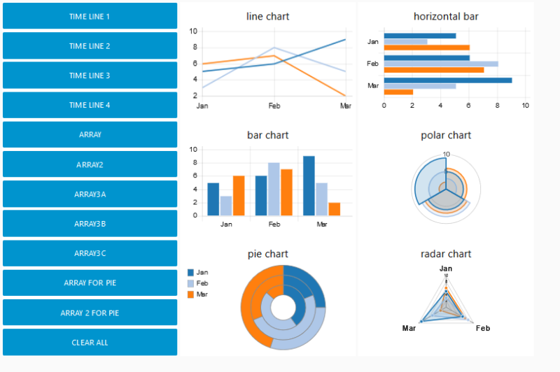

| [На головну](../)                          | [Розділ](README.md)                                         |
| ------------------------------------------ | ----------------------------------------------------------- |
| [<- Audio out (Вивід аудіо)](Audio_out.md) | [Show notification (Повідомлення) ->](Show_notification.md) |

## Chart (Діаграма)

 Додає до інтерфейсу користувача діаграму з відображенням значень, що надходять на вхід у вигляді різного типу діаграм (рис.3.27).  

Це може бути лінійний графік від часу (time based line chart), стовпчикова діаграма (bar chart, вертикальна або горизонтальна) або кругова діаграма(pie chart).

рис.3.27. Вікно налаштування вузла Chart.

Кожне значення `msg.payload` перетворюється в числове значення. Якщо перетворення не вдається, повідомлення ігнорується. Властивість максимального і мінімального значення осі `Y` (`Y axis Min` та `Max`) є опціональними, якщо вони не вказуються - застосовується авто-масштабування.`

Вісь X для діаграм типу Line Chart означує часове вікно або максимальну кількість точок для відображення. Старі дані автоматично видаляються з графіка. Мітки осі можуть бути відформатовані за допомогою рядка [Moment.js time formatted](https://momentjs.com/docs/#/displaying/format/), відформатованого за часом.

Поле **Blank label** використовується для відображення тексту на діаграмі, коли дані відсутні. 

Мітку над діаграмою можна змінювати властивістю повідомлення, виставивши її в поле label, наприклад `{{msg.topic}}`.

На тій самій діаграмі можуть бути показані кілька послідовностей (series). Для цього  використовуючи різне значення `msg.topic` для кожного вхідного повідомлення, колір кривих означується в налаштуванні вузла і може бути зміненим. Для прикладу розглянемо фрагмент програми з використанням діаграм типу Line Chart, зображеної на рис.3.27. 

рис.3.28. Фрагмент програми та результат її роботи для використання Chart типу Line Chart.

Вузол `Timestamp` формує у вихідному повідомленні відмітку часу, яку вузол `Simul` (для імітації) обробляє як число для здобуття кута в радіанах для синусоїди. Отримане значення синусоїди (`Math.sin`) зміщується на +1.0 та множиться на масштабний коефіцієнт, щоб отримати значення від 0 до 50. Далі створюється масив з 3-х об’єктів msgs, для кожного з яких означується payload (кожне зміщене на 10 відносно `val`) та `topic` («T1010», «T1020», «T1030»). На вихід відправляється масив повідомлень, що [формує їх послідовність](#_Відправка_кількох_повідомлень). Таким чином вузол тренди отримує повідомлення з різними topic для яких формує графіки залежності від часу тривалістю 1 хвилину. На легенді видно назви цих графіків, тобто topic. Кольори вибираються з послідовності, яка означена в самому вузлі.

Вихід вузла містить масив стану діаграми, який, за необхідності, може бути збережений. Це може бути передано до вузла діаграми для повторного відображення збережених даних. Другий вихід вузла більше не повинен використовуватися і буде видалено в майбутньому випуску. Використовуйте вузол `control` для запуску відновлення, якщо це необхідно. На рис.3.29 показано як виглядить вихідне повідомлення з попереднього прикладу, що показано на рис.3.28. При кожному оновленні вузла, на вихід в payload записується масив з одного елементу object, що містить три масиви об’єктів: «series», «data» та «labels». Для типу діаграми LineChart мають значення тільки «series» та «data». Масив «series» вказує на назви послідовностей (графіків), тобто на їх topic. Масив «data» - є масивом даних з трьох елементів для кожної послідовності (графіку), кожний з яких є масивом об’єктів для кожної точки на графіку : x – відмітка часу, y – значення.  

​    рис.3.29. Вигляд вихідного повідомлення з вузла Тренди з прикладу.

Згідно документації, за допомогою властивості `msg.label` для інших типів діаграм (не line chart) можна показати кілька стовпчиків (labels) тієї ж послідовності. Однак на практиці `msg.topic `використовується аналогічно як і `msg.label`.  Якщо модифікувати наведений вище приклад, добавивши такі самі вузли chart але з іншими типами, то вийде наступний результат (див.рис. 3.30). Вихідне повідомлення з вузлів цього типу показані на рис.3.31. Як видно, замість масиву “series” на виході вузла формується масив «labels».  

​    рис.3.30. Фрагмент програми та результат її роботи для використання Chart різних типів.

    

рис.3.31. Вигляд вихідного повідомлення з вузла Pie Chart з прикладу.

Вхідне повідомлення `msg.payload` що містить пустий масив `[]`автоматично очищає діаграму. Дивіться [це посилання](https://github.com/node-red/node-red-dashboard/blob/master/Charts.md) для розуміння як наперед сформатовані дані можна вивести на готову діаграму. Інтерфейс показаний на рис.3.32

рис.3.32. Різні типи діаграм.

Див. також https://github.com/node-red/node-red-dashboard/blob/master/Charts.md

[Show notification (Повідомлення) ->](Show_notification.md)