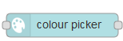
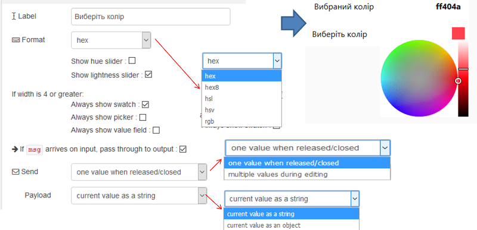

## 3.12. Colour picker (Вибір кольору)

Додає до інтерфейсу користувача панель вибору кольору.

Якщо ширина групи становить 4 або більше, то панель вибору кольору буде завжди видимою (рис.3.20-3.21). Формат може бути rgb, hex, hex8, hsv або hsl. Прозорість підтримується для всіх, крім hex. 

рис.3.20. Налаштування та вигляд Colour picker.

рис.3.21. Налаштування та вигляд Colour picker з усіма видимими повзунками налаштування.