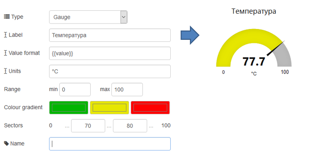
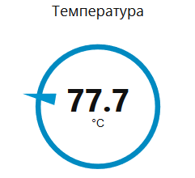

## 3.15. Gauge (Індикатор)

Додає до інтерфейсу користувача віджет індикатору (рис.3.24).

рис.3.24. Налаштування Gauge.

Віджет намагається перетворити  `msg.payload` в числове значення і від форматувати його відповідно до означеного **Value Format**, використовуючи ангулярні фільтри. Можуть бути вказані кольори кожного з 3 секторів. Тип означує зовнішній вигляд індикатору. В таб.3.1 вказаний приклад вигляду індикатору при тих же налаштуваннях, але різних типів.

Таб.3.1. Приклад вигляду індикатору при тих же налаштуваннях, але різних типів.

| Gauge                   | Donut                   | Compass                 | Level                   |
| ----------------------- | ----------------------- | ----------------------- | ----------------------- |
|  |  |  |  |

 