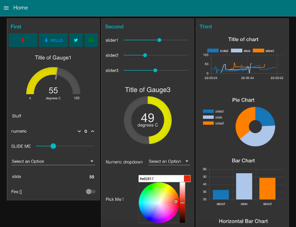

[<- На головну](../)

# 3. Dashboard (node-red-dashboard) 

Модуль **dashboard** (**приладова панель**) надає набір вузлів в Node-RED для швидкого створення інформаційної панелі. З версії 2.10.0 можна створювати та встановлювати вузли віджетів, подібно до інших Node-RED вузлів. 

рис.3.1. Приклад приладової панелі

- [1. Інсталяція](install.md) 
- [2. Компонування та налаштування](config.md) 
- [3. Налаштування віджетів (Widgets)](Widgets.md) 
- [4. Основи AngularJS в Node-RED dashboard](AngularJS.md) 
- [5. Button (Кнопка)](Button.md) 
- [6. Dropdown (Спадне меню)](Dropdown.md) 
- [7. Switch (Перемикач)](Switch.md) 
- [8. Slider (Повзунок)](Slider.md) 
- [9. Numeric (Числове поле)](Numeric.md) 
- [10. Text input (Текстове поле для вводу)](Text_input.md) 
- [11. Date picker(Вибір дати)](Date_picker.md) 
- [12. Colour picker (Вибір кольору)](Colour_picker.md) 
- [13. Form (Форма)](Form.md) 
- [14. Text (Вивід тексту)](Text.md) 
- [15. Gauge (Індикатор)](Gauge.md) 
- [16. Audio out (Вивід аудіо)](Audio_out.md) 
- [17. Chart (Діаграма)](Chart.md) 
- [18. Show notification (Повідомлення)](Show_notification.md) 
- [19. Ui control (Керування UI)](Ui_control.md) 
- [20. Template (Шаблон)](Template.md) 

## Додаткові віджети сумісні з node-red-dashboard:

- [node-red-node-ui-list](https://flows.nodered.org/node/node-red-node-ui-list) - A Node-RED widget node for showing a list of items
- [node-red-contrib-ui-etable](https://flows.nodered.org/node/node-red-contrib-ui-etable) - A Node-RED UI Node to create an editable table based on the Tabulator libraries.
- [node-red-node-ui-lineargauge](https://flows.nodered.org/node/node-red-node-ui-lineargauge) - A Node-RED ui node to display a linear gauge on the dashboard.
- [node-red-node-ui-microphone](https://flows.nodered.org/node/node-red-node-ui-microphone) - A Node-RED ui node to record audio on a dashboard.
- [node-red-node-ui-table](https://flows.nodered.org/node/node-red-node-ui-table) - A Node-RED UI widget node which displays data as a table
- [node-red-node-ui-vega](https://flows.nodered.org/node/node-red-node-ui-vega) - Node-RED UI widget node for Vega visualization grammar- пакунок з великою кількістю способів відображення
- [node-red-contrib-ui-actions](https://flows.nodered.org/node/node-red-contrib-ui-actions) - This project is a set of custom dashboard nodes that support advanced control of the UI.
- [node-red-contrib-ui-artless-gauge](https://flows.nodered.org/node/node-red-contrib-ui-artless-gauge) -  Gauge with minimal design
- [node-red-contrib-ui-contextmenu](https://flows.nodered.org/node/node-red-contrib-ui-contextmenu) - A Node-RED node to display a popup contextmenu in the Node-RED dashboard
- [node-red-contrib-ui-heatmap](https://flows.nodered.org/node/node-red-contrib-ui-heatmap) - A Node Red node to show a heat map (based on the [heatmap.js](https://www.patrick-wied.at/static/heatmapjs/) library).
- [node-red-contrib-ui-led](https://flows.nodered.org/node/node-red-contrib-ui-led) - A simple LED status indicator for the Node-RED Dashboard
- [node-red-contrib-ui-level](https://flows.nodered.org/node/node-red-contrib-ui-level) -  Linear level indicator
- [node-red-contrib-ui-media](https://flows.nodered.org/node/node-red-contrib-ui-media) - A Node-RED UI node to show media files (image and video) on the dashboard.
- [node-red-contrib-ui-state-trail](https://flows.nodered.org/node/node-red-contrib-ui-state-trail) - Trail of state changes over time
- [node-red-contrib-ui-statechart](https://flows.nodered.org/node/node-red-contrib-ui-statechart) - Bar chart to visualize numeric values in relation, together with state represented by color.
- [node-red-contrib-ui-svg](https://flows.nodered.org/node/node-red-contrib-ui-svg) - A Node-RED widget node to show interactive SVG (vector graphics) in the dashboard
- [node-red-contrib-ui-upload](https://flows.nodered.org/node/node-red-contrib-ui-upload) - Node-RED Dashboard UI widget node for uploading a file content by Socket.io streaming
- [node-red-contrib-ui-value-trail](https://flows.nodered.org/node/node-red-contrib-ui-value-trail) - Node-RED dashboard widget to show small trail of value history near some numeric value
- [node-red-contrib-ui-week-schedule](https://flows.nodered.org/node/@clysema/node-red-contrib-ui-week-schedule) - A Week Schedule UI for the Node-RED Dashboard
- [node-red-contrib-dashboard-sum-bars](https://flows.nodered.org/node/node-red-contrib-dashboard-sum-bars)
- [node-red-contrib-dashboard-average-bars](https://flows.nodered.org/node/node-red-contrib-dashboard-average-bars)
- 

Додаткові посилання :

https://flows.nodered.org/node/node-red-dashboard 

https://github.com/node-red/node-red-dashboard/wiki/Creating-New-Dashboard-Widgets 