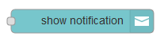
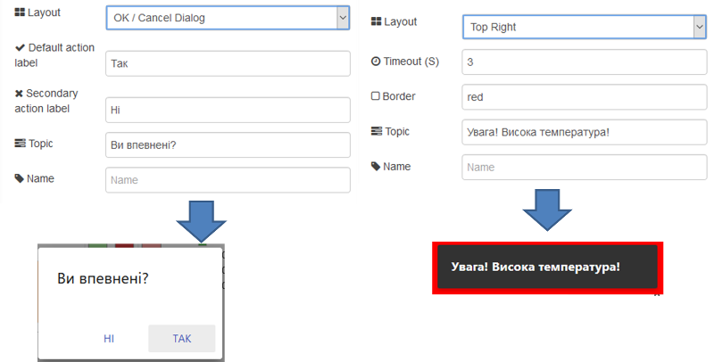

## 3.18. Show notification (Повідомлення)

Показує `msg.payload` як спливаюче сповіщення або діалогове повідомлення з кнопками OK/Cancel (рис.3.33). 

Якщо не встановлюється додатковий колір підсвічування рамки в налаштуваннях, то він може бути встановлений динамічно за допомогою `msg.highlight`. Також можна налаштувати місце (верхній/нижній правий/лівий куток екрану) та тривалість повідомлення. 

При вибору діалогового вікна (Ok/Cancel Dialog), вузол повертає рядок `msg.payload` в якому вказує натиснуто кнопку. Означення напису для другої кнопки (скасування) є необов'язковою, як і значення, що повертається `msg.topic`.

рис.3.33. Варіанти налаштування Show notification.

 