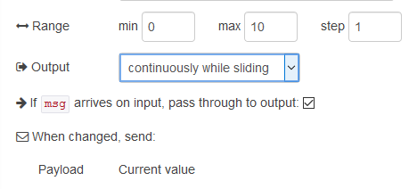

[<- На головну](../) 	 [Розділ](README.md)	 [Numeric (Числове поле) ->](Numeric.md)

## Slider (Повзунок)

Додає до інтерфейсу користувача віджет повзунка. Користувач може змінювати своє значення в межах, що встановлені налаштуванням min та max з кроком step (рис.3.17). Кожна зміна значення буде генерувати повідомлення зі значенням, встановленим як payload.

 

рис.3.17. Налаштування Slider.

Якщо перетворення не вдасться, буде використано значення min. Якщо значення змінюється, воно також передається на вивід. 

Примітка: вхідне повідомлення msg для вузла повзунка не змінить відображення інформації по стан, якщо вихід вузла повзунка не з'єднаний з іншим вузлом.

[Numeric (Числове поле) ->](Numeric.md)