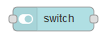
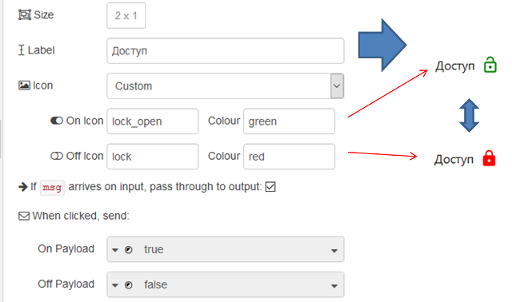

| [На головну](../)                        | [Розділ](README.md)               |
| ---------------------------------------- | --------------------------------- |
| [<- Dropdown (Спадне меню)](Dropdown.md) | [Slider (Повзунок) ->](Slider.md) |

## Switch (Перемикач)

Додає до інтерфейсу користувача перемикач. Кожна зміна стану перемикача буде генерувати `msg.payload` з вказаними значеннями On і Off.

рис.3.16.Налаштування елементу Switch

Колір увімкнення/вимкнення та значок увімкнення/вимкнення є необов'язковими. Якщо вони є присутніми, перемикач за замовчуванням буде замінено відповідними іконками та відповідними кольорами (див. рис.3.16).

[Slider (Повзунок) ->](Slider.md)