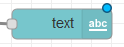
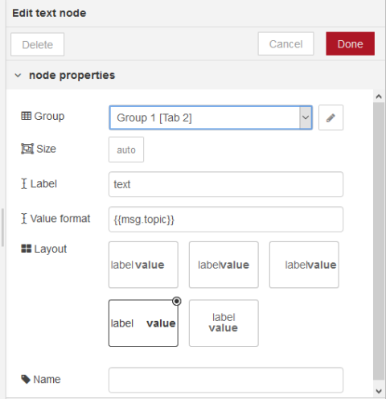

[<- На головну](../)  [Розділ](README.md)

## 3.14. Text (Вивід тексту)

Додає до інтерфейсу користувача поле для виведення тексту.
 Кожний отриманий `msg.payload` оновить текст на основі наданого формату значення **Value Format**. (рис.3.23)

рис.3.23. Налаштування Text.

 