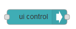

| [На головну](../) | [Розділ](README.md)                |
| ----------------- | ---------------------------------- |
|                   | [Template (Шаблон)->](Template.md) |

## Ui control (Керування UI)

Дозволяє динамічне керування Dashboard. За замовченням функція змінює активну вкладку. На вхід подається повідомлення де `msg.payload` має бути або об'єктом форми `{"tab":"my_tab_name"}`, або просто бути назвою вкладки або числовим індексом (з 0) вкладки або посилання, яка буде показане (рис.3.34).

Якщо надіслати пусту назву вкладки "" оновиться поточна сторінка. Також можна надіслати "+1" для переключення на наступну вкладку та "-1" - на попередню. 

Видимість окремих груп віджетів може керуватися payload, за подібною формою: 

```json
{"group":{"hide":["tab_name_group_name_with_underscores"],"show":["reveal_another_group"], "focus":true}}
```

, де `focus` є необов'язковим і призведе до прокручування екрана, щоб показати цю групу, якщо потрібно. Імена груп є ідентифікаторами груп і зазвичай формуються з назви закладок та назви групи, об'єднаної символом підкреслення, що замінює всі пробіли. Наприклад, на рис.32 показаний фрагмент програми, в якому використовується перемикач «Тренди» що перемикає видимість двох груп елементів «Група1» та «Група2», які знаходяться на вкладці «Приклади». 


рис.3.34. Приклад використання Ui control для перемикання видимості груп.

Коли будь-який клієнт браузера підключається або втрачає зв'язок, цей вузол видає `msg`, що містить:

- `payload` - *connect* (підключення) або *lost* (втрата)
- `socketid` - ідентифікатор сокета (це буде змінюватися кожного разу, коли браузер перезавантажує сторінку).
-  `socketip` - ip-адреса, з якої виникло з'єднання.


На рис.3.34 показаний приклад виведення повідомлень з вузла ui_control. 

[Template (Шаблон)->](Template.md)