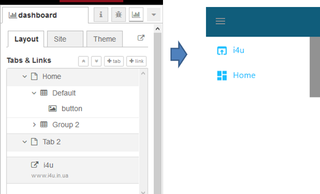
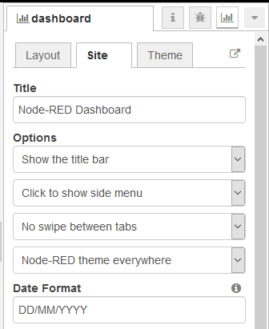

| [На головну](../)              | [Розділ](README.md)                              |
| ------------------------------ | ------------------------------------------------ |
| [<- Інсталяція](Інсталяція.md) | [Налаштування віджетів (Widgets) ->](Widgets.md) |

## Налаштування

Типова URL-адреса для інформаційної панелі базується на наявному Node-RED httpRoot-шляху, додавши `/ui`. Це можна змінити у файлі ` settings.js` Node-RED - `ui:{path:"ui"}`. 

Ви також можете додати власне експрес-проміжне програмне забезпечення для обробки запитів, використовуючи властивість `ui: {middleware: your_function}` у `settings.js`. Наприклад

```js
ui: { path: 'ui', middleware: function (req, res, next) {
            // Do something more interesting here.
            console.log(req.url);
            next()
        }
    },
```

Ви також можете встановити приладову панель лише для читання за допомогою `ui: {readOnly: true}`. Це не перешкоджає взаємодії користувача з інформаційною панеллю, але ігнорує всі оновлення, що надходять з інформаційної панелі.

## Компонування

Основні властивості, що відносяться до Dashboard налаштовуються через відповідний пункт меню бічної панелі. 

Компонування приладової панелі розглядається у вигляді сітки, до якої прив’язуються елементи (віджети). Сітка вимірюється в одиницях сітки (**unit**), які за замовченням рівні 48px шириною з 6px зазором. За необхідності параметри одиниці та зазори можна змінити в налаштуваннях dashboard -> Site (рис.3.2)


рис.3.2. Налаштування одиниці сітки. 

Приладовий інтерфейс ділиться на вкладки (окремі сторінки), які створюються і налаштовуються на вкладці бічної панелі Layout (компонування).  В налаштуваннях можна змінити порядок вкладок, груп і віджетів, і добавити та редагувати інші властивості. Також тут можна добавити в меню **посилання** (**Links**) на інші веб-сторінки. Це може опціонально бути відкритим в iframe - якщо дозволено цільовою сторінкою (рис.3.3).

 



рис.3.3. Вкладки.

В налаштуваннях Site доступні для зміни також інші властивості, зокрема заголовок (Title), опції (Options) та формат дати (Date Format) (рис.3.4).

. 



рис.3.4. Властивості сайту.

Опції дозволяють сховати рядок заголовка, дозволити переміщуватися збоку між вкладками на сенсорному екрані. Можна також встановити та налаштувати тему, що використовується для відображення.

Елементи (**віджети**) об’єднуються в **групи** (**group**), для яких вказується ширина в одинцях сітки. За замовченням це 6 одиниць (рис.3.5-3.6). 


рис.3.5. Налаштування розміщення груп одна відносно одної в налаштуваннях dashboard -> Site.


рис.3.6. Налаштування розміру групи

Кожен елемент на панелі, що представлений вузлом, - **віджет** (**widget**), розміщується в конкретній групі, яка вибирається в його налаштуваннях (рис.3.7). Для віджета налаштовується ширина, яка за замовченням вказана як «авто» - це значить що елемент буде заповнюватися по ширині групи, в якій знаходиться. Значення ширини можна також встановити її фіксованою в кількостях одиниць.


рис.3.7. Налаштування розміщення віджета в групі

 Алгоритм компонування приладової панелі завжди намагається помістити елементи в верхньому лівому кутку контейнеру - це відноситься як до розміщення груп на сторінці, так саме і до розміщення віджетів в групі. Тобто, з урахуванням групи шириною 6, якщо Ви добавляєте шість віджетів, кожен з шириною 2, тоді вони будуть викладені в два рядки – по три віджета в кожному.  Якщо Ви добавляєте дві групи з шириною 6, вони будуть розміщуватися один біля одного до тих пір, поки дозволяє ширина вікна браузера. Якщо Ви зменшуєте ширину вікна браузера, в деякий момент друга група буде зміщена нижче першої в одну колонку.  Це дозволяє використовувати декілька груп якщо це можливо, а не одну велику групу, так щоб сторінки могли динамічного змінювати розмір для малих екранів. 

На вкладці Theme (рис.3.8) можна означити стилі сторінок.


рис.3.8. Налаштування стилю

### Link (посилання)

The **Open in** field controls whether the link opens in a *New Tab*, or if the link is opened within an *iframe* on the same page. Some sites, including Google, do not allow the rendering of their page inside an iframe. If you select the *iframe* option and the site does not show, this is simply because that site forbids the use of it inside an iframe.

### Spacer (пустий простір)

ToDo

### Tab (закладка)

ToDo

### Group (група)

ToDo

### Base (база UI)

ToDo

This *ui_base* node is the main node that all
other dashboard widget nodes communicate to.

One instance is required to support the dashboard.

If you have no dashboard you can delete this node.
It will be re-created automatically if required.


[Налаштування віджетів (Widgets) ->](Widgets.md)

