# node-red-contrib-ui-svg

[Джерело](https://github.com/bartbutenaers/node-red-contrib-ui-svg)

A Node-RED widget node to show interactive SVG (vector graphics) in the dashboard.

## Введення в SVG

Scalable Vector Graphics (SVG) - це формат векторних зображень на основі XML для двовимірної графіки з підтримкою інтерактивності та анімації. Ми не будемо тут пояснювати, як це працює, оскільки Інтернет наповнений інформацією про це.

Схема SVG містить ряд елементів SVG, які браузер буде відображати зверху вниз. Наприклад:

```xml
<svg ...>
  <image .../>
  <circle .../>
  <text .../>
</svg>
```

Браузер спочатку нарисує (фонове) зображення, потім коло (зверху зображення) і так далі ...

Кожен із цих елементів SVG має атрибути (колір заливки, ...), може реагувати на події (натискання, ...) та може бути анімований (наприклад, зменшити ...).

## Використання вузла

💥 Подивіться на  [WIKI](https://github.com/bartbutenaers/node-red-contrib-ui-svg/wiki) де показано посібник крок-за-кроком

Цей вузол можна використовувати для візуалізації всіх видів графічних матеріалів наNode-RED dashboard. Це може варіюватися від простої графіки (наприклад, кругла кнопка, ...) до дуже складної графіки (схеми поверхонь, промислові процеси, трубопроводи, електропроводка, ...). Але навіть ця складна графіка буде складатися з кількох простих графічних фігур. Наприклад, ***план поверху*** насправді є простим зображенням вашого поверху, а серія інших елементів SVG (наприклад, піктограми Fontawesome), намальованих поверх цього (фонового) зображення.

Просто розгорніть рядок SVG на екрані налаштування, і інформаційна панель Node-RED відобразить вашу векторну графіку:

[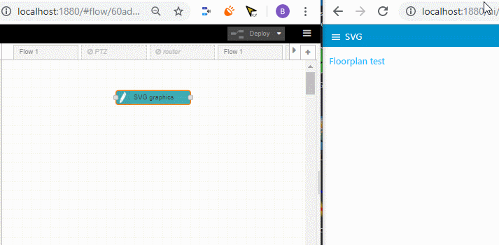](https://user-images.githubusercontent.com/14224149/65639986-94e63680-dfe9-11e9-8086-89d78394301b.gif)

Але що, якщо ви не знайомі з синтаксисом SVG. Не хвилюйтеся, ми інтегрували [DrawSvg](https://github.com/bartbutenaers/node-red-contrib-ui-svg#DrawSvg-drawing-editor) редактор малювання на екрані конфігурації нашого вузла.

## Конфігураційні екрани 

Екран конфігурації вузла складається з ряду вкладок, які описані нижче.

### Editor

[Editor](https://github.com/bartbutenaers/node-red-contrib-ui-svg/tree/master/docs/tabsheet_editor.md) tab sheet

[DrawSvg](http://drawsvg.org/) - це безкоштовний редактор схем SVG, який повністю працюватиме у вашому браузері, тому установка не потрібна. Ми інтегрували DrawSvg у цей вузол, щоб дозволити користувачам редагувати SVG за допомогою чудової програми для рисування.

*** !!! DrawSvg - це безкоштовне програмне забезпечення. Зверніть увагу, що DrawSvg та онлайн-сервіс використовуються як є і без гарантії відсутності помилок !!! ***

[](https://user-images.githubusercontent.com/44235289/66716981-f40ac000-edcb-11e9-96b5-69e11220b71d.gif)

Кроки для використання DrawSvg:

1. Клацніть *"Відкрити редактор SVG"*, щоб показати SVG у [DrawSvg](https://github.com/bartbutenaers/node-red-contrib-ui-svg/blob/master/docs/tabsheet_editor.md#DrawSvg-drawing-editor) редактор малювання.
2. DrawSvg буде відкрито у спливаючому діалоговому вікні, і він буде візуалізувати джерело SVG (з цього вузла).
3. Малюнок SVG можна редагувати.
4. Ви можете проміжно зберегти свої зміни (до цього вузла), використовуючи кнопку *"Зберегти"* у верхньому правому куті спливаючого діалогового вікна.
5. Як тільки закриється спливаюче діалогове вікно, з’явиться повідомлення. Там ви можете ігнорувати всі зміни (тобто вони вам більше не потрібні) або зберегти всі зміни (до цього вузла).
6. Оновлене джерело SVG з'явиться на вкладці *"SVG source"* цього вузла.

За замовчуванням цей вузол використовуватиме безкоштовну онлайн-службу DrawSvg (див. *"URL-адреса редактора"* на вкладці "Налаштування"). Однак ми також можемо використовувати вузол [node-red-contrib-drawsvg](https://github.com/bartbutenaers/node-red-contrib-drawsvg) , який може локально розміщувати службу DrawSvg для офлайн-систем.

### SVG

[SVG](https://github.com/bartbutenaers/node-red-contrib-ui-svg/tree/master/docs/tabsheet_SVG.md) tab sheet

[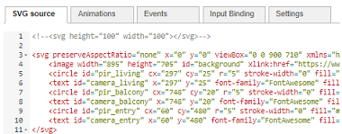](https://user-images.githubusercontent.com/14224149/65357446-5faba400-dbf7-11e9-9824-886238dba228.png)

Введіть у цьому редакторі графіку SVG (на основі XML). Це можна зробити різними способами:

- Якщо ви затятий фанат SVG, ви можете ввести рядок SVG вручну на закладці *"SVG"*.
- Якщо ви віддаєте перевагу використовувати редактор схем SVG, ви можете використовувати вбудований редактор [DrawSvg](https://github.com/bartbutenaers/node-red-contrib-ui-svg/blob/master/docs/tabsheet_SVG.md#DrawSvg-drawing-editor).
- Якщо вам потрібні дуже специфічні типи рисунків, ви можете використовувати сторонній редактор SVG для створення вашої схеми (і просто вставити згенерований рядок SVG у цей аркуш вкладки). Кілька (онлайн) редакторів доступні безкоштовно, кожен зі своїми спеціальними можливостями:
   - [Floorplanner](http://floorplanner.com)
   - [Floorplancreator](https://floorplancreator.net/#pricing)
   - ...

Однак:

- Майте на увазі, що ці сторонні редактори SVG можуть створювати досить складні рядки SVG, які важче зрозуміти, коли після цього потрібно змінити їх вручну.
- Майте на увазі, що браузер має багато роботи, щоб відтворити всі елементи SVG на кресленні! У деяких випадках може бути корисно - для підвищення продуктивності - перетворити SVG один раз на зображення і використовувати його як фонове зображення в цьому вузлі SVG (і намалювати інші фігури поверх цього зображення). Наприклад, на веб-сайті Floorplanner креслення SVG можна зберегти як зображення JPEG/PNG. Це зображення можна завантажити в елемент SVG *'image'*, як я це зроблено у прикладах потоків на цій сторінці readme ...

Унизу аркуша вкладки "Джерело SVG" доступна низка кнопок:

[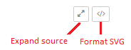](https://user-images.githubusercontent.com/14224149/66707892-5621e180-ed48-11e9-8d66-e3add751e7c8.png)

- *Expand source*: оказати джерело SVG у повноекранному режимі.
- *Format SVG*: by formatting the SVG source, the source will  be beatified.  відформатувавши джерело SVG, джерело буде беатифіковано. Це означає, що порожні рядки будуть видалені, кожен рядок отримає один елемент SVG, відступи будуть виправлені ... 

### Animation

[Animation](https://github.com/bartbutenaers/node-red-contrib-ui-svg/tree/master/docs/tabsheet_animation.md) tab sheet

[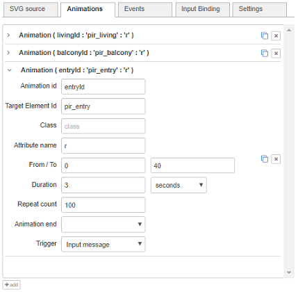](https://user-images.githubusercontent.com/14224149/65359120-d2b71980-dbfb-11e9-83ea-5bbc6e155673.png)

SVG дозволяє користувачам анімувати атрибути елементів з часом. Наприклад, ви можете зробити так, щоб радіус кола зростав за 3 секунди з 10 пікселів до 40 пікселів.

Додавання анімації до графіки SVG можна виконати різними способами:

- *На вкладці "SVG"* вручну, для фанатів SVG:

  ```xml
  <circle id="mycircle" ... r="5" ...>
     <animate id="myanimation" attributeName="r" begin="0s" dur="3s" repeatCount="1" from="10" to="40"/>
  </circle>
  ```

  Анімація буде застосована браузером до батьківського елемента (у цьому прикладі коло). Однак також можна додати елемент анімації самостійно (тобто не як дочірній елемент) із посиланням на елемент SVG, до якого його потрібно застосувати:

  ```xml
  <circle id="mycircle" ... r="5" .../>
  <animate xlink:href="#mycircle" id="myanimation" attributeName="r" begin="0s" dur="3s" repeatCount="1" from="10" to="40"/>
  ```

- *На вкладці "Animation"*, щоб малюнок та анімація були розділені. Натисніть кнопку *'add'*, щоб створити новий запис анімації, де потрібно ввести такі властивості:

  - ***Animation id***:  Ідентифікатор цього елемента анімації SVG (у цьому прикладі *"myanimation"*).

  - ***Target element id***: Ідентифікатор елемента SVG, який ви хочете анімувати (у цьому прикладі *"mycircle"*).

  - ***Class***: Встановивши значення в класі, ви можете використовувати селектор для запуску або зупинки декількох анімацій.

  - ***Attribute name***: Ім'я атрибута елемента, який потрібно анімувати (у цьому прикладі *"r"*).

  - ***From***: значення атрибута на початку анімації (у цьому прикладі *"10"*).

  - ***To***: Значення атрибута в кінці анімації (у цьому прикладі *"40"*).

  - ***Duration***: Скільки часу займе анімація.

  - ***Repeat count***: Скільки разів потрібно повторити анімацію (у цьому прикладі *"1", що означає лише один раз). Увага: якщо вибрано *"0"*, це означає, що анімація буде повторюватися ***"невизначено"***!

  - **Animation end**: Що робити з новим значенням після закінчення анімації.

    - *Freeze new value*: значення атрибута збереже нове значення *'До'* (у цьому прикладі *"40"*).
    - *Restore original value*: значення атрибута буде відновлено до початкового значення (у цьому прикладі *"5"*) з початку анімації.

  - **Trigger**: Який тригер призведе до запуску анімації

    - Input message: анімація розпочнеться шляхом введення вхідного повідомлення (див. нижче).
    - Time delay: анімація розпочнеться через певний час.
    - Custom: анімація буде запущена за допомогою стандартних параметрів  [begin](https://developer.mozilla.org/en-US/docs/Web/SVG/Attribute/begin) . Наприклад:

    ```
    2s; myRect.click; myAnim.end-400ms
    ```

  Створення анімації за допомогою цієї вкладки має ту перевагу, що джерело SVG та анімація зберігаються окремо. Більш конкретно, коли SVG створюється у стороннім редакторі SVG (який у більшості випадків не підтримує анімацію), ваші вручну вставлені елементи анімації будуть перезаписані кожного разу, коли вам потрібно оновити SVG ...

  Зауваження: також можна анімувати трансформації. Дійсно, коли ім'я атрибута *"transform"*, з'явиться додатковий випадаючий список "тип анімації":

  [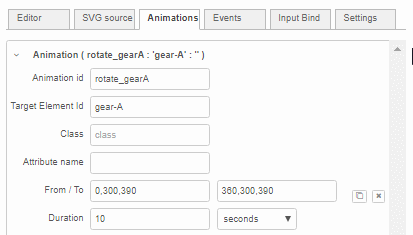](https://user-images.githubusercontent.com/14224149/73695310-23766d00-46da-11ea-9960-065dc1bf7004.gif)

- *Via an input message* as explained in the [Control via messages](https://github.com/bartbutenaers/node-red-contrib-ui-svg/blob/master/docs/tabsheet_animation.md#control-via-messages) section below. *Через вхідне повідомлення*, як пояснено в розділі "Керування через повідомлення", що наведений нижче.

### Event

[Event](https://github.com/bartbutenaers/node-red-contrib-ui-svg/tree/master/docs/tabsheet_event.md) tab sheet

[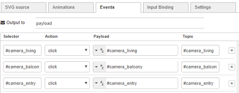](https://user-images.githubusercontent.com/14224149/65360241-70f8ae80-dbff-11e9-8c6a-65f3a14e22a7.png)

Сюди можна додати елемент SVG, щоб зробити цей елемент здатним перехопити одну з наступних подій:

- *Click*: when a mouse-down and mouse-up on the same element.
- *Double click*: when a double mouse click on an element.
- *Change*: when the value of a (foreign) input element is changed.
- *Context menu*: when a right mouse click on an element.
- *Mouse down*: when a mouse button is pressed down on an element.
- *Mouse up*: when a mouse button is released on an element.
- *Mouse over*: when the mouse is moved onto an element.
- *Mouse out*: when the mouse is moved away from an element.
- *Focus*: when an element receives focus.
- *Focus in*: when an element is about to receive focus.
- *Focus out*: when an element is about to lose focus.
- *Blur*: when an element loses focus.
- *Key down*: when a key is pressed down.
- *Key up*: when a key is released.
- *Touch start*: when a touch event starts (on mobile/tablet only).
- *Touch end*: when a touch event ends (on mobile/tablet only).

Додаючи новий рядок на цій вкладці, потрібно ввести кілька властивостей:

- ***Selector***: the selection of (one or more) SVG elements that needs to intercept events. See the syntax of [CSS  selectors](https://www.w3schools.com/cssref/css_selectors.asp).
- ***Action***: the event that the shape needs to intercept.
- ***Payload***: the `msg.payload` content of the output message, which will be sent when the event occurs.
- ***Topic***: the `msg.topic` content of the output message, which will be sent when the event occurs.

За замовчуванням вміст зберігатиметься в `msg.payload` вихідного повідомлення. Однак, коли результат повинен потрапити в `msg.anotherField`, це поле повідомлення можна вказати вгорі аркуша вкладки:

[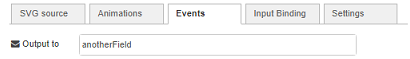](https://user-images.githubusercontent.com/14224149/65385332-dd71cb80-dd2d-11e9-8ae9-7b604d3f077e.png)

Коли подія відбувається за таким елементом SVG, трапляються дві речі:

1. Курсор ***миші*** зміниться під час наведення курсора на елемент, щоб візуалізувати, що елемент реагує на події.

2. Щойно клацне елемент, із Node-RED буде надіслано ***вихідне повідомлення***,  в [стандартному](https://discourse.nodered.org/t/contextmenu-location/22780/71?u = bartbutenaers) форматі:

   ```json
   "elementId": "light_bulb_kitchen",
   "selector": "#light_bulb_kitchen",
   "event": {
      "type":"click",
      "svgX":28.02083396911621,
      "svgY":78.66666412353516,
      "pageX":1105,
      "pageY":310,
      "screenX":829,
      "screenY":304,
      "clientX":1105,
      "clientY":310,
      "bbox": [
         1076.979248046875,
         311.3333435058594,
         1136.979248046875,
         251.33334350585938
      ]
   }
   ```

   Координати (де відбувається подія) у вихідному повідомленні дозволяють наступним вузлам у потоці відображати інформацію в цьому місці. Наприклад, ми розробили [node-red-contrib-ui-contextmenu](https://github.com/bartbutenaers/node-red-contrib-ui-contextmenu) , щоб показати спливаюче контекстне меню на інформаційній панелі над SVG малюнок у місці, де клацнули фігури. Наступна демонстрація пояснює цю комбінацію обох вузлів:

   [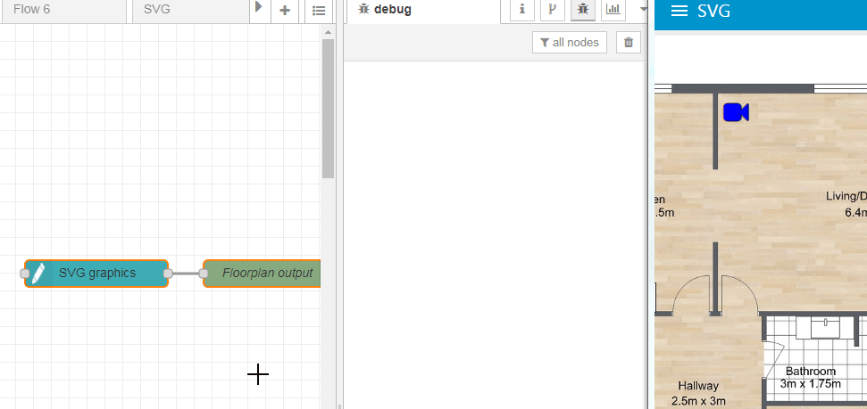](https://user-images.githubusercontent.com/44235289/65387884-149ea780-dd43-11e9-9cd4-a6bb4fb59d65.gif)

   ```
   [{"id":"107fa0c1.cb755f","type":"debug","z":"60ad596.8120ba8","name":"Floorplan output","active":true,"tosidebar":true,"console":false,"tostatus":false,"complete":"true","x":1340,"y":440,"wires":[]},{"id":"58329d91.3fc564","type":"ui_svg_graphics","z":"60ad596.8120ba8","group":"f014eb03.a3c618","order":1,"width":"14","height":"10","svgString":"<svg preserveAspectRatio=\"none\" x=\"0\" y=\"0\" viewBox=\"0 0 900 710\" xmlns=\"http://www.w3.org/2000/svg\" xmlns:svg=\"http://www.w3.org/2000/svg\" xmlns:xlink=\"http://www.w3.org/1999/xlink\">\n  <image width=\"889\" height=\"703\" id=\"background\" xlink:href=\"https://www.roomsketcher.com/wp-content/uploads/2016/10/1-Bedroom-Floor-Plans.jpg\"/>\n  <circle id=\"pir_living\" cx=\"310\" cy=\"45\" r=\"5\" stroke-width=\"0\" fill=\"#FF0000\"/>\n  <text id=\"camera_living\" x=\"310\" y=\"45\" font-family=\"FontAwesome\" fill=\"blue\" stroke=\"black\" font-size=\"35\" text-anchor=\"middle\" alignment-baseline=\"middle\" stroke-width=\"1\"></text>\n</svg>","clickableShapes":[{"targetId":"#camera_living","action":"click","payload":"camera_living","payloadType":"str","topic":"camera_living"}],"smilAnimations":[],"bindings":[],"showCoordinates":false,"autoFormatAfterEdit":false,"outputField":"","editorUrl":"http://drawsvg.org/drawsvg.html","directory":"","name":"","x":1140,"y":440,"wires":[["107fa0c1.cb755f"]]},{"id":"f014eb03.a3c618","type":"ui_group","z":"","name":"Floorplan test","tab":"80068970.6e2868","disp":true,"width":"14","collapse":false},{"id":"80068970.6e2868","type":"ui_tab","z":"","name":"SVG","icon":"dashboard","disabled":false,"hidden":false}]
   ```

   Об'єкт `msg.event` містить кілька координат, що відповідають різним доступним системам координат у браузері:

   [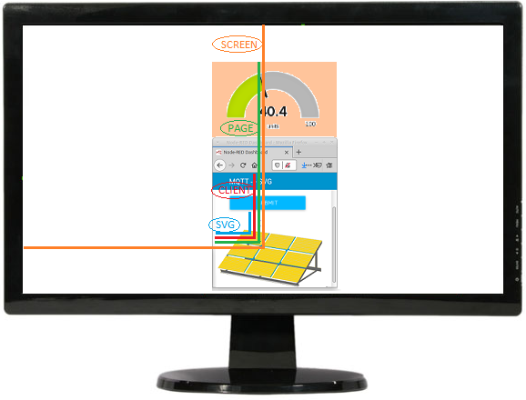](https://user-images.githubusercontent.com/14224149/85235300-3fbe4080-b414-11ea-931d-acceb28a7789.png)

   - *SVG* координати - в межах редактора SVG, тобто відносно початку початку схеми SVG.

   - *Client* координати - в межах видимого вікна браузера.
   - *Page* координати - відносно верхньої частини поточної сторінки інформаційної панелі (яка стане видимою лише після прокрутки, оскільки вона занадто коротка для відображення у вікні браузера).
   - *Screen* координати - в межах екрану монітора.

   Примітка: `msg.bbox` містить обмежувальне поле (ліворуч/знизу/праворуч/зверху) елемента SVG, де відбувається подія

Замість того, щоб вказувати події на екрані налаштування, можна також додавати або видаляти події за допомогою вхідних повідомлень. Це пояснюється у розділі [Control via messages](https://github.com/bartbutenaers/node-red-contrib-ui-svg/blob/master/docs/tabsheet_event.md#control-via-messages)  нижче.

### JS

[JS](https://github.com/bartbutenaers/node-red-contrib-ui-svg/tree/master/docs/tabsheet_js.md) tab sheet

[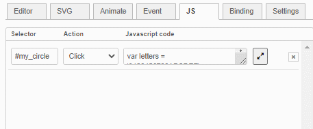

Сюди можна додати елемент SVG, щоб зробити цей елемент здатним перехопити одну з подій: див. Розділ таблиці "Event".

Додаючи новий рядок на цій вкладці, потрібно ввести кілька властивостей:

- ***Selector***:  вибір (одного або декількох) елементів SVG, які потребують перехоплення подій. Див. Синтаксис [селекторів CSS](https://www.w3schools.com/cssref/css_selectors.asp).
- ***Action***: подія, що потрібно перехопити.
- ***Javascript code***: код Javascript, який потрібно виконати на стороні клієнта (тобто всередині інформаційної панелі), коли відбувається подія.

Зверніть увагу, що у кожному рядку є кнопка *fullscreen* для відображення коду Javascript у повноекранному редакторі з підсвічуванням синтаксису!

Коли подія відбувається за таким елементом SVG, трапляються дві речі:

1. Курсор ***миші*** зміниться під час наведення курсора над елементом, щоб візуалізувати, що елемент реагує на події.
2. Код Javascript буде виконаний на стороні dashboard.

Замість того, щоб вказати події Javascript на екрані конфігурації, можна також додавати або видаляти події за допомогою вхідних повідомлень. Це пояснюється у розділі Керування за допомогою повідомлень, що наведений нижче. Коли ваш код Javascript працює некоректно, вікі [сторінка](https://github.com/bartbutenaers/node-red-contrib-ui-svg/wiki/Troubleshooting-JS-event-handlers)  містить кілька порад.

Наступний приклад показує, як змінити колір кола при кожному натисканні на коло. Потік також показує, що обробник події Javascript можна видалити, а інший обробник події Javascript (для показу попередження) можна ввести через вхідне повідомлення:

[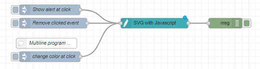

```json
[{"id":"89244415.be9278","type":"ui_svg_graphics","z":"a03bd3cf.177578","group":"5ae1b679.de89c8","order":4,"width":"0","height":"0","svgString":"<svg x=\"0\" y=\"0\" height=\"350\" viewBox=\"-0.04032258064515237 0 250.0806451612903 350\" width=\"250\" xmlns=\"http://www.w3.org/2000/svg\" xmlns:svg=\"http://www.w3.org/2000/svg\" xmlns:xlink=\"http://www.w3.org/1999/xlink\" preserveAspectRatio=\"xMidYMid meet\">\n<circle id=\"my_circle\" cx=\"30\" cy=\"30\" r=\"25\" style=\"stroke: none; fill: #0000ff;\">\n</circle>\n</svg>","clickableShapes":[],"javascriptHandlers":[{"selector":"#my_circle","action":"click","sourceCode":"var letters = '0123456789ABCDEF';\n  var color = '#';\n  for (var i = 0; i < 6; i++) {\n    color += letters[Math.floor(Math.random() * 16)];\n  }\n\n$(\"#my_circle\")[0].style.fill = color;\n \n$scope.send({payload: color, topic: 'circle_color'})"}],"smilAnimations":[{"id":"","targetId":"","classValue":"","attributeName":"transform","transformType":"rotate","fromValue":"","toValue":"","trigger":"msg","duration":"1","durationUnit":"s","repeatCount":"0","end":"restore","delay":"1","delayUnit":"s","custom":""}],"bindings":[],"showCoordinates":false,"autoFormatAfterEdit":true,"showBrowserErrors":true,"showBrowserEvents":true,"outputField":"payload","editorUrl":"http://drawsvg.org/drawsvg.html","directory":"","panning":"disabled","zooming":"disabled","panOnlyWhenZoomed":false,"doubleClickZoomEnabled":false,"mouseWheelZoomEnabled":false,"name":"SVG with Javascript","x":540,"y":180,"wires":[["e06da0e0.2c837"]]},{"id":"d9df6292.785bc","type":"inject","z":"a03bd3cf.177578","name":"Show alert at click","props":[{"p":"payload"}],"repeat":"","crontab":"","once":false,"onceDelay":0.1,"topic":"","payload":"{\"command\":\"add_js_event\",\"event\":\"click\",\"selector\":\"#my_circle\",\"script\":\"alert('Click event handled on the client ...')\"}","payloadType":"json","x":230,"y":140,"wires":[["89244415.be9278"]]},{"id":"5074f893.d378d8","type":"inject","z":"a03bd3cf.177578","name":"Remove clicked event","props":[{"p":"payload"}],"repeat":"","crontab":"","once":false,"onceDelay":0.1,"topic":"","payload":"{\"command\":\"remove_js_event\",\"event\":\"click\",\"selector\":\"#my_circle\"}","payloadType":"json","x":240,"y":180,"wires":[["89244415.be9278"]]},{"id":"e06da0e0.2c837","type":"debug","z":"a03bd3cf.177578","name":"","active":true,"tosidebar":true,"console":false,"tostatus":false,"complete":"true","targetType":"full","statusVal":"","statusType":"auto","x":750,"y":180,"wires":[]},{"id":"8572fad7.dd39b8","type":"inject","z":"a03bd3cf.177578","name":"change color at click","props":[{"p":"payload"}],"repeat":"","crontab":"","once":false,"onceDelay":0.1,"topic":"","payload":"{\"command\":\"add_js_event\",\"event\":\"click\",\"selector\":\"#my_circle\",\"script\":\"var letters = '0123456789ABCDEF';  var color = '#';  for (var i = 0; i < 6; i++) {    color += letters[Math.floor(Math.random() * 16)];  } $('#my_circle')[0].style.fill = color; $scope.send({payload: color, topic: 'circle_color'})\"}","payloadType":"json","x":230,"y":280,"wires":[["89244415.be9278"]]},{"id":"f678a359.157b4","type":"comment","z":"a03bd3cf.177578","name":"Multiline program ...","info":"","x":220,"y":240,"wires":[]},{"id":"5ae1b679.de89c8","type":"ui_group","name":"Press Demo","tab":"3667e211.c08f0e","order":1,"disp":true,"width":"5","collapse":false},{"id":"3667e211.c08f0e","type":"ui_tab","name":"Home","icon":"dashboard","order":1,"disabled":false,"hidden":false}]
```

Що призведе до цього:

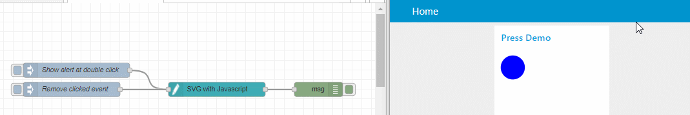

Основна ***різниця*** між подіями на вкладці "Event" та подіями Javascript на вкладці "JS":

- Вкладка "Event" використовується, коли події просто потрібно надіслати вихідне повідомлення, яке, у свою чергу, може викликати деякі інші вузли в потоці на сервері. Наприклад натисніть значок лампочки, щоб увімкнути світло у вашому розумному будинку.
- Вкладка "JS" використовується, коли події просто потрібно викликати якийсь код Javascript, щоб запустити функціональність безпосередньо в SVG.

Зверніть увагу, що між подіями на обох таблицях є деяке перекриття:

- Вкладку "Event" можна використовувати для запуску вихідного повідомлення на потоці сервера, яке, в свою чергу, запускає вхідне повідомлення для цього вузла SVG. Це вхідне повідомлення може маніпулювати SVG. Однак у нас є цілий * руговий шлях* (від інформаційної панелі через серверний потік назад до інформаційної панелі) для запуску функціональності на інформаційній панелі:

  [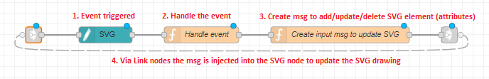

  Натомість набагато простіше використовувати обробник подій JS, щоб залишитися в інформаційній панелі та негайно запустити якийсь код Javascript:

  [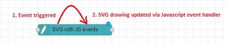

- Вкладка "JS" може бути використана для запуску деякого коду Javascript для надсилання повідомлення в потік сервера. Наприклад:

  ```js
  $scope.send({payload: color, topic: 'circle_color'})
  ```

  Однак набагато простіше використовувати звичайний обробник подій, який надсилає повідомлення (включаючи обмежувальне поле та всі координати) без будь-якого кодування ...

### Binding

[Binding](https://github.com/bartbutenaers/node-red-contrib-ui-svg/tree/master/docs/tabsheet_binding.md) tab sheet

Як пояснено в розділі Керування за допомогою повідомлень", що наведений нижче, цим вузлом можна керувати за допомогою вхідних повідомлень. Наприклад, змінити колір заливки кола з ідентифікатором "mycircle" на зелений. Як результат, вхідні повідомлення повинні містити багато інформації (ідентифікатор елемента, ім’я атрибута, значення атрибута ...), щоб цей вузол знав, що ви хочете зробити. Це означає, що потік стане досить складним, оскільки для розміщення всієї цієї інформації в повідомленні потрібно багато додаткових вузлів.

Інший спосіб управління цим вузлом - це використання прив’язок. Це означає, що ви повинні вказати більшу частину інформації в прив'язці, тому вхідне повідомлення буде лише містити нове значення. Оскільки вхідні повідомлення повинні містити менше інформації, потік можна спростити ...

[

Вхідні прив'язки можуть бути додані для прив'язки джерел (= полів вхідних повідомлень) до пунктів призначення (= значення атрибута елемента/тексту).

Потрібно ввести кілька властивостей:

- ***Binding source***: поле вхідного повідомлення, яке буде містити нове значення.

- ***Selector***: вибір (одного або декількох) елементів SVG, до яких буде застосовано нове значення атрибута. Див. Синтаксис [CSS  selectors](https://www.w3schools.com/cssref/css_selectors.asp).

- **Binding destination**: до якого атрибуту з вибраних елементів SVG застосовуватимуться нові значення.

  - *Text content*: коли вибрано цей параметр, значення (із вхідного повідомлення) буде застосовано до внутрішнього текстового вмісту елемента.

    Наприклад, встановіть текстовий вміст у  `<text x="20" y="20">Some text content</text>`.

  - *Attribute value*: коли вибрано цей параметр, значення (із вхідного повідомлення) буде застосовано до атрибута. Це означає, що потрібно буде вказати додаткове "ім'я атрибута", щоб переконатися, що нове значення буде застосовано до атрибута з цим ім'ям.

    Наприклад, встановіть значення кольору заливки в `<circle fill="yellow"/>`.

  - *Style value*: коли вибрано цей параметр, значення (із вхідного повідомлення) буде застосовано до атрибута стилю. Це означає, що потрібно буде вказати додатковий стиль "attribute name", щоб переконатися, що нове значення буде застосовано до атрибута з цим ім'ям.

    Наприклад, встановіть значення кольору заливки в  `<circle style="fill: yellow;"/>`.

Наприклад:

[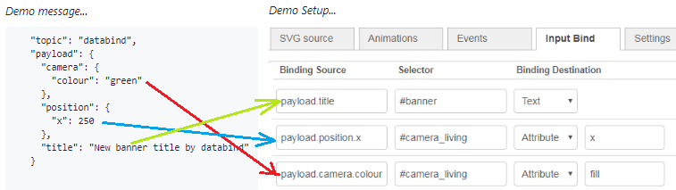

Коли, напр. вхідне повідомлення містить `msg.payload.position.x`, тоді для цього значення (250) буде встановлено атрибут" x "елемента SVG з ідентифікатором" camera_living ".

Наступний потік показує наведений вище приклад прив'язки в дії:


```
[{"id":"c9ab8554.337588","type":"debug","z":"60ad596.8120ba8","name":"Floorplan output","active":true,"tosidebar":true,"console":false,"tostatus":false,"complete":"true","x":1380,"y":440,"wires":[]},{"id":"56869c57.d65c74","type":"ui_svg_graphics","z":"60ad596.8120ba8","group":"d4ee73ea.a7676","order":1,"width":"14","height":"10","svgString":"<svg preserveAspectRatio=\"none\" x=\"0\" y=\"0\" viewBox=\"0 0 900 710\" xmlns=\"http://www.w3.org/2000/svg\" xmlns:svg=\"http://www.w3.org/2000/svg\" xmlns:xlink=\"http://www.w3.org/1999/xlink\">\n  <image width=\"889\" height=\"703\" id=\"background\" xlink:href=\"https://www.roomsketcher.com/wp-content/uploads/2016/10/1-Bedroom-Floor-Plans.jpg\" />\n  <text id=\"banner\" x=\"10\" y=\"16\" fill=\"black\" stroke=\"black\" font-size=\"35\" text-anchor=\"left\" alignment-baseline=\"middle\" stroke-width=\"1\">This is the #banner</text>\n  <circle id=\"pir_living\" cx=\"310\" cy=\"45\" r=\"5\" stroke-width=\"0\" fill=\"#FF0000\" />\n  <text id=\"camera_living\" x=\"310\" y=\"45\" font-family=\"FontAwesome\" fill=\"grey\" stroke=\"black\" font-size=\"35\" text-anchor=\"middle\" alignment-baseline=\"middle\" stroke-width=\"1\"></text>\n</svg> ","clickableShapes":[{"targetId":"#camera_living","action":"click","payload":"camera_living","payloadType":"str","topic":"camera_living"}],"smilAnimations":[],"bindings":[{"selector":"#banner","bindSource":"payload.title","bindType":"text","attribute":""},{"selector":"#camera_living","bindSource":"payload.position.x","bindType":"attr","attribute":"x"},{"selector":"#camera_living","bindSource":"payload.camera.colour","bindType":"attr","attribute":"fill"}],"showCoordinates":false,"autoFormatAfterEdit":false,"outputField":"","editorUrl":"http://drawsvg.org/drawsvg.html","directory":"","name":"","x":1180,"y":440,"wires":[["c9ab8554.337588"]]},{"id":"62a285fb.bd046c","type":"inject","z":"60ad596.8120ba8","name":"databind","topic":"databind","payload":"{\"camera\":{\"colour\":\"yellow\"},\"position\":{\"x\":320},\"title\":\"databind strikes again\"}","payloadType":"json","repeat":"","crontab":"","once":false,"onceDelay":0.1,"x":980,"y":460,"wires":[["56869c57.d65c74"]]},{"id":"132d184e.ff0ab8","type":"inject","z":"60ad596.8120ba8","name":"databind","topic":"databind","payload":"{\"camera\":{\"colour\":\"green\"},\"position\":{\"x\":250},\"title\":\"New banner title by databind\"}","payloadType":"json","repeat":"","crontab":"","once":false,"onceDelay":0.1,"x":980,"y":420,"wires":[["56869c57.d65c74"]]},{"id":"d4ee73ea.a7676","type":"ui_group","z":"","name":"Floorplan test","tab":"b4bb5633.ba92b8","disp":true,"width":"14","collapse":false},{"id":"b4bb5633.ba92b8","type":"ui_tab","z":"","name":"SVG","icon":"dashboard","disabled":false,"hidden":false}]
```

Зверніть увагу, що існує ще один спосіб реалізації прив'язки даних (без використання таблиці *"Binding"*), за допомогою атрибутів користувача всередині джерела SVG:

- Використовуйте

  ```
  data-bind-text
  ```

  встановити зміст тексту елемента Наприклад:

  ```
  <svg ...>
     <text data-bind-text="payload.SystemStateDesc" ...>Temporary text content</text>
  </svg>
  ```

  Тоді текстовий вміст можна оновити, вводячи таке повідомлення:

  ```
  "payload": {
     "SystemStateDesc": "Updated text content"},
     "topic": "databind"
  }
  ```

- Використовуйте

  ```
  data-bind-attributes
  ```

   щоб вказати, які атрибути елемента SVG потрібно прив'язати до яких полів повідомлень (зазначених у

  ```
  data-bind-values
  ```

  ).  Наприклад:

  ```
  <svg ...>
     <circle data-bind-attributes="fill,r" data-bind-values="payload.circleColour,payload.size" ...>;
  </svg>
  ```

  Тоді атрибути кольору та радіуса заливки кола можна оновити, вводячи таке повідомлення:

  ```
  "payload": {
    "fill": "circleColour",
    "size": 25
  },
  "topic":"databind"
  ```

### Settings

[Settings](https://github.com/bartbutenaers/node-red-contrib-ui-svg/tree/master/docs/tabsheet_settings.md) tab sheet

#### Відображення координат

 Коли вибрано цей параметр, відображатиметься ***підказка***, яка відображатиме поточне розташування миші (тобто координати X та Y):

[

This option has been introduced to simplify lay outing during manual  editing of the SVG string (without external SVG drawing tool).  Without  this option determining the location of your shapes would require a lot  of calculations or guessing ...

Remark: The location is measured in the SVG coordinate system, which  means the origin (X=Y=0) is in the top left of your drawing.

#### Auto format SVG Source after saving edits in SVG Editor

When editing the SVG source via [DrawSvg](https://github.com/bartbutenaers/node-red-contrib-ui-svg/blob/master/docs/tabsheet_settings.md#DrawSvg-drawing-editor), the manipulated SVG source is not very pretty: the SVG source will  contain empty lines, multiple SVG elements on a single line ...  This  SVG source can be manually beautified using the "*Format SVG*" button, or automatically (every time the DrawSvg popup dialog window is closed - by activating this checkbox.

#### Show browser errors on the server

Unfortunately, not all kind of errors can be validated on the server, but instead they will occur on the client side.  For example, when an  input message arrives, but no SVG element can be found for the specified selector.  As a result, your drawing will not be updated, and in the  1.x.x version you had to figure out yourself what is going wrong...  Of  course, you can have a look in the browser console log to have a look at the client side errors.  However, on some systems (e.g. Android  smartphones) it is very difficult to get access to that console log  (unless you setup a remote connection via USB with your desktop  browser).

To simplify troubleshooting, the client-side errors will appear in  the Node-RED debug panel when this checkbox is activated.  But keep in  mind that if you have N drawings visible simultaneously (when your  dashboard is currently displayed in N browsers), then you will get N  errors instead of 1 ...

#### Show browser events on the server

Rather similar to the previous option (about browser errors), except  that here browser events (click, ...) are being logged on the server:

[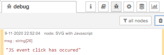

#### Enable JS event debugging

When this setting is active (and you have opened your browser's  development tools), the browser's debugger will automatically halt when a JS event handler will be executed.  This allows you to experiment live  with your Javascript code, to troubleshoot problems with that code.

See the wiki [page](https://github.com/bartbutenaers/node-red-contrib-ui-svg/wiki/Troubleshooting-JS-event-handlers) for more information about debugging JS code.

#### Send output msg when the client is (re)loaded

When this setting is active, an output message will be send every  time the client side widget is (re)loaded.  This can be useful to  trigger the flow to start ***preloading data*** into the SVG drawing when it is opened.  The output msg will look like this:

```
   "payload": <the id of the SVG node>,
   "topic": "loaded"
```

#### Editor URL

This is the URL where the [DrawSvg](https://github.com/bartbutenaers/node-red-contrib-ui-svg/blob/master/docs/tabsheet_settings.md#DrawSvg-drawing-editor) editor instance is being hosted.  By default this field contains a link to the official [DrawSvg cloud](http://drawsvg.org/drawsvg.html) system, but it can also contain a link to a local DrawSvg installation (hosted via a [node-red-contrib-drawsvg](https://github.com/bartbutenaers/node-red-contrib-drawsvg) node).

*Be aware that this is a free system, so there is no guarantee about availability of the cloud system!*

#### Directory

This directory of your local system (where your Node-RED instance is  running) can be used to make your local images available, to both your  dashboard and your flow editor.

#### Pan and zoom

A series of options are available to allow panning and zooming, which is useful for large drawings (like buildings, process flows, ...):

- ***"Panning"***: enable panning in X, Y or in both directions.
- ***"Zooming"***:  enable zooming.
- ***"Pan only when zoomed"***: when this option  is activated, the SVG drawing can only be panned when it has been zoomed previously.  Indeed, when the drawing is at its original size, it might in some cases be pointless to allow panning.
- ***"Enable mouse-wheel zooming"***: allow zooming in/out by rotating the mouse wheel.
- ***"Enable double click/tap zooming"***: the  first double mouse click (or double tap on a touch screen) will trigger  zooming in.  The second double tap will trigger zooming out.  And so on  ...

The following demo shows how to pan and zoom via the mouse (mouse-wheel and dragging):

[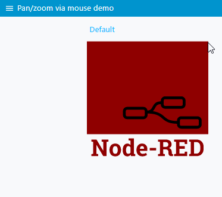

When a ***touch device*** has been detected, panning and zoom through touch events is also supported.  Thanks to [tkirchm](https://github.com/tkirchm) for getting us started with these new features!  The following hand gestures are currently supported:

[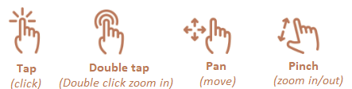

It is also possible to control panning and zooming via input messages, as explained in the section [Control via messages](https://github.com/bartbutenaers/node-red-contrib-ui-svg/blob/master/docs/tabsheet_settings.md#control-via-messages) below. The following example flow shows how to control panning and zooming from the flow editor (using Inject nodes) and via the dashboard (using  dashboard button widgets):

[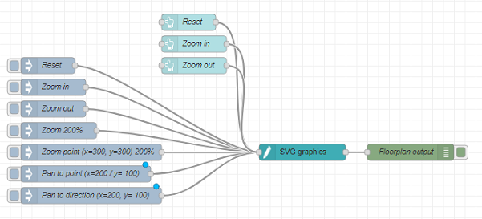

```
[{"id":"a289199.a1714e8","type":"debug","z":"4ae15451.7b2f5c","name":"Floorplan output","active":true,"tosidebar":true,"console":false,"tostatus":false,"complete":"true","targetType":"full","x":2140,"y":380,"wires":[]},{"id":"32dfda30.706666","type":"ui_svg_graphics","z":"4ae15451.7b2f5c","group":"8d1b9121.83b3c","order":1,"width":"14","height":"10","svgString":"<svg xmlns=\"http://www.w3.org/2000/svg\" xmlns:xlink=\"http://www.w3.org/1999/xlink\" xmlns:svg=\"http://www.w3.org/2000/svg\" width=\"600px\" height=\"500px\" preserveAspectRatio=\"xMidYMid meet\"><defs id=\"svgEditorDefs\"><polygon id=\"svgEditorShapeDefs\" style=\"fill:rosybrown;stroke:black;vector-effect:non-scaling-stroke;stroke-width:1px;\"/></defs><rect id=\"svgEditorBackground\" x=\"0\" y=\"0\" width=\"100%\" height=\"100%\" style=\"fill: none; stroke: none;\"/><circle id=\"e1_circle\" cx=\"100\" cy=\"100\" style=\"fill:rosybrown;stroke:black;stroke-width:1px;\" r=\"25.8069758011\"/><text style=\"fill:black;font-family:Arial;font-size:20px;\" x=\"94\" y=\"105\" id=\"e2_texte\">A</text><text style=\"fill:black;font-family:Arial;font-size:20px;\" x=\"104\" y=\"98\" id=\"e3_texte\"/><circle id=\"e2_circle\" cx=\"200\" cy=\"100\" style=\"fill:rosybrown;stroke:black;stroke-width:1px;\" r=\"25.8069758011\"/><text style=\"fill:black;font-family:Arial;font-size:20px;\" x=\"193\" y=\"107\" id=\"e4_texte\">B</text><text style=\"fill:black;font-family:Arial;font-size:20px;\" x=\"195\" y=\"97\" id=\"e5_texte\"/><circle id=\"e3_circle\" cx=\"100\" cy=\"200\" style=\"fill:rosybrown;stroke:black;stroke-width:1px;\" r=\"25.8069758011\"/><text style=\"fill:black;font-family:Arial;font-size:20px;\" x=\"93\" y=\"206\" id=\"e6_texte\">F</text><circle id=\"e4_circle\" cx=\"200\" cy=\"200\" style=\"fill:rosybrown;stroke:black;stroke-width:1px;\" r=\"25.8069758011\"/><circle id=\"e5_circle\" cx=\"100\" cy=\"300\" style=\"fill:rosybrown;stroke:black;stroke-width:1px;\" r=\"25.8069758011\"/><circle id=\"e6_circle\" cx=\"200\" cy=\"300\" style=\"fill:rosybrown;stroke:black;stroke-width:1px;\" r=\"25.8069758011\"/><circle id=\"e7_circle\" cx=\"302\" cy=\"102\" style=\"fill:rosybrown;stroke:black;stroke-width:1px;\" r=\"25.8069758011\"/><text style=\"fill:black;font-family:Arial;font-size:20px;\" x=\"293\" y=\"109\" id=\"e7_texte\">C</text><circle id=\"e8_circle\" cx=\"402\" cy=\"102\" style=\"fill:rosybrown;stroke:black;stroke-width:1px;\" r=\"25.8069758011\"/><text style=\"fill:black;font-family:Arial;font-size:20px;\" x=\"397\" y=\"108\" id=\"e8_texte\">D</text><circle id=\"e9_circle\" cx=\"300\" cy=\"200\" style=\"fill:rosybrown;stroke:black;stroke-width:1px;\" r=\"25.8069758011\"/><text style=\"fill:black;font-family:Arial;font-size:20px;\" x=\"295\" y=\"208\" id=\"e9_texte\">H</text><circle id=\"e10_circle\" cx=\"400\" cy=\"200\" style=\"fill:rosybrown;stroke:black;stroke-width:1px;\" r=\"25.8069758011\"/><circle id=\"e11_circle\" cx=\"300\" cy=\"300\" style=\"fill:rosybrown;stroke:black;stroke-width:1px;\" r=\"25.8069758011\"/><circle id=\"e12_circle\" cx=\"402\" cy=\"302\" style=\"fill:rosybrown;stroke:black;stroke-width:1px;\" r=\"25.8069758011\"/><circle id=\"e13_circle\" cx=\"100\" cy=\"400\" style=\"fill:rosybrown;stroke:black;stroke-width:1px;\" r=\"25.8069758011\"/><circle id=\"e14_circle\" cx=\"200\" cy=\"400\" style=\"fill:rosybrown;stroke:black;stroke-width:1px;\" r=\"25.8069758011\"/><circle id=\"e15_circle\" cx=\"300\" cy=\"400\" style=\"fill:rosybrown;stroke:black;stroke-width:1px;\" r=\"25.8069758011\"/><circle id=\"e16_circle\" cx=\"400\" cy=\"400\" style=\"fill:rosybrown;stroke:black;stroke-width:1px;\" r=\"25.8069758011\"/><circle id=\"e17_circle\" cx=\"500\" cy=\"100\" style=\"fill:rosybrown;stroke:black;stroke-width:1px;\" r=\"25.8069758011\"/><text style=\"fill:black;font-family:Arial;font-size:20px;\" x=\"493\" y=\"106\" id=\"e17_texte\">E</text><circle id=\"e18_circle\" cx=\"500\" cy=\"200\" style=\"fill:rosybrown;stroke:black;stroke-width:1px;\" r=\"25.8069758011\"/><circle id=\"e19_circle\" cx=\"500\" cy=\"300\" style=\"fill:rosybrown;stroke:black;stroke-width:1px;\" r=\"25.8069758011\"/><circle id=\"e20_circle\" cx=\"500\" cy=\"400\" style=\"fill:rosybrown;stroke:black;stroke-width:1px;\" r=\"25.8069758011\"/><text style=\"fill:black;font-family:Arial;font-size:20px;\" x=\"93\" y=\"307\" id=\"e1_texte\">K</text><text style=\"fill:black;font-family:Arial;font-size:20px;\" x=\"93\" y=\"406\" id=\"e10_texte\">P</text><text style=\"fill:black;font-family:Arial;font-size:20px;\" x=\"191\" y=\"208\" id=\"e11_texte\">G</text><text style=\"fill:black;font-family:Arial;font-size:20px;\" x=\"193\" y=\"307\" id=\"e12_texte\">L</text><text style=\"fill:black;font-family:Arial;font-size:20px;\" x=\"193\" y=\"406\" id=\"e13_texte\">Q</text><text style=\"fill:black;font-family:Arial;font-size:20px;\" x=\"494\" y=\"308\" id=\"e14_texte\">O</text><text style=\"fill:black;font-family:Arial;font-size:20px;\" x=\"492\" y=\"406\" id=\"e15_texte\">T</text><text style=\"fill:black;font-family:Arial;font-size:20px;\" x=\"493\" y=\"207\" id=\"e16_texte\">J</text><text style=\"fill:black;font-family:Arial;font-size:20px;\" x=\"392\" y=\"207\" id=\"e18_texte\">I</text><text style=\"fill:black;font-family:Arial;font-size:20px;\" x=\"396\" y=\"309\" id=\"e19_texte\">N</text><text style=\"fill:black;font-family:Arial;font-size:20px;\" x=\"393\" y=\"407\" id=\"e20_texte\">S</text><text style=\"fill:black;font-family:Arial;font-size:20px;\" x=\"293\" y=\"306\" id=\"e21_texte\">M</text><text style=\"fill:black;font-family:Arial;font-size:20px;\" x=\"292\" y=\"407\" id=\"e22_texte\">R</text><text style=\"fill:black;font-family:Arial;font-size:20px;\" x=\"82.55244445800781\" y=\"26.68446922302246\" id=\"e23_texte\">100</text><text style=\"fill:black;font-family:Arial;font-size:20px;\" x=\"182.9540252685547\" y=\"27.42818832397461\" id=\"e24_texte\">200</text><text style=\"fill:black;font-family:Arial;font-size:20px;\" x=\"285.5868225097656\" y=\"27.42818832397461\" id=\"e25_texte\">300</text><text style=\"fill:black;font-family:Arial;font-size:20px;\" x=\"385.2447204589844\" y=\"26.684473037719727\" id=\"e26_texte\">400</text><text style=\"fill:black;font-family:Arial;font-size:20px;\" x=\"484.1588134765625\" y=\"27.428176879882812\" id=\"e27_texte\">500</text><text style=\"fill:black;font-family:Arial;font-size:20px;\" x=\"8.180865287780762\" y=\"106.26204681396484\" id=\"e28_texte\">100</text><text style=\"fill:black;font-family:Arial;font-size:20px;\" x=\"8.92458724975586\" y=\"204.4324493408203\" id=\"e29_texte\">200</text><text style=\"fill:black;font-family:Arial;font-size:20px;\" x=\"6.693431854248047\" y=\"306.3215026855469\" id=\"e30_texte\">300</text><text style=\"fill:black;font-family:Arial;font-size:20px;\" x=\"9.668293952941895\" y=\"405.23565673828125\" id=\"e31_texte\">400</text><text style=\"fill:black;font-family:Arial;font-size:20px;\" x=\"40.160640716552734\" y=\"25.197044372558594\" id=\"e32_texte\"/><path d=\"M4.848484684596244,-1.5151515315403765v-2l4,4l-4,4v-2h-4v-4Z\" style=\"fill:rosybrown; stroke:black; vector-effect:non-scaling-stroke;stroke-width:1px;\" id=\"e37_shape\" transform=\"matrix(3.06783 0 0 3.06783 50.9445 18.8755)\"/><path d=\"M3.000000026913421,2.5000000672835476h2l-4,4l-4,-4h1.9999999999999998v-4h4Z\" style=\"fill:rosybrown; stroke:black; vector-effect:non-scaling-stroke;stroke-width:1px;\" id=\"e38_shape\" transform=\"matrix(2.97486 0 0 2.97486 22.3115 63.1265)\"/><text style=\"fill:black;font-family:Arial;font-size:20px;\" x=\"35.698360443115234\" y=\"28.171905517578125\" id=\"e39_texte\">X</text><text style=\"fill:black;font-family:Arial;font-size:20px;\" x=\"19.336605072021484\" y=\"54.94566345214844\" id=\"e40_texte\">Y</text></svg>","clickableShapes":[{"targetId":"#mycircle","action":"click","payload":"cam living clicked","payloadType":"str","topic":"camera_living"}],"smilAnimations":[],"bindings":[{"selector":"#e26_texte","bindSource":"payload.title","bindType":"text","attribute":""}],"showCoordinates":false,"autoFormatAfterEdit":false,"showBrowserErrors":false,"selectorAsElementId":false,"outputField":"","editorUrl":"https://drawsvg.org/drawsvg.html","directory":"","panning":"both","zooming":"enabled","panOnlyWhenZoomed":false,"doubleClickZoomEnabled":true,"mouseWheelZoomEnabled":true,"name":"","x":1940,"y":380,"wires":[["a289199.a1714e8"]]},{"id":"91163354.31b2f","type":"inject","z":"4ae15451.7b2f5c","name":"Zoom in","topic":"","payload":"{\"command\":\"zoom_in\"}","payloadType":"json","repeat":"","crontab":"","once":false,"onceDelay":0.1,"x":1480,"y":260,"wires":[["32dfda30.706666"]]},{"id":"8c7c165f.dee1a8","type":"inject","z":"4ae15451.7b2f5c","name":"Zoom out","topic":"","payload":"{\"command\":\"zoom_out\"}","payloadType":"json","repeat":"","crontab":"","once":false,"onceDelay":0.1,"x":1480,"y":300,"wires":[["32dfda30.706666"]]},{"id":"d984058a.02d818","type":"inject","z":"4ae15451.7b2f5c","name":"Zoom 200%","topic":"","payload":"{\"command\":\"zoom_by_percentage\",\"percentage\":200}","payloadType":"json","repeat":"","crontab":"","once":false,"onceDelay":0.1,"x":1490,"y":340,"wires":[["32dfda30.706666"]]},{"id":"62277e70.5c676","type":"inject","z":"4ae15451.7b2f5c","name":"Zoom point (x=300, y=300) 200%","topic":"","payload":"{\"command\":\"zoom_by_percentage\",\"percentage\":200,\"x\":300,\"y\":300}","payloadType":"json","repeat":"","crontab":"","once":false,"onceDelay":0.1,"x":1550,"y":380,"wires":[["32dfda30.706666"]]},{"id":"365d5483.fa174c","type":"inject","z":"4ae15451.7b2f5c","name":"Pan to point (x=200 / y= 100)","topic":"","payload":"{\"command\":\"pan_to_point\",\"x\":200,\"y\":100}","payloadType":"json","repeat":"","crontab":"","once":false,"onceDelay":0.1,"x":1540,"y":420,"wires":[["32dfda30.706666"]]},{"id":"4d1e70dd.f51f3","type":"inject","z":"4ae15451.7b2f5c","name":"Pan to direction (x=200, y= 100)","topic":"","payload":"{\"command\":\"pan_to_direction\",\"x\":200,\"y\":100}","payloadType":"json","repeat":"","crontab":"","once":false,"onceDelay":0.1,"x":1550,"y":460,"wires":[["32dfda30.706666"]]},{"id":"79ebf8c1.adadd8","type":"inject","z":"4ae15451.7b2f5c","name":"Reset","topic":"","payload":"{\"command\":\"reset_panzoom\"}","payloadType":"json","repeat":"","crontab":"","once":false,"onceDelay":0.1,"showConfirmation":false,"confirmationLabel":"","x":1470,"y":220,"wires":[["32dfda30.706666"]]},{"id":"61be354.f7175cc","type":"ui_button","z":"4ae15451.7b2f5c","name":"Reset","group":"8d1b9121.83b3c","order":4,"width":"3","height":"1","passthru":false,"label":"Reset","tooltip":"","color":"","bgcolor":"","icon":"","payload":"{\"command\":\"reset_panzoom\"}","payloadType":"json","topic":"","x":1730,"y":140,"wires":[["32dfda30.706666"]]},{"id":"d43dfb27.a0f308","type":"ui_button","z":"4ae15451.7b2f5c","name":"Zoom in","group":"8d1b9121.83b3c","order":4,"width":"3","height":"1","passthru":false,"label":"Zoom in","tooltip":"","color":"","bgcolor":"","icon":"","payload":"{\"command\":\"zoom_in\"}","payloadType":"json","topic":"","x":1740,"y":180,"wires":[["32dfda30.706666"]]},{"id":"ef78f0f5.c44b3","type":"ui_button","z":"4ae15451.7b2f5c","name":"Zoom out","group":"8d1b9121.83b3c","order":4,"width":"3","height":"1","passthru":false,"label":"Zoom out","tooltip":"","color":"","bgcolor":"","icon":"","payload":"{\"command\":\"zoom_out\"}","payloadType":"json","topic":"","x":1740,"y":220,"wires":[["32dfda30.706666"]]},{"id":"8d1b9121.83b3c","type":"ui_group","z":"","name":"Pan/zoom test","tab":"5021fcf2.ee7ac4","order":1,"disp":true,"width":"14","collapse":false},{"id":"5021fcf2.ee7ac4","type":"ui_tab","z":"","name":"SVG","icon":"dashboard","disabled":false,"hidden":false}]
```

Which results in this dashboard behaviour:

[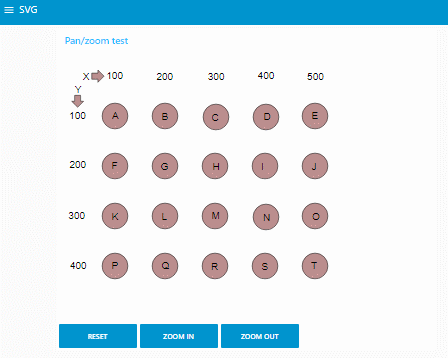

Notice the different behaviour between the two types of buttons in this flow:

- The dashboard buttons will trigger a message that contains the ***socketid***:

  [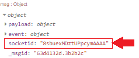

  Based on that socketid, only that client - where the button has been  pressed - will receive the pan/zoom command (which is exactly what we  want).

- The Inject node buttons will trigger a message that contains no  socketid (since there is no specific dashboard client involved here), so ALL clients will receive the same pan/zoom command (which is most of  the time not useful).

Caution: make sure the panning and zooming is enabled in the Settings tab sheet, otherwise it will not be possible to control panning and  zooming via input messages!

## Керування через повідомлення

Більшість інформації SVG можна обробляти, надсилаючи вхідні повідомлення на цей вузол.

### Деякі загальні рекомендації щодо повідомлень:

- У більшості повідомлень потрібно вказати, до яких елементів SVG потрібно застосувати керуюче повідомлення. Щоб вказати один елемент, можна вказати поле `elementId`:

  ```json
  "payload": {
       "command": "update_text",
       "elementId": "some_element_id",
       "textContent": "my title"
   }
  ```

  Однак також можна вказати один або кілька елементів за допомогою [селектора CSS](https://www.w3schools.com/cssref/css_selectors.asp). Це дуже потужний механізм запитів, який дозволяє застосовувати керуюче повідомлення до кількох елементів SVG одночасно! Наприклад, встановіть для всіх текстів із класом 'titleText' значення "my title":

  ```json
  "payload": {
       "command": "update_text",
       "selector": ".titleText", //standard dom selector '#' for id, '.' for class etc.
       "textContent": "my title"
   }
  ```

  Це може бути використано для ***того самого оновлення декількох елементів з використанням одного повідомлення***. Зверніть увагу, що `selector`можна також використовувати для вказівки ідентифікатора окремого елемента (подібно до `elementId`), використовуючи хештег, такий як *"#some_element_id"*

- Повідомлення може містити одну команду. Наприклад:

  ```json
  "payload": {
      "command": "update_attribute",
      "selector": "#cam_living_room",
      "attributeName": "fill",
      "attributeValue": "orange"
  }
  ```

  Але також можна вказати ***кілька команд (як масив)*** в одному повідомленні управління. Наприклад:

  ```json
  "payload": [
       {
          "command": "update_attribute",
          "elementId": "cam_kitchen", /*use elementId or selector*/
          "attributeName": "fill",
          "attributeValue": "orange"
       },
       {
          "command": "set_attribute",
          "selector": "#cam_living", /*use elementId or selector*/
          "attributeName": "fill",
          "attributeValue": "red"
       }      
  ]
  ```

- Коли в одному повідомленні використовуються кілька однакових команд, повідомлення може бути спрощене, вказавши команду всередині `msg.topic`:

  ```json
  "payload": [
       {
          "elementId": "cam_kitchen", /*use elementId or selector*/
          "attributeName": "fill",
          "attributeValue": "orange"
       },
       {
          "selector": "#cam_living", /*use elementId or selector*/
          "attributeName": "fill",
          "attributeValue": "red"
       },        
  ],
  "topic": "update_attribute"
  ```

  Це може бути використано для виконання ***кількох команд з одним повідомленням***.

- Для подальшого спрощення повідомлення селектор CSS - коли він потрібен - також може бути доданий до теми (відокремлений `|`):

  ```json
   {
       "topic": "update_text|#myRect > .faultMessage",
       "payload": "hello"
   }
  ```

  Таким чином повідомлення стає ще коротшим, але ви можете використовувати лише 1 селектор або значення команди (навіть коли корисне навантаження містить масив).

### Пдітримувані команди:

- [Update/set an attribute value](https://github.com/bartbutenaers/node-red-contrib-ui-svg/tree/master/docs/msg_control.md#updateset-an-attribute-value-via-msg) via msg
- [Update/set a style attribute value](https://github.com/bartbutenaers/node-red-contrib-ui-svg/tree/master/docs/msg_control.md#updateset-a-style-attribute-value-via-msg) via msg
- [Remove an attribute](https://github.com/bartbutenaers/node-red-contrib-ui-svg/tree/master/docs/msg_control.md#remove-an-attribute-via-msg) via msg
- [Replace an attribute value](https://github.com/bartbutenaers/node-red-contrib-ui-svg/blob/master/docs/msg_control.md#replace-an-attribute-value-via-msg) via msg
- [Set text content](https://github.com/bartbutenaers/node-red-contrib-ui-svg/tree/master/docs/msg_control.md#set-text-content-via-msg) via msg
- [Get text content](https://github.com/bartbutenaers/node-red-contrib-ui-svg/tree/master/docs/msg_control.md#get-text-content-via-msg) via msg
- [Start/stop animations](https://github.com/bartbutenaers/node-red-contrib-ui-svg/tree/master/docs/msg_control.md#startstop-animations-via-msg) via msg
- [Add events](https://github.com/bartbutenaers/node-red-contrib-ui-svg/tree/master/docs/msg_control.md#add-events-via-msg) via msg
- [Remove events](https://github.com/bartbutenaers/node-red-contrib-ui-svg/tree/master/docs/msg_control.md#remove-events-via-msg) via msg
- [Add Javascript events](https://github.com/bartbutenaers/node-red-contrib-ui-svg/tree/master/docs/msg_control.md#add-javascript-events-via-msg) via msg
- [Remove Javascript events](https://github.com/bartbutenaers/node-red-contrib-ui-svg/tree/master/docs/msg_control.md#remove-javascript-events-via-msg) via msg
- [Add elements](https://github.com/bartbutenaers/node-red-contrib-ui-svg/tree/master/docs/msg_control.md#add-elements-via-msg) via msg
- [Remove elements](https://github.com/bartbutenaers/node-red-contrib-ui-svg/tree/master/docs/msg_control.md#remove-elements-via-msg) via msg
- [Update (input) value](https://github.com/bartbutenaers/node-red-contrib-ui-svg/tree/master/docs/msg_control.md#update-input-value-via-msg) via msg
- [Set entire SVG](https://github.com/bartbutenaers/node-red-contrib-ui-svg/tree/master/docs/msg_control.md#set-entire-svg-via-msg) via msg
- [Get entire SVG](https://github.com/bartbutenaers/node-red-contrib-ui-svg/tree/master/docs/msg_control.md#get-entire-svg) via msg
- [Zoom in/out](https://github.com/bartbutenaers/node-red-contrib-ui-svg/tree/master/docs/msg_control.md#zoom-inout-via-msg) via msg
- [Panning](https://github.com/bartbutenaers/node-red-contrib-ui-svg/tree/master/docs/msg_control.md#panning-via-msg) via msg
- [Reset pan/zoom](https://github.com/bartbutenaers/node-red-contrib-ui-svg/tree/master/docs/msg_control.md#reset-panzoom-via-msg) via msg

## Різне

### Fontawesome icons

Значки Fontawome які широко використовуються в Node-RED насправді самі по собі є невеликими малюнками SVG. Вони є дуже простим способом, напр. представляти пристрої на плані поверху. Таку піктограму можна легко додати за допомогою DrawSvg, як показано в цій анімації:

[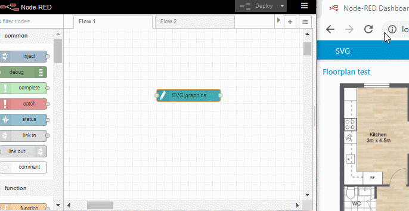](https://user-images.githubusercontent.com/14224149/66722326-17edf600-ee0c-11e9-94b9-225edcc12250.gif)

Вказавши ідентифікатор піктограми (як у наведеній вище анімації), піктограму можна згодом оновити за допомогою вхідних повідомлень (як і будь-який інший елемент SVG).

Коли ви хочете ввести джерело SVG ***вручну*** (без використання DrawSvg), існує інший механізм:

1. Знайдіть на веб-сайті [Fontawesome](https://fontawesome.com/v4.7.0/icons/) значок, який відповідає вашим потребам. Наприклад, "fa-video-camera".

2. Створіть текстовий елемент (із сімейством шрифтів  *"FontAwesome"*), що містить це ім'я піктограми:

   ```html
   <text id="camera_living" x="310" y="45" font-family="FontAwesome" fill="blue" stroke="black" font-size="35" text-anchor="middle" alignment-baseline="middle" stroke-width="1">fa-video-camera</text>
   ```

3. Результатом буде піктограма FontAwesome у вказаному місці:

   [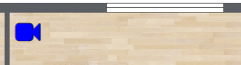](https://user-images.githubusercontent.com/14224149/63217104-29828c80-c140-11e9-957b-22ea8eb9a0ed.png)

Деякі зауваження:

- Вузол автоматично шукає значення ***unicode*** для цієї піктограми на основі цього [списку](https://fontawesome.com/v4.7.0/cheatsheet/):

  [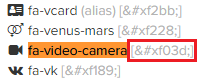](https://user-images.githubusercontent.com/14224149/63217056-9e08fb80-c13f-11e9-8b48-0ec516752d90.png)

  Як результат, у сформованій інформаційній панелі html ви побачите лише значення Unicode (замість оригінального значення fa-video-camera):

  ```html
  <text id="camera_living" x="310" y="45" font-family="FontAwesome" fill="blue" stroke="black" font-size="35" text-anchor="middle"  alignment-baseline="middle" stroke-width="1">&#xf03d;</text>
  ```

- Наразі [DrawSvg](https://github.com/bartbutenaers/node-red-contrib-ui-svg#DrawSvg-drawing-editor) не підтримує шрифт FontAwesome. Див. Це [issue](https://github.com/bartbutenaers/node-red-contrib-ui-svg/issues/34).

  ```html
  ! Це означає, що в поточній версії DrawSvg ви побачите "fa-xxx" замість піктограми FontAwesome:
  ```

  [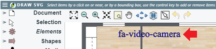](https://user-images.githubusercontent.com/14224149/65816859-4317f900-e201-11e9-83e8-0d46d06198ef.png)

- Оскільки піктограми FontAwesome відображаються в елементах SVG `<text>`, дуже легко змінити піктограму за допомогою ***update_text*** (див. Розділ« Керування повідомленнями »вище):

  [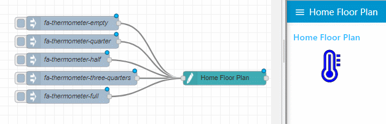](https://user-images.githubusercontent.com/14224149/65432498-95c96d80-de1b-11e9-86c1-8ee7aa147d15.gif)

  ```json
  [{"id":"f369eb92.6c5558","type":"ui_svg_graphics","z":"553defb0.b99fb","group":"9ec8b304.368cc","order":0,"width":"15","height":"15","svgString":"<!--<svg height=\"100\" width=\"100\"></svg>-->\n\n<svg preserveAspectRatio=\"none\" x=\"0\" y=\"0\" viewBox=\"0 0 900 710\" xmlns=\"http://www.w3.org/2000/svg\" xmlns:svg=\"http://www.w3.org/2000/svg\" xmlns:xlink=\"http://www.w3.org/1999/xlink\">\n    <text id=\"my_text\" x=\"100\" y=\"50\" font-family=\"FontAwesome\" fill=\"blue\" stroke=\"black\" font-size=\"80\" text-anchor=\"middle\" alignment-baseline=\"middle\" stroke-width=\"1\">fa-thermometer-empty</text>\n</svg>","clickableShapes":[{"targetId":"#camera_living","action":"click","payload":"#camera_living","payloadType":"str","topic":"#camera_living"},{"targetId":"#camera_balcony","action":"click","payload":"#camera_balcony","payloadType":"str","topic":"#camera_balcony"},{"targetId":"#camera_entry","action":"click","payload":"#camera_entry","payloadType":"str","topic":"#camera_entry"}],"smilAnimations":[],"bindings":[{"selector":"#camera_living","bindSource":"payload.attributeValue","bindType":"attr","attribute":"fill"},{"selector":"#camera_entry","bindSource":"payload.attribueValue","bindType":"attr","attribute":"fill"},{"selector":"#camera_balcony","bindSource":"payload.attributeValue","bindType":"attr","attribute":"fill"}],"showCoordinates":true,"autoFormatAfterEdit":false,"outputField":"anotherField","editorUrl":"","directory":"","name":"Home Floor Plan","x":1130,"y":520,"wires":[[]]},{"id":"866e2e46.ba033","type":"inject","z":"553defb0.b99fb","name":"fa-thermometer-three-quarters","topic":"","payload":"{\"command\":\"update_text\",\"selector\":\"#my_text\",\"textContent\":\"fa-thermometer-three-quarters\"}","payloadType":"json","repeat":"","crontab":"","once":false,"onceDelay":0.1,"x":820,"y":520,"wires":[["f369eb92.6c5558"]]},{"id":"68c4730b.af00bc","type":"inject","z":"553defb0.b99fb","name":"fa-thermometer-full ","topic":"","payload":"{\"command\":\"update_text\",\"selector\":\"#my_text\",\"textContent\":\"fa-thermometer-full\"}","payloadType":"json","repeat":"","crontab":"","once":false,"onceDelay":0.1,"x":790,"y":560,"wires":[["f369eb92.6c5558"]]},{"id":"46183ab5.42fd54","type":"inject","z":"553defb0.b99fb","name":"fa-thermometer-empty","topic":"","payload":"{\"command\":\"update_text\",\"selector\":\"#my_text\",\"textContent\":\"fa-thermometer-empty\"}","payloadType":"json","repeat":"","crontab":"","once":false,"onceDelay":0.1,"x":800,"y":400,"wires":[["f369eb92.6c5558"]]},{"id":"501c7f9a.08ac4","type":"inject","z":"553defb0.b99fb","name":"fa-thermometer-half ","topic":"","payload":"{\"command\":\"update_text\",\"selector\":\"#my_text\",\"textContent\":\"fa-thermometer-half\"}","payloadType":"json","repeat":"","crontab":"","once":false,"onceDelay":0.1,"x":790,"y":480,"wires":[["f369eb92.6c5558"]]},{"id":"d3ea2538.fa9458","type":"inject","z":"553defb0.b99fb","name":"fa-thermometer-quarter","topic":"","payload":"{\"command\":\"update_text\",\"selector\":\"#my_text\",\"textContent\":\"fa-thermometer-quarter\"}","payloadType":"json","repeat":"","crontab":"","once":false,"onceDelay":0.1,"x":800,"y":440,"wires":[["f369eb92.6c5558"]]},{"id":"9ec8b304.368cc","type":"ui_group","z":"","name":"Home Floor Plan","tab":"bb4f2a94.83b338","disp":true,"width":"15","collapse":false},{"id":"bb4f2a94.83b338","type":"ui_tab","z":"","name":"Home Floor Plan","icon":"dashboard","disabled":false,"hidden":false}]
  ```

### Display images

У SVG-схемі елемент *"image"* може бути використаний для відображення зображення всередині схеми SVG. Дивіться цей [підручник](https://github.com/bartbutenaers/node-red-contrib-ui-svg/wiki/Add-an-image-to-an-SVG-drawing) для отримання додаткової інформації!

## Troubleshooting

Деякі поради та підказки для вирішення відомих проблем:

1. Коли елементи SVG ***path*** отримують той самий колір, що і тема інформаційної панелі, як у цьому прикладі, коли фігури стають синіми:

   [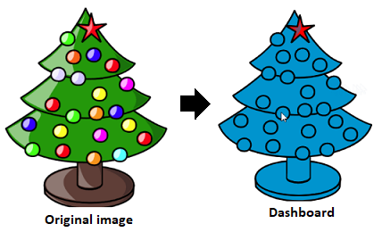](https://user-images.githubusercontent.com/14224149/79540632-c2c7c100-8088-11ea-9ba7-6c5dd4f0a842.png)

   Цього можна уникнути, застосувавши колір заливки як атрибут `style` (наприклад, <element style =" fill: red "... />) до шляху, а не як звичайний атрибут (наприклад, <element fill =" red "... />). І звичайний атрибут `fill 'на шляху SVG буде замінений кольором теми панелі інструментів ...

   Примітка: малюнки, створені за допомогою DrawSvg, уже правильні, але деякі сторонні редактори використовують атрибут `fill` .

1. Деякі основні перевірки вхідних повідомлень були додані на стороні сервера, а помилки перевірки відображатимуться на бічній панелі налагодження.

2. Дивіться [DrawSvg](https://github.com/bartbutenaers/node-red-contrib-ui-svg#show-browser-errors-on-the-server), як показати помилки на стороні клієнта у вашому Node-RED панелі налагодження.

    Примітка: коли зараз видно N малюнків (наприклад, працює одночасно на N інформаційних панелях), тоді відображатиметься N повторюваних повідомлень (де N може бути 0 - це не відкрито інформаційні панелі ...).