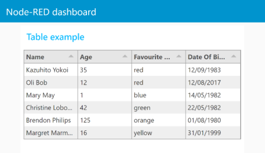
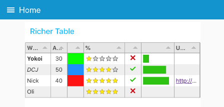
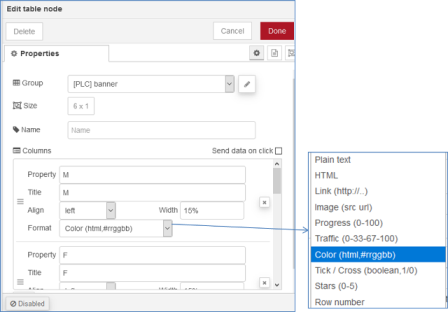
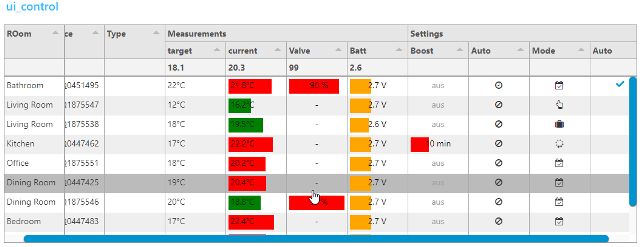

# node-red-node-ui-table

<https://flows.nodered.org/node/node-red-node-ui-table>

<http://tabulator.info/examples/4.4>

## Опис вузла

Вузол віджета інтерфейсу  Node-RED-Dashboard UI, який відображає таблицю даних.

**Inputs**

- payload (array) - Масив об’єктів, що містить дані рядків.

**Outputs (optional)**

- payload (object) -  Об’єкт, що містить дані з вибраного рядка.

- topic (string) - Рядок, що містить ім'я властивості вибраної комірки.
- row (number) -  Число, що містить індекс рядка клікнутої комірки (від 0).

Для очищення таблиці надішліть порожній масив даних `[]`.    

Кожен об’єкт рядка даних повинен мати однаковий набір ключів, оскільки ключі в об’єкті використовуються як імена стовпців. 

### Прості таблиці

Без конфігурації вузол спробує створити таблицю з однаково розташованими стовпцями простого тексту для кожного наданого рядка, використовуючи ключі як заголовки стовпців.



### Покращені таблиці

Якщо використовується ручна конфігурація, для кожного стовпця можна налаштувати заголовок, ширину, вирівнювання та формат. Ширина може бути в пікселях або %, або бути порожньою для автоматичного підлаштування.

Стовпці можна налаштувати вручну. Якщо так, тоді відображатимуться лише визначені властивості `msg.payload`. Потім ви також можете визначити заголовок, ширину, вирівнювання та формат стовпця.



    

- **Title**: Text for the column title (or blank).
- **Width**: Either a number of pixels or percentage of  the overall table width. e.g. 150 or 20%. Leave blank for automatic,  equally spaced to fill the available space.
- **Align**: Column alignment, left, centre or right.
- **Format**: Formatting of the input.
  - **Plain Text** - Simple text values.
  - **HTML** - Rich html to allow text Formatting - *NOTE*: this is raw un-sanitised HTML.
  - **Link** - URL link to a web page.
  - **Image** - Source (src) URL of an image to display.
  - **Progress** - a progress bar from 0 to 100.
  - **Traffic** - Red/Amber/Green indicator light set by numbers in the range 0-33-67-100.
  - **Color** - HTML color name, or hex value (#rrggbb) to fill the cell.
  - **Tick/Cross** - Tick or Cross symbol, boolean true/false, numeric 1/0 or text "1"/"0".
  - **Stars** - Number of stars - numeric 0 to 5.
  - **Row Number** - Current row number.

```json
[
    {
        "Name": "Kazuhito Yokoi",
        "Age": "35",
        "Favourite Color": "red",
        "Date Of Birth": "12/09/1983"
    },
    {
        "Name": "Oli Bob",
        "Age": "12",
        "Favourite Color": "cyan",
        "Date Of Birth": "12/08/2017"
    }
]
```

## Розширені можливості

ui-table базується на модулі **tabulator**. Ви можете знайти більш детальну [документацію тут](http://tabulator.info/docs/4.4) з багатьма [прикладами тут](http://tabulator.info/examples/4.4) а також в наступних розділах. 

## Налаштування таблиці через `msg.ui_control` 

ui-table можна налаштувати, надіславши дані конфігурації на `msg.ui_control.tabulator`.

### Опції налаштування таблиці

Табулятор має широкий спектр параметрів налаштування, які допоможуть вам налаштувати взаємодію з користувачами ваших таблиць. Для цього використовується `msg.ui_control.tabulator` з вказівкою необхідних параметрів.

```js
msg.ui_control = {tabulator: {
    columnVertAlign:"bottom", //align header contents to bottom of cell
    columns:[]}};
```

[Деталі за посиланням](http://tabulator.info/docs/4.5/options)

## Відправка команд на ui-table

Замість надсилання масиву до ui-table цей вузол для заміни повних даних таблиці ui-table також приймає об'єкт як корисне навантаження для надсилання команд. Окрім маніпуляцій з даними, ви можете [встановлювати фільтри](http://tabulator.info/docs/4.5/filter#func) та виконувати багато інших дій за допомогою команд. Об'єкт повинен мати такі властивості

- `command` необхідна функція tabulator, такі як `addRow`, `replaceData` або `addFilter`
- `arguments` *(optional)* масив аргументів для цієї функції
- `returnPromise` *(optional)* boolean значення. `true`  якщо функція повинна повернути повідомлення про Promise. Дивіться документацію tabulator, які команди повернуть Promise

Приклад

```json
{"payload":{
    "command":"addData",
    "arguments":[
        {
            "facility":"daemon",
            "facilityCode":3,
            "severity":"info",
            "severityCode":6,
            "tag":"systemd[1]",
            "timestamp":"2020-01-02T19:17:39.793Z",
            "hostname":"localhost",
            "address":"127.0.0.1",
            "family":"IPv4",
            "port":38514,
            "size":80,
            "msg":"some demo data",
            "id":2351
        },
        true
    ],
    "returnPromise":true
    }
}
```

Надсилаючи лише змінені або нові дані до ui-table, можна дуже швидко оновити таблицю, лише надіславши нові дані до рівня комірки. Або величезні обсяги даних можуть надсилатися як журнали.

**Важливі зауваги**

Дані, які надсилаються до ui-table за допомогою команд, **не** кешуються ui-table! Потік повинен подбати про оновлення таблиці для підключення нових клієнтів або зміни вкладки інформаційної панелі! Табулятор не обмежує обсяг даних, які він зберігає. Це досить ефективно для показу таблиць з парою тисяч рядків. Якщо ці дані перевищують можливості браузера клієнтів, вони будуть аварійно завершуватися помилкою **не вистачає пам’яті** без попередження.

Приклад файлу "4 sending commands.json" можна знайти у папці із прикладами або встановити безпосередньо за допомогою **menu/import/examples/ui-table**. Цей потік показує базову реалізацію того, як потік може зберігати кешовану копію всіх даних таблиці та додавати / видаляти або оновлювати вибіркові рядки. Більшість вузлів містять текст інформації на вкладці info/help.

### Оновлення існуючих даних в таблиці

Якщо ви хочете оновити наявний набір даних у таблиці, не повністю замінюючи дані, ви можете використовувати метод updateData.

Ця функція бере масив об’єктів рядків і оновлює кожен рядок на основі його значення індексу. (за замовчуванням індекс має параметр "id", це можна встановити, використовуючи параметр index у конструкторі табулятора). Параметри без індексу будуть ігноруватися, як і елементи з індексом, якого ще немає в даних таблиці. Функцію addRow слід використовувати для додавання нових даних до таблиці.

```js
table.updateData([{id:1, name:"bob", gender:"male"}, {id:2, name:"Jenny", gender:"female"}]);
```

The function will not replace the rows with the provided data, it will only update any of the provided parameters.

```js
//data before update {id:1, name:"Steve", gender:"male", age:20}

table.updateData([{id:1, name:"bob"}]); //update data

//data after update  = {id:1, name:"bob", gender:"male", age:20}
```

#### Returned Promise

The updateData method returns a promise,  this can be used to run any other commands that have to be run after the data has been loaded into the table. By running them in the promise you ensure they are only run after the table has loaded the data.

```js
table.updateData([{id:1, name:"bob"}])
.then(function(){
    //run code after data has been updated
})
.catch(function(error){
    //handle error updating data
});
```

[Деталі за посиланням](http://tabulator.info/docs/4.5/update)

### Додатково

Табулятор має широкий спектр параметрі



Додаючи ***headers***, ***footers***, ***line*** або ***column grouping***, іноді неможливо визначити кількість рядків. Тому висоту можна вказати, надіславши `msg.ui_control.customHeight = кількість рядків`.

## Групування та форматування стовпців


Приклад потоку з файлу "3 ui_control table.json" 

- згруповані стовпці за визначенням вкладеного стовпця в `ui_control.tabulator.columns`

- перший стовпець `frozen` (заморожений) від горизонтальної прокрутки

- `formatterParams`, щоб означити мінімальний/максимальний, колір, легенду чи інші параметри для форматорів ` progress` та `planText`
- функції форматування значень легенди

  ```javascript
  // add a unit
  function(cell, formatterParams, onRendered){
    return cell.getValue()+"°C";
  }
  ```

  або більш досконалий за допомогою html

  ```javascript
  // convert Number to Icons
  function(cell, formatterParams, onRendered){
    var html="<i class=\"";
    switch(cell.getValue()) {
        case 0: html+="fa fa-calendar-check-o"; break;
        case 1: html+="fa fa-hand-o-up"; break;
        case 2: html+="fa fa-suitcase"; break;
        case 3: html+="fa fa-spinner fa-spin fa-fw"; break;
    }
    html+='\"></i>';
    return html;
  }
  ```

- `topCalc` for average and min/max calculations

- custom icons for `tickCross` formatter

- `tick` formatter

- `groupBy` parameter to use group lines. `groupHeader` function to format legend and adding html tags (Insert a field name in  the groupBy paramter at the end of json in the change node to use this  feature)

- ```
  columnResized
  ```

   callback function to receive a message when the user resize a column

  ```javascript
  function(column){
    var newColumn = {
        field: column._column.field,
        visible: column._column.visible,
        width: column._column.width,
        widthFixed: column._column.widthFixed,
        widthStyled: column._column.widthStyled
    };
    this.send({
        ui_control:{callback:'columnResized',columnWidths:newColumn}
    });
  }
  ```

- use 

  ```
  this.send({})
  ```

   to pass result to Node-RED. (to avoid a loopback add

  ```
  ui_control.callback="someText"
  ```

  )

  ```javascript
  this.send({topic: "anyTopic",payload:"anyPayload",ui_control: {callback:"myCallback"}});
  ```

- all parameters are named according to tabulator documentation. Use `field` instead of `Property` used in node configuration

- no validation of `msg.ui_control` data is performed! So if you don`t get the results you expect take a look on your browsers console.