[<- На головну](../)

# Node-RED Dashboard 2.0

Це переклад [оригінальної документації](https://dashboard.flowfuse.com/about.html)

Цей проект був створений компанією [FlowFuse](https://flowfuse.com/) як частину зусиль щодо оновлення оригінальної Dashboard, щоб уникнути Angular v1.0, який давно вже не підтримується. Ви можете прочитати нашу повну заяву про *чому* ми створюємо Dashboard 2.0 [тут](https://flowfuse.com/blog/2023/06/dashboard-announcement/).

## Технології

### Node-RED

[Node-RED](https://nodered.org/) — це інструмент потокового програмування, спочатку розроблений командою IBM Emerging Technology Services, а тепер є частиною JS Foundation. Він надає редактор на основі браузера, який спрощує об’єднання потоків за допомогою широкого діапазону вузлів у палітрі, які можна розгорнути у середовищі виконання одним клацанням миші.

### Vue.js v3.0

[Vue.js](https://vuejs.org/) — це прогресивний фреймворк JavaScript із поступовим застосуванням для створення інтерфейсу користувача в Інтернеті. Це популярний вибір для створення сучасних веб-додатків. Ми вибрали Vue.js порівняно з іншими популярними фреймворками, такими як React і Angular, через його поверхневу криву навчання та легкість у використанні/читабельності для розробників, які не використовують інтерфейс.

Ми також використовуємо [бібліотеку компонентів Vuetify](https://vuetifyjs.com/en/components/all/), яка є структурою компонентів Material Design для Vue.js. Він спрямований на забезпечення чистих, семантичних і багаторазово використовуваних компонентів, які спрощують створення вашої програми.

### Socket IO

[Socket.IO](https://socket.io/) забезпечує двосторонній зв’язок у реальному часі та на основі подій. Він працює на кожній платформі, браузері чи пристрої, зосереджуючись однаково на надійності та швидкості.

У Dashboard 2.0 ми використовуємо Socket IO для зв’язку між Node-RED та інтерфейсом користувача Dashboard.

# Починаємо

## Встановлення

[FlowFuse](https://flowfuse.com) Node-RED Dashboard 2.0 доступна в Node-RED Palette Manager. Щоб встановити його:

- Відкрийте меню у верхньому правому куті Node-RED
- Натисніть «Керувати палітрою»
- Перейдіть на вкладку «Встановити».
- Пошук `node-red-dashboard`
- Встановіть пакет `@flowfuse/node-red-dashboard` (а не `node-red/node-red-dashboard`)

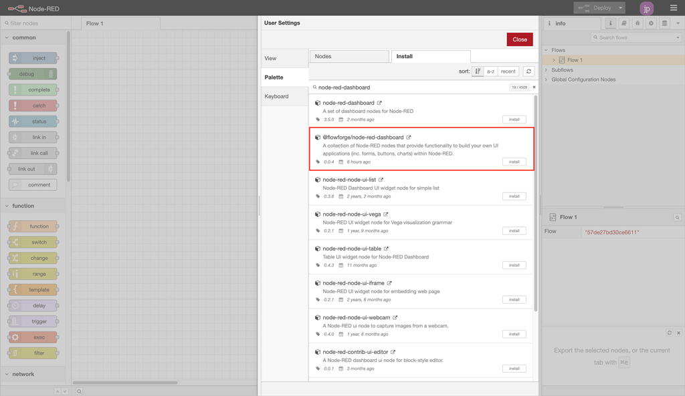

Після цього вузли будуть доступні у вашому редакторі, щоб ви могли почати роботу.

Якщо ви хочете використовувати `npm` для встановлення вузлів, натомість ви можете [дотримуватися цих інструкцій](https://nodered.org/docs/user-guide/runtime/adding-nodes)

## Ієрархія інформаційної панелі (Dashboard )

Кожна інформаційна панель (Dashboard) — це набір віджетів (наприклад, діаграм, кнопок, форм), які можна налаштувати та впорядкувати в нашому власному інтерфейсі користувача. Ієрархія інформаційної панелі така:

- **Base** – означує базову URL-адресу (наприклад, `/dashboard`) для вашої інформаційної панелі.
- **Page** – дана сторінка, на яку може перейти відвідувач, URL-адреса розширить базу, напр. `/dashboard/page1`. Кожна сторінка також може мати означену унікальну тему, яка керує стилем усіх груп/віджетів на сторінці.
- **Group** - колекція віджетів. Відображено на сторінці.
- **Widget** – один віджет (наприклад, діаграма, кнопка, форма), створений на інформаційній панелі.

## Додавання ваших перших віджетів

З установленими вузлами почати так само просто, як вибрати вузол із палітри (лівосторонній список вузлів) у Node-RED і скинути його на своє полотно.

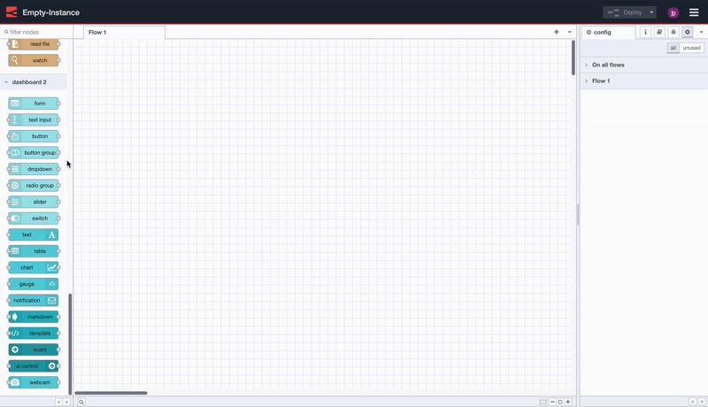

*Запис екрана, щоб показати, як легко розгорнути вашу першу програму Dashboard 2.0.*

У цьому випадку ми вставляємо `ui-button`, натискаємо «Deploy», а потім бачимо, як кнопка працює в інтерфейсі користувача.

Також зауважте, що інформаційна панель автоматично створить для вас нову групу, сторінку, тему та базу для Dashboard .

## Налаштування макета

Dashboard 2.0 додає до редактора Node-RED відповідну бічну панель «Dashboard 2.0». Ця бічна панель надає інтерфейс, за допомогою якого можна переглядати ваші сторінки, теми, групи та віджети. Звідси ви можете додавати нові сторінки та групи, змінювати існуючі налаштування та змінювати порядок вмісту на свій смак.

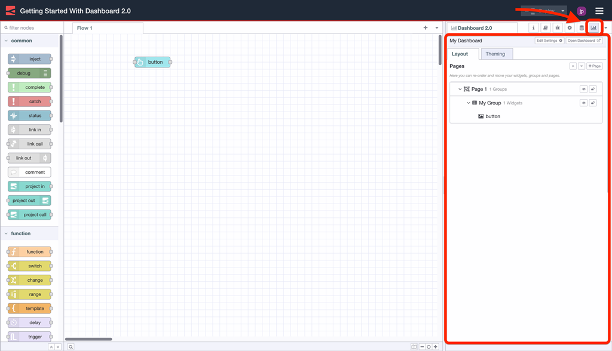

*Знімок екрана, на якому показано бічну панель Dashboard 2.0 у редакторі Node-RED.*

Параметри макета в інтерфейсі користувача Dashboard 2.0 керуються двома основними налаштуваннями:

- **Page Layout:** контролює, як `ui-groups` представлені на певній сторінці у вашій програмі.
- **Navigation Sidebar:** визначає стиль навігації ліворуч, визначений на рівні `ui-base`.

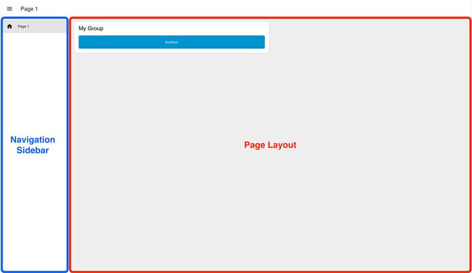**

Приклад "клітинного" макета сторінки (Grid) з навігацією бічної панелі типу "Collapsing".

### Сторінка за замовчуванням

Кожна сторінка в Dashboard 2.0 має унікальну URL-адресу. Якщо користувач переходить до нерозпізнаного шляху під шляхом `/dashboard/`, то для повернення використовується сторінка за замовчуванням.

Зараз у Dashboard 2.0 сторінка за замовчуванням вибирається як сторінка, яка стоїть першою в списку сторінок на бічній панелі навігації:

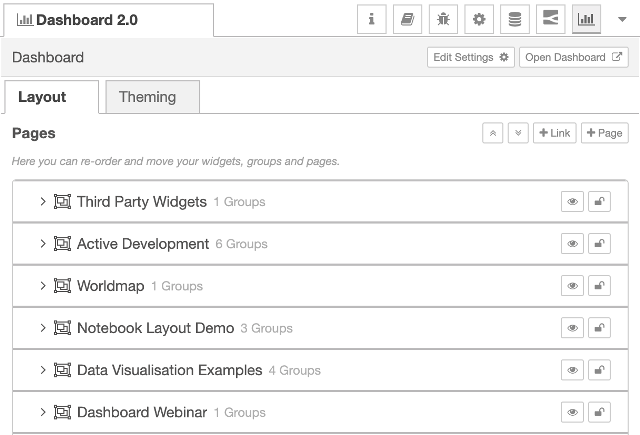

*Знімок екрана зі списком сторінок на бічній панелі Dashboard 2.0*

У цьому прикладі сторінка *"Віджети третьої сторони"* є сторінкою за замовчуванням.

### Параметри макета (Layout)

Наразі ми маємо три різні варіанти макета сторінки:

- **Grid:** ([документи](https://dashboard.flowfuse.com/layouts/types/grid.html)) Макет сторінки за умовчанням. Він використовує структуру сітки з 12 стовпців для розміщення груп. Ширина кожної групи або віджета визначає кількість стовпців, у яких вони відтворюватимуться. Таким чином, «ширина» 6 дюймів відтворюватиме 50% екрана. Макети сітки повністю реагують і адаптуються до розміру екрана. .
- **Fixed:** ([документи](https://dashboard.flowfuse.com/layouts/types/fixed.html)) Кожен компонент відтворюватиметься з *фіксованою* шириною, незалежно від розміру екрана. Властивість «width» перетворюється на фіксоване значення пікселів (за замовчуванням кратне 48 пікселів).
- **Notebook:** ([документи](https://dashboard.flowfuse.com/layouts/types/notebook.html)) Цей макет розтягнеться до 100% ширини, до максимальної ширини 1024 пікселів, і буде вирівняти по центру. Це особливо корисно для розповіді історій (наприклад, статей/блогів) або користувальницьких інтерфейсів типу аналізу (наприклад, Jupyter Notebooks), де ви хочете, щоб користувач переглядав вміст у певному порядку за допомогою прокручування.

### Бічна панель навігації

У структуру інтерфейсу користувача вбудована бічна навігаційна панель разом із верхньою «панеллю додатків» на всій сторінці. Існують параметри конфігурації, за допомогою яких можна керувати поведінкою бічної навігації. Опції включають:

- **Collapsing:** коли бічна панель відкрита, вміст сторінки змінюватиметься відповідно до ширини бічної панелі.
- **Fixed:** повна бічна панель завжди буде видимою, а вміст сторінки підлаштовуватиметься відповідно до ширини бічної панелі.
- **Collapse to Icons:** у згорнутому режимі користувачі можуть переходити між сторінками, клацаючи піктограми, що представляють кожну сторінку, на бічній панелі.
- **Appear over Content:** коли бічна панель відкрита, сторінка накладається, а бічна панель розташовується зверху.
- **Always Hide:** бічна панель ніколи не відображатиметься, а навігація між сторінками може здійснюватися за допомогою [`ui-control`](https://dashboard.flowfuse.com/nodes/widgets/ui-control.html). ).

## Патерни проектування

Є два основні шаблони проектування, які можливі під час створення за допомогою Dashboard 2.0:

- **Єдине джерело правди:** Усі користувачі вашої інформаційної панелі бачитимуть однакові дані. Це корисно для промислових додатків IoT або домашньої автоматизації.
- **Клієнтські дані:** Дані, які відображаються в конкретному віджеті, є унікальними для даного клієнта/сеансу/користувача. Це більш традиційна веб-програма, де кожен користувач має власний сеанс і пов’язані з ним дані.

Варто зазначити, що ці два шаблони можна змішувати та поєднувати в одній програмі Dashboard 2.0, показано [пізніше](https://dashboard.flowfuse.com/getting-started.html#example).

### Єдине джерело правди

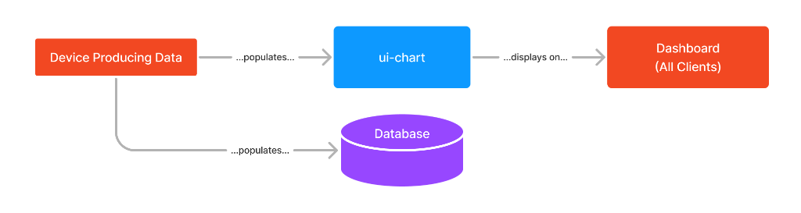

Рис. Приклад робочого процесу для демонстрації шаблону проектування «Єдине джерело істини».

Це шаблон, який використала оригінальна інформаційна панель Node-RED. У цьому шаблоні всі користувачі інформаційної панелі бачитимуть однакові дані. Дані, які заповнюють віджет, зазвичай керуються частиною апаратного забезпечення або викликом API загального призначення.

Коли користувач переходить на інформаційну панель, віджети завантажують відповідний стан і відображають його кожному користувачеві.

Прикладом цього є те, що якщо у вас є інтерактивні елементи, напр. повзунок, пов’язаний із діаграмою, тоді один користувач, пересуваючи повзунок, також відображатиме дані на діаграмі інформаційних панелей кожного іншого користувача.

### Дані, керовані клієнтом

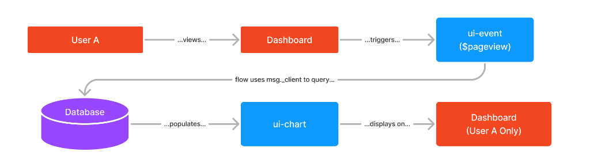

*Приклад робочого процесу для демонстрації шаблону проектування «Client-Driven Data».*

У Dashboard 2.0 ми можемо налаштувати певний тип вузла на ["Приймати дані клієнта"](https://dashboard.flowfuse.com/user/sidebar.html#client-data) на бічній панелі:

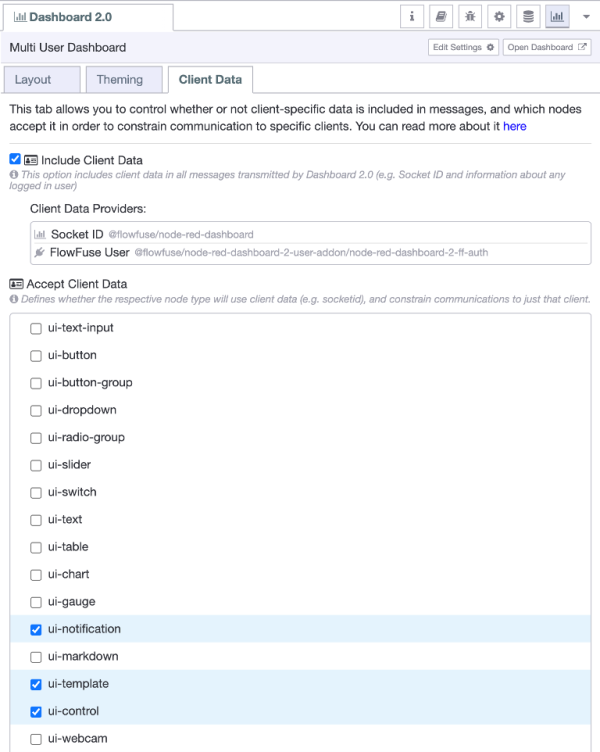*Screenshot of an example "Client Data" tab*

Якщо «Include Client Data» увімкнуто, тоді *всі* об’єкти `msg`, випущені з *усіх* вузлів, міститимуть об’єкт `msg._client`, який буде щонайменше деталізувати `socketId` для підключеного клієнта. До цього об’єкта можна додати додаткові дані, як-от ім’я користувача, адресу електронної пошти чи інший унікальний ідентифікатор за допомогою плагінів інформаційної панелі, напр. [Плагін користувача FlowFuse](https://flowfuse.com/blog/2024/04/displaying-logged-in-users-on-dashboard/).

Таблиця «Прийняти дані клієнта» дозволяє налаштувати, які типи вузлів звертатимуть увагу на будь-яку надану інформацію `msg._client`. Будь-яке повідомлення, надіслане *до* одного з цих вузлів, може містити значення `msg._client`, щоб вказати конкретне з’єднання (наприклад, ім’я користувача, ідентифікатор сокета), до якого мають бути надіслані дані, а не всім клієнтам.

Для користувачів, які знайомі з оригінальною Node-RED Dashboard, ви впізнаєте цей шаблон за допомогою `ui-notification` і `ui-control`, тепер, у Dashboard 2.0, це можливо для *всіх* віджетів.

Ключовим тут є те, що дані зазвичай вводяться у вузол як наслідок дії користувача, наприклад. натискання кнопки, перегляд сторінки або надсилання форми, і дані відповіді надсилаються *лише* тому користувачеві.

Простим прикладом цього шаблону проектування в Dashboard 2.0 є використання вузла [UI Event](https://dashboard.flowfuse.com/nodes/widgets/ui-event.html). Вузол `ui-event` видає `msg`, коли користувач завантажує сторінку. Усередині `msg` є повний об’єкт даних `msg._client`, доступний для підключення цього клієнта. Якщо це повідомлення потім буде надіслано на інший вузол, який приймає дані клієнта, то повне `msg` буде надіслано *тільки* цьому вказаному клієнту.

### Приклад

Тут у нас є потік, який створить деякі дані, визначені клієнтом, і деякі спільні дані. Під час імпортування обов’язково переконайтеся, що на бічній панелі Dashboard 2.0 у таблиці «Accepts Client Data» позначено `ui-text` і `ui-template`.

<video width="800" height="600" src ="https://dashboard.flowfuse.com/assets/demo-design-patterns.B9Lpy5Wp.mp4"> Your browser does not support the video tag. </video>

У відео вище ми бачимо, що в деяких випадках дані надсилаються лише тому клієнту, який їх ініціював (наприклад, натискання кнопок), а в інших дані поширюються між усіма сеансами клієнта (наприклад, візуалізація значення повзунка на діаграмі). .

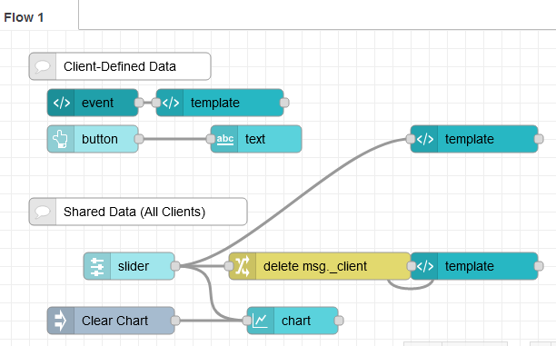

Якщо ви хочете погратиcz з цим прикладом, можете імпортувати цей код в Node-RED.  Під час імпортування обов’язково переконайтеся, що на бічній панелі Dashboard 2.0 у таблиці «Accepts Client Data» позначено `ui-text` і `ui-template`.

```json
[{"id":"f385539f963b56ce","type":"ui-text","z":"3d8c801ff2007261","group":"2b287eac8c5a64cd","order":2,"width":"3","height":"1","name":"","label":"Your Latest Button Click:","format":"{{msg.payload}}","layout":"row-left","style":false,"font":"","fontSize":16,"color":"#717171","className":"","x":290,"y":120,"wires":[]},{"id":"ae23d23cc164d27a","type":"ui-button","z":"3d8c801ff2007261","group":"2b287eac8c5a64cd","name":"","label":"Click Me!","order":3,"width":0,"height":0,"emulateClick":false,"tooltip":"","color":"","bgcolor":"","className":"","icon":"","iconPosition":"left","payload":"","payloadType":"date","topic":"topic","topicType":"msg","x":100,"y":120,"wires":[["f385539f963b56ce"]]},{"id":"a7d3cb9fc537d9bb","type":"ui-slider","z":"3d8c801ff2007261","group":"8bee8ca608b26b77","name":"","label":"slider","tooltip":"","order":1,"width":0,"height":0,"passthru":false,"outs":"all","topic":"topic","topicType":"msg","thumbLabel":true,"min":0,"max":10,"step":1,"className":"","x":150,"y":260,"wires":[["257625ee5df3a84e","ea03c8bc066ebdf2","5ef058757d792100"]]},{"id":"257625ee5df3a84e","type":"ui-chart","z":"3d8c801ff2007261","group":"8bee8ca608b26b77","name":"","label":"chart","order":3,"chartType":"line","category":"topic","categoryType":"msg","xAxisProperty":"","xAxisPropertyType":"msg","xAxisType":"time","yAxisProperty":"","ymin":"","ymax":"","action":"append","pointShape":"circle","pointRadius":4,"showLegend":true,"removeOlder":1,"removeOlderUnit":"3600","removeOlderPoints":"","colors":["#1f77b4","#aec7e8","#ff7f0e","#2ca02c","#98df8a","#d62728","#ff9896","#9467bd","#c5b0d5"],"width":"9","height":8,"className":"","x":330,"y":320,"wires":[[]]},{"id":"ce9b4c9ec9c4ed93","type":"inject","z":"3d8c801ff2007261","name":"Clear Chart","props":[{"p":"payload"}],"repeat":"","crontab":"","once":false,"onceDelay":0.1,"topic":"","payload":"[]","payloadType":"json","x":130,"y":320,"wires":[["257625ee5df3a84e"]]},{"id":"8aefa358fdb6e177","type":"ui-event","z":"3d8c801ff2007261","ui":"c2e1aa56f50f03bd","name":"","x":100,"y":80,"wires":[["0b8294025998e4be"]]},{"id":"0b8294025998e4be","type":"ui-template","z":"3d8c801ff2007261","group":"2b287eac8c5a64cd","page":"","ui":"","name":"","order":1,"width":0,"height":0,"head":"","format":"<template>\n    <strong>msg._client:</strong>\n    <pre>{{ msg._client }}</pre>\n</template>","storeOutMessages":true,"passthru":true,"resendOnRefresh":true,"templateScope":"local","className":"","x":240,"y":80,"wires":[[]]},{"id":"c0a2283e528e663e","type":"comment","z":"3d8c801ff2007261","name":"Client-Defined Data","info":"","x":130,"y":40,"wires":[]},{"id":"c999e4c44afd670c","type":"comment","z":"3d8c801ff2007261","name":"Shared Data (All Clients)","info":"","x":150,"y":200,"wires":[]},{"id":"6de64b0ab3a086ed","type":"ui-template","z":"3d8c801ff2007261","group":"8bee8ca608b26b77","page":"","ui":"","name":"Show to All","order":2,"width":0,"height":0,"head":"","format":"<template>\n    <strong>Shared Slider Value:</strong>\n    <pre>{{ msg.payload }}</pre>\n</template>","storeOutMessages":true,"passthru":true,"resendOnRefresh":true,"templateScope":"local","className":"","x":530,"y":260,"wires":[[]]},{"id":"ea03c8bc066ebdf2","type":"change","z":"3d8c801ff2007261","name":"","rules":[{"t":"delete","p":"_client","pt":"msg"}],"action":"","property":"","from":"","to":"","reg":false,"x":350,"y":260,"wires":[["6de64b0ab3a086ed"]]},{"id":"5ef058757d792100","type":"ui-template","z":"3d8c801ff2007261","group":"2b287eac8c5a64cd","page":"","ui":"","name":"Client-Driven","order":2,"width":"3","height":"1","head":"","format":"<template>\n    Client Specific Slider: {{ msg.payload }}\n</template>","storeOutMessages":true,"passthru":true,"resendOnRefresh":true,"templateScope":"local","className":"","x":530,"y":120,"wires":[[]]},{"id":"2b287eac8c5a64cd","type":"ui-group","name":"Design Pattern - Client Driven","page":"1a43c75e8780fe2b","width":"9","height":"1","order":-1,"showTitle":true,"className":"","visible":"true","disabled":"false"},{"id":"8bee8ca608b26b77","type":"ui-group","name":"Design Pattern - Single Source of Truth","page":"1a43c75e8780fe2b","width":"9","height":"1","order":-1,"showTitle":true,"className":"","visible":"true","disabled":"false"},{"id":"c2e1aa56f50f03bd","type":"ui-base","name":"Dashboard","path":"/dashboard","includeClientData":true,"acceptsClientConfig":["ui-control","ui-notification","ui-text","ui-template"],"showPathInSidebar":true,"navigationStyle":"temporary","titleBarStyle":"fixed"},{"id":"1a43c75e8780fe2b","type":"ui-page","name":"Design Pattern Examples","ui":"c2e1aa56f50f03bd","path":"/design-patterns","icon":"home","layout":"grid","theme":"c2ff5ba1f92a0f0e","order":1,"className":"","visible":"true","disabled":"false"},{"id":"c2ff5ba1f92a0f0e","type":"ui-theme","name":"Default","colors":{"surface":"#ffffff","primary":"#0094ce","bgPage":"#eeeeee","groupBg":"#ffffff","groupOutline":"#cccccc"},"sizes":{"pagePadding":"12px","groupGap":"12px","groupBorderRadius":"4px","widgetGap":"12px"}}]
```

Трохи більше про сам потік.

#### Client-Driven Data

Для цього випадку ми встановили параметри `ui-text` і `ui-template`, налаштовані на бічній панелі, як «Accept Client Constraints».

У верхній половині вузол `ui-event` видасть повідомлення, коли користувач завантажить сторінку. Це повідомлення міститиме об’єкт `msg._client`, унікальний для підключення цього користувача. Потім це повідомлення надсилається до вузла `ui-template`, який відображатиме ідентифікатор сокета конкретного користувача.

Подібним чином у нас є кнопка, яка також видаватиме дані `msg._client` (як і всі вузли), але цього разу вони будуть надіслані до вузла `ui-text`. `ui-text` покаже мітку часу останнього натискання клієнтом/користувачем цієї кнопки.

#### Shared Data  (усі клієнти)

У цьому розділі потоку демонструється, як можна використовувати повзунок для керування діаграмою. Зауважте, що ми підключаємо повзунок безпосередньо до діаграми, оскільки `ui-chart` не налаштовано на «Accept Client Constraints».

Ми також підключаємо `ui-slider` до двох вузлів `ui-template`. Враховуючи, що вузли `ui-template` *налаштовані* на «Accept Client Data», ми можемо продемонструвати як спільні, так і клієнтські дані в одному потоці, видаливши дані `msg._client` на шляху до наступного `ui-template`. Якщо видалити це, будь-які дані повзунка, надіслані сюди, надсилатимуться до *всіх* з’єднань, оскільки `msg` не вказує `_client`. Верхній `ui-template` оновлюватиметься лише для клієнта, який перемістив повзунок.

## Сприяння

Якщо ви бажаєте запустити цей набір вузлів локально та, зокрема, допомогти в розробці, ви можете прочитати документацію [Допомога](https://dashboard.flowfuse.com/contributing/).

Якщо ви хочете створювати власні автономні вузли та віджети, які легко інтегруються з Dashboard 2.0, ви можете прочитати наш посібник про це [тут](https://dashboard.flowfuse.com/contributing/widgets/third-party.html). )

# Віджети

## Основні віджети

Віджети інформаційної панелі є будівельними блоками вашої інформаційної панелі. Поєднуйте їх так, як вам подобається, щоб створювати власні візуалізації даних та інтерфейси користувача.

Наступні віджети входять до складу Node-RED Dashboard 2.0:

### Загальні

#### Button

Додає на інформаційну панель кнопку, яку можна натиснути.

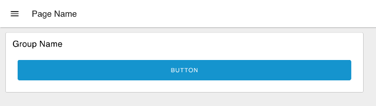

#### Markdown

Виконує динамічну розцінку (включаючи Mermaid Charts).

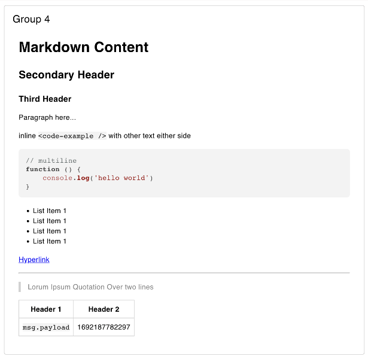


#### Notification

Відображає повідомлення протягом визначеного періоду часу.

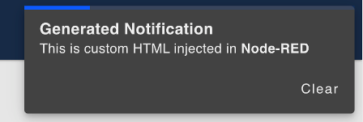


#### Template

Відтворює настроювані шаблони на панелі інструментів.

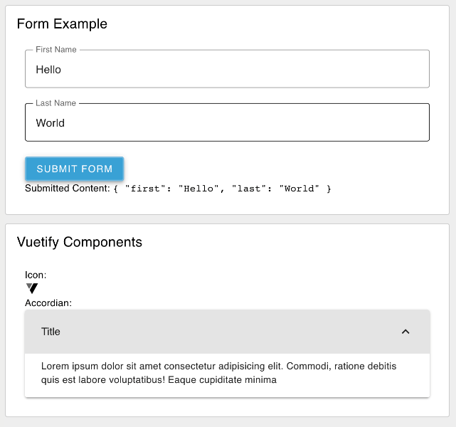

#### Text

Відображає на інформаційній панелі текстове поле, яке не можна редагувати.

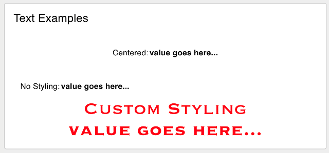


### Form & Controls 

#### Dropdown

Додає на інформаційну панель кнопку, яку можна натиснути.

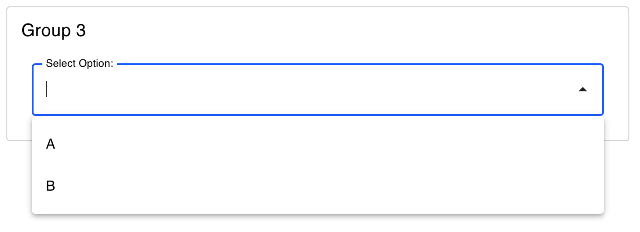

#### Form

Додає на інформаційну панель кнопку, яку можна натиснути.

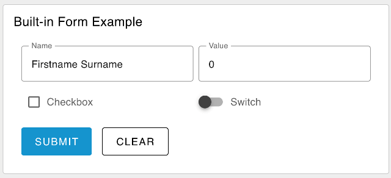

#### Radio Group

Додає групу радіо-кнопок на вашу інформаційну панель.


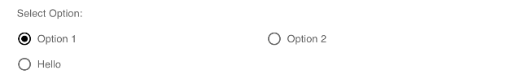

#### Slider

Додає повзунок на вашу інформаційну панель.


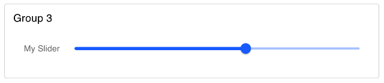

#### Switch

Додає на інформаційну панель перемикач, який можна натиснути.

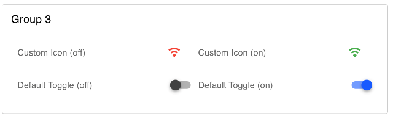

#### Text Input

Додає введення тексту на інформаційну панель.

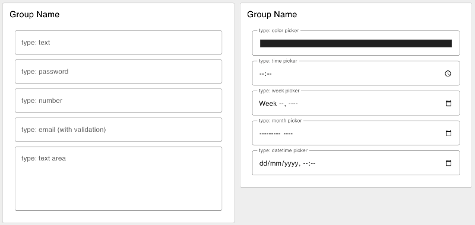


### Data Visualisation 

#### Chart

Додає діаграму на інформаційну панель.

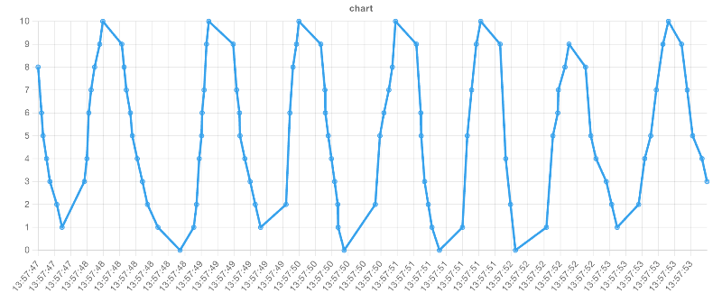

#### Table

Додає таблицю на інформаційну панель.

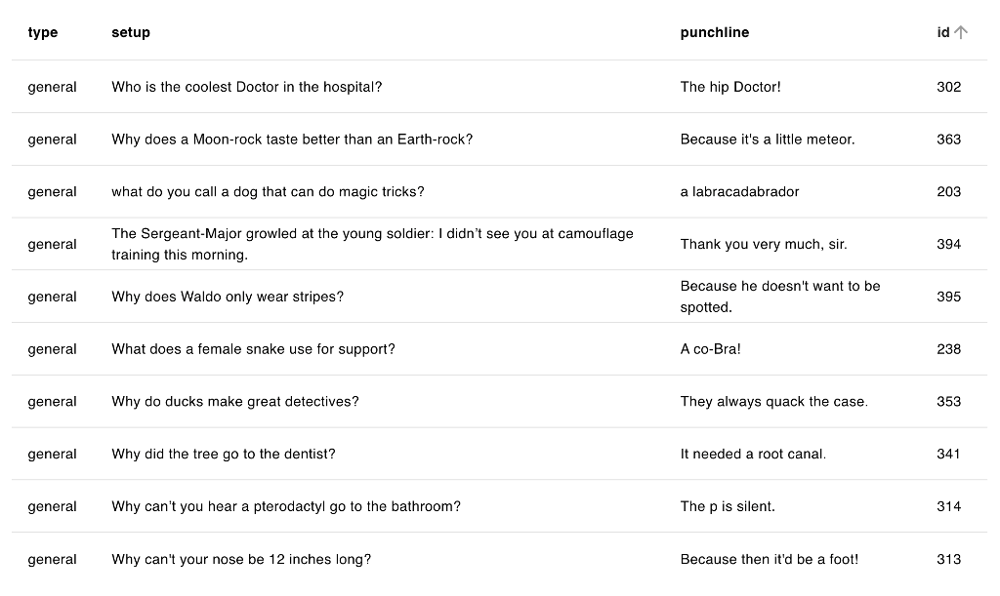

### Events & Control 

Колекція віджетів, які не відображають вміст на інформаційній панелі, але натомість дозволяють обмінюватися даними з інформаційною панеллю для моніторингу активності та контролю стану інформаційної панелі.

#### Event

Відстежує події на інформаційній панелі та видає відповідні повідомлення.

## Віджети сторонніх розробників

На додаток до основних віджетів, ми маємо архітектуру для підтримки сторонніх віджетів. Якщо вам цікаво розробити щось самостійно, ви можете ознайомитися з [Посібником із створення сторонніх віджетів](https://dashboard.flowfuse.com/contributing/widgets/third-party.html).

Ось список сторонніх віджетів, про які ми знаємо, щоб полегшити пошук того, що ви шукаєте. Ці віджети створені нами та спільнотою та можуть бути встановлені через Node-RED Palette Manager.

- [@sumit_shinde_84/ui-webcam](https://flows.nodered.org/node/@sumit_shinde_84/node-red-dashboard-2-ui-webcam): дозволяє користувачам інтегрувати функції веб-камери в Node-RED Dashboard 2.0 , що дозволяє користувачам знімати зображення та транслювати відео через різні камери.
- [@flowfuse/ui-iframe](https://flows.nodered.org/node/@flowfuse/node-red-dashboard-2-ui-iframe): вставте зовнішню веб-сторінку на свою інформаційну панель за допомогою iframe.
- [@flowfuse/ui-led](https://flows.nodered.org/node/@flowfuse/node-red-dashboard-2-ui-led): додає світлодіодний індикатор стану на вашу інформаційну панель.

### У розробці

Нижче наведено список вузлів, про які нам стало відомо, які знаходяться в активній розробці, але ще не опубліковані в Node-RED Palette Manager.

- [@bartbutenaers/ui-svg](https://github.com/bartbutenaers/node-red-dashboard-2-ui-svg/tree/master): додає віджет SVG до вашої інформаційної панелі з динамічним керуванням над графіком і стиль.