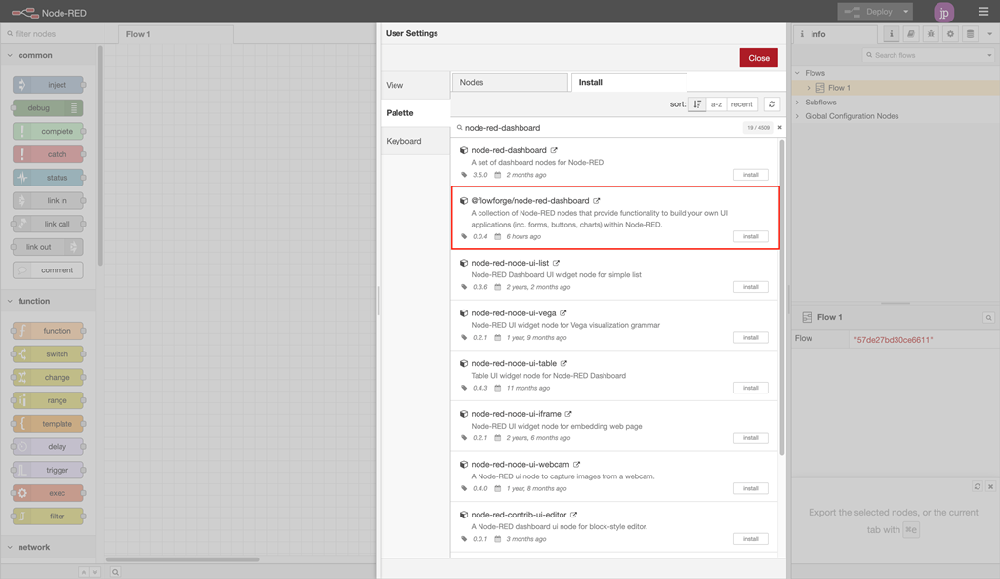
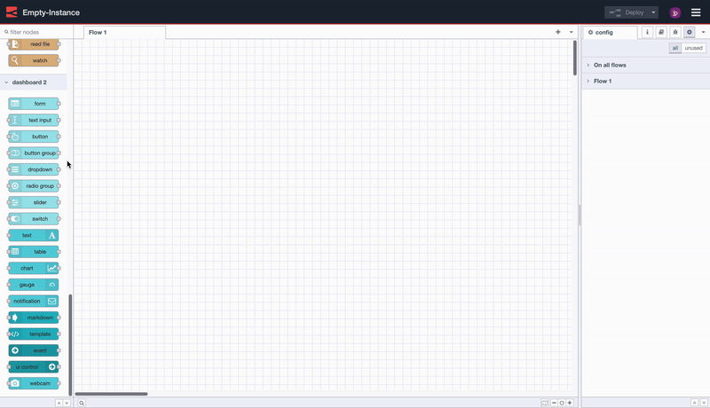
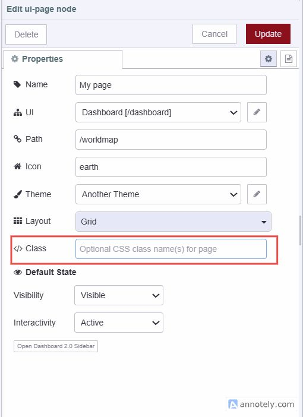

[<- На головну](../)

# Node-RED Dashboard 2.0

## Dashboard 2.0

Проєкт Node-RED Dashboard 2.0 був створений компанією [FlowFuse](https://flowfuse.com/) для заміни оригінальної версії Dashboard, яка базувалася на Angular v1.0, що давно вже не підтримується. Про цю ініціативу зокрема написано [за цим посиланням](https://flowfuse.com/blog/2023/06/dashboard-announcement/). У основні Node-RED Dashboard 2.0 стоять нові технології:

- [Vue.js v3.0](https://vuejs.org/) — це прогресивний фреймворк JavaScript із поступовим застосуванням для створення інтерфейсу користувача в Інтернеті. Це популярний вибір для створення сучасних веб-застосунків. Він був вибраний розробниками через його поверхневу криву навчання та легкість у використанні/читабельності для розробників, які не використовують інтерфейс. Також використовується [бібліотека компонентів Vuetify](https://vuetifyjs.com/en/components/all/), яка є структурою компонентів Material Design для Vue.js. Він спрямований на забезпечення чистих, семантичних і багаторазово використовуваних компонентів, які спрощують створення вашої програми.

- [Socket.IO](https://socket.io/) забезпечує двосторонній зв’язок у реальному часі та на основі подій. Він працює на кожній платформі, браузері чи пристрої, зосереджуючись однаково на надійності та швидкості. 

## Перші кроки

FlowFuse Node-RED Dashboard 2.0 доступна в Node-RED Palette Manager під назвою `@flowfuse/node-red-dashboard` (а не `node-red/node-red-dashboard`)

рис.1. 

Спробувати роботу можна просто перетягнувши якийсь вузол віджета, зробивши розгортання та перейшовши на dashboard через відповідний пункт меню (рис.2). У випадку з рис.2 вставляється `ui-button`, натискається «Deploy», а потім бачимо, як кнопка працює в інтерфейсі користувача. Також зауважте, що інформаційна панель автоматично створить нову групу, сторінку, тему та базу для Dashboard . 

рис.2. Запис екрана, щоб показати, як легко розгорнути першу програму Dashboard 2.0.

## Основні компоненти

Базовий принцип побудови UI полягає у структурній ієрархії: сторінка (page) – група (group) – віджет (Widget ). Сторінка відповідає логічному екрану або сценарію використання, групи виконують роль контейнерів для функціонально пов’язаних елементів, а віджети є візуальними представленнями даних або органів керування. 

Таким чином кожна **інформаційна панель** (**Dashboard**) — це набір віджетів (наприклад, діаграм, кнопок, форм), які можна налаштувати та впорядкувати:

- `Base` – означує базову URL-адресу (наприклад, `/dashboard`) для вашої інформаційної панелі.
- `Page` – дана сторінка, на яку може перейти відвідувач, URL-адреса розширить базу, напр. `/dashboard/page1`. Кожна сторінка також може мати означену унікальну тему, яка керує стилем усіх груп/віджетів на сторінці.
- `Group` - колекція віджетів. Відображено на сторінці.
- `Widget` – один віджет (наприклад, діаграма, кнопка, форма), створений на інформаційній панелі.

Dashboard 2.0 додає до редактора Node-RED відповідну бічну панель «Dashboard 2.0». Ця бічна панель надає інтерфейс, за допомогою якого можна переглядати і редагувати сторінки, теми, групи та віджети. Звідси ви можете додавати нові сторінки та групи, змінювати існуючі налаштування та змінювати порядок вмісту на свій смак. Тут можна змінювати як сторінки так і бічне меню.

Детальніше про макетування читайте в [Макетування ](layouts.md)

Віджети можуть оновлюватися одночасно на всіх відображених сторінках однаково, або мати індивідуальну поведінку, в залежності від клієнта. Детальніше про це написано в [Патерни проектування](patterns.md).

## Віджети

Віджети інформаційної панелі є будівельними блоками інформаційної панелі. Доступні наступні віджети:

| Віджет                             | Призначення                                                  | Примітка |
| ---------------------------------- | ------------------------------------------------------------ | -------- |
| [ui-audio](audio.md)               | Додає аудіоможливості до Dashboard. Можна обрати один із двох режимів: `Audio Player` або `Text-to-Speech`. |          |
| [ui-button](button.md)             | Додає клікабельну кнопку на Dashboard.                       |          |
| [ui-button-group](button-group.md) | Додає набір кнопок, які працюють як багатостановий перемикач на Dashboard. Коли натискається окрема кнопка, вона стає активною, а всі інші кнопки в групі переходять у неактивний стан. Нове вибране значення передається з вузла в Node-RED. |          |
| [ui-control](uictrl.md)            | Надає інтерфейс для керування поведінкою інформаційної панелі з редактора Node-RED. |          |
| [ui-chart](chart.md)               | Надає параметри конфігурації для створення різних типів діаграм |          |
| [ui-dropdown](dropdown.md)         | Додає випадаючий список (dropdown) на Dashboard, який щоразу при зміні значення передає вибране значення в Node-RED у `msg.payload`. |          |
| [ui-file-input](file-input.md)     | Дозволяє користувачам завантажувати файли до Node-RED. Віджет можна налаштувати на приймання певних типів файлів і дозволити завантаження кількох файлів одночасно. |          |
| [ui-form](form.md)                 | Додає форму до інтерфейсу користувача, яка допомагає збирати кілька значень від користувача після натискання кнопки надсилання як об’єкт у `msg.payload`. |          |
| [ui_gage](gauge.md)                | Додає індикатор (Gauge) на Dashboard. Може бути налаштований з користувацькими типами (півколо, 3/4 кола), стилями (заокруглений, стрілка) та сегментацією. Нижче наведено приклади. |          |
| [ui-markdown](markdown.md)         | Дозволяє означати Markdown безпосередньо в редакторі Node-RED і відображати його в UI. Може використовуватися для виведення підписів, заголовків або навіть повноцінних статей блогу. |          |
| [ui-notification](notification.md) | Відображає текст або HTML у невеликому вікні, яке з’являється на екрані на заданий проміжок часу (`timeout`) і в заданому місці екрана (position). |          |
| [ui-number-input](number-input.md) | Додає один рядок числового введення (Number Input) на Dashboard. |          |
| [ui-progress](progress.md)         | Відображає візуальний індикатор прогресу для показу стану виконання або поточних процесів на Dashboard. |          |
| [ui-radio-group](radio-group.md)   | Додає групу радіокнопок (Radio Group) на Dashboard, яка щоразу при виборі значення передає його в Node-RED через `msg.payload`. |          |
| [ui-slider](slider.md)             | Додає повзунок (Slider) на Dashboard, який щоразу при зміні значення передає його в Node-RED через `msg.payload`. |          |
| [ui-spacer](spacer.md)             | Дозволяє додати простий розділювач (spacer) до груп Dashboard, що допомагає у компонуванні елементів інтерфейсу. |          |
| [ui-switch](switch.md)             | Додає тумблер (перемикач) до користувацького інтерфейсу.     |          |
| [ui-table](table.md)               | Відтворює набір даних у табличному форматі.                  |          |
| [ui-template](template.md)         | Надає можливість розміщувати власний код JS і HTML (включно з будь-якими компонентами Vuetify) і CSS для відтворення на інформаційній панелі. |          |
| [ui-text](text.md)                 | Відображає в інтерфейсі користувача текстове поле, яке не можна редагувати. Кожен отриманий `msg.payload` оновлюватиме значення, показане поряд із (необов’язковою) міткою. |          |
| [ui-text-input](text-input.md)     | Введення тексту з використанням різних форм.                 |          |

На додаток до основних віджетів, ми маємо архітектуру для підтримки сторонніх віджетів. Якщо вам цікаво розробити щось самостійно, ви можете ознайомитися з [Посібником із створення сторонніх віджетів](https://dashboard.flowfuse.com/contributing/widgets/third-party.html).

Ось список сторонніх віджетів, про які ми знаємо, щоб полегшити пошук того, що ви шукаєте. Ці віджети створені нами та спільнотою та можуть бути встановлені через Node-RED Palette Manager.

- [@sumit_shinde_84/ui-webcam](https://flows.nodered.org/node/@sumit_shinde_84/node-red-dashboard-2-ui-webcam): дозволяє користувачам інтегрувати функції веб-камери в Node-RED Dashboard 2.0 , що дозволяє користувачам знімати зображення та транслювати відео через різні камери.
- [@flowfuse/ui-iframe](https://flows.nodered.org/node/@flowfuse/node-red-dashboard-2-ui-iframe): вставте зовнішню веб-сторінку на свою інформаційну панель за допомогою iframe.
- [@flowfuse/ui-led](https://flows.nodered.org/node/@flowfuse/node-red-dashboard-2-ui-led): додає світлодіодний індикатор стану на вашу інформаційну панель.

## Конфігураційні вузли

Макетування великою мірою базується на конфігураційних вузлах Node-RED Dashboard 2.0. У наступній таблиці наведений перелік конфігураційних вузлів та посилання на їх опис.

| Вузол                | Призначення                                                  | Примітка |
| -------------------- | ------------------------------------------------------------ | -------- |
| [ui-base](base.md)   | відповідає за базову конфігурацію та глобальні властивості Dashboard у Node-RED (FlowFuse Dashboard 2.0). Це кореневий вузол інтерфейсу, від якого залежать усі сторінки, групи та віджети |          |
| [ui-page](page.md)   | налаштування сторінки                                        |          |
| [ui-link](link.md)   | налаштування посилання на зовнішні ресурси                   |          |
| [ui-group](group.md) | налаштування групи                                           |          |
| [ui-theme](theme.md) | налаштування теми                                            |          |

## Кастомізація

Більшість віджетів через властивість `Class` мають можливість змінювати свій зовнішній вигляд, який переозначується через вузол  [`ui-template`](template.md). Цей же вузол надає можливість розміщувати власний код JS і HTML на сторінці. 

Деякі налаштування Dashboard2 вносяться в `settings.js` , про це можна почитати в [Налаштування Dashboard 2](settings.md)

[Оригінальна документація](https://dashboard.flowfuse.com/about.html)