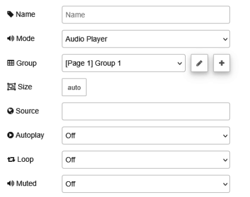

| [На головну](../) | [Розділ](README.md) |
| ----------------- | ------------------- |
|                   |                     |

# Audio `ui-audio`

https://dashboard.flowfuse.com/nodes/widgets/ui-audio

Додає аудіоможливості до Dashboard. 



- `Mode` - Вибір між `Audio Player` (відтворення аудіофайлів за URL) і `Text-to-Speech` (озвучування тексту за допомогою вбудованого TTS браузера).

- `UI` - UI (`ui-base`), до якого буде додано цю сторінку (лише для TTS).

- `Group` - Визначає, у якій групі UI Dashboard буде відображено цей віджет (лише для `Audio Player`).

- `Size` - Керує шириною кнопки відносно батьківської групи. Максимальне значення дорівнює ширині групи.

- `Source` (динамічна) - Джерело аудіо, URL, з якого завантажується аудіофайл (лише для Audio Player).

- `Autoplay` (динамічна) - Визначає, чи починати відтворення автоматично (лише для Audio Player).

- `Loop` (динамічна) - Визначає, чи має аудіо відтворюватися по колу, тобто автоматично запускатися знову після завершення (лише для Audio Player).

- `Muted` (динамічна) - Визначає, чи має звук бути вимкненим (лише для `Audio Player`).

- `Voice` - Голос для використання в режимі `Text-to-Speech` (лише для TTS).

Можна обрати один із двох режимів: `Audio Player` або `Text-to-Speech`.

- `Audio Player`. У цьому режимі вузол відображає на Dashboard аудіоплеєр, який може відтворювати аудіофайли за URL. URL можна задати в конфігурації вузла або динамічно через вхідні повідомлення (див. Dynamic Properties нижче). Додатково, якщо надіслати у вузол рядок як `payload`, цей рядок буде використано як джерело аудіо і відтворення розпочнеться автоматично (якщо увімкнено `autoplay`).

- `Text-to-Speech (TTS)`. У цьому режимі вузол використовує вбудовані в браузер можливості синтезу мовлення для озвучування тексту. Для роботи потрібна дія користувача (наприклад, клік на Dashboard) через обмеження безпеки браузера. Якщо `payload` вхідного повідомлення є рядком, він використовується як текст для озвучування. Якщо `payload` є об’єктом, можна задати додаткові параметри (поле `text` є обов’язковим). Приклад: озвучити `Hello World` голосом `Google US English` зі швидкістю 1.1, висотою тону 0.9 і гучністю 88 %

```json
{
    "payload": {
        "text": "Hello World",
        "voice": "Google US English",
        "rate": 1.1,
        "pitch": 0.9,
        "volume": 88
    }
}
```

Примітки:

- Доступні голоси залежать від браузера та операційної системи. Список доступних голосів можна отримати, виконавши speechSynthesis.getVoices() у консолі браузера.
- Властивість voice є необов’язковою. Вона може бути назвою голосу (наприклад, "Google US English") або індексом (0 для першого голосу, 1 для другого тощо). Якщо встановити voice як порожній рядок "", браузер використає голос за замовчуванням.
- Властивість lang дозволяє вибрати голос, що відповідає заданій мові. Це корисно, якщо потрібна певна мова, але точна назва голосу невідома. Браузер вибере перший голос, що відповідає мові. Зауваження: якщо задано voice, воно має вищий пріоритет за lang.

Вузол також підтримує керування відтворенням через вхідні повідомлення. Надішліть повідомлення зі значенням `playback`, встановленим в один із таких рядків:

- `play`: почати або відновити відтворення. Якщо аудіо на паузі, воно продовжиться з поточної позиції.
- `resume`: синонім для `play`.
- `pause`: призупинити відтворення.
- `stop`: зупинити відтворення і повернутися на початок.

Динамічні властивості можуть бути перевизначені під час виконання шляхом надсилання відповідного msg до вузла. За потреби значення, задані в конфігурації Node-RED, будуть замінені значеннями з отриманих повідомлень.

| Prop     | Payload                  | Structures     | Example Values |
| -------- | ------------------------ | -------------- | -------------- |
| Source   | `msg.ui_update.source`   | `String`       |                |
| Autoplay | `msg.ui_update.autoplay` | `'on' | 'off'` |                |
| Loop     | `msg.ui_update.loop`     | `'on' | 'off'` |                |
| Muted    | `msg.ui_update.muted`    | `'on' | 'off'` |                |

`msg.enabled` Дозволяє керувати тим, чи є кнопка клікабельною.

```
msg.enabled: true | false
```

