| [На головну](../) | [Розділ](README.md) |
| ----------------- | ------------------- |
|                   |                     |

# Config: UI Base `ui-base`

https://dashboard.flowfuse.com/nodes/config/ui-base

## Загальні налаштування

Вузол `ui-base` відповідає за базову конфігурацію та глобальні властивості Dashboard у Node-RED (FlowFuse Dashboard 2.0). Це кореневий вузол інтерфейсу, від якого залежать усі сторінки, групи та віджети. По суті, `ui-base` задає рамку, в межах якої працює весь користувацький інтерфейс. До нього можна доступитися як через меню конфігураційних вузлів, так і через кнопку `Edit Settings` бічної панелі (рис.1)

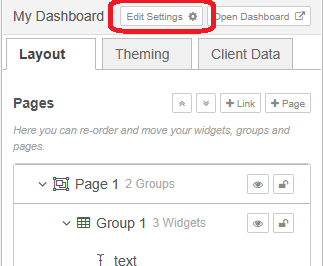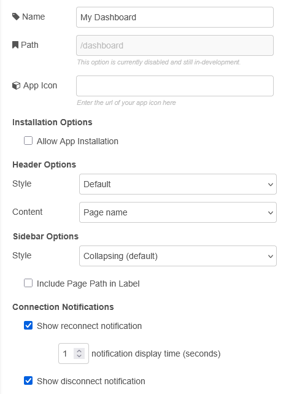

рис.1.

| Prop                       | Description                                                  |
| -------------------------- | ------------------------------------------------------------ |
| Path                       | Шлях кінцевої точки після хоста Node-RED, за яким буде доступний ваш UI |
| App Icon                   | Дозволяє задати власний значок застосунку. Потрібно вказати URL значка, який буде відображатися як іконка застосунку та у вкладці браузера. |
| Include Page Path in Label | Бічна навігація перелічує всі доступні сторінки Dashboard. За замовчуванням відображається лише назва сторінки, але ця опція дозволяє також показувати шлях сторінки. |
| Side Navigation Style      | Стиль бічного навігаційного меню (`default`, `fixed`, `icon`, `temporary`, `none`) |

## Application Icon

Функція Application Icon дозволяє встановити власний значок для FlowFuse Dashboard. Цей значок використовується у вкладці браузера та під час встановлення Dashboard як `Progressive Web Application (PWA)`. Надане зображення має бути квадратним, з розмірами від 192 px до 512 px. Для налаштування потрібно вказати URL зображення у полі App Icon, що покращує брендування та впізнаваність для користувачів.

Щоб налаштувати Application Icon у FlowFuse Dashboard, виконайте такі кроки:

1. Відкрийте налаштування вузла Edit `ui-base`.
2. У полі App Icon введіть URL зображення, яке ви хочете використати як значок застосунку. Переконайтеся, що зображення квадратне і має розміри від 192 px до 512 px.
3. Цей значок буде відображатися у вкладці браузера та під час встановлення Dashboard як Progressive Web App (PWA).
4. Натисніть `Update`, щоб зберегти зміни.

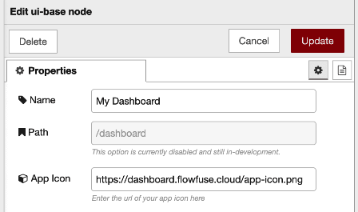

рис.2. Скріншот параметрів конфігурації UI Base 

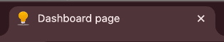

рис.3. Приклад того, як App Icon виглядає у вкладці браузера

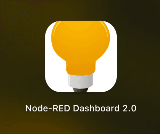

рис.4. Приклад того, як App Icon виглядає після встановлення на iPhone

## Allow Install

Будь-який застосунок FlowFuse Dashboard можна встановити як `Progressive Web App` на настільний або мобільний пристрій, що забезпечує вигляд і користувацький досвід, подібні до нативного мобільного застосунку. Детальніше про цю можливість можна прочитати за [посиланням](https://dashboard.flowfuse.com/user/pwa).

Опція `Allow Install` надає можливість увімкнути або вимкнути пункт `Install` для встановлення Dashboard як застосунку. Якщо використовується автентифікація FlowFuse, це не рекомендується, оскільки PWA worker-и кешують вміст окремо від сесій автентифікації.

## Header Style Options

`Title Bar – Default` - Панель заголовка відображається першою і прокручується разом із вмістом. Це означає, що на довгих сторінках панель заголовка не буде видимою після прокручування.

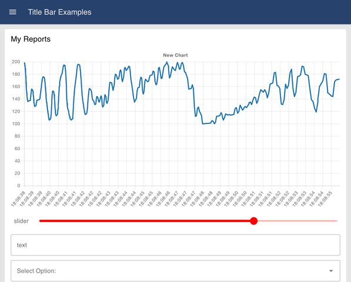

рис.5. Приклад вигляду опції Default

`Title Bar – Fixed` - Панель заголовка завжди залишається видимою, навіть під час прокручування сторінки. Це корисно, якщо потрібно постійно мати доступ до панелі заголовка незалежно від довжини сторінки.

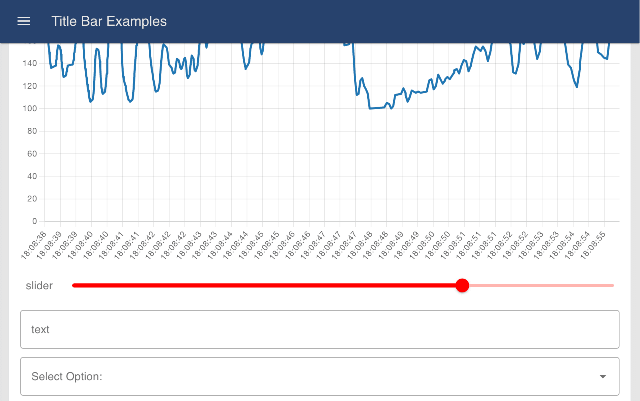

рис.6. Приклад вигляду опції Fixed

`Title Bar – Hidden` - Панель заголовка повністю прихована. Зауважте, що в цьому режимі все одно можна бачити навігаційне меню, якщо для нього обрано фіксований стиль.

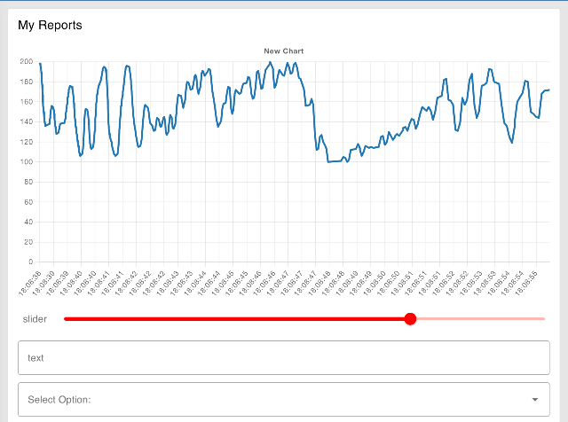

рис.7. Приклад вигляду опції Hidden

## Header Content Options

Визначає текст, який відображається як основний заголовок сторінки.

- `Page Name` - Відображається назва активної сторінки. Під час кожної зміни сторінки цей текст оновлюється відповідно до нової сторінки.

- `Dashboard Name` - Використовується назва Dashboard і залишається однаковою на всіх сторінках застосунку.

- `Dashboard Name (Page Name)` - Поєднує два попередні варіанти і відображає назву Dashboard та назву сторінки, де назва сторінки подається в дужках.

- `None` - Текстовий заголовок не відображається. Часто використовується разом із Teleports для кастомізації вмісту цієї області, наприклад для вставлення логотипів.

## Navigation Style Options

`Navigation – Collapsing` (default)

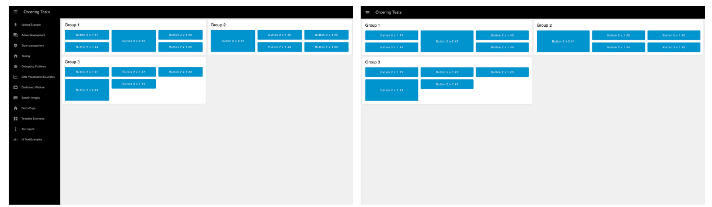

рис.8. Приклад вигляду опції Collapsing у відкритому (ліворуч) і закритому (праворуч) станах.

У відкритому стані меню зсуває весь вміст Dashboard, а у закритому стані не відображається зовсім.

`Navigation – Fixed`

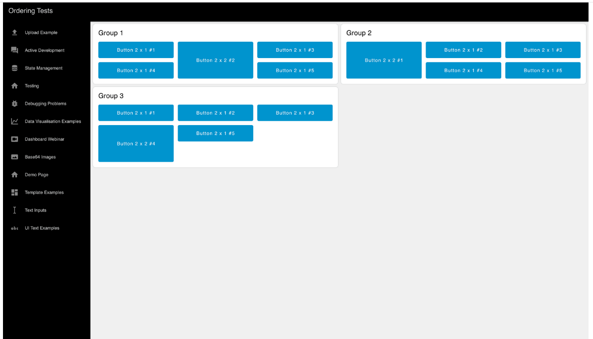

рис.9. Приклад вигляду опції Fixed у будь-який момент часу.

Меню завжди залишається відкритим. На мобільному пороговому розмірі екрана (768 px) цей режим примусово замінюється на варіант «Appear Over». Зауважте, що на екранах менше ніж 768 px фіксований режим повертається до варіанту за замовчуванням.

`Navigation – Collapse to Icons`

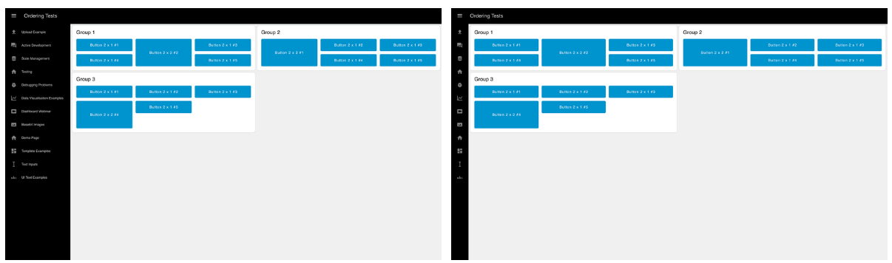

рис.10. Подібно до Collapsing у відкритому стані, але у закритому стані залишаються видимими іконки кожної сторінки.

`Navigation – Appear over Content`

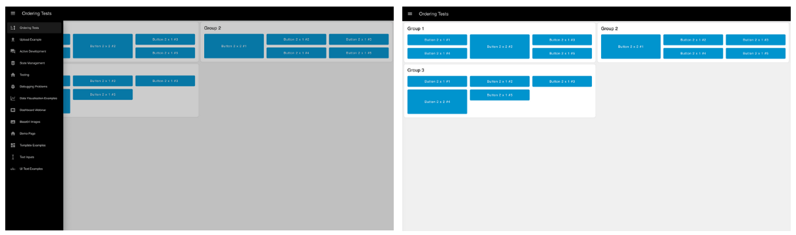рис.11. У закритому стані меню не видно, а у відкритому воно накладається поверх вмісту Dashboard, не зсуваючи його.

`Navigation – Always Hide`

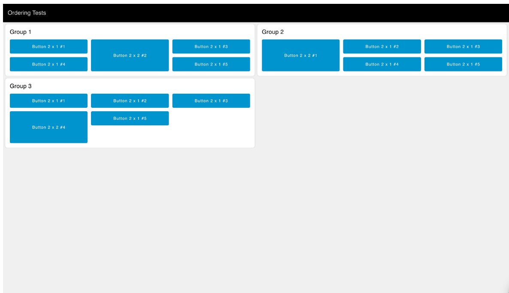рис.12. Бічна панель не відображається за жодних умов. Усі сторінки залишаються доступними через прямі посилання або за допомогою вузла ui-control.