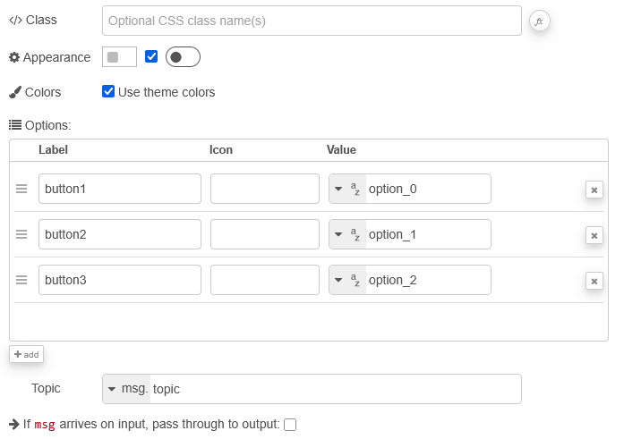
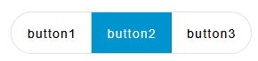
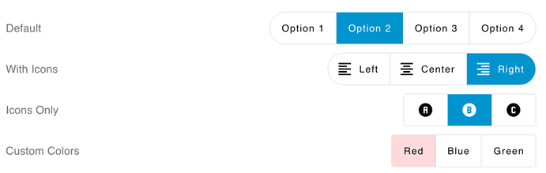

| [На головну](../) | [Розділ](README.md) |
| ----------------- | ------------------- |
|                   |                     |

# Button `ui-button-group`

https://dashboard.flowfuse.com/nodes/widgets/ui-button-group

Додає набір кнопок, які працюють як багатостановий перемикач на Dashboard. Коли натискається окрема кнопка, вона стає активною, а всі інші кнопки в групі переходять у неактивний стан. Нове вибране значення передається з вузла в Node-RED. Вибрану опцію можна встановити, надіславши `msg.payload` зі значенням кнопки, яку потрібно активувати.

рис.1. Налаштування і зовнішній вигляд 

- `Label` (динамічна) - Текст, що відображається всередині кнопок. Дозволено використання HTML-вмісту.

- `Appearance` - Визначає форму віджета: прямокутна або із заокругленими кутами.

- `Use theme colors` - Визначає, чи використовувати кольори теми. Якщо вимкнено, для кожної опції можна задати власні кольори.

- `Options` (динамічна) - Визначає набір опцій, які потрібно відобразити. Кожна опція може містити підпис, іконку, значення та колір. Для підписів дозволено HTML-вміст.

- `Topic` - Текст, який буде передано в полі `msg.topic`.

- `Passthrough` - Визначає, чи потрібно пропускати вхідні повідомлення без змін на вихід.

- `Class` - Клас CSS для віджета.

Динамічні властивості можуть бути перевизначені під час виконання шляхом надсилання відповідного msg до вузла. За потреби значення, задані в Node-RED, будуть замінені значеннями з отриманих повідомлень.

| Prop           | Payload                 | Structures                                                   | Example Values |
| -------------- | ----------------------- | ------------------------------------------------------------ | -------------- |
| Disabled State | `msg.enabled`           | `Boolean`                                                    |                |
| Label          | `msg.ui_update.label`   | `String`                                                     |                |
| Options        | `msg.ui_update.options` | `Array<String>``Array<{value: String}>``Array<{value: String, label: String}>``Array<{value: String, icon: String}>` |                |

рис.2. Приклади