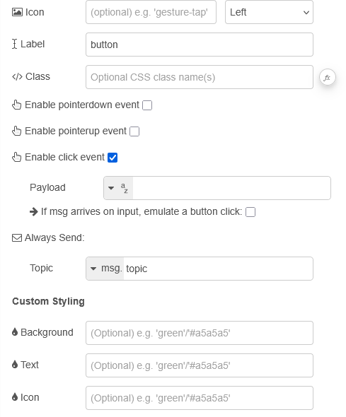

| [На головну](../) | [Розділ](README.md) |
| ----------------- | ------------------- |
|                   |                     |

# Button `ui-button`

https://dashboard.flowfuse.com/nodes/widgets/ui-button

Додає клікабельну кнопку на Dashboard.

- `Icon` (динамічна) - Відображає іконку Material Design всередині кнопки. Немає потреби додавати префікс "mdi-".

- `Icon Position` (динамічна) - Якщо задано Icon, ця властивість визначає, з якого боку від Label буде відображатися іконка.

- `Label` (динамічна) - Текст, що відображається всередині кнопки. Якщо не задано, кнопка відображатиме лише іконку.

- `Button Color` (динамічна) - Колір кнопки. Якщо не задано, використовується колір теми за замовчуванням.

- `Text Color` (динамічна) - Колір тексту (`Label`). Якщо не задано, він обчислюється автоматично на основі кольору кнопки і буде чорним або білим.

- `Icon Color` (динамічна) - Колір іконки. Якщо не задано, використовується той самий колір, що й для тексту (`Label`).

- `Enable pointerup event` - Вмикає перехоплення подій `pointerup` для кнопки. У вихідному повідомленні буде присутній `msg._event` з деталями типу взаємодії, що спричинила подію.

- `Enable pointerdown event` - Вмикає перехоплення подій `pointerdown` для кнопки. У вихідному повідомленні буде присутній `msg._event` з деталями типу взаємодії, що спричинила подію.

- `Enable click event` - Вмикає перехоплення подій `click` для кнопки, тобто коли відбуваються і `pointerdown`, і `pointerup`, і курсор миші залишається в межах кнопки. У вихідному повідомленні буде присутній `msg._event`з деталями типу взаємодії, що спричинила подію.

- `Emulate Button Click` - Якщо увімкнено, будь-яке отримане повідомлення ініціює натискання кнопки з формуванням відповідного `payload` і `topic`.

Динамічні властивості можуть бути перевизначені під час виконання шляхом надсилання відповідного `msg` до вузла. За потреби значення, задані в Node-RED, будуть замінені значеннями з отриманих повідомлень.

| Prop          | Payload                      | Structures | Example Values |
| ------------- | ---------------------------- | ---------- | -------------- |
| Icon          | `msg.ui_update.icon`         | `String`   |                |
| Icon Position | `msg.ui_update.iconPosition` | `String`   |                |
| Label         | `msg.ui_update.label`        | `String`   |                |
| Button Color  | `msg.ui_update.buttonColor`  | `String`   |                |
| Text Color    | `msg.ui_update.textColor`    | `String`   |                |
| Icon Color    | `msg.ui_update.iconColor`    | `String`   |                |
| Class         | `msg.ui_update.class`        | `String`   |                |

`msg.enabled` Дозволяє керувати тим, чи є кнопка клікабельною.