| [На головну](../) | [Розділ](README.md) |
| ----------------- | ------------------- |
|                   |                     |

# Chart `ui-chart` 

https://dashboard.flowfuse.com/nodes/widgets/ui-chart.html#line-chart

[Спробувати демо](https://dashboard-demos.flowfuse.cloud/dashboard/charts-example)

## Загальні налаштування

Надає параметри конфігурації для створення таких типів діаграм:

- [Line Chart](#line-chart)
- [Scatter Plot](#scatter-charts)
- [Bar Chart](#bar-charts)
- [Pie/Doughnut Charts](#pie-doughnut-charts)
- [Histograms](#histograms)

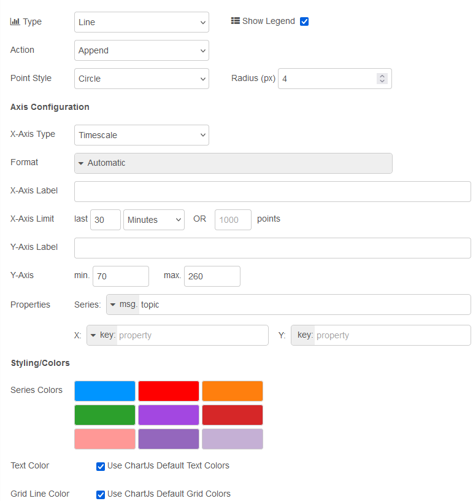

рис.1. Налаштування

| Властивість     | Dynamic | Опис                                                         |
| --------------- | ------- | ------------------------------------------------------------ |
| Group           |         | Визначає, у якій групі UI Dashboard буде відображено цей віджет. |
| Size            |         | Керує шириною віджета відносно батьківської групи. Максимальне значення дорівнює ширині групи. |
| Label           |         | Текст, що відображається у віджеті.                          |
| Class           |         | CSS-клас, який застосовується до віджета.                    |
| Chart Type      |         | `Line | Bar | Scatter `                                      |
| Show Legend     |         | Визначає, чи відображається легенда між заголовком і діаграмою. Кожен підпис формується на основі `msg.topic`. |
| Action          | ✓       | Керує тим, як нові дані додаються до діаграми. Може бути "append" – зберігати наявні дані та додавати нові; "replace" – видалити наявні дані перед додаванням нових точок. |
| Point Shape     |         | Визначає форму точки для діаграм `Scatter` і `Line`.         |
| Point Radius    |         | Визначає радіус (у пікселях) кожної точки, що відображається на діаграмі `Scatter` або `Line`. |
| X-Axis Type     |         | `Timescale/Linear/Categorical`                               |
| X-Axis Format   |         | `{HH}:{mm}:{ss} / {HH}:{mm} / {yyyy}-{M}-{d} / {d}/{M} / {ee} {HH}:{mm} / Custom / Auto` |
| X-Axis Limit    |         | Усі дані, що виходять за заданий часовий ліміт (для часових діаграм) або перевищують задану кількість точок, будуть видалені з діаграми. Часове обмеження можна вимкнути, встановивши значення 0. |
| Properties      |         | `Series:` Визначає, як формуються серії потоків даних у цьому віджеті. Типово використовується msg.topic, при цьому різні topic відображаються як окремі лінії або стовпчики на діаграмі.  <br />`X:` Визначає, які дані використовуються для побудови значення по осі X для кожної точки.  <br />`Y:` Визначає, як формується значення по осі Y для кожної точки. |
| Text Color      |         | Дозволяє перевизначити стандартний колір тексту Chart.js. Наразі впливає на колір заголовка діаграми, підписів поділок, заголовків осей і тексту легенди.<br/>Повернення до стандартних кольорів Chart.js можливе через прапорець `Use ChartJs Default Text Colors`. |
| Grid Line Color |         | Дозволяє перевизначити стандартний колір ліній сітки та меж осей Chart.js.<br/>Повернення до стандартних кольорів Chart.js можливе через прапорець `Use ChartJs Default Grid Colors`. |

Динамічні властивості – це властивості, які можуть бути перевизначені під час виконання шляхом надсилання відповідного msg до вузла. За потреби значення, задані в конфігурації Node-RED, будуть замінені значеннями з отриманих повідомлень.

| Prop  | Payload     | Structures | Example Values |
| ----- | ----------- | ---------- | -------------- |
| Class | `msg.class` | `String`   |                |

## Побудова діаграм

Щоб зіставити свої дані з діаграмою, найважливіші властивості, які потрібно налаштувати:

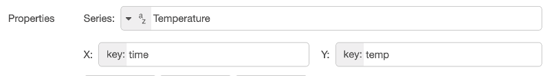

рис.2. Налаштування ключів

- `Series`: означує спосіб групування даних. Наприклад, на лінійній діаграмі (line chart) різні ряди призводять до різних ліній,  на гістограмі (bar chart) різні ряди призводять до різних стовпчиків для одного значення x (складених або згрупованих пліч-о-пліч).

- `X`: означте, де зчитувати значення для графіка на осі `x`. Якщо залишити порожнім, значення `x` буде розраховано як поточну позначку часу.
- `Y`: означте, де зчитувати значення для графіка на осі `y`. Якщо залишити порожнім, значення `y` буде зчитано безпосередньо з `msg.payload` і вважатиметься числом.

Наступними найважливішими властивостями, які потрібно налаштувати, є «Тип діаграми» (`Chart Type`) та «Тип осі Х» (`X-Axis Type`).

- `Chart Type`: виберіть `Line`, `Scatter`, або `Bar chart`.
- `X-Axis Type`: виберіть `Timescale` (для даних на основі часу), `Linear` (для числових даних) або `Categorical` (для нечислових даних). Ви помітите, що деякі типи осі X доступні лише для певних типів діаграм.

### Line Chart

#### Дані часових рядів

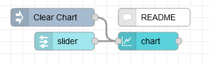

рис.3.

```json
[{"id":"f2b32a695a996008","type":"ui-chart","z":"28aca5b1020ec1a4","group":"8de7b0ba54b83e6a","name":"","label":"chart","order":1,"chartType":"line","category":"Slider","categoryType":"str","xAxisLabel":"","xAxisProperty":"","xAxisPropertyType":"property","xAxisType":"time","xAxisFormat":"","xAxisFormatType":"auto","yAxisLabel":"","yAxisProperty":"","ymin":"","ymax":"","action":"append","stackSeries":false,"pointShape":"circle","pointRadius":4,"showLegend":true,"removeOlder":1,"removeOlderUnit":"3600","removeOlderPoints":"","colors":["#1f77b4","#aec7e8","#ff7f0e","#2ca02c","#98df8a","#d62728","#ff9896","#9467bd","#c5b0d5"],"textColor":["#666666"],"textColorDefault":true,"gridColor":["#e5e5e5"],"gridColorDefault":true,"width":6,"height":8,"className":"","x":290,"y":100,"wires":[[]]},{"id":"60413f89bde7b6b0","type":"ui-slider","z":"28aca5b1020ec1a4","group":"8de7b0ba54b83e6a","name":"","label":"slider","tooltip":"","order":2,"width":0,"height":0,"passthru":false,"outs":"all","topic":"topic","topicType":"msg","thumbLabel":"true","showTicks":"always","min":0,"max":10,"step":1,"className":"","iconPrepend":"","iconAppend":"","color":"","colorTrack":"","colorThumb":"","x":150,"y":100,"wires":[["f2b32a695a996008"]]},{"id":"0f23aefcc565f5c0","type":"inject","z":"28aca5b1020ec1a4","name":"Clear Chart","props":[{"p":"payload"}],"repeat":"","crontab":"","once":false,"onceDelay":0.1,"topic":"","payload":"[]","payloadType":"json","x":130,"y":60,"wires":[["f2b32a695a996008"]]},{"id":"c624c1ca7c57bb20","type":"comment","z":"28aca5b1020ec1a4","name":"README","info":"No need to define \"x\" and \"y\" properties here,\nas the incoming value is a single number.\n\nSo, \"y\" will take that value, and the \"x\"\nvalue will just use the time upon\nreceiving that data.","x":300,"y":60,"wires":[]},{"id":"8de7b0ba54b83e6a","type":"ui-group","name":"Line Charts","page":"d0621b8f20aee671","width":"6","height":"1","order":1,"showTitle":true,"className":"","visible":"true","disabled":"false"},{"id":"d0621b8f20aee671","type":"ui-page","name":"Charts","ui":"c2e1aa56f50f03bd","path":"/charts","icon":"home","layout":"notebook","theme":"5075a7d8e4947586","order":27,"className":"","visible":"true","disabled":"false"},{"id":"c2e1aa56f50f03bd","type":"ui-base","name":"Dashboard","path":"/dashboard","includeClientData":true,"acceptsClientConfig":["ui-control","ui-notification"],"showPathInSidebar":false,"showPageTitle":false,"navigationStyle":"icon","titleBarStyle":"default"},{"id":"5075a7d8e4947586","type":"ui-theme","name":"Default Theme","colors":{"surface":"#ffffff","primary":"#0094CE","bgPage":"#eeeeee","groupBg":"#ffffff","groupOutline":"#cccccc"},"sizes":{"pagePadding":"12px","groupGap":"12px","groupBorderRadius":"4px","widgetGap":"12px"}}]
```

У цьому прикладі підключаєються [повзунок](slider.md) до нашої діаграми, щоб побудувати його результат у часі:

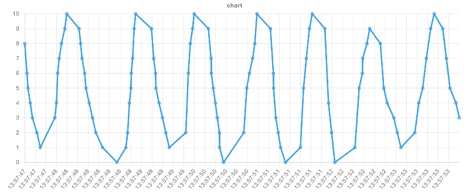

рис.4. Приклад візуалізованої лінійної діаграми з віссю X «час»

Дуже поширеним випадком використання Node-RED є обробка даних часових рядів, наприклад показань датчиків. У цьому випадку ви повинні встановити наступне:

| Property    | Value       |
| ----------- | ----------- |
| Chart Type  | `Line`      |
| X-Axis Type | `Timescale` |

Тоді значення властивості `x` буде одним із двох:

- Якщо ваші дані є простим числовим значенням, ви можете залишити це поле порожнім, і діаграма автоматично використовуватиме поточну дату/час.
- Якщо ваші дані є об’єктом, ви можете надати ключ мітки часу у ваших даних, наприклад. `{"myTime": 1234567890}` встановіть для властивості `X` тип `key` і значення `myTime`.

Тоді останньою частиною головоломки буде встановлення властивості `y` як одного з двох варіантів:

- Якщо ваші дані є простим числовим значенням, ви можете залишити це поле порожнім, і діаграма автоматично використовуватиме значення `msg.payload`.
- Якщо ваші дані є об’єктом, ви можете надати ключ значення у ваших даних, напр. `{"myTime": 1234567890, "myValue": 123}` встановіть для властивості `Y` тип `key` і значення `myValue`.

#### Кілька ліній

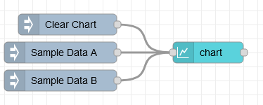

рис.5.

```json
[{"id":"eed78059233cb876","type":"ui-chart","z":"28aca5b1020ec1a4","group":"b429518aee48a6fb","name":"Array Line Chart","label":"chart","order":1,"chartType":"line","category":"topic","categoryType":"msg","xAxisLabel":"Property A","xAxisProperty":"propertyA","xAxisPropertyType":"property","xAxisType":"linear","xAxisFormat":"","xAxisFormatType":"auto","yAxisLabel":"Property B","yAxisProperty":"propertyB","ymin":"0","ymax":"10","action":"append","stackSeries":false,"pointShape":"circle","pointRadius":4,"showLegend":true,"removeOlder":1,"removeOlderUnit":"3600","removeOlderPoints":"","colors":["#1f77b4","#ff0000","#ff7f0e","#2ca02c","#98df8a","#d62728","#ff9896","#9467bd","#c5b0d5"],"textColor":["#666666"],"textColorDefault":true,"gridColor":["#e5e5e5"],"gridColorDefault":true,"width":6,"height":8,"className":"","x":340,"y":100,"wires":[[]]},{"id":"b21df8b397cb3233","type":"inject","z":"28aca5b1020ec1a4","name":"Clear Chart","props":[{"p":"payload"}],"repeat":"","crontab":"","once":false,"onceDelay":0.1,"topic":"","payload":"[]","payloadType":"json","x":150,"y":60,"wires":[["eed78059233cb876"]]},{"id":"3493e8d72fbfa5a9","type":"inject","z":"28aca5b1020ec1a4","name":"Sample Data A","props":[{"p":"payload"},{"p":"topic","vt":"str"}],"repeat":"","crontab":"","once":false,"onceDelay":0.1,"topic":"Sample Data A","payload":"[{\"propertyA\":10,\"propertyB\":2},{\"propertyA\":15,\"propertyB\":3},{\"propertyA\":25,\"propertyB\":5},{\"propertyA\":30,\"propertyB\":6},{\"propertyA\":40,\"propertyB\":8}]","payloadType":"json","x":140,"y":100,"wires":[["eed78059233cb876"]]},{"id":"3d24d72914056683","type":"inject","z":"28aca5b1020ec1a4","name":"Sample Data B","props":[{"p":"payload"},{"p":"topic","vt":"str"}],"repeat":"","crontab":"","once":false,"onceDelay":0.1,"topic":"Sample Data B","payload":"[{\"propertyA\":7,\"propertyB\":6},{\"propertyA\":15,\"propertyB\":2},{\"propertyA\":24,\"propertyB\":9},{\"propertyA\":32,\"propertyB\":4},{\"propertyA\":47,\"propertyB\":9}]","payloadType":"json","x":140,"y":140,"wires":[["eed78059233cb876"]]},{"id":"b429518aee48a6fb","type":"ui-group","name":"Chart Examples","page":"d0621b8f20aee671","width":"6","height":"1","order":4,"showTitle":true,"className":"","visible":"true","disabled":"false"},{"id":"d0621b8f20aee671","type":"ui-page","name":"Charts","ui":"c2e1aa56f50f03bd","path":"/charts","icon":"home","layout":"notebook","theme":"5075a7d8e4947586","order":27,"className":"","visible":"true","disabled":"false"},{"id":"c2e1aa56f50f03bd","type":"ui-base","name":"Dashboard","path":"/dashboard","includeClientData":true,"acceptsClientConfig":["ui-control","ui-notification"],"showPathInSidebar":false,"showPageTitle":false,"navigationStyle":"icon","titleBarStyle":"default"},{"id":"5075a7d8e4947586","type":"ui-theme","name":"Default Theme","colors":{"surface":"#ffffff","primary":"#0094CE","bgPage":"#eeeeee","groupBg":"#ffffff","groupOutline":"#cccccc"},"sizes":{"pagePadding":"12px","groupGap":"12px","groupBorderRadius":"4px","widgetGap":"12px"}}]
```

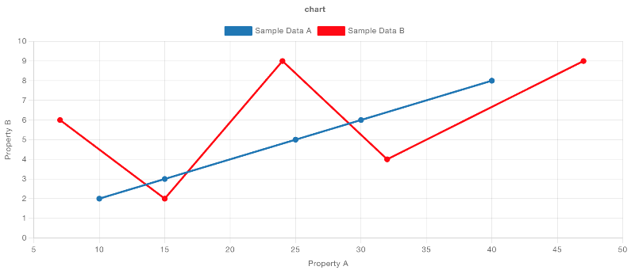

рис.6. Приклад Line Chart з кількома лініями

Ви можете згрупувати дані в кілька рядків за допомогою властивості `Series`. Загальним випадком використання тут є використання `msg.topic`, де кожне повідомлення, надіслане на діаграму, буде призначено іншому рядку на основі значення `msg.topic`. Крім того, ви можете встановити значення `key` і вказати ключ у своїх даних для групування.

Якщо ви хочете, щоб одна частина даних побудувала кілька рядків, ви можете встановити для властивості `Series` значення `JSON`, а потім надати масив ключів (наприклад, `["key1", "key2"]`), який буде побудувати точку даних для кожного наданого ключа з однієї точки даних.

### Scatter-charts

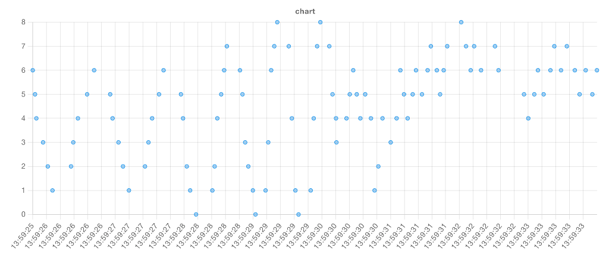

рис.7. Приклад візуалізованої діаграми розсіювання з віссю x «час».

Ми також можемо використовувати "Series" для групування точок. Розглянемо приклад із таким набором даних:

```json
[	{ "series": "A", "x": 5, "y": 84 },
    { "series": "A", "x": 9, "y": 10 },
    { "series": "A", "x": 11, "y": 70 },
    { "series": "B", "x": 12, "y": 28 },
    { "series": "B", "x": 15, "y": 35 },
    { "series": "B", "x": 26, "y": 42 },
    { "series": "C", "x": 20, "y": 12 },
    { "series": "C", "x": 24, "y": 54 },
    { "series": "C", "x": 27, "y": 60 },
    { "series": "C", "x": 30, "y": 66 }]
```

У нашому потоці ми мали б:

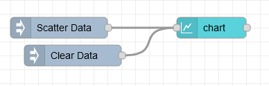

рис.8.

```json
[{"id":"16c2839487757a01","type":"inject","z":"28aca5b1020ec1a4","name":"Scatter Data","props":[{"p":"payload"}],"repeat":"","crontab":"","once":false,"onceDelay":0.1,"topic":"","payload":"[{\"series\":\"A\",\"x\":5,\"y\":84},{\"series\":\"A\",\"x\":9,\"y\":10},{\"series\":\"A\",\"x\":11,\"y\":70},{\"series\":\"B\",\"x\":12,\"y\":28},{\"series\":\"B\",\"x\":15,\"y\":35},{\"series\":\"B\",\"x\":26,\"y\":42},{\"series\":\"C\",\"x\":20,\"y\":12},{\"series\":\"C\",\"x\":24,\"y\":54},{\"series\":\"C\",\"x\":27,\"y\":60},{\"series\":\"C\",\"x\":30,\"y\":66}]","payloadType":"json","x":130,"y":160,"wires":[["d6ddc83bcd4de04a"]]},{"id":"d6ddc83bcd4de04a","type":"ui-chart","z":"28aca5b1020ec1a4","group":"b429518aee48a6fb","name":"Chart: Scatter","label":"Scatter Plot Example","order":1,"chartType":"scatter","category":"series","categoryType":"property","xAxisLabel":"x","xAxisProperty":"x","xAxisPropertyType":"property","xAxisType":"linear","xAxisFormat":"","xAxisFormatType":"auto","yAxisLabel":"y","yAxisProperty":"y","ymin":"0","ymax":"100","action":"append","stackSeries":false,"pointShape":"circle","pointRadius":4,"showLegend":true,"removeOlder":1,"removeOlderUnit":"3600","removeOlderPoints":"","colors":["#0095ff","#ff0000","#ff7f0e","#2ca02c","#98df8a","#d62728","#ff9896","#9467bd","#c5b0d5"],"textColor":["#666666"],"textColorDefault":true,"gridColor":["#e5e5e5"],"gridColorDefault":true,"width":6,"height":8,"className":"","x":340,"y":160,"wires":[[]]},{"id":"aa0ac5025fc32d7f","type":"inject","z":"28aca5b1020ec1a4","name":"Clear Data","props":[{"p":"payload"}],"repeat":"","crontab":"","once":false,"onceDelay":0.1,"topic":"","payload":"[]","payloadType":"json","x":140,"y":200,"wires":[["d6ddc83bcd4de04a"]]},{"id":"b429518aee48a6fb","type":"ui-group","name":"Chart Examples","page":"d0621b8f20aee671","width":"6","height":"1","order":4,"showTitle":true,"className":"","visible":"true","disabled":"false"},{"id":"d0621b8f20aee671","type":"ui-page","name":"Charts","ui":"c2e1aa56f50f03bd","path":"/charts","icon":"home","layout":"notebook","theme":"5075a7d8e4947586","order":27,"className":"","visible":"true","disabled":"false"},{"id":"c2e1aa56f50f03bd","type":"ui-base","name":"Dashboard","path":"/dashboard","includeClientData":true,"acceptsClientConfig":["ui-control","ui-notification"],"showPathInSidebar":false,"showPageTitle":false,"navigationStyle":"icon","titleBarStyle":"default"},{"id":"5075a7d8e4947586","type":"ui-theme","name":"Default Theme","colors":{"surface":"#ffffff","primary":"#0094CE","bgPage":"#eeeeee","groupBg":"#ffffff","groupOutline":"#cccccc"},"sizes":{"pagePadding":"12px","groupGap":"12px","groupBorderRadius":"4px","widgetGap":"12px"}}]
```

З такою конфігурацією:

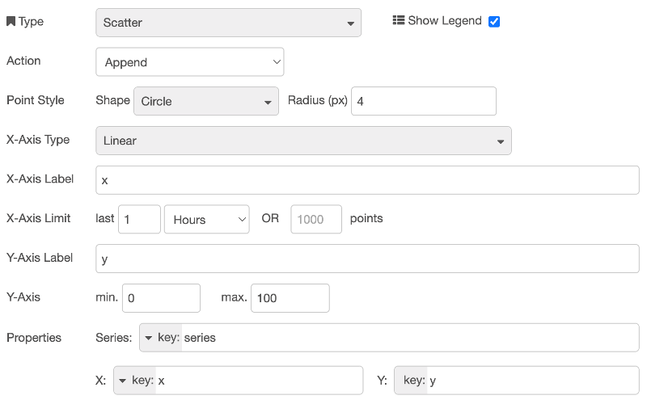

рис.9. 

Що призводить до:

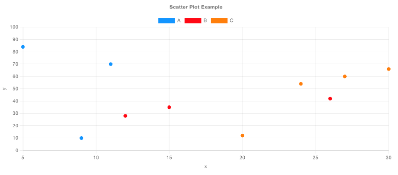

рис.10. Приклад відтвореної діаграми розсіювання з «Linear» віссю x і даними, згрупованими в «Series».

### Bar Charts 

Наразі ми підтримуємо тип осі X "Categorical" лише для стовпчикових діаграм (Bar Chart). Це означає, що значення по осі X будуть рядками, а по осі Y – числовими. Розглянемо приклад завантаження даних для Star Wars API:

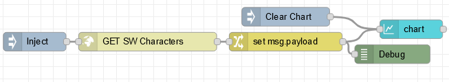

рис.11. 

```json
[{"id":"6cb23f28989d733d","type":"inject","z":"28aca5b1020ec1a4","name":"Inject","props":[],"repeat":"","crontab":"","once":false,"onceDelay":0.1,"topic":"","x":110,"y":80,"wires":[["6aaa2545ebc497d7"]]},{"id":"6aaa2545ebc497d7","type":"http request","z":"28aca5b1020ec1a4","name":"GET SW Characters","method":"GET","ret":"obj","paytoqs":"ignore","url":"https://swapi.dev/api/people","tls":"","persist":false,"proxy":"","insecureHTTPParser":false,"authType":"","senderr":false,"headers":[],"x":290,"y":80,"wires":[["650581df3aa3e266"]]},{"id":"650581df3aa3e266","type":"change","z":"28aca5b1020ec1a4","name":"","rules":[{"t":"set","p":"payload","pt":"msg","to":"payload.results","tot":"msg"}],"action":"","property":"","from":"","to":"","reg":false,"x":500,"y":80,"wires":[["3c0489e86320b632","3c8bd38a30f7250a"]]},{"id":"3c0489e86320b632","type":"ui-chart","z":"28aca5b1020ec1a4","group":"b429518aee48a6fb","name":"Array Bar Chart","label":"chart","order":1,"chartType":"bar","category":"Characters","categoryType":"str","xAxisLabel":"Characters","xAxisProperty":"name","xAxisPropertyType":"property","xAxisType":"category","xAxisFormat":"","xAxisFormatType":"auto","yAxisLabel":"Height","yAxisProperty":"height","ymin":"","ymax":"","action":"append","stackSeries":false,"pointShape":"circle","pointRadius":4,"showLegend":true,"removeOlder":1,"removeOlderUnit":"3600","removeOlderPoints":"","colors":["#1f77b4","#aec7e8","#ff7f0e","#2ca02c","#98df8a","#d62728","#ff9896","#9467bd","#c5b0d5"],"textColor":["#666666"],"textColorDefault":true,"gridColor":["#e5e5e5"],"gridColorDefault":true,"width":6,"height":8,"className":"","x":700,"y":60,"wires":[[]]},{"id":"d64a12d802fc0de8","type":"inject","z":"28aca5b1020ec1a4","name":"Clear Chart","props":[{"p":"payload"}],"repeat":"","crontab":"","once":false,"onceDelay":0.1,"topic":"","payload":"[]","payloadType":"json","x":510,"y":40,"wires":[["3c0489e86320b632"]]},{"id":"3c8bd38a30f7250a","type":"debug","z":"28aca5b1020ec1a4","name":"Debug","active":false,"tosidebar":true,"console":false,"tostatus":false,"complete":"payload","targetType":"msg","statusVal":"","statusType":"auto","x":670,"y":100,"wires":[]},{"id":"b429518aee48a6fb","type":"ui-group","name":"Chart Examples","page":"d0621b8f20aee671","width":"6","height":"1","order":4,"showTitle":true,"className":"","visible":"true","disabled":"false"},{"id":"d0621b8f20aee671","type":"ui-page","name":"Charts","ui":"c2e1aa56f50f03bd","path":"/charts","icon":"home","layout":"notebook","theme":"5075a7d8e4947586","order":27,"className":"","visible":"true","disabled":"false"},{"id":"c2e1aa56f50f03bd","type":"ui-base","name":"Dashboard","path":"/dashboard","includeClientData":true,"acceptsClientConfig":["ui-control","ui-notification"],"showPathInSidebar":false,"showPageTitle":false,"navigationStyle":"icon","titleBarStyle":"default"},{"id":"5075a7d8e4947586","type":"ui-theme","name":"Default Theme","colors":{"surface":"#ffffff","primary":"#0094CE","bgPage":"#eeeeee","groupBg":"#ffffff","groupOutline":"#cccccc"},"sizes":{"pagePadding":"12px","groupGap":"12px","groupBorderRadius":"4px","widgetGap":"12px"}}]
```

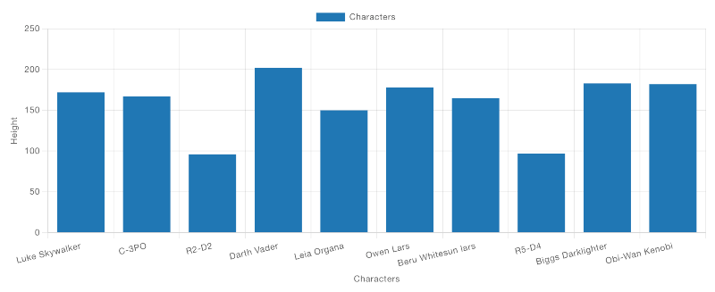

рис.12.  Приклад стовпчикової діаграми, що відображає дані про «зріст» персонажів. Якщо подивитися на конфігурацію цієї діаграми:

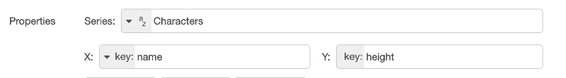

рис.13. Ми можемо легко змінити властивість "Y", щоб відображати інше значення, не змінюючи самі дані.

#### Grouped Bars - Financial Data Example 

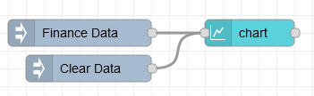

рис.14.

```json
[{"id":"48f2d5b3e40cb944","type":"ui-chart","z":"28aca5b1020ec1a4","group":"b429518aee48a6fb","name":"Chart: Finance","label":"Finance Data","order":1,"chartType":"bar","category":"[\"Q1\", \"Q2\", \"Q3\", \"Q4\"]","categoryType":"json","xAxisLabel":"Year","xAxisProperty":"year","xAxisPropertyType":"property","xAxisType":"category","xAxisFormat":"","xAxisFormatType":"auto","yAxisLabel":"Profit","yAxisProperty":"radius","ymin":"","ymax":"","action":"append","stackSeries":false,"pointShape":"circle","pointRadius":4,"showLegend":true,"removeOlder":1,"removeOlderUnit":"3600","removeOlderPoints":"","colors":["#0095ff","#ff0000","#ff7f0e","#2ca02c","#98df8a","#d62728","#ff9896","#9467bd","#c5b0d5"],"textColor":["#666666"],"textColorDefault":true,"gridColor":["#e5e5e5"],"gridColorDefault":true,"width":6,"height":8,"className":"","x":300,"y":60,"wires":[[]]},{"id":"3ccddcc77ed44e81","type":"inject","z":"28aca5b1020ec1a4","name":"Finance Data","props":[{"p":"payload"}],"repeat":"","crontab":"","once":false,"onceDelay":0.1,"topic":"","payload":"[{\"year\":2021,\"Q1\":115,\"Q2\":207,\"Q3\":198,\"Q4\":163},{\"year\":2022,\"Q1\":170,\"Q2\":200,\"Q3\":230,\"Q4\":210},{\"year\":2023,\"Q1\":86,\"Q2\":140,\"Q3\":180,\"Q4\":138}]","payloadType":"json","x":110,"y":60,"wires":[["48f2d5b3e40cb944"]]},{"id":"8df4587f825276eb","type":"inject","z":"28aca5b1020ec1a4","name":"Clear Data","props":[{"p":"payload"}],"repeat":"","crontab":"","once":false,"onceDelay":0.1,"topic":"","payload":"[]","payloadType":"json","x":120,"y":100,"wires":[["48f2d5b3e40cb944"]]},{"id":"b429518aee48a6fb","type":"ui-group","name":"Chart Examples","page":"d0621b8f20aee671","width":"6","height":"1","order":4,"showTitle":true,"className":"","visible":"true","disabled":"false"},{"id":"d0621b8f20aee671","type":"ui-page","name":"Charts","ui":"c2e1aa56f50f03bd","path":"/charts","icon":"home","layout":"notebook","theme":"5075a7d8e4947586","order":27,"className":"","visible":"true","disabled":"false"},{"id":"c2e1aa56f50f03bd","type":"ui-base","name":"Dashboard","path":"/dashboard","includeClientData":true,"acceptsClientConfig":["ui-control","ui-notification"],"showPathInSidebar":false,"showPageTitle":false,"navigationStyle":"icon","titleBarStyle":"default"},{"id":"5075a7d8e4947586","type":"ui-theme","name":"Default Theme","colors":{"surface":"#ffffff","primary":"#0094CE","bgPage":"#eeeeee","groupBg":"#ffffff","groupOutline":"#cccccc"},"sizes":{"pagePadding":"12px","groupGap":"12px","groupBorderRadius":"4px","widgetGap":"12px"}}]
```

Тут наведено приклад деяких фінансових даних:

```json
[
    { "year": 2021, "Q1": 115, "Q2": 207, "Q3": 198, "Q4": 163 },
    { "year": 2022, "Q1": 170, "Q2": 200, "Q3": 230, "Q4": 210 },
    { "year": 2023, "Q1": 86, "Q2": 140, "Q3": 180, "Q4": 138 }
]
```

Стовпчикові діаграми автоматично групують дані за однаковими значеннями по осі X, але при цьому зберігають окремі стовпчики для кожної серії. Якщо вибрано тип діаграми "Bar", можна додатково обрати параметр "Group By": "Side-by-Side" або "Stacks".

Типова поведінка для стовпчикової діаграми – групування даних у режимі "Side-by-Side".

У конфігурації діаграми ми можемо визначити:

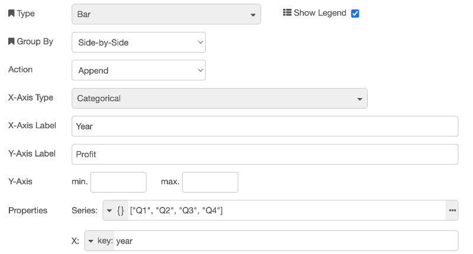

рис.15. Конфігурація стовпчикової діаграми, що відображає фінансові дані, згруповані за роками, де властивість "Series" визначена з типом `JSON`, оскільки ми хочемо відобразити кілька стовпчиків для кожної точки даних, у цьому випадку – по одному для кожного кварталу.

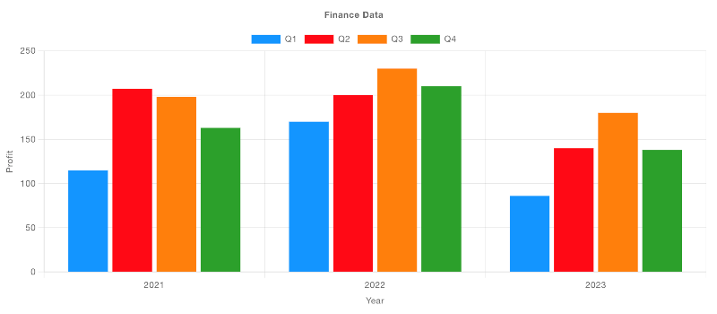

рис.16. Приклад стовпчикової діаграми, що відображає фінансові дані, згруповані за роками.

Якщо змінити параметр "Group By" на "Stacks", ми побачимо:

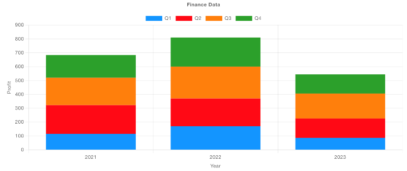

рис.17.  Приклад стовпчикової діаграми, що відображає ті самі дані, але у вигляді стеків (накладених стовпчиків).

#### Grouped Bars - Election Data Example 

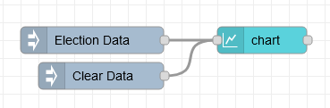

рис.18. 

```json
[{"id":"ac3aae239ac7cf51","type":"ui-chart","z":"28aca5b1020ec1a4","group":"b429518aee48a6fb","name":"Chart: Election","label":"Election Data","order":1,"chartType":"bar","category":"year","categoryType":"property","xAxisLabel":"Candidate","xAxisProperty":"candidate","xAxisPropertyType":"property","xAxisType":"category","xAxisFormat":"","xAxisFormatType":"auto","yAxisLabel":"Votes","yAxisProperty":"votes","ymin":"","ymax":"","action":"append","stackSeries":false,"pointShape":"circle","pointRadius":4,"showLegend":true,"removeOlder":1,"removeOlderUnit":"3600","removeOlderPoints":"","colors":["#0095ff","#ff0000","#ff7f0e","#2ca02c","#98df8a","#d62728","#ff9896","#9467bd","#c5b0d5"],"textColor":["#666666"],"textColorDefault":true,"gridColor":["#e5e5e5"],"gridColorDefault":true,"width":6,"height":8,"className":"","x":300,"y":60,"wires":[[]]},{"id":"e7d244573f732c9b","type":"inject","z":"28aca5b1020ec1a4","name":"Election Data","props":[{"p":"payload"}],"repeat":"","crontab":"","once":false,"onceDelay":0.1,"topic":"","payload":"[{\"candidate\":\"Dave\",\"year\":2019,\"votes\":100},{\"candidate\":\"Sarah\",\"year\":2019,\"votes\":90},{\"candidate\":\"Chris\",\"year\":2019,\"votes\":160},{\"candidate\":\"Lucy\",\"year\":2019,\"votes\":125},{\"candidate\":\"Dave\",\"year\":2024,\"votes\":20},{\"candidate\":\"Sarah\",\"year\":2024,\"votes\":170},{\"candidate\":\"Chris\",\"year\":2024,\"votes\":150},{\"candidate\":\"Lucy\",\"year\":2024,\"votes\":60}]","payloadType":"json","x":110,"y":60,"wires":[["ac3aae239ac7cf51"]]},{"id":"4482f355ad4e7664","type":"inject","z":"28aca5b1020ec1a4","name":"Clear Data","props":[{"p":"payload"}],"repeat":"","crontab":"","once":false,"onceDelay":0.1,"topic":"","payload":"[]","payloadType":"json","x":120,"y":100,"wires":[["ac3aae239ac7cf51"]]},{"id":"b429518aee48a6fb","type":"ui-group","name":"Chart Examples","page":"d0621b8f20aee671","width":"6","height":"1","order":4,"showTitle":true,"className":"","visible":"true","disabled":"false"},{"id":"d0621b8f20aee671","type":"ui-page","name":"Charts","ui":"c2e1aa56f50f03bd","path":"/charts","icon":"home","layout":"notebook","theme":"5075a7d8e4947586","order":27,"className":"","visible":"true","disabled":"false"},{"id":"c2e1aa56f50f03bd","type":"ui-base","name":"Dashboard","path":"/dashboard","includeClientData":true,"acceptsClientConfig":["ui-control","ui-notification"],"showPathInSidebar":false,"showPageTitle":false,"navigationStyle":"icon","titleBarStyle":"default"},{"id":"5075a7d8e4947586","type":"ui-theme","name":"Default Theme","colors":{"surface":"#ffffff","primary":"#0094CE","bgPage":"#eeeeee","groupBg":"#ffffff","groupOutline":"#cccccc"},"sizes":{"pagePadding":"12px","groupGap":"12px","groupBorderRadius":"4px","widgetGap":"12px"}}]
```

Тут для кожного кандидата і для кожного року наведено набір даних, який описує кількість «голосів» (Votes), отриманих цим кандидатом.

```json
[
    { "candidate": "Dave", "year": 2019, "votes": 100 },
    { "candidate": "Sarah", "year": 2019, "votes": 90 },
    { "candidate": "Chris", "year": 2019, "votes": 160 },
    { "candidate": "Lucy", "year": 2019, "votes": 125 },
    { "candidate": "Dave", "year": 2024, "votes": 20 },
    { "candidate": "Sarah", "year": 2024, "votes": 170 },
    { "candidate": "Chris", "year": 2024, "votes": 150 },
    { "candidate": "Lucy", "year": 2024, "votes": 60 }
]
```

Ми маємо кілька різних способів згрупувати ці дані. По-перше, можна визначити серію для кожного «Year», а значення по осі X задати як «candidate».

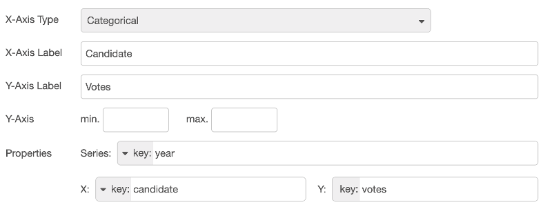

рис.19. Конфігурація стовпчикової діаграми, що відображає виборчі дані, згруповані за кандидатом, із окремою серією для кожного року.

У результаті отримаємо:

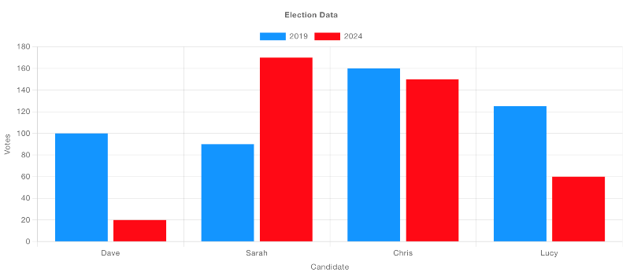

рис.20. Приклад стовпчикової діаграми, що відображає виборчі дані, згруповані за кандидатом, з окремою серією для кожного року.

Альтернативно, можна задати окрему серію для кожного кандидата, а значення по осі X визначити як «year».

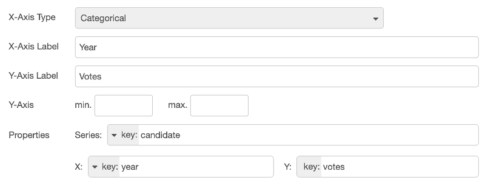

рис.21. Конфігурація стовпчикової діаграми, що відображає виборчі дані, згруповані за роками, з окремою серією для кожного кандидата.

У результаті отримаємо:

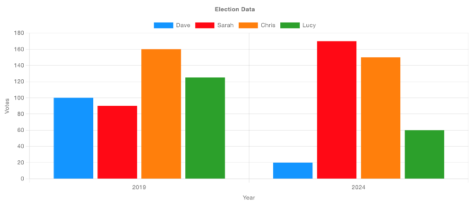

рис.22.  

### Pie-Doughnut-Charts 

Ці типи діаграм використовують радіальні осі (Radial). Властивість "Series" застосовується для визначення шару, у якому відображаються відповідні дані; кілька серій призводять до вкладених кругових або кільцевих діаграм.

Значення "X" визначає ключ усередині однієї серії, а властивість "Y" повинна вказувати на числове значення, яке визначає розмір відповідного сегмента.

Розглянемо кілька прикладів:

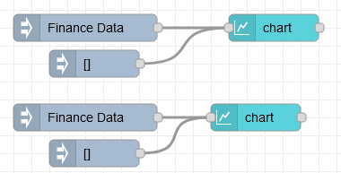

рис.23.  

З використанням прикладового набору даних, такого як:

```json
[{"id":"bc346c7d325fe6b5","type":"ui-chart","z":"28aca5b1020ec1a4","group":"e0d7a0182b3c8eb7","name":"Doughnut Chart","label":"Doughnut Chart","order":5,"chartType":"doughnut","category":"year","categoryType":"property","xAxisLabel":"","xAxisProperty":"quarter","xAxisPropertyType":"property","xAxisType":"radial","xAxisFormat":"","xAxisFormatType":"auto","yAxisLabel":"","yAxisProperty":"earnings","ymin":"","ymax":"","action":"append","stackSeries":false,"pointShape":"circle","pointRadius":4,"showLegend":true,"removeOlder":1,"removeOlderUnit":"3600","removeOlderPoints":"","colors":["#0095ff","#ff0000","#ff7f0e","#2ca02c","#98df8a","#d62728","#ff9896","#9467bd","#c5b0d5"],"textColor":["#666666"],"textColorDefault":true,"gridColor":["#e5e5e5"],"gridColorDefault":true,"width":"3","height":"6","className":"","x":320,"y":280,"wires":[[]]},{"id":"c8e227dc6c78b5f2","type":"inject","z":"28aca5b1020ec1a4","name":"Finance Data","props":[{"p":"payload"}],"repeat":"","crontab":"","once":false,"onceDelay":0.1,"topic":"","payload":"[{\"year\":2021,\"quarter\":\"Q1\",\"earnings\":115},{\"year\":2021,\"quarter\":\"Q2\",\"earnings\":120},{\"year\":2021,\"quarter\":\"Q3\",\"earnings\":100},{\"year\":2021,\"quarter\":\"Q4\",\"earnings\":180},{\"year\":2022,\"quarter\":\"Q1\",\"earnings\":142},{\"year\":2022,\"quarter\":\"Q2\",\"earnings\":106},{\"year\":2022,\"quarter\":\"Q3\",\"earnings\":164},{\"year\":2022,\"quarter\":\"Q4\",\"earnings\":172}]","payloadType":"json","x":110,"y":280,"wires":[["bc346c7d325fe6b5"]]},{"id":"2413205ce1f39442","type":"inject","z":"28aca5b1020ec1a4","name":"","props":[{"p":"payload"}],"repeat":"","crontab":"","once":false,"onceDelay":0.1,"topic":"","payload":"[]","payloadType":"json","x":130,"y":320,"wires":[["bc346c7d325fe6b5"]]},{"id":"b87fe3201b219a05","type":"ui-chart","z":"28aca5b1020ec1a4","group":"e0d7a0182b3c8eb7","name":"Pie Chart","label":"Pie Chart","order":4,"chartType":"pie","category":"year","categoryType":"property","xAxisLabel":"","xAxisProperty":"quarter","xAxisPropertyType":"property","xAxisType":"radial","xAxisFormat":"","xAxisFormatType":"auto","yAxisLabel":"","yAxisProperty":"earnings","ymin":"","ymax":"","action":"append","stackSeries":false,"pointShape":"circle","pointRadius":4,"showLegend":true,"removeOlder":1,"removeOlderUnit":"3600","removeOlderPoints":"","colors":["#0095ff","#ff0000","#ff7f0e","#2ca02c","#98df8a","#d62728","#ff9896","#9467bd","#c5b0d5"],"textColor":["#666666"],"textColorDefault":true,"gridColor":["#e5e5e5"],"gridColorDefault":true,"width":"3","height":"6","className":"","x":300,"y":380,"wires":[[]]},{"id":"d10804e8db462840","type":"inject","z":"28aca5b1020ec1a4","name":"Finance Data","props":[{"p":"payload"}],"repeat":"","crontab":"","once":false,"onceDelay":0.1,"topic":"","payload":"[{\"year\":2021,\"quarter\":\"Q1\",\"earnings\":115},{\"year\":2021,\"quarter\":\"Q2\",\"earnings\":120},{\"year\":2021,\"quarter\":\"Q3\",\"earnings\":100},{\"year\":2021,\"quarter\":\"Q4\",\"earnings\":180}]","payloadType":"json","x":110,"y":380,"wires":[["b87fe3201b219a05"]]},{"id":"49dbac215fa8b40f","type":"inject","z":"28aca5b1020ec1a4","name":"","props":[{"p":"payload"}],"repeat":"","crontab":"","once":false,"onceDelay":0.1,"topic":"","payload":"[]","payloadType":"json","x":130,"y":420,"wires":[["b87fe3201b219a05"]]},{"id":"e0d7a0182b3c8eb7","type":"ui-group","name":"PIe Charts","page":"d0621b8f20aee671","width":"6","height":"1","order":1,"showTitle":true,"className":"","visible":"true","disabled":"false"},{"id":"d0621b8f20aee671","type":"ui-page","name":"Charts","ui":"c2e1aa56f50f03bd","path":"/charts","icon":"home","layout":"notebook","theme":"5075a7d8e4947586","order":27,"className":"","visible":"true","disabled":"false"},{"id":"c2e1aa56f50f03bd","type":"ui-base","name":"Dashboard","path":"/dashboard","includeClientData":true,"acceptsClientConfig":["ui-control","ui-notification"],"showPathInSidebar":false,"showPageTitle":false,"navigationStyle":"icon","titleBarStyle":"default"},{"id":"5075a7d8e4947586","type":"ui-theme","name":"Default Theme","colors":{"surface":"#ffffff","primary":"#0094CE","bgPage":"#eeeeee","groupBg":"#ffffff","groupOutline":"#cccccc"},"sizes":{"pagePadding":"12px","groupGap":"12px","groupBorderRadius":"4px","widgetGap":"12px"}}]
```


```json
[
    { "year": 2021, "quarter": "Q1", "earnings": 115 },
    { "year": 2021, "quarter": "Q2", "earnings": 120 },
    { "year": 2021, "quarter": "Q3", "earnings": 100 },
    { "year": 2021, "quarter": "Q4", "earnings": 180 }
]
```

Ми можемо налаштувати діаграму для відображення у вигляді кругової (Pie) або кільцевої (Doughnut) діаграми таким чином:

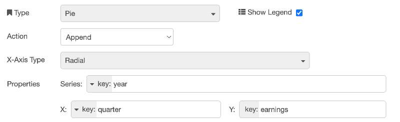

рис.24. У результаті отримаємо таке відображення, де для кільцевої (Doughnut) діаграми використано дані з двох серій (Series).

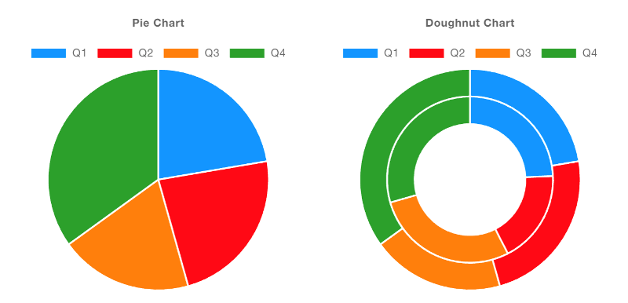

рис.25. Приклад кругової (Pie) та кільцевої (Doughnut) діаграм.

### Histograms 

Гістограми є особливими тим, що вони не просто відображають передані їм дані. Натомість вони обчислюють і накопичують частоти отриманих повідомлень, згрупованих за властивостями "X" та "Series".

#### Bins 

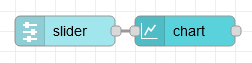

рис.26. 

```json
[{"id":"df07df47734f792e","type":"ui-slider","z":"28aca5b1020ec1a4","group":"ef4891074978d31b","name":"","label":"slider","tooltip":"","order":11,"width":0,"height":0,"passthru":false,"outs":"all","topic":"topic","topicType":"msg","thumbLabel":"true","showTicks":"always","min":0,"max":10,"step":1,"className":"","iconPrepend":"","iconAppend":"","color":"","colorTrack":"","colorThumb":"","x":120,"y":40,"wires":[["88a1f34f43c4b907"]]},{"id":"88a1f34f43c4b907","type":"ui-chart","z":"28aca5b1020ec1a4","group":"ef4891074978d31b","name":"Histogram","label":"Slider Histogram","order":10,"chartType":"histogram","category":"","categoryType":"none","xAxisLabel":"Slider Values","xAxisProperty":"payload","xAxisPropertyType":"msg","xAxisType":"bins","xAxisFormat":"","xAxisFormatType":"auto","yAxisLabel":"Frequency","yAxisProperty":"earnings","xmin":"0","xmax":"10","ymin":"0","ymax":"25","bins":"5","action":"append","stackSeries":true,"pointShape":"circle","pointRadius":4,"showLegend":true,"removeOlder":1,"removeOlderUnit":"3600","removeOlderPoints":"","colors":["#0095ff","#ff0000","#ff7f0e","#2ca02c","#98df8a","#ff00bb","#ff9896","#9467bd","#c5b0d5"],"textColor":["#666666"],"textColorDefault":true,"gridColor":["#e5e5e5"],"gridColorDefault":true,"width":"6","height":"8","className":"","x":240,"y":40,"wires":[[]]},{"id":"ef4891074978d31b","type":"ui-group","name":"Histograms","page":"d0621b8f20aee671","width":"6","height":"1","order":1,"showTitle":true,"className":"","visible":"true","disabled":"false"},{"id":"d0621b8f20aee671","type":"ui-page","name":"Charts","ui":"c2e1aa56f50f03bd","path":"/charts","icon":"home","layout":"notebook","theme":"5075a7d8e4947586","order":33,"className":"","visible":"true","disabled":"false"},{"id":"c2e1aa56f50f03bd","type":"ui-base","name":"Dashboard","path":"/dashboard","includeClientData":true,"acceptsClientConfig":["ui-control","ui-notification"],"showPathInSidebar":false,"showPageTitle":false,"navigationStyle":"icon","titleBarStyle":"default"},{"id":"5075a7d8e4947586","type":"ui-theme","name":"Default Theme","colors":{"surface":"#ffffff","primary":"#0094CE","bgPage":"#eeeeee","groupBg":"#ffffff","groupOutline":"#cccccc"},"sizes":{"pagePadding":"12px","groupGap":"12px","groupBorderRadius":"4px","widgetGap":"12px"}}]
```

If you want to render numerical data on the x-axis, then you should use  the "Bins" x-axis type. This will allow you to define the range of  values that should be grouped together, and how many "bins" your range  should be split into.

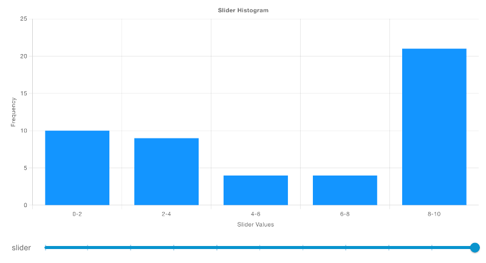

рис.27. Якщо потрібно відображати числові дані по осі X, слід використовувати тип осі X "Bins". Це дозволяє визначити діапазон значень, які мають групуватися разом, а також кількість «бінів» (інтервалів), на які буде поділено цей діапазон.

#### Categorical 

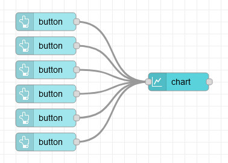

рис.28.

Якщо ж по осі X використовуються фіксовані рядкові або категоріальні значення, слід застосовувати тип осі X "Categorical". У цьому випадку дані групуються за значенням осі X, після чого обчислюється частота кожного значення.

```json
[{"id":"9f58aff04b61c826","type":"ui-button","z":"28aca5b1020ec1a4","group":"ef4891074978d31b","name":"","label":"A","order":4,"width":"2","height":"1","emulateClick":false,"tooltip":"","color":"","bgcolor":"","className":"","icon":"","iconPosition":"left","payload":"A","payloadType":"str","topic":"Series 1","topicType":"str","buttonColor":"","textColor":"","iconColor":"","enablePointerdown":false,"pointerdownPayload":"","pointerdownPayloadType":"str","enablePointerup":false,"pointerupPayload":"","pointerupPayloadType":"","x":910,"y":860,"wires":[["3da7bceee3e94781"]]},{"id":"3da7bceee3e94781","type":"ui-chart","z":"28aca5b1020ec1a4","group":"ef4891074978d31b","name":"Histogram","label":"Histogram","order":3,"chartType":"histogram","category":"topic","categoryType":"msg","xAxisLabel":"Age of Instances (Days)","xAxisProperty":"payload","xAxisPropertyType":"msg","xAxisType":"category","xAxisFormat":"","xAxisFormatType":"auto","yAxisLabel":"Frequency","yAxisProperty":"earnings","xmin":"0","xmax":"90","ymin":"0","ymax":"","bins":"10","action":"append","stackSeries":false,"pointShape":"circle","pointRadius":4,"showLegend":true,"removeOlder":1,"removeOlderUnit":"3600","removeOlderPoints":"","colors":["#0095ff","#ff0000","#ff7f0e","#2ca02c","#98df8a","#ff00bb","#ff9896","#9467bd","#c5b0d5"],"textColor":["#666666"],"textColorDefault":true,"gridColor":["#e5e5e5"],"gridColorDefault":true,"width":"6","height":"8","className":"","x":1130,"y":960,"wires":[[]]},{"id":"032b2f0912bf9d63","type":"ui-button","z":"28aca5b1020ec1a4","group":"ef4891074978d31b","name":"","label":"B","order":5,"width":"2","height":"1","emulateClick":false,"tooltip":"","color":"","bgcolor":"","className":"","icon":"","iconPosition":"left","payload":"B","payloadType":"str","topic":"Series 1","topicType":"str","buttonColor":"","textColor":"","iconColor":"","enablePointerdown":false,"pointerdownPayload":"","pointerdownPayloadType":"str","enablePointerup":false,"pointerupPayload":"","pointerupPayloadType":"","x":910,"y":900,"wires":[["3da7bceee3e94781"]]},{"id":"99a22dfe2175323c","type":"ui-button","z":"28aca5b1020ec1a4","group":"ef4891074978d31b","name":"","label":"C","order":6,"width":"2","height":"1","emulateClick":false,"tooltip":"","color":"","bgcolor":"","className":"","icon":"","iconPosition":"left","payload":"C","payloadType":"str","topic":"Series 1","topicType":"str","buttonColor":"","textColor":"","iconColor":"","enablePointerdown":false,"pointerdownPayload":"","pointerdownPayloadType":"str","enablePointerup":false,"pointerupPayload":"","pointerupPayloadType":"","x":910,"y":940,"wires":[["3da7bceee3e94781"]]},{"id":"edc0e8f2577de2b1","type":"ui-button","z":"28aca5b1020ec1a4","group":"ef4891074978d31b","name":"","label":"A","order":7,"width":"2","height":"1","emulateClick":false,"tooltip":"","color":"","bgcolor":"","className":"","icon":"","iconPosition":"left","payload":"A","payloadType":"str","topic":"Series 2","topicType":"str","buttonColor":"","textColor":"","iconColor":"","enablePointerdown":false,"pointerdownPayload":"","pointerdownPayloadType":"str","enablePointerup":false,"pointerupPayload":"","pointerupPayloadType":"","x":910,"y":980,"wires":[["3da7bceee3e94781"]]},{"id":"097812761c5e20f3","type":"ui-button","z":"28aca5b1020ec1a4","group":"ef4891074978d31b","name":"","label":"B","order":8,"width":"2","height":"1","emulateClick":false,"tooltip":"","color":"","bgcolor":"","className":"","icon":"","iconPosition":"left","payload":"B","payloadType":"str","topic":"Series 2","topicType":"str","buttonColor":"","textColor":"","iconColor":"","enablePointerdown":false,"pointerdownPayload":"","pointerdownPayloadType":"str","enablePointerup":false,"pointerupPayload":"","pointerupPayloadType":"","x":910,"y":1020,"wires":[["3da7bceee3e94781"]]},{"id":"5a72bb8de6ae3d82","type":"ui-button","z":"28aca5b1020ec1a4","group":"ef4891074978d31b","name":"","label":"C","order":9,"width":"2","height":"1","emulateClick":false,"tooltip":"","color":"","bgcolor":"","className":"","icon":"","iconPosition":"left","payload":"C","payloadType":"str","topic":"Series 2","topicType":"str","buttonColor":"","textColor":"","iconColor":"","enablePointerdown":false,"pointerdownPayload":"","pointerdownPayloadType":"str","enablePointerup":false,"pointerupPayload":"","pointerupPayloadType":"","x":910,"y":1060,"wires":[["3da7bceee3e94781"]]},{"id":"ef4891074978d31b","type":"ui-group","name":"Histograms","page":"d0621b8f20aee671","width":"6","height":"1","order":1,"showTitle":true,"className":"","visible":"true","disabled":"false"},{"id":"d0621b8f20aee671","type":"ui-page","name":"Charts","ui":"c2e1aa56f50f03bd","path":"/charts","icon":"home","layout":"notebook","theme":"5075a7d8e4947586","order":33,"className":"","visible":"true","disabled":"false"},{"id":"c2e1aa56f50f03bd","type":"ui-base","name":"Dashboard","path":"/dashboard","includeClientData":true,"acceptsClientConfig":["ui-control","ui-notification"],"showPathInSidebar":false,"showPageTitle":false,"navigationStyle":"icon","titleBarStyle":"default"},{"id":"5075a7d8e4947586","type":"ui-theme","name":"Default Theme","colors":{"surface":"#ffffff","primary":"#0094CE","bgPage":"#eeeeee","groupBg":"#ffffff","groupOutline":"#cccccc"},"sizes":{"pagePadding":"12px","groupGap":"12px","groupBorderRadius":"4px","widgetGap":"12px"}}]
```

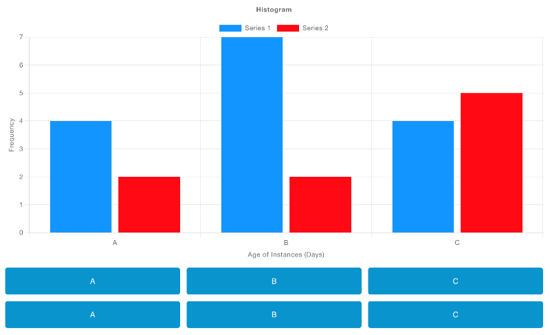

рис.29. 

Тут кожна кнопка передає `payload`, що відповідає певній літері (значенню по осі X), а діаграма обчислює частоту появи кожної отриманої літери. Додатково, перший ряд кнопок належить до «Series 1», а другий ряд – до «Series 2», що визначається через `msg.topic`.

#### Grouping into Series 

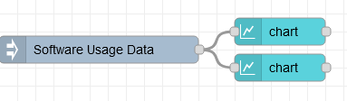

рис.30. 

```json
[{"id":"60c23da02739d9a1","type":"inject","z":"28aca5b1020ec1a4","name":"Software Usage Data","props":[{"p":"payload"}],"repeat":"","crontab":"","once":false,"onceDelay":0.1,"topic":"","payload":"[{\"age\":{\"days\":45},\"version\":\"2.1.3\",\"license\":\"Free\",\"os\":\"Linux\"},{\"age\":{\"days\":120},\"version\":\"2.1.3\",\"license\":\"Paid\",\"os\":\"Mac\"},{\"age\":{\"days\":30},\"version\":\"2.4.5\",\"license\":\"Free\",\"os\":\"Windows\"},{\"age\":{\"days\":60},\"version\":\"2.4.5\",\"license\":\"Paid\",\"os\":\"Linux\"},{\"age\":{\"days\":90},\"version\":\"2.6.7\",\"license\":\"Free\",\"os\":\"Mac\"},{\"age\":{\"days\":15},\"version\":\"2.6.7\",\"license\":\"Paid\",\"os\":\"Windows\"},{\"age\":{\"days\":75},\"version\":\"2.8.9\",\"license\":\"Free\",\"os\":\"Linux\"},{\"age\":{\"days\":105},\"version\":\"2.8.9\",\"license\":\"Paid\",\"os\":\"Mac\"},{\"age\":{\"days\":135},\"version\":\"2.1.3\",\"license\":\"Free\",\"os\":\"Windows\"},{\"age\":{\"days\":25},\"version\":\"2.4.5\",\"license\":\"Paid\",\"os\":\"Linux\"},{\"age\":{\"days\":55},\"version\":\"2.6.7\",\"license\":\"Free\",\"os\":\"Mac\"},{\"age\":{\"days\":85},\"version\":\"2.8.9\",\"license\":\"Paid\",\"os\":\"Windows\"},{\"age\":{\"days\":115},\"version\":\"2.1.3\",\"license\":\"Free\",\"os\":\"Linux\"},{\"age\":{\"days\":145},\"version\":\"2.4.5\",\"license\":\"Paid\",\"os\":\"Mac\"},{\"age\":{\"days\":35},\"version\":\"2.6.7\",\"license\":\"Free\",\"os\":\"Windows\"},{\"age\":{\"days\":65},\"version\":\"2.8.9\",\"license\":\"Paid\",\"os\":\"Linux\"},{\"age\":{\"days\":95},\"version\":\"2.1.3\",\"license\":\"Free\",\"os\":\"Mac\"},{\"age\":{\"days\":125},\"version\":\"2.4.5\",\"license\":\"Paid\",\"os\":\"Windows\"},{\"age\":{\"days\":20},\"version\":\"2.6.7\",\"license\":\"Free\",\"os\":\"Linux\"},{\"age\":{\"days\":50},\"version\":\"2.8.9\",\"license\":\"Paid\",\"os\":\"Mac\"}]","payloadType":"json","x":120,"y":60,"wires":[["c74a6ea207ded516","9d56c25ee6835aa9"]]},{"id":"c74a6ea207ded516","type":"ui-chart","z":"28aca5b1020ec1a4","group":"ef4891074978d31b","name":"Histogram (by Version)","label":"Frequency of Ages (by Version)","order":1,"chartType":"histogram","category":"version","categoryType":"property","xAxisLabel":"Age of Instances (Days)","xAxisProperty":"age.days","xAxisPropertyType":"property","xAxisType":"bins","xAxisFormat":"","xAxisFormatType":"auto","yAxisLabel":"Frequency","yAxisProperty":"","xmin":"0","xmax":"90","ymin":"0","ymax":"","bins":"10","action":"replace","stackSeries":true,"pointShape":"circle","pointRadius":4,"showLegend":true,"removeOlder":1,"removeOlderUnit":"3600","removeOlderPoints":"","colors":["#0095ff","#52b4ff","#99d5ff","#adddff","#98df8a","#ff00bb","#ff9896","#9467bd","#c5b0d5"],"textColor":["#666666"],"textColorDefault":true,"gridColor":["#e5e5e5"],"gridColorDefault":true,"width":"3","height":"9","className":"","x":320,"y":40,"wires":[[]]},{"id":"9d56c25ee6835aa9","type":"ui-chart","z":"28aca5b1020ec1a4","group":"ef4891074978d31b","name":"Histogram (by OS)","label":"Frequency of Ages (by OS)","order":2,"chartType":"histogram","category":"os","categoryType":"property","xAxisLabel":"Age of Instances (Days)","xAxisProperty":"age.days","xAxisPropertyType":"property","xAxisType":"bins","xAxisFormat":"","xAxisFormatType":"auto","yAxisLabel":"Frequency","yAxisProperty":"earnings","xmin":"0","xmax":"90","ymin":"0","ymax":"","bins":"10","action":"replace","stackSeries":true,"pointShape":"circle","pointRadius":4,"showLegend":true,"removeOlder":1,"removeOlderUnit":"3600","removeOlderPoints":"","colors":["#a3d9ff","#a8e990","#ffcc85","#0295ff","#98df8a","#ff00bb","#ff9896","#9467bd","#c5b0d5"],"textColor":["#666666"],"textColorDefault":true,"gridColor":["#e5e5e5"],"gridColorDefault":true,"width":"3","height":"9","className":"","x":320,"y":80,"wires":[[]]},{"id":"ef4891074978d31b","type":"ui-group","name":"Histograms","page":"d0621b8f20aee671","width":"6","height":"1","order":1,"showTitle":true,"className":"","visible":"true","disabled":"false"},{"id":"d0621b8f20aee671","type":"ui-page","name":"Charts","ui":"c2e1aa56f50f03bd","path":"/charts","icon":"home","layout":"notebook","theme":"5075a7d8e4947586","order":33,"className":"","visible":"true","disabled":"false"},{"id":"c2e1aa56f50f03bd","type":"ui-base","name":"Dashboard","path":"/dashboard","includeClientData":true,"acceptsClientConfig":["ui-control","ui-notification"],"showPathInSidebar":false,"showPageTitle":false,"navigationStyle":"icon","titleBarStyle":"default"},{"id":"5075a7d8e4947586","type":"ui-theme","name":"Default Theme","colors":{"surface":"#ffffff","primary":"#0094CE","bgPage":"#eeeeee","groupBg":"#ffffff","groupOutline":"#cccccc"},"sizes":{"pagePadding":"12px","groupGap":"12px","groupBorderRadius":"4px","widgetGap":"12px"}}]
```

Також ми можемо додати до гістограми додатковий вимір даних за допомогою властивості "Series".

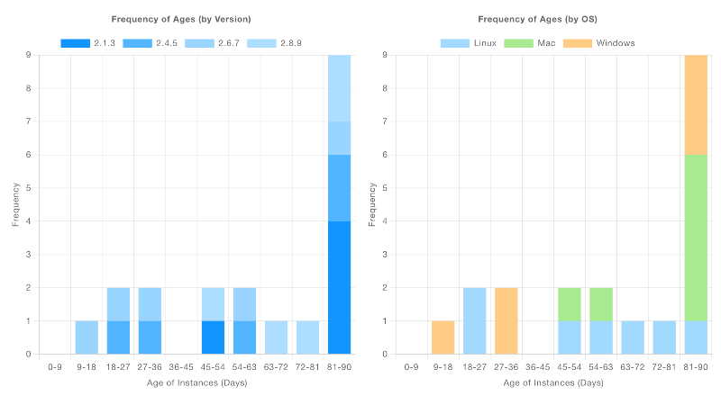

рис.31. Знімок екрана, що показує дві гістограми, які відображають одне й те саме джерело даних, але з різними серіями.

Тут наведено прикладовий набір даних, який описує ліцензії для програмного забезпечення, що працює протягом n днів. Для кожної ліцензії вказано операційну систему (`os`), версію програмного забезпечення (`version`), а також інформацію про те, чи є ліцензія платною (`license`). Дві діаграми, розміщені поруч, показують однакові частотні дані (з інтервалами для `age` по осі X), але в одній гістограмі розбиття виконано за `version`, а в іншій – за `os`.

## Керування 

### Видалення даних 

#### «Додати» або «Замінити» 

Властивість "Action" на діаграмі дозволяє керувати:

- `Append`: усі надані нові дані буде додано до наявних даних на діаграмі
- `Replace`: усі наявні дані спочатку буде видалено, а потім додано нові.

Якщо ви коли-небудь захочете переозначити властивість для кожного окремого повідомлення, ви також можете зробити це, включивши властивість `msg.action`, яка перевизначить поведінку за замовчуванням. Наприклад:

```js
msg = {
    "action": "append",
    "payload": 1
}
```

Додасть цю точку даних до діаграми, залишивши наявні дані, навіть якщо для базової діаграми налаштовано функцію "Replace".

#### Очистити всі дані

Крім того, ви можете будь-коли видалити всі дані з діаграми, надіславши `msg.payload` `[]` до вузла. Найчастіше це робиться шляхом підключення `ui-button` до вузла `ui-chart` і налаштування кнопки для надсилання корисного навантаження JSON зі значенням `[]`.

### Вкладені дані

Це звичайний випадок використання, коли ви матимете дані, структуровані як JSON, і хочете побудувати деякі з них, наприклад:

```js
msg = {
    "payload": {
        "id": "Dataset 1",
        "value": 3,
        "nested": {
            "value": 1
        }
    }
}
```

Тут ми можемо використати «Властивості» `series`, `x` і `y`, щоб означити, які значення ми хочемо відобразити на діаграмі. Щоб отримати доступ до відповідної точки даних тут, ви можете використовувати тип `key:` і використовувати крапкову нотацію, наприклад: `nested.value`.

### Живі дані

Якщо ви створюєте «живі» дані (наприклад, із датчиків), вам не потрібно означувати, як властивість `x` має бути зображена на графіку. Натомість ви можете залишити це поле порожнім, і діаграма автоматично обчислить поточну дату/час.

Це однаково добре працює, якщо ви використовуєте дані у форматі `Object`, напр.

```js
msg = {
    "topic": "Sensor A" 
    "payload": {
        "value": 3
    }
}
```

Де ви можете встановити для властивості `y` значення `key:value`. Значення `x`, якщо залишити порожнім у конфігурації, обчислюватиметься як поточна дата/час.

## Створення власних діаграм

ChartJS має багатий набір параметрів конфігурації, з яких ми відкриваємо лише невеликий підрозділ через конфігурацію Node-RED. Якщо ви хочете додатково налаштувати зовнішній вигляд вашої діаграми або навіть відобразити діаграми, які ми ще не підтримуємо, ви можете зробити це за допомогою вузла UI Template .

Наразі, хоча це і не ідеально, нам потрібно завантажити бібліотеку ChartJS із CDN, а потім спостерігати за завантаженням файлу, перш ніж ми зможемо його використовувати, відповідно до [Завантаження зовнішніх залежностей](https://dashboard.flowfuse.com/nodes/widgets/ui-template.html#loading-external-dependencies) подробиці в документації UI Template.

### Приклад: Статичні дані 

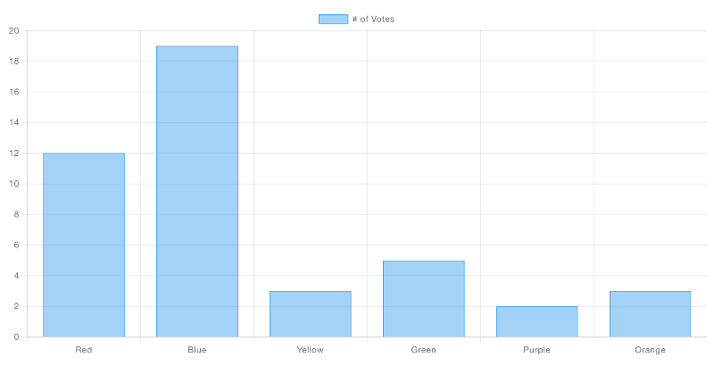

рис.32. 

Ось код шаблону, який відтворить цю гістограму:

```html
<template>
    <canvas ref="chart" />
</template>

<script src="https://cdn.jsdelivr.net/npm/chart.js"></script>

<script>
    export default {
        mounted() {
            // code here when the component is first loaded
            let interval = setInterval(() => {
                if (window.Chart) {
                    // Babylon.js is loaded, so we can now use it
                    clearInterval(interval);
                    this.draw()
                }
            }, 100);
        },
        methods: {
            draw () {
                const ctx = this.$refs.chart
                new Chart(ctx, {
                    type: 'bar',
                    data: {
                        labels: ['Red', 'Blue', 'Yellow', 'Green', 'Purple', 'Orange'],
                        datasets: [{
                            label: '# of Votes',
                            data: [12, 19, 3, 5, 2, 3],
                            borderWidth: 1
                        }]
                    },
                    options: {
                        scales: {
                            y: {
                                beginAtZero: true
                            }
                        }
                    }
                });
            }
        }
    }
</script>
```

### Приклад: побудова вхідних даних

Це малоймовірно, як у першому прикладі, ми просто хочемо рендерити статичні дані - це все-таки Node-RED. Отже, як короткий приклад, ми також можемо підключити цей приклад до `ui-slider` для швидкої демонстрації, ось потік, який може допомогти вам почати:

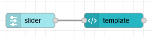

рис.33.

```json
[{"id":"ea7c02fa77fe6efc","type":"ui-template","z":"28aca5b1020ec1a4","group":"1c6f457dfe15977b","page":"","ui":"","name":"Custom Line Chart","order":1,"width":0,"height":0,"head":"","format":"<template>\n    <canvas ref=\"chart\" />\n</template>\n\n<script src=\"https://cdn.jsdelivr.net/npm/chart.js\"></script>\n\n<script>\n    export default {\n        mounted() {\n            this.$socket.on('msg-input:' + this.id, this.onInput)\n\n            // code here when the component is first loaded\n            let interval = setInterval(() => {\n                if (window.Chart) {\n                    // Babylon.js is loaded, so we can now use it\n                    clearInterval(interval);\n                    this.draw()\n                }\n            }, 100);\n        },\n        methods: {\n            draw () {\n                const ctx = this.$refs.chart\n                const datasets = []\n                \n                // Render the chart\n                const chart = new Chart(ctx, {\n                    type: 'line',\n                    data: {\n                        datasets: [{\n                            label: \"My Label\",\n                            data: []\n                        }]\n                    },\n                    options: {\n                        animation: false,\n                        responsive: true,\n                        scales: {\n                            x: {\n                                type: 'time'\n                            }\n                        },\n                        parsing: {\n                            xAxisKey: 'time',\n                            yAxisKey: 'value'\n                        },\n                        plugins: {\n                            legend: {\n                                position: 'top',\n                            },\n                            title: {\n                                display: true,\n                                text: 'Chart.js Line Chart'\n                            }\n                        }   \n                    },\n                });\n                // make this available to all elements of the component\n                this.chart = chart\n            },\n            onInput (msg) {\n                this.chart.data.datasets[0].data.push({\n                    time: (new Date()).getTime(),\n                    value: msg.payload\n                }) \n                this.chart.update()      \n            }\n        }\n    }\n</script>","storeOutMessages":true,"passthru":true,"resendOnRefresh":true,"templateScope":"local","className":"","x":310,"y":120,"wires":[[]]},{"id":"caff24894c090d95","type":"ui-slider","z":"28aca5b1020ec1a4","group":"1c6f457dfe15977b","name":"Slider 1","label":"Slider 1","tooltip":"","order":2,"width":0,"height":0,"passthru":false,"outs":"all","topic":"slider-1","topicType":"str","thumbLabel":"true","showTicks":"always","min":0,"max":10,"step":1,"color":"","colorTrack":"","colorThumb":"","className":"","x":140,"y":120,"wires":[["ea7c02fa77fe6efc"]]},{"id":"1c6f457dfe15977b","type":"ui-group","name":"Custom Bar Chart","page":"d0621b8f20aee671","width":"6","height":"1","order":1,"showTitle":true,"className":"","visible":"true","disabled":"false"},{"id":"d0621b8f20aee671","type":"ui-page","name":"Charts","ui":"c2e1aa56f50f03bd","path":"/charts","icon":"home","layout":"notebook","theme":"5075a7d8e4947586","order":27,"className":"","visible":"true","disabled":"false"},{"id":"c2e1aa56f50f03bd","type":"ui-base","name":"Dashboard","path":"/dashboard","includeClientData":true,"acceptsClientConfig":["ui-control","ui-notification"],"showPathInSidebar":false,"navigationStyle":"icon","titleBarStyle":"default"},{"id":"5075a7d8e4947586","type":"ui-theme","name":"Default Theme","colors":{"surface":"#ffffff","primary":"#0094CE","bgPage":"#eeeeee","groupBg":"#ffffff","groupOutline":"#cccccc"},"sizes":{"pagePadding":"12px","groupGap":"12px","groupBorderRadius":"4px","widgetGap":"12px"}}]
```

і як це виглядатиме після відтворення на Dashboard:

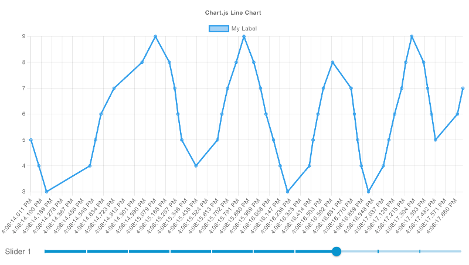

рис.34. 

Глибоко занурюючись у вміст `ui-template` для цієї діаграми, ми можемо побачити:

```html
<template>
    <canvas ref="chart" />
</template>

<script src="https://cdn.jsdelivr.net/npm/chart.js"></script>

<script>
    export default {
        mounted() {
            // register a listener for incoming data
            this.$socket.on('msg-input:' + this.id, this.onInput)

            // check with ChartJS has loaded
            let interval = setInterval(() => {
                if (window.Chart) {
                    // clear the check for ChartJS
                    clearInterval(interval);
                    // draw our initial chart
                    this.draw()
                }
            }, 100);
        },
        methods: {
            draw () {
                // get reference to the <canvas /> element
                const ctx = this.$refs.chart
                
                // Render the chart
                const chart = new Chart(ctx, {
                    type: 'line',
                    data: {
                        datasets: [{
                            label: "My Label",  // label for the single line we'll render
                            data: []            // start with no data
                        }]
                    },
                    options: {
                        animation: false, // don't run the animation for incoming data
                        responsive: true, // ensure we auto-resize the content
                        scales: {
                            x: {
                                type: 'time' // in this example, we're rendering timestamps
                            }
                        },
                        parsing: {
                            xAxisKey: 'time', // the property to render on the x-axis
                            yAxisKey: 'value' // the property to render on the y-axis
                        },
                        plugins: {
                            legend: {
                                position: 'top',
                            },
                            title: {
                                display: true,
                                text: 'Chart.js Line Chart'
                            }
                        }   
                    },
                });
                // make this available to all elements of the component
                this.chart = chart
            },
            onInput (msg) {
                // add a new data point ot our existing dataset
                this.chart.data.datasets[0].data.push({
                    time: (new Date()).getTime(),
                    value: msg.payload
                }) 
                // ensure the chart re-renders
                this.chart.update()      
            }
        }
    }
</script>
```

### Example: Categorising Data 

Розглянемо складніший приклад, у якому ми можемо відобразити тип діаграми, що наразі не підтримується базовим Dashboard, – діаграму Polar Area.

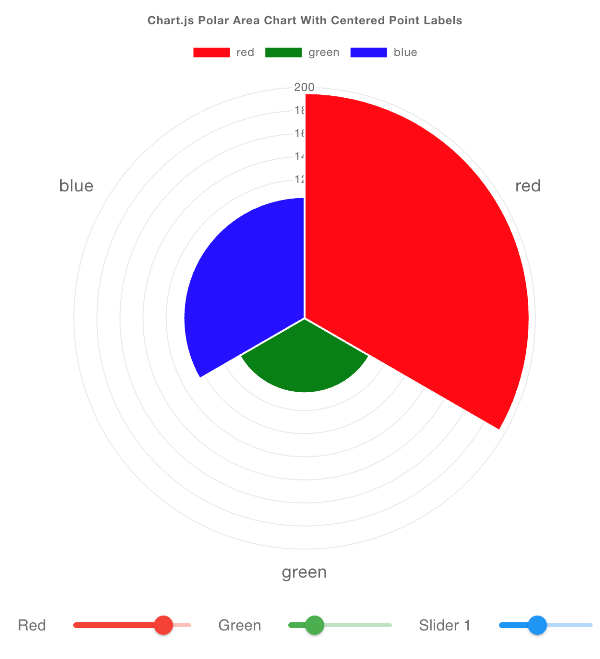

рис.35. 

Цей приклад адаптовано з прикладу з документації ChartJS.

У цьому прикладі ми під’єднуємо кілька `ui-sliders`, кожен з яких задає `msg.topic` як інший колір, до нашої кастомної діаграми:

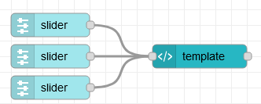

рис.36.

```json
[{"id":"06431e1221a0d2e8","type":"ui-template","z":"28aca5b1020ec1a4","group":"1c6f457dfe15977b","page":"","ui":"","name":"Custom Polar Chart","order":1,"width":0,"height":0,"head":"","format":"<template>\n    <canvas ref=\"chart\" />\n</template>\n\n<script src=\"https://cdn.jsdelivr.net/npm/chart.js\"></script>\n\n<script>\n    export default {\n        mounted() {\n            // register a listener for incoming data\n            this.$socket.on('msg-input:' + this.id, this.onInput)\n\n            // code here when the component is first loaded\n            let interval = setInterval(() => {\n                if (window.Chart) {\n                    // Babylon.js is loaded, so we can now use it\n                    clearInterval(interval);\n                    this.draw()\n                }\n            }, 100);\n        },\n        methods: {\n            draw () {\n                const ctx = this.$refs.chart\n                const data = {\n                    labels: [],\n                    datasets: [{\n                        label: 'Colors',\n                        data: [],\n                        backgroundColor: []\n                    }]\n                }\n                \n                // Render the chart\n                const chart = new Chart(ctx, {\n                    type: 'polarArea',\n                    data: data,\n                    options: {\n                        responsive: true,\n                        scales: {\n                            r: {\n                                pointLabels: {\n                                    display: true,\n                                    centerPointLabels: true,\n                                    font: {\n                                        size: 18\n                                    }\n                                }\n                            }\n                            },\n                            plugins: {\n                            legend: {\n                                position: 'top',\n                            },\n                            title: {\n                                display: true,\n                                text: 'Chart.js Polar Area Chart With Centered Point Labels'\n                            }\n                        }\n                    },\n                });\n                this.chart = chart\n            },\n            onInput (msg) {\n                // in this example, our topics will be colors\n                const color = msg.topic\n\n                // have we seen this color before?\n                const index = this.chart.data.labels.indexOf(color)\n                \n                if (index === -1) {\n                    console.log('new color', color)\n                    // add new dataset for this topic\n                    this.chart.data.labels.push(color)\n                    this.chart.data.datasets[0].data.push(msg.payload)\n                    this.chart.data.datasets[0].backgroundColor.push(color)\n                } else {\n                    // we've already got data for this color, update the value\n                    this.chart.data.datasets[0].data[index] = msg.payload\n                }\n\n                // ensure the chart re-renders\n                this.chart.update()      \n            }\n        }\n    }\n</script>","storeOutMessages":true,"passthru":true,"resendOnRefresh":true,"templateScope":"local","className":"","x":280,"y":100,"wires":[[]]},{"id":"6a5c7ecd2dd174db","type":"ui-slider","z":"28aca5b1020ec1a4","group":"1c6f457dfe15977b","name":"Red","label":"Red","tooltip":"","order":2,"width":"2","height":"1","passthru":false,"outs":"all","topic":"red","topicType":"str","thumbLabel":"true","showTicks":"false","min":0,"max":"255","step":"5","color":"red","colorTrack":"red","colorThumb":"red","className":"","x":90,"y":60,"wires":[["06431e1221a0d2e8"]]},{"id":"70cbfaa92b06ee6f","type":"ui-slider","z":"28aca5b1020ec1a4","group":"1c6f457dfe15977b","name":"Green","label":"Green","tooltip":"","order":3,"width":"2","height":"1","passthru":false,"outs":"all","topic":"green","topicType":"str","thumbLabel":"true","showTicks":"false","min":0,"max":"255","step":"5","color":"green","colorTrack":"green","colorThumb":"green","className":"","x":90,"y":100,"wires":[["06431e1221a0d2e8"]]},{"id":"d95df24465a70884","type":"ui-slider","z":"28aca5b1020ec1a4","group":"1c6f457dfe15977b","name":"Blue","label":"Slider 1","tooltip":"","order":4,"width":"2","height":"1","passthru":false,"outs":"all","topic":"blue","topicType":"str","thumbLabel":"true","showTicks":"false","min":0,"max":"255","step":"5","color":"blue","colorTrack":"blue","colorThumb":"blue","className":"","x":90,"y":140,"wires":[["06431e1221a0d2e8"]]},{"id":"1c6f457dfe15977b","type":"ui-group","name":"Custom Bar Chart","page":"d0621b8f20aee671","width":"6","height":"1","order":1,"showTitle":true,"className":"","visible":"true","disabled":"false"},{"id":"d0621b8f20aee671","type":"ui-page","name":"Charts","ui":"c2e1aa56f50f03bd","path":"/charts","icon":"home","layout":"notebook","theme":"5075a7d8e4947586","order":27,"className":"","visible":"true","disabled":"false"},{"id":"c2e1aa56f50f03bd","type":"ui-base","name":"Dashboard","path":"/dashboard","includeClientData":true,"acceptsClientConfig":["ui-control","ui-notification"],"showPathInSidebar":false,"navigationStyle":"icon","titleBarStyle":"default"},{"id":"5075a7d8e4947586","type":"ui-theme","name":"Default Theme","colors":{"surface":"#ffffff","primary":"#0094CE","bgPage":"#eeeeee","groupBg":"#ffffff","groupOutline":"#cccccc"},"sizes":{"pagePadding":"12px","groupGap":"12px","groupBorderRadius":"4px","widgetGap":"12px"}}]
```

Детальний розбір вмісту `ui-template` показує:

```html
<template>
    <canvas ref="chart" />
</template>

<script src="https://cdn.jsdelivr.net/npm/chart.js"></script>

<script>
    export default {
        mounted() {
            // register a listener for incoming data
            this.$socket.on('msg-input:' + this.id, this.onInput)

            // code here when the component is first loaded
            let interval = setInterval(() => {
                if (window.Chart) {
                    // Babylon.js is loaded, so we can now use it
                    clearInterval(interval);
                    this.draw()
                }
            }, 100);
        },
        methods: {
            draw () {
                const ctx = this.$refs.chart
                const data = {
                    labels: [],
                    datasets: [{
                        label: 'Colors',
                        data: [],
                        backgroundColor: []
                    }]
                }
                
                // Render the chart
                const chart = new Chart(ctx, {
                    type: 'polarArea',
                    data: data,
                    options: {
                        responsive: true,
                        scales: {
                            r: {
                                pointLabels: {
                                    display: true,
                                    centerPointLabels: true,
                                    font: {
                                        size: 18
                                    }
                                }
                            }
                            },
                            plugins: {
                            legend: {
                                position: 'top',
                            },
                            title: {
                                display: true,
                                text: 'Chart.js Polar Area Chart With Centered Point Labels'
                            }
                        }
                    },
                });
                this.chart = chart
            },
            onInput (msg) {
                // in this example, our topics will be colors
                const color = msg.topic

                // have we seen this color before?
                const index = this.chart.data.labels.indexOf(color)
                
                if (index === -1) {
                    console.log('new color', color)
                    // add new dataset for this topic
                    this.chart.data.labels.push(color)
                    this.chart.data.datasets[0].data.push(msg.payload)
                    this.chart.data.datasets[0].backgroundColor.push(color)
                } else {
                    // we've already got data for this color, update the value
                    this.chart.data.datasets[0].data[index] = msg.payload
                }

                // ensure the chart re-renders
                this.chart.update()      
            }
        }
    }
</script>
```

