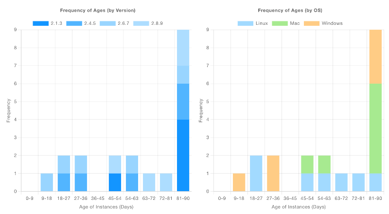

| [На головну](../) | [Розділ](README.md) |
| ----------------- | ------------------- |
|                   |                     |

# Chart `ui-chart` 

https://dashboard.flowfuse.com/nodes/widgets/ui-chart.html#line-chart

[Спробувати демо](https://dashboard-demos.flowfuse.cloud/dashboard/charts-example)

Provides configuration options to create the following chart types:

- [Line Chart](https://dashboard.flowfuse.com/nodes/widgets/ui-chart.html#line-chart)
- [Scatter Plot](https://dashboard.flowfuse.com/nodes/widgets/ui-chart.html#scatter-charts)
- [Bar Chart](https://dashboard.flowfuse.com/nodes/widgets/ui-chart.html#bar-charts)
- [Pie/Doughnut Charts](https://dashboard.flowfuse.com/nodes/widgets/ui-chart.html#pie-doughnut-charts)
- [Histograms](https://dashboard.flowfuse.com/nodes/widgets/ui-chart.html#histograms)


## Властивості 

| Властивість     | Dynamic | Опис                                                         |
| --------------- | ------- | ------------------------------------------------------------ |
| Group           |         | Defines which group of the UI Dashboard this widget will render in. |
| Size            |         | Controls the width of the button with respect to the parent group. Maximum value is the width of the group. |
| Label           |         | The text shown within the button.                            |
| Class           |         | The text shown within the button.                            |
| Chart Type      |         | `Line`                                                       |
| Show Legend     |         | Defines whether or not a legend is shown between the title and the chart. Each label is driven by `msg.topic`. |
| Action          | ✓       | Controls how new data is added to a chart. It will either "append", keeping  existing data, or "replace", removing existing data, before adding any  newly provided data points. |
| Point Shape     |         | Define the shape of the point shown in Scatter & Line charts. |
| Point Radius    |         | Define the radius (in pixels) of each point rendered onto a Scatter or Line chart. |
| X-Axis Type     |         | `Timescale`                                                  |
| X-Axis Format   |         | `HH:mm:ss`                                                   |
| X-Axis Limit    |         | Any data that is before the specific time limit (for time charts) or where  there are more data points than the limit specified will be removed from the chart. |
| Properties      |         | **Series:** Controls how you want to set the Series of data stream into this widget. The default is `msg.topic`, where separate topics will render to a new line/bar in their respective plots.  **X:** Only available for Line & Scatter Charts. This defines the key  (which can be nested) of the value that should be plotted onto the  x-axis. If left blank, the x-value will be calculated as the current  timestamp.  **Y:** Defines the key (which can be nested, e.g. `'nested.value'`) of the value that should be plotted onto the x-axis. This value is  ignored if injecting single numerical values into the chart. |
| Text Color      |         | Option to override Chart.Js default color for text. At moment overrides the text color for `Chart Title`, `Ticks Text`, `Axis Title` and `Legend Text`  It is possible to return to Chart.Js defaults by using the checkbox `Use ChartJs Default Text Colors` |
| Grid Line Color |         | Option to override Chart.Js default color for `Grid Lines` and `Axis Border`.  It is possible to return to Chart.Js defaults by using the checkbox `Use ChartJs Default Grid Colors` |

## Динамічні властивості 

Dynamic properties are those that can be overriden at runtime by sending a particular `msg` to the node.

Where appropriate, the underlying values set within Node-RED will be overriden by the values set in the received messages.

| Prop  | Payload     | Structures | Example Values |
| ----- | ----------- | ---------- | -------------- |
| Class | `msg.class` | `String`   |                |

## Побудова діаграм

У Node-RED Dashboard 2.0 `ui-chart` пропонує простий спосіб візуалізації даних у різних типах діаграм. Діаграму можна налаштувати відповідно до ваших даних.

Щоб зіставити свої дані з діаграмою, найважливіші властивості, які потрібно налаштувати:

*Example key mapping config for UI Chart*

- **Series**: означує спосіб групування даних. Наприклад, на лінійній діаграмі (line chart) різні ряди призводять до різних ліній,  на гістограмі (bar chart) різні ряди призводять до різних стовпчиків для одного значення x (складених або згрупованих пліч-о-пліч).

- **X**: означте, де зчитувати значення для графіка на осі `x`. Якщо залишити порожнім, значення `x` буде розраховано як поточну позначку часу.
- **Y**: означте, де зчитувати значення для графіка на осі `y`. Якщо залишити порожнім, значення `y` буде зчитано безпосередньо з `msg.payload` і вважатиметься числом.

Наступними найважливішими властивостями, які потрібно налаштувати, є «Тип діаграми» ("Chart Type") та «Тип осі Х» ("X-Axis Type").

- **Chart Type**: виберіть Line, Scatter, або Bar chart.
- **X-Axis Type**: виберіть "Timescale" (для даних на основі часу), "Linear" (для числових даних) або "Categorical" (для нечислових даних). Ви помітите, що деякі типи осі X доступні лише для певних типів діаграм.

### Лінійні діаграми

#### Дані часових рядів


```json
[{"id":"f2b32a695a996008","type":"ui-chart","z":"28aca5b1020ec1a4","group":"8de7b0ba54b83e6a","name":"","label":"chart","order":1,"chartType":"line","category":"Slider","categoryType":"str","xAxisLabel":"","xAxisProperty":"","xAxisPropertyType":"property","xAxisType":"time","xAxisFormat":"","xAxisFormatType":"auto","yAxisLabel":"","yAxisProperty":"","ymin":"","ymax":"","action":"append","stackSeries":false,"pointShape":"circle","pointRadius":4,"showLegend":true,"removeOlder":1,"removeOlderUnit":"3600","removeOlderPoints":"","colors":["#1f77b4","#aec7e8","#ff7f0e","#2ca02c","#98df8a","#d62728","#ff9896","#9467bd","#c5b0d5"],"textColor":["#666666"],"textColorDefault":true,"gridColor":["#e5e5e5"],"gridColorDefault":true,"width":6,"height":8,"className":"","x":290,"y":100,"wires":[[]]},{"id":"60413f89bde7b6b0","type":"ui-slider","z":"28aca5b1020ec1a4","group":"8de7b0ba54b83e6a","name":"","label":"slider","tooltip":"","order":2,"width":0,"height":0,"passthru":false,"outs":"all","topic":"topic","topicType":"msg","thumbLabel":"true","showTicks":"always","min":0,"max":10,"step":1,"className":"","iconPrepend":"","iconAppend":"","color":"","colorTrack":"","colorThumb":"","x":150,"y":100,"wires":[["f2b32a695a996008"]]},{"id":"0f23aefcc565f5c0","type":"inject","z":"28aca5b1020ec1a4","name":"Clear Chart","props":[{"p":"payload"}],"repeat":"","crontab":"","once":false,"onceDelay":0.1,"topic":"","payload":"[]","payloadType":"json","x":130,"y":60,"wires":[["f2b32a695a996008"]]},{"id":"c624c1ca7c57bb20","type":"comment","z":"28aca5b1020ec1a4","name":"README","info":"No need to define \"x\" and \"y\" properties here,\nas the incoming value is a single number.\n\nSo, \"y\" will take that value, and the \"x\"\nvalue will just use the time upon\nreceiving that data.","x":300,"y":60,"wires":[]},{"id":"8de7b0ba54b83e6a","type":"ui-group","name":"Line Charts","page":"d0621b8f20aee671","width":"6","height":"1","order":1,"showTitle":true,"className":"","visible":"true","disabled":"false"},{"id":"d0621b8f20aee671","type":"ui-page","name":"Charts","ui":"c2e1aa56f50f03bd","path":"/charts","icon":"home","layout":"notebook","theme":"5075a7d8e4947586","order":27,"className":"","visible":"true","disabled":"false"},{"id":"c2e1aa56f50f03bd","type":"ui-base","name":"Dashboard","path":"/dashboard","includeClientData":true,"acceptsClientConfig":["ui-control","ui-notification"],"showPathInSidebar":false,"showPageTitle":false,"navigationStyle":"icon","titleBarStyle":"default"},{"id":"5075a7d8e4947586","type":"ui-theme","name":"Default Theme","colors":{"surface":"#ffffff","primary":"#0094CE","bgPage":"#eeeeee","groupBg":"#ffffff","groupOutline":"#cccccc"},"sizes":{"pagePadding":"12px","groupGap":"12px","groupBorderRadius":"4px","widgetGap":"12px"}}]
```

У цьому прикладі ми підключаємо [повзунок](https://dashboard.flowfuse.com/nodes/widgets/ui-slider.html) до нашої діаграми, щоб побудувати його результат у часі:


Приклад візуалізованої лінійної діаграми з віссю X «час»

Дуже поширеним випадком використання Node-RED є обробка даних часових рядів, наприклад показань датчиків. У цьому випадку ви повинні встановити наступне:

| Property        | Value       |
| --------------- | ----------- |
| **Chart Type**  | `Line`      |
| **X-Axis Type** | `Timescale` |

Тоді значення властивості `x` буде одним із двох:

- Якщо ваші дані є простим числовим значенням, ви можете залишити це поле порожнім, і діаграма автоматично використовуватиме поточну дату/час.
- Якщо ваші дані є об’єктом, ви можете надати ключ мітки часу у ваших даних, наприклад. `{"myTime": 1234567890}` встановіть для властивості `X` тип `key` і значення `myTime`.

Тоді останньою частиною головоломки буде встановлення властивості `y` як одного з двох варіантів:

- Якщо ваші дані є простим числовим значенням, ви можете залишити це поле порожнім, і діаграма автоматично використовуватиме значення `msg.payload`.
- Якщо ваші дані є об’єктом, ви можете надати ключ значення у ваших даних, напр. `{"myTime": 1234567890, "myValue": 123}` встановіть для властивості `Y` тип `key` і значення `myValue`.

#### Кілька ліній


```json
[{"id":"eed78059233cb876","type":"ui-chart","z":"28aca5b1020ec1a4","group":"b429518aee48a6fb","name":"Array Line Chart","label":"chart","order":1,"chartType":"line","category":"topic","categoryType":"msg","xAxisLabel":"Property A","xAxisProperty":"propertyA","xAxisPropertyType":"property","xAxisType":"linear","xAxisFormat":"","xAxisFormatType":"auto","yAxisLabel":"Property B","yAxisProperty":"propertyB","ymin":"0","ymax":"10","action":"append","stackSeries":false,"pointShape":"circle","pointRadius":4,"showLegend":true,"removeOlder":1,"removeOlderUnit":"3600","removeOlderPoints":"","colors":["#1f77b4","#ff0000","#ff7f0e","#2ca02c","#98df8a","#d62728","#ff9896","#9467bd","#c5b0d5"],"textColor":["#666666"],"textColorDefault":true,"gridColor":["#e5e5e5"],"gridColorDefault":true,"width":6,"height":8,"className":"","x":340,"y":100,"wires":[[]]},{"id":"b21df8b397cb3233","type":"inject","z":"28aca5b1020ec1a4","name":"Clear Chart","props":[{"p":"payload"}],"repeat":"","crontab":"","once":false,"onceDelay":0.1,"topic":"","payload":"[]","payloadType":"json","x":150,"y":60,"wires":[["eed78059233cb876"]]},{"id":"3493e8d72fbfa5a9","type":"inject","z":"28aca5b1020ec1a4","name":"Sample Data A","props":[{"p":"payload"},{"p":"topic","vt":"str"}],"repeat":"","crontab":"","once":false,"onceDelay":0.1,"topic":"Sample Data A","payload":"[{\"propertyA\":10,\"propertyB\":2},{\"propertyA\":15,\"propertyB\":3},{\"propertyA\":25,\"propertyB\":5},{\"propertyA\":30,\"propertyB\":6},{\"propertyA\":40,\"propertyB\":8}]","payloadType":"json","x":140,"y":100,"wires":[["eed78059233cb876"]]},{"id":"3d24d72914056683","type":"inject","z":"28aca5b1020ec1a4","name":"Sample Data B","props":[{"p":"payload"},{"p":"topic","vt":"str"}],"repeat":"","crontab":"","once":false,"onceDelay":0.1,"topic":"Sample Data B","payload":"[{\"propertyA\":7,\"propertyB\":6},{\"propertyA\":15,\"propertyB\":2},{\"propertyA\":24,\"propertyB\":9},{\"propertyA\":32,\"propertyB\":4},{\"propertyA\":47,\"propertyB\":9}]","payloadType":"json","x":140,"y":140,"wires":[["eed78059233cb876"]]},{"id":"b429518aee48a6fb","type":"ui-group","name":"Chart Examples","page":"d0621b8f20aee671","width":"6","height":"1","order":4,"showTitle":true,"className":"","visible":"true","disabled":"false"},{"id":"d0621b8f20aee671","type":"ui-page","name":"Charts","ui":"c2e1aa56f50f03bd","path":"/charts","icon":"home","layout":"notebook","theme":"5075a7d8e4947586","order":27,"className":"","visible":"true","disabled":"false"},{"id":"c2e1aa56f50f03bd","type":"ui-base","name":"Dashboard","path":"/dashboard","includeClientData":true,"acceptsClientConfig":["ui-control","ui-notification"],"showPathInSidebar":false,"showPageTitle":false,"navigationStyle":"icon","titleBarStyle":"default"},{"id":"5075a7d8e4947586","type":"ui-theme","name":"Default Theme","colors":{"surface":"#ffffff","primary":"#0094CE","bgPage":"#eeeeee","groupBg":"#ffffff","groupOutline":"#cccccc"},"sizes":{"pagePadding":"12px","groupGap":"12px","groupBorderRadius":"4px","widgetGap":"12px"}}]
```


*Example Line Chart with multiple lines*

Ви можете згрупувати дані в кілька рядків за допомогою властивості `Series`. Загальним випадком використання тут є використання `msg.topic`, де кожне повідомлення, надіслане на діаграму, буде призначено іншому рядку на основі значення `msg.topic`. Крім того, ви можете встановити значення `key` і вказати ключ у своїх даних для групування.

Якщо ви хочете, щоб одна частина даних побудувала кілька рядків, ви можете встановити для властивості `Series` значення `JSON`, а потім надати масив ключів (наприклад, `["key1", "key2"]`), який буде побудувати точку даних для кожного наданого ключа з однієї точки даних.

### Точкові діаграми


*Приклад візуалізованої діаграми розсіювання з віссю x «час».*

Ми також можемо використовувати "Series" для групування точок. Розглянемо приклад із таким набором даних:

```json
[	{ "series": "A", "x": 5, "y": 84 },
    { "series": "A", "x": 9, "y": 10 },
    { "series": "A", "x": 11, "y": 70 },
    { "series": "B", "x": 12, "y": 28 },
    { "series": "B", "x": 15, "y": 35 },
    { "series": "B", "x": 26, "y": 42 },
    { "series": "C", "x": 20, "y": 12 },
    { "series": "C", "x": 24, "y": 54 },
    { "series": "C", "x": 27, "y": 60 },
    { "series": "C", "x": 30, "y": 66 }]
```

У нашому потоці ми мали б:


```json
[{"id":"16c2839487757a01","type":"inject","z":"28aca5b1020ec1a4","name":"Scatter Data","props":[{"p":"payload"}],"repeat":"","crontab":"","once":false,"onceDelay":0.1,"topic":"","payload":"[{\"series\":\"A\",\"x\":5,\"y\":84},{\"series\":\"A\",\"x\":9,\"y\":10},{\"series\":\"A\",\"x\":11,\"y\":70},{\"series\":\"B\",\"x\":12,\"y\":28},{\"series\":\"B\",\"x\":15,\"y\":35},{\"series\":\"B\",\"x\":26,\"y\":42},{\"series\":\"C\",\"x\":20,\"y\":12},{\"series\":\"C\",\"x\":24,\"y\":54},{\"series\":\"C\",\"x\":27,\"y\":60},{\"series\":\"C\",\"x\":30,\"y\":66}]","payloadType":"json","x":130,"y":160,"wires":[["d6ddc83bcd4de04a"]]},{"id":"d6ddc83bcd4de04a","type":"ui-chart","z":"28aca5b1020ec1a4","group":"b429518aee48a6fb","name":"Chart: Scatter","label":"Scatter Plot Example","order":1,"chartType":"scatter","category":"series","categoryType":"property","xAxisLabel":"x","xAxisProperty":"x","xAxisPropertyType":"property","xAxisType":"linear","xAxisFormat":"","xAxisFormatType":"auto","yAxisLabel":"y","yAxisProperty":"y","ymin":"0","ymax":"100","action":"append","stackSeries":false,"pointShape":"circle","pointRadius":4,"showLegend":true,"removeOlder":1,"removeOlderUnit":"3600","removeOlderPoints":"","colors":["#0095ff","#ff0000","#ff7f0e","#2ca02c","#98df8a","#d62728","#ff9896","#9467bd","#c5b0d5"],"textColor":["#666666"],"textColorDefault":true,"gridColor":["#e5e5e5"],"gridColorDefault":true,"width":6,"height":8,"className":"","x":340,"y":160,"wires":[[]]},{"id":"aa0ac5025fc32d7f","type":"inject","z":"28aca5b1020ec1a4","name":"Clear Data","props":[{"p":"payload"}],"repeat":"","crontab":"","once":false,"onceDelay":0.1,"topic":"","payload":"[]","payloadType":"json","x":140,"y":200,"wires":[["d6ddc83bcd4de04a"]]},{"id":"b429518aee48a6fb","type":"ui-group","name":"Chart Examples","page":"d0621b8f20aee671","width":"6","height":"1","order":4,"showTitle":true,"className":"","visible":"true","disabled":"false"},{"id":"d0621b8f20aee671","type":"ui-page","name":"Charts","ui":"c2e1aa56f50f03bd","path":"/charts","icon":"home","layout":"notebook","theme":"5075a7d8e4947586","order":27,"className":"","visible":"true","disabled":"false"},{"id":"c2e1aa56f50f03bd","type":"ui-base","name":"Dashboard","path":"/dashboard","includeClientData":true,"acceptsClientConfig":["ui-control","ui-notification"],"showPathInSidebar":false,"showPageTitle":false,"navigationStyle":"icon","titleBarStyle":"default"},{"id":"5075a7d8e4947586","type":"ui-theme","name":"Default Theme","colors":{"surface":"#ffffff","primary":"#0094CE","bgPage":"#eeeeee","groupBg":"#ffffff","groupOutline":"#cccccc"},"sizes":{"pagePadding":"12px","groupGap":"12px","groupBorderRadius":"4px","widgetGap":"12px"}}]
```

З такою конфігурацією:


Що призводить до:


*Приклад відтвореної діаграми розсіювання з «Linear» віссю x і даними, згрупованими в «Series».*

### Bar Charts 

Currently, we only support "Category" x-axis types for Bar Charts. This means that the x-axis values will be a string, and the y-axis will be a numerical  value.

Let's take an example of loading data for the Star Wars API:


```json
[{"id":"6cb23f28989d733d","type":"inject","z":"28aca5b1020ec1a4","name":"Inject","props":[],"repeat":"","crontab":"","once":false,"onceDelay":0.1,"topic":"","x":110,"y":80,"wires":[["6aaa2545ebc497d7"]]},{"id":"6aaa2545ebc497d7","type":"http request","z":"28aca5b1020ec1a4","name":"GET SW Characters","method":"GET","ret":"obj","paytoqs":"ignore","url":"https://swapi.dev/api/people","tls":"","persist":false,"proxy":"","insecureHTTPParser":false,"authType":"","senderr":false,"headers":[],"x":290,"y":80,"wires":[["650581df3aa3e266"]]},{"id":"650581df3aa3e266","type":"change","z":"28aca5b1020ec1a4","name":"","rules":[{"t":"set","p":"payload","pt":"msg","to":"payload.results","tot":"msg"}],"action":"","property":"","from":"","to":"","reg":false,"x":500,"y":80,"wires":[["3c0489e86320b632","3c8bd38a30f7250a"]]},{"id":"3c0489e86320b632","type":"ui-chart","z":"28aca5b1020ec1a4","group":"b429518aee48a6fb","name":"Array Bar Chart","label":"chart","order":1,"chartType":"bar","category":"Characters","categoryType":"str","xAxisLabel":"Characters","xAxisProperty":"name","xAxisPropertyType":"property","xAxisType":"category","xAxisFormat":"","xAxisFormatType":"auto","yAxisLabel":"Height","yAxisProperty":"height","ymin":"","ymax":"","action":"append","stackSeries":false,"pointShape":"circle","pointRadius":4,"showLegend":true,"removeOlder":1,"removeOlderUnit":"3600","removeOlderPoints":"","colors":["#1f77b4","#aec7e8","#ff7f0e","#2ca02c","#98df8a","#d62728","#ff9896","#9467bd","#c5b0d5"],"textColor":["#666666"],"textColorDefault":true,"gridColor":["#e5e5e5"],"gridColorDefault":true,"width":6,"height":8,"className":"","x":700,"y":60,"wires":[[]]},{"id":"d64a12d802fc0de8","type":"inject","z":"28aca5b1020ec1a4","name":"Clear Chart","props":[{"p":"payload"}],"repeat":"","crontab":"","once":false,"onceDelay":0.1,"topic":"","payload":"[]","payloadType":"json","x":510,"y":40,"wires":[["3c0489e86320b632"]]},{"id":"3c8bd38a30f7250a","type":"debug","z":"28aca5b1020ec1a4","name":"Debug","active":false,"tosidebar":true,"console":false,"tostatus":false,"complete":"payload","targetType":"msg","statusVal":"","statusType":"auto","x":670,"y":100,"wires":[]},{"id":"b429518aee48a6fb","type":"ui-group","name":"Chart Examples","page":"d0621b8f20aee671","width":"6","height":"1","order":4,"showTitle":true,"className":"","visible":"true","disabled":"false"},{"id":"d0621b8f20aee671","type":"ui-page","name":"Charts","ui":"c2e1aa56f50f03bd","path":"/charts","icon":"home","layout":"notebook","theme":"5075a7d8e4947586","order":27,"className":"","visible":"true","disabled":"false"},{"id":"c2e1aa56f50f03bd","type":"ui-base","name":"Dashboard","path":"/dashboard","includeClientData":true,"acceptsClientConfig":["ui-control","ui-notification"],"showPathInSidebar":false,"showPageTitle":false,"navigationStyle":"icon","titleBarStyle":"default"},{"id":"5075a7d8e4947586","type":"ui-theme","name":"Default Theme","colors":{"surface":"#ffffff","primary":"#0094CE","bgPage":"#eeeeee","groupBg":"#ffffff","groupOutline":"#cccccc"},"sizes":{"pagePadding":"12px","groupGap":"12px","groupBorderRadius":"4px","widgetGap":"12px"}}]
```


*Example of a bar chart showing character "height" data*

If we take a look at the configuration for this chart:


We could easily modify the "Y" property to plot a different value, without needing to modify our data.

#### Grouped Bars - Financial Data Example 


```json
[{"id":"48f2d5b3e40cb944","type":"ui-chart","z":"28aca5b1020ec1a4","group":"b429518aee48a6fb","name":"Chart: Finance","label":"Finance Data","order":1,"chartType":"bar","category":"[\"Q1\", \"Q2\", \"Q3\", \"Q4\"]","categoryType":"json","xAxisLabel":"Year","xAxisProperty":"year","xAxisPropertyType":"property","xAxisType":"category","xAxisFormat":"","xAxisFormatType":"auto","yAxisLabel":"Profit","yAxisProperty":"radius","ymin":"","ymax":"","action":"append","stackSeries":false,"pointShape":"circle","pointRadius":4,"showLegend":true,"removeOlder":1,"removeOlderUnit":"3600","removeOlderPoints":"","colors":["#0095ff","#ff0000","#ff7f0e","#2ca02c","#98df8a","#d62728","#ff9896","#9467bd","#c5b0d5"],"textColor":["#666666"],"textColorDefault":true,"gridColor":["#e5e5e5"],"gridColorDefault":true,"width":6,"height":8,"className":"","x":300,"y":60,"wires":[[]]},{"id":"3ccddcc77ed44e81","type":"inject","z":"28aca5b1020ec1a4","name":"Finance Data","props":[{"p":"payload"}],"repeat":"","crontab":"","once":false,"onceDelay":0.1,"topic":"","payload":"[{\"year\":2021,\"Q1\":115,\"Q2\":207,\"Q3\":198,\"Q4\":163},{\"year\":2022,\"Q1\":170,\"Q2\":200,\"Q3\":230,\"Q4\":210},{\"year\":2023,\"Q1\":86,\"Q2\":140,\"Q3\":180,\"Q4\":138}]","payloadType":"json","x":110,"y":60,"wires":[["48f2d5b3e40cb944"]]},{"id":"8df4587f825276eb","type":"inject","z":"28aca5b1020ec1a4","name":"Clear Data","props":[{"p":"payload"}],"repeat":"","crontab":"","once":false,"onceDelay":0.1,"topic":"","payload":"[]","payloadType":"json","x":120,"y":100,"wires":[["48f2d5b3e40cb944"]]},{"id":"b429518aee48a6fb","type":"ui-group","name":"Chart Examples","page":"d0621b8f20aee671","width":"6","height":"1","order":4,"showTitle":true,"className":"","visible":"true","disabled":"false"},{"id":"d0621b8f20aee671","type":"ui-page","name":"Charts","ui":"c2e1aa56f50f03bd","path":"/charts","icon":"home","layout":"notebook","theme":"5075a7d8e4947586","order":27,"className":"","visible":"true","disabled":"false"},{"id":"c2e1aa56f50f03bd","type":"ui-base","name":"Dashboard","path":"/dashboard","includeClientData":true,"acceptsClientConfig":["ui-control","ui-notification"],"showPathInSidebar":false,"showPageTitle":false,"navigationStyle":"icon","titleBarStyle":"default"},{"id":"5075a7d8e4947586","type":"ui-theme","name":"Default Theme","colors":{"surface":"#ffffff","primary":"#0094CE","bgPage":"#eeeeee","groupBg":"#ffffff","groupOutline":"#cccccc"},"sizes":{"pagePadding":"12px","groupGap":"12px","groupBorderRadius":"4px","widgetGap":"12px"}}]
```

Here we have an example of some financial data:

```json
[
    { "year": 2021, "Q1": 115, "Q2": 207, "Q3": 198, "Q4": 163 },
    { "year": 2022, "Q1": 170, "Q2": 200, "Q3": 230, "Q4": 210 },
    { "year": 2023, "Q1": 86, "Q2": 140, "Q3": 180, "Q4": 138 }
]
```

Bar charts will automatically group data by common x-axis values, but maintain separate bars for each *series*. When you select a "Bar" chart, then you can choose the "Group By" option to be "Side-by-Side" or "Stacks".

Default behavior for a Bar Chart is to group content "Side-by-Side".

In our chart config we can define:


*Configuration for of a bar chart showing financial data, grouped by year*

where we have defined "Series" as a type `JSON` because we want to render multiple bars for each data point, in this case, one for each quarter:


*Example of a bar chart showing financial data, grouped by year*

If we switch over the "Group By" option to be "Stacks", we'd see:


*Example of a bar chart showing the same data, but stacked*

#### Grouped Bars - Election Data Example 


```json
[{"id":"ac3aae239ac7cf51","type":"ui-chart","z":"28aca5b1020ec1a4","group":"b429518aee48a6fb","name":"Chart: Election","label":"Election Data","order":1,"chartType":"bar","category":"year","categoryType":"property","xAxisLabel":"Candidate","xAxisProperty":"candidate","xAxisPropertyType":"property","xAxisType":"category","xAxisFormat":"","xAxisFormatType":"auto","yAxisLabel":"Votes","yAxisProperty":"votes","ymin":"","ymax":"","action":"append","stackSeries":false,"pointShape":"circle","pointRadius":4,"showLegend":true,"removeOlder":1,"removeOlderUnit":"3600","removeOlderPoints":"","colors":["#0095ff","#ff0000","#ff7f0e","#2ca02c","#98df8a","#d62728","#ff9896","#9467bd","#c5b0d5"],"textColor":["#666666"],"textColorDefault":true,"gridColor":["#e5e5e5"],"gridColorDefault":true,"width":6,"height":8,"className":"","x":300,"y":60,"wires":[[]]},{"id":"e7d244573f732c9b","type":"inject","z":"28aca5b1020ec1a4","name":"Election Data","props":[{"p":"payload"}],"repeat":"","crontab":"","once":false,"onceDelay":0.1,"topic":"","payload":"[{\"candidate\":\"Dave\",\"year\":2019,\"votes\":100},{\"candidate\":\"Sarah\",\"year\":2019,\"votes\":90},{\"candidate\":\"Chris\",\"year\":2019,\"votes\":160},{\"candidate\":\"Lucy\",\"year\":2019,\"votes\":125},{\"candidate\":\"Dave\",\"year\":2024,\"votes\":20},{\"candidate\":\"Sarah\",\"year\":2024,\"votes\":170},{\"candidate\":\"Chris\",\"year\":2024,\"votes\":150},{\"candidate\":\"Lucy\",\"year\":2024,\"votes\":60}]","payloadType":"json","x":110,"y":60,"wires":[["ac3aae239ac7cf51"]]},{"id":"4482f355ad4e7664","type":"inject","z":"28aca5b1020ec1a4","name":"Clear Data","props":[{"p":"payload"}],"repeat":"","crontab":"","once":false,"onceDelay":0.1,"topic":"","payload":"[]","payloadType":"json","x":120,"y":100,"wires":[["ac3aae239ac7cf51"]]},{"id":"b429518aee48a6fb","type":"ui-group","name":"Chart Examples","page":"d0621b8f20aee671","width":"6","height":"1","order":4,"showTitle":true,"className":"","visible":"true","disabled":"false"},{"id":"d0621b8f20aee671","type":"ui-page","name":"Charts","ui":"c2e1aa56f50f03bd","path":"/charts","icon":"home","layout":"notebook","theme":"5075a7d8e4947586","order":27,"className":"","visible":"true","disabled":"false"},{"id":"c2e1aa56f50f03bd","type":"ui-base","name":"Dashboard","path":"/dashboard","includeClientData":true,"acceptsClientConfig":["ui-control","ui-notification"],"showPathInSidebar":false,"showPageTitle":false,"navigationStyle":"icon","titleBarStyle":"default"},{"id":"5075a7d8e4947586","type":"ui-theme","name":"Default Theme","colors":{"surface":"#ffffff","primary":"#0094CE","bgPage":"#eeeeee","groupBg":"#ffffff","groupOutline":"#cccccc"},"sizes":{"pagePadding":"12px","groupGap":"12px","groupBorderRadius":"4px","widgetGap":"12px"}}]
```

Here we have a piece of data for each candidate, for each year, which details the number of "Votes" that candidate won.

```json
[
    { "candidate": "Dave", "year": 2019, "votes": 100 },
    { "candidate": "Sarah", "year": 2019, "votes": 90 },
    { "candidate": "Chris", "year": 2019, "votes": 160 },
    { "candidate": "Lucy", "year": 2019, "votes": 125 },
    { "candidate": "Dave", "year": 2024, "votes": 20 },
    { "candidate": "Sarah", "year": 2024, "votes": 170 },
    { "candidate": "Chris", "year": 2024, "votes": 150 },
    { "candidate": "Lucy", "year": 2024, "votes": 60 }
]
```

We have a couple of different ways we could group this data, firstly, we  have a series for each "Year" and the x-value defined as the  "candidate":


*Configuration for of a bar chart showing election data, grouped by candidate, and a series for each year*

Resulting in:


*Example of a bar chart showing election data, grouped by candidate, and a series for each year*

Alternatively, we could have a series per candidate, and then the x-value defined as the "year":


*Configuration for of a bar chart showing election data, grouped by year, and a series for each candidate*

Resulting in:


### Pie/Doughnut Charts 

These chart types use "Radial" axes. The "Series" property is used to define  the layer that the particular data is rendered in, multiple series  results in nested pie/doughnut charts.

The "X" value defines the  key within a single Series", and the "Y" property should point to the  numerical value that dictates the size of a given segment.

Let's take a look at a couple of examples:


With a sample data set such as:

```json
[{"id":"bc346c7d325fe6b5","type":"ui-chart","z":"28aca5b1020ec1a4","group":"e0d7a0182b3c8eb7","name":"Doughnut Chart","label":"Doughnut Chart","order":5,"chartType":"doughnut","category":"year","categoryType":"property","xAxisLabel":"","xAxisProperty":"quarter","xAxisPropertyType":"property","xAxisType":"radial","xAxisFormat":"","xAxisFormatType":"auto","yAxisLabel":"","yAxisProperty":"earnings","ymin":"","ymax":"","action":"append","stackSeries":false,"pointShape":"circle","pointRadius":4,"showLegend":true,"removeOlder":1,"removeOlderUnit":"3600","removeOlderPoints":"","colors":["#0095ff","#ff0000","#ff7f0e","#2ca02c","#98df8a","#d62728","#ff9896","#9467bd","#c5b0d5"],"textColor":["#666666"],"textColorDefault":true,"gridColor":["#e5e5e5"],"gridColorDefault":true,"width":"3","height":"6","className":"","x":320,"y":280,"wires":[[]]},{"id":"c8e227dc6c78b5f2","type":"inject","z":"28aca5b1020ec1a4","name":"Finance Data","props":[{"p":"payload"}],"repeat":"","crontab":"","once":false,"onceDelay":0.1,"topic":"","payload":"[{\"year\":2021,\"quarter\":\"Q1\",\"earnings\":115},{\"year\":2021,\"quarter\":\"Q2\",\"earnings\":120},{\"year\":2021,\"quarter\":\"Q3\",\"earnings\":100},{\"year\":2021,\"quarter\":\"Q4\",\"earnings\":180},{\"year\":2022,\"quarter\":\"Q1\",\"earnings\":142},{\"year\":2022,\"quarter\":\"Q2\",\"earnings\":106},{\"year\":2022,\"quarter\":\"Q3\",\"earnings\":164},{\"year\":2022,\"quarter\":\"Q4\",\"earnings\":172}]","payloadType":"json","x":110,"y":280,"wires":[["bc346c7d325fe6b5"]]},{"id":"2413205ce1f39442","type":"inject","z":"28aca5b1020ec1a4","name":"","props":[{"p":"payload"}],"repeat":"","crontab":"","once":false,"onceDelay":0.1,"topic":"","payload":"[]","payloadType":"json","x":130,"y":320,"wires":[["bc346c7d325fe6b5"]]},{"id":"b87fe3201b219a05","type":"ui-chart","z":"28aca5b1020ec1a4","group":"e0d7a0182b3c8eb7","name":"Pie Chart","label":"Pie Chart","order":4,"chartType":"pie","category":"year","categoryType":"property","xAxisLabel":"","xAxisProperty":"quarter","xAxisPropertyType":"property","xAxisType":"radial","xAxisFormat":"","xAxisFormatType":"auto","yAxisLabel":"","yAxisProperty":"earnings","ymin":"","ymax":"","action":"append","stackSeries":false,"pointShape":"circle","pointRadius":4,"showLegend":true,"removeOlder":1,"removeOlderUnit":"3600","removeOlderPoints":"","colors":["#0095ff","#ff0000","#ff7f0e","#2ca02c","#98df8a","#d62728","#ff9896","#9467bd","#c5b0d5"],"textColor":["#666666"],"textColorDefault":true,"gridColor":["#e5e5e5"],"gridColorDefault":true,"width":"3","height":"6","className":"","x":300,"y":380,"wires":[[]]},{"id":"d10804e8db462840","type":"inject","z":"28aca5b1020ec1a4","name":"Finance Data","props":[{"p":"payload"}],"repeat":"","crontab":"","once":false,"onceDelay":0.1,"topic":"","payload":"[{\"year\":2021,\"quarter\":\"Q1\",\"earnings\":115},{\"year\":2021,\"quarter\":\"Q2\",\"earnings\":120},{\"year\":2021,\"quarter\":\"Q3\",\"earnings\":100},{\"year\":2021,\"quarter\":\"Q4\",\"earnings\":180}]","payloadType":"json","x":110,"y":380,"wires":[["b87fe3201b219a05"]]},{"id":"49dbac215fa8b40f","type":"inject","z":"28aca5b1020ec1a4","name":"","props":[{"p":"payload"}],"repeat":"","crontab":"","once":false,"onceDelay":0.1,"topic":"","payload":"[]","payloadType":"json","x":130,"y":420,"wires":[["b87fe3201b219a05"]]},{"id":"e0d7a0182b3c8eb7","type":"ui-group","name":"PIe Charts","page":"d0621b8f20aee671","width":"6","height":"1","order":1,"showTitle":true,"className":"","visible":"true","disabled":"false"},{"id":"d0621b8f20aee671","type":"ui-page","name":"Charts","ui":"c2e1aa56f50f03bd","path":"/charts","icon":"home","layout":"notebook","theme":"5075a7d8e4947586","order":27,"className":"","visible":"true","disabled":"false"},{"id":"c2e1aa56f50f03bd","type":"ui-base","name":"Dashboard","path":"/dashboard","includeClientData":true,"acceptsClientConfig":["ui-control","ui-notification"],"showPathInSidebar":false,"showPageTitle":false,"navigationStyle":"icon","titleBarStyle":"default"},{"id":"5075a7d8e4947586","type":"ui-theme","name":"Default Theme","colors":{"surface":"#ffffff","primary":"#0094CE","bgPage":"#eeeeee","groupBg":"#ffffff","groupOutline":"#cccccc"},"sizes":{"pagePadding":"12px","groupGap":"12px","groupBorderRadius":"4px","widgetGap":"12px"}}]
```


```json
[
    { "year": 2021, "quarter": "Q1", "earnings": 115 },
    { "year": 2021, "quarter": "Q2", "earnings": 120 },
    { "year": 2021, "quarter": "Q3", "earnings": 100 },
    { "year": 2021, "quarter": "Q4", "earnings": 180 }
]
```

We can configure our chart to render a Pie or Doughnut chart like so:


Results in the following, where for the "Doughnut" chart has two "Series" worth of data.


*Example of Pie and Doughnut Charts*

### Histograms 

Histograms are unique in that they do not *just* plot the data provided to them. Instead, they calculate and keep track  of frequencies of messages received, grouped by the "X" and "Series"  properties.

#### Bins 


```json
[{"id":"df07df47734f792e","type":"ui-slider","z":"28aca5b1020ec1a4","group":"ef4891074978d31b","name":"","label":"slider","tooltip":"","order":11,"width":0,"height":0,"passthru":false,"outs":"all","topic":"topic","topicType":"msg","thumbLabel":"true","showTicks":"always","min":0,"max":10,"step":1,"className":"","iconPrepend":"","iconAppend":"","color":"","colorTrack":"","colorThumb":"","x":120,"y":40,"wires":[["88a1f34f43c4b907"]]},{"id":"88a1f34f43c4b907","type":"ui-chart","z":"28aca5b1020ec1a4","group":"ef4891074978d31b","name":"Histogram","label":"Slider Histogram","order":10,"chartType":"histogram","category":"","categoryType":"none","xAxisLabel":"Slider Values","xAxisProperty":"payload","xAxisPropertyType":"msg","xAxisType":"bins","xAxisFormat":"","xAxisFormatType":"auto","yAxisLabel":"Frequency","yAxisProperty":"earnings","xmin":"0","xmax":"10","ymin":"0","ymax":"25","bins":"5","action":"append","stackSeries":true,"pointShape":"circle","pointRadius":4,"showLegend":true,"removeOlder":1,"removeOlderUnit":"3600","removeOlderPoints":"","colors":["#0095ff","#ff0000","#ff7f0e","#2ca02c","#98df8a","#ff00bb","#ff9896","#9467bd","#c5b0d5"],"textColor":["#666666"],"textColorDefault":true,"gridColor":["#e5e5e5"],"gridColorDefault":true,"width":"6","height":"8","className":"","x":240,"y":40,"wires":[[]]},{"id":"ef4891074978d31b","type":"ui-group","name":"Histograms","page":"d0621b8f20aee671","width":"6","height":"1","order":1,"showTitle":true,"className":"","visible":"true","disabled":"false"},{"id":"d0621b8f20aee671","type":"ui-page","name":"Charts","ui":"c2e1aa56f50f03bd","path":"/charts","icon":"home","layout":"notebook","theme":"5075a7d8e4947586","order":33,"className":"","visible":"true","disabled":"false"},{"id":"c2e1aa56f50f03bd","type":"ui-base","name":"Dashboard","path":"/dashboard","includeClientData":true,"acceptsClientConfig":["ui-control","ui-notification"],"showPathInSidebar":false,"showPageTitle":false,"navigationStyle":"icon","titleBarStyle":"default"},{"id":"5075a7d8e4947586","type":"ui-theme","name":"Default Theme","colors":{"surface":"#ffffff","primary":"#0094CE","bgPage":"#eeeeee","groupBg":"#ffffff","groupOutline":"#cccccc"},"sizes":{"pagePadding":"12px","groupGap":"12px","groupBorderRadius":"4px","widgetGap":"12px"}}]
```

If you want to render numerical data on the x-axis, then you should use  the "Bins" x-axis type. This will allow you to define the range of  values that should be grouped together, and how many "bins" your range  should be split into.


Here, we have a slider that inject a payload into the chart everytime it is  moved, with numbers being split into 5 bins between 0 and 10.

#### Categorical 


If instead, you have fixed string or categorical values for your x-axis,  you should use the "Categorical" x-axis type. This will group data by  the x-axis value, and then calculate the frequency of each value.

```json
[{"id":"9f58aff04b61c826","type":"ui-button","z":"28aca5b1020ec1a4","group":"ef4891074978d31b","name":"","label":"A","order":4,"width":"2","height":"1","emulateClick":false,"tooltip":"","color":"","bgcolor":"","className":"","icon":"","iconPosition":"left","payload":"A","payloadType":"str","topic":"Series 1","topicType":"str","buttonColor":"","textColor":"","iconColor":"","enablePointerdown":false,"pointerdownPayload":"","pointerdownPayloadType":"str","enablePointerup":false,"pointerupPayload":"","pointerupPayloadType":"","x":910,"y":860,"wires":[["3da7bceee3e94781"]]},{"id":"3da7bceee3e94781","type":"ui-chart","z":"28aca5b1020ec1a4","group":"ef4891074978d31b","name":"Histogram","label":"Histogram","order":3,"chartType":"histogram","category":"topic","categoryType":"msg","xAxisLabel":"Age of Instances (Days)","xAxisProperty":"payload","xAxisPropertyType":"msg","xAxisType":"category","xAxisFormat":"","xAxisFormatType":"auto","yAxisLabel":"Frequency","yAxisProperty":"earnings","xmin":"0","xmax":"90","ymin":"0","ymax":"","bins":"10","action":"append","stackSeries":false,"pointShape":"circle","pointRadius":4,"showLegend":true,"removeOlder":1,"removeOlderUnit":"3600","removeOlderPoints":"","colors":["#0095ff","#ff0000","#ff7f0e","#2ca02c","#98df8a","#ff00bb","#ff9896","#9467bd","#c5b0d5"],"textColor":["#666666"],"textColorDefault":true,"gridColor":["#e5e5e5"],"gridColorDefault":true,"width":"6","height":"8","className":"","x":1130,"y":960,"wires":[[]]},{"id":"032b2f0912bf9d63","type":"ui-button","z":"28aca5b1020ec1a4","group":"ef4891074978d31b","name":"","label":"B","order":5,"width":"2","height":"1","emulateClick":false,"tooltip":"","color":"","bgcolor":"","className":"","icon":"","iconPosition":"left","payload":"B","payloadType":"str","topic":"Series 1","topicType":"str","buttonColor":"","textColor":"","iconColor":"","enablePointerdown":false,"pointerdownPayload":"","pointerdownPayloadType":"str","enablePointerup":false,"pointerupPayload":"","pointerupPayloadType":"","x":910,"y":900,"wires":[["3da7bceee3e94781"]]},{"id":"99a22dfe2175323c","type":"ui-button","z":"28aca5b1020ec1a4","group":"ef4891074978d31b","name":"","label":"C","order":6,"width":"2","height":"1","emulateClick":false,"tooltip":"","color":"","bgcolor":"","className":"","icon":"","iconPosition":"left","payload":"C","payloadType":"str","topic":"Series 1","topicType":"str","buttonColor":"","textColor":"","iconColor":"","enablePointerdown":false,"pointerdownPayload":"","pointerdownPayloadType":"str","enablePointerup":false,"pointerupPayload":"","pointerupPayloadType":"","x":910,"y":940,"wires":[["3da7bceee3e94781"]]},{"id":"edc0e8f2577de2b1","type":"ui-button","z":"28aca5b1020ec1a4","group":"ef4891074978d31b","name":"","label":"A","order":7,"width":"2","height":"1","emulateClick":false,"tooltip":"","color":"","bgcolor":"","className":"","icon":"","iconPosition":"left","payload":"A","payloadType":"str","topic":"Series 2","topicType":"str","buttonColor":"","textColor":"","iconColor":"","enablePointerdown":false,"pointerdownPayload":"","pointerdownPayloadType":"str","enablePointerup":false,"pointerupPayload":"","pointerupPayloadType":"","x":910,"y":980,"wires":[["3da7bceee3e94781"]]},{"id":"097812761c5e20f3","type":"ui-button","z":"28aca5b1020ec1a4","group":"ef4891074978d31b","name":"","label":"B","order":8,"width":"2","height":"1","emulateClick":false,"tooltip":"","color":"","bgcolor":"","className":"","icon":"","iconPosition":"left","payload":"B","payloadType":"str","topic":"Series 2","topicType":"str","buttonColor":"","textColor":"","iconColor":"","enablePointerdown":false,"pointerdownPayload":"","pointerdownPayloadType":"str","enablePointerup":false,"pointerupPayload":"","pointerupPayloadType":"","x":910,"y":1020,"wires":[["3da7bceee3e94781"]]},{"id":"5a72bb8de6ae3d82","type":"ui-button","z":"28aca5b1020ec1a4","group":"ef4891074978d31b","name":"","label":"C","order":9,"width":"2","height":"1","emulateClick":false,"tooltip":"","color":"","bgcolor":"","className":"","icon":"","iconPosition":"left","payload":"C","payloadType":"str","topic":"Series 2","topicType":"str","buttonColor":"","textColor":"","iconColor":"","enablePointerdown":false,"pointerdownPayload":"","pointerdownPayloadType":"str","enablePointerup":false,"pointerupPayload":"","pointerupPayloadType":"","x":910,"y":1060,"wires":[["3da7bceee3e94781"]]},{"id":"ef4891074978d31b","type":"ui-group","name":"Histograms","page":"d0621b8f20aee671","width":"6","height":"1","order":1,"showTitle":true,"className":"","visible":"true","disabled":"false"},{"id":"d0621b8f20aee671","type":"ui-page","name":"Charts","ui":"c2e1aa56f50f03bd","path":"/charts","icon":"home","layout":"notebook","theme":"5075a7d8e4947586","order":33,"className":"","visible":"true","disabled":"false"},{"id":"c2e1aa56f50f03bd","type":"ui-base","name":"Dashboard","path":"/dashboard","includeClientData":true,"acceptsClientConfig":["ui-control","ui-notification"],"showPathInSidebar":false,"showPageTitle":false,"navigationStyle":"icon","titleBarStyle":"default"},{"id":"5075a7d8e4947586","type":"ui-theme","name":"Default Theme","colors":{"surface":"#ffffff","primary":"#0094CE","bgPage":"#eeeeee","groupBg":"#ffffff","groupOutline":"#cccccc"},"sizes":{"pagePadding":"12px","groupGap":"12px","groupBorderRadius":"4px","widgetGap":"12px"}}]
```


Here, each button emits a payload matching a given letter (the x-axis value), and the chart calculates the frequency of each letter received.  Additionally, we have the first row of buttons belonging to the "Series  1", and the second row of buttons belonging to the "Series 2", defined  through `msg.topic`.

#### Grouping into Series 


```json
[{"id":"60c23da02739d9a1","type":"inject","z":"28aca5b1020ec1a4","name":"Software Usage Data","props":[{"p":"payload"}],"repeat":"","crontab":"","once":false,"onceDelay":0.1,"topic":"","payload":"[{\"age\":{\"days\":45},\"version\":\"2.1.3\",\"license\":\"Free\",\"os\":\"Linux\"},{\"age\":{\"days\":120},\"version\":\"2.1.3\",\"license\":\"Paid\",\"os\":\"Mac\"},{\"age\":{\"days\":30},\"version\":\"2.4.5\",\"license\":\"Free\",\"os\":\"Windows\"},{\"age\":{\"days\":60},\"version\":\"2.4.5\",\"license\":\"Paid\",\"os\":\"Linux\"},{\"age\":{\"days\":90},\"version\":\"2.6.7\",\"license\":\"Free\",\"os\":\"Mac\"},{\"age\":{\"days\":15},\"version\":\"2.6.7\",\"license\":\"Paid\",\"os\":\"Windows\"},{\"age\":{\"days\":75},\"version\":\"2.8.9\",\"license\":\"Free\",\"os\":\"Linux\"},{\"age\":{\"days\":105},\"version\":\"2.8.9\",\"license\":\"Paid\",\"os\":\"Mac\"},{\"age\":{\"days\":135},\"version\":\"2.1.3\",\"license\":\"Free\",\"os\":\"Windows\"},{\"age\":{\"days\":25},\"version\":\"2.4.5\",\"license\":\"Paid\",\"os\":\"Linux\"},{\"age\":{\"days\":55},\"version\":\"2.6.7\",\"license\":\"Free\",\"os\":\"Mac\"},{\"age\":{\"days\":85},\"version\":\"2.8.9\",\"license\":\"Paid\",\"os\":\"Windows\"},{\"age\":{\"days\":115},\"version\":\"2.1.3\",\"license\":\"Free\",\"os\":\"Linux\"},{\"age\":{\"days\":145},\"version\":\"2.4.5\",\"license\":\"Paid\",\"os\":\"Mac\"},{\"age\":{\"days\":35},\"version\":\"2.6.7\",\"license\":\"Free\",\"os\":\"Windows\"},{\"age\":{\"days\":65},\"version\":\"2.8.9\",\"license\":\"Paid\",\"os\":\"Linux\"},{\"age\":{\"days\":95},\"version\":\"2.1.3\",\"license\":\"Free\",\"os\":\"Mac\"},{\"age\":{\"days\":125},\"version\":\"2.4.5\",\"license\":\"Paid\",\"os\":\"Windows\"},{\"age\":{\"days\":20},\"version\":\"2.6.7\",\"license\":\"Free\",\"os\":\"Linux\"},{\"age\":{\"days\":50},\"version\":\"2.8.9\",\"license\":\"Paid\",\"os\":\"Mac\"}]","payloadType":"json","x":120,"y":60,"wires":[["c74a6ea207ded516","9d56c25ee6835aa9"]]},{"id":"c74a6ea207ded516","type":"ui-chart","z":"28aca5b1020ec1a4","group":"ef4891074978d31b","name":"Histogram (by Version)","label":"Frequency of Ages (by Version)","order":1,"chartType":"histogram","category":"version","categoryType":"property","xAxisLabel":"Age of Instances (Days)","xAxisProperty":"age.days","xAxisPropertyType":"property","xAxisType":"bins","xAxisFormat":"","xAxisFormatType":"auto","yAxisLabel":"Frequency","yAxisProperty":"","xmin":"0","xmax":"90","ymin":"0","ymax":"","bins":"10","action":"replace","stackSeries":true,"pointShape":"circle","pointRadius":4,"showLegend":true,"removeOlder":1,"removeOlderUnit":"3600","removeOlderPoints":"","colors":["#0095ff","#52b4ff","#99d5ff","#adddff","#98df8a","#ff00bb","#ff9896","#9467bd","#c5b0d5"],"textColor":["#666666"],"textColorDefault":true,"gridColor":["#e5e5e5"],"gridColorDefault":true,"width":"3","height":"9","className":"","x":320,"y":40,"wires":[[]]},{"id":"9d56c25ee6835aa9","type":"ui-chart","z":"28aca5b1020ec1a4","group":"ef4891074978d31b","name":"Histogram (by OS)","label":"Frequency of Ages (by OS)","order":2,"chartType":"histogram","category":"os","categoryType":"property","xAxisLabel":"Age of Instances (Days)","xAxisProperty":"age.days","xAxisPropertyType":"property","xAxisType":"bins","xAxisFormat":"","xAxisFormatType":"auto","yAxisLabel":"Frequency","yAxisProperty":"earnings","xmin":"0","xmax":"90","ymin":"0","ymax":"","bins":"10","action":"replace","stackSeries":true,"pointShape":"circle","pointRadius":4,"showLegend":true,"removeOlder":1,"removeOlderUnit":"3600","removeOlderPoints":"","colors":["#a3d9ff","#a8e990","#ffcc85","#0295ff","#98df8a","#ff00bb","#ff9896","#9467bd","#c5b0d5"],"textColor":["#666666"],"textColorDefault":true,"gridColor":["#e5e5e5"],"gridColorDefault":true,"width":"3","height":"9","className":"","x":320,"y":80,"wires":[[]]},{"id":"ef4891074978d31b","type":"ui-group","name":"Histograms","page":"d0621b8f20aee671","width":"6","height":"1","order":1,"showTitle":true,"className":"","visible":"true","disabled":"false"},{"id":"d0621b8f20aee671","type":"ui-page","name":"Charts","ui":"c2e1aa56f50f03bd","path":"/charts","icon":"home","layout":"notebook","theme":"5075a7d8e4947586","order":33,"className":"","visible":"true","disabled":"false"},{"id":"c2e1aa56f50f03bd","type":"ui-base","name":"Dashboard","path":"/dashboard","includeClientData":true,"acceptsClientConfig":["ui-control","ui-notification"],"showPathInSidebar":false,"showPageTitle":false,"navigationStyle":"icon","titleBarStyle":"default"},{"id":"5075a7d8e4947586","type":"ui-theme","name":"Default Theme","colors":{"surface":"#ffffff","primary":"#0094CE","bgPage":"#eeeeee","groupBg":"#ffffff","groupOutline":"#cccccc"},"sizes":{"pagePadding":"12px","groupGap":"12px","groupBorderRadius":"4px","widgetGap":"12px"}}]
```

We can also add an extra dimension of data to our Histogram with "Series".



*Screenshot showing two histograms rendering hte same data source, but with different series*

Here, we have a sample data set which details licenses for software running for *n* days. Each license details the operating system (`os`), which `version` of the software it is running, and whether or not it is a paid for `license`.

Our two side-by-side charts show the same frequency data (with bins for the `age` on the x-axis), but one breaks it down by `version` and the other by `os`.

## Керування 

### Видалення даних 

#### «Додати» або «Замінити» 

Властивість "Action" на діаграмі дозволяє керувати:

- `Append`: усі надані нові дані буде додано до наявних даних на діаграмі
- `Replace`: усі наявні дані спочатку буде видалено, а потім додано нові.

Якщо ви коли-небудь захочете переозначити властивість для кожного окремого повідомлення, ви також можете зробити це, включивши властивість `msg.action`, яка перевизначить поведінку за замовчуванням. Наприклад:

```js
msg = {
    "action": "append",
    "payload": 1
}
```

Додасть цю точку даних до діаграми, залишивши наявні дані, навіть якщо для базової діаграми налаштовано функцію "Replace".

#### Очистити всі дані

Крім того, ви можете будь-коли видалити всі дані з діаграми, надіславши `msg.payload` `[]` до вузла. Найчастіше це робиться шляхом підключення `ui-button` до вузла `ui-chart` і налаштування кнопки для надсилання корисного навантаження JSON зі значенням `[]`.

### Вкладені дані

Це звичайний випадок використання, коли ви матимете дані, структуровані як JSON, і хочете побудувати деякі з них, наприклад:

```js
msg = {
    "payload": {
        "id": "Dataset 1",
        "value": 3,
        "nested": {
            "value": 1
        }
    }
}
```

Тут ми можемо використати «Властивості» `series`, `x` і `y`, щоб означити, які значення ми хочемо відобразити на діаграмі. Щоб отримати доступ до відповідної точки даних тут, ви можете використовувати тип `key:` і використовувати крапкову нотацію, наприклад: `nested.value`.

### Живі дані

Якщо ви створюєте «живі» дані (наприклад, із датчиків), вам не потрібно означувати, як властивість `x` має бути зображена на графіку. Натомість ви можете залишити це поле порожнім, і діаграма автоматично обчислить поточну дату/час.

Це однаково добре працює, якщо ви використовуєте дані у форматі `Object`, напр.

```js
msg = {
    "topic": "Sensor A" 
    "payload": {
        "value": 3
    }
}
```

Де ви можете встановити для властивості `y` значення `key:value`. Значення `x`, якщо залишити порожнім у конфігурації, обчислюватиметься як поточна дата/час.

## Створення власних діаграм

ChartJS має багатий набір параметрів конфігурації, з яких ми відкриваємо лише невеликий підрозділ через конфігурацію Node-RED. Якщо ви хочете додатково налаштувати зовнішній вигляд вашої діаграми або навіть відобразити діаграми, які ми ще не підтримуємо, ви можете зробити це за допомогою вузла UI Template .

Наразі, хоча це і не ідеально, нам потрібно завантажити бібліотеку ChartJS із CDN, а потім спостерігати за завантаженням файлу, перш ніж ми зможемо його використовувати, відповідно до [Завантаження зовнішніх залежностей](https://dashboard.flowfuse.com/nodes/widgets/ui-template.html#loading-external-dependencies) подробиці в документації UI Template.

### Приклад: Статичні дані 


Ось код шаблону, який відтворить цю гістограму:

```html
<template>
    <canvas ref="chart" />
</template>

<script src="https://cdn.jsdelivr.net/npm/chart.js"></script>

<script>
    export default {
        mounted() {
            // code here when the component is first loaded
            let interval = setInterval(() => {
                if (window.Chart) {
                    // Babylon.js is loaded, so we can now use it
                    clearInterval(interval);
                    this.draw()
                }
            }, 100);
        },
        methods: {
            draw () {
                const ctx = this.$refs.chart
                new Chart(ctx, {
                    type: 'bar',
                    data: {
                        labels: ['Red', 'Blue', 'Yellow', 'Green', 'Purple', 'Orange'],
                        datasets: [{
                            label: '# of Votes',
                            data: [12, 19, 3, 5, 2, 3],
                            borderWidth: 1
                        }]
                    },
                    options: {
                        scales: {
                            y: {
                                beginAtZero: true
                            }
                        }
                    }
                });
            }
        }
    }
</script>
```

### Приклад: побудова вхідних даних

Це малоймовірно, як у першому прикладі, ми просто хочемо рендерити статичні дані - це все-таки Node-RED. Отже, як короткий приклад, ми також можемо підключити цей приклад до `ui-slider` для швидкої демонстрації, ось потік, який може допомогти вам почати:


```json
[{"id":"ea7c02fa77fe6efc","type":"ui-template","z":"28aca5b1020ec1a4","group":"1c6f457dfe15977b","page":"","ui":"","name":"Custom Line Chart","order":1,"width":0,"height":0,"head":"","format":"<template>\n    <canvas ref=\"chart\" />\n</template>\n\n<script src=\"https://cdn.jsdelivr.net/npm/chart.js\"></script>\n\n<script>\n    export default {\n        mounted() {\n            this.$socket.on('msg-input:' + this.id, this.onInput)\n\n            // code here when the component is first loaded\n            let interval = setInterval(() => {\n                if (window.Chart) {\n                    // Babylon.js is loaded, so we can now use it\n                    clearInterval(interval);\n                    this.draw()\n                }\n            }, 100);\n        },\n        methods: {\n            draw () {\n                const ctx = this.$refs.chart\n                const datasets = []\n                \n                // Render the chart\n                const chart = new Chart(ctx, {\n                    type: 'line',\n                    data: {\n                        datasets: [{\n                            label: \"My Label\",\n                            data: []\n                        }]\n                    },\n                    options: {\n                        animation: false,\n                        responsive: true,\n                        scales: {\n                            x: {\n                                type: 'time'\n                            }\n                        },\n                        parsing: {\n                            xAxisKey: 'time',\n                            yAxisKey: 'value'\n                        },\n                        plugins: {\n                            legend: {\n                                position: 'top',\n                            },\n                            title: {\n                                display: true,\n                                text: 'Chart.js Line Chart'\n                            }\n                        }   \n                    },\n                });\n                // make this available to all elements of the component\n                this.chart = chart\n            },\n            onInput (msg) {\n                this.chart.data.datasets[0].data.push({\n                    time: (new Date()).getTime(),\n                    value: msg.payload\n                }) \n                this.chart.update()      \n            }\n        }\n    }\n</script>","storeOutMessages":true,"passthru":true,"resendOnRefresh":true,"templateScope":"local","className":"","x":310,"y":120,"wires":[[]]},{"id":"caff24894c090d95","type":"ui-slider","z":"28aca5b1020ec1a4","group":"1c6f457dfe15977b","name":"Slider 1","label":"Slider 1","tooltip":"","order":2,"width":0,"height":0,"passthru":false,"outs":"all","topic":"slider-1","topicType":"str","thumbLabel":"true","showTicks":"always","min":0,"max":10,"step":1,"color":"","colorTrack":"","colorThumb":"","className":"","x":140,"y":120,"wires":[["ea7c02fa77fe6efc"]]},{"id":"1c6f457dfe15977b","type":"ui-group","name":"Custom Bar Chart","page":"d0621b8f20aee671","width":"6","height":"1","order":1,"showTitle":true,"className":"","visible":"true","disabled":"false"},{"id":"d0621b8f20aee671","type":"ui-page","name":"Charts","ui":"c2e1aa56f50f03bd","path":"/charts","icon":"home","layout":"notebook","theme":"5075a7d8e4947586","order":27,"className":"","visible":"true","disabled":"false"},{"id":"c2e1aa56f50f03bd","type":"ui-base","name":"Dashboard","path":"/dashboard","includeClientData":true,"acceptsClientConfig":["ui-control","ui-notification"],"showPathInSidebar":false,"navigationStyle":"icon","titleBarStyle":"default"},{"id":"5075a7d8e4947586","type":"ui-theme","name":"Default Theme","colors":{"surface":"#ffffff","primary":"#0094CE","bgPage":"#eeeeee","groupBg":"#ffffff","groupOutline":"#cccccc"},"sizes":{"pagePadding":"12px","groupGap":"12px","groupBorderRadius":"4px","widgetGap":"12px"}}]
```

і як це виглядатиме після відтворення на Dashboard:


Глибоко занурюючись у вміст `ui-template` для цієї діаграми, ми можемо побачити:

```html
<template>
    <canvas ref="chart" />
</template>

<script src="https://cdn.jsdelivr.net/npm/chart.js"></script>

<script>
    export default {
        mounted() {
            // register a listener for incoming data
            this.$socket.on('msg-input:' + this.id, this.onInput)

            // check with ChartJS has loaded
            let interval = setInterval(() => {
                if (window.Chart) {
                    // clear the check for ChartJS
                    clearInterval(interval);
                    // draw our initial chart
                    this.draw()
                }
            }, 100);
        },
        methods: {
            draw () {
                // get reference to the <canvas /> element
                const ctx = this.$refs.chart
                
                // Render the chart
                const chart = new Chart(ctx, {
                    type: 'line',
                    data: {
                        datasets: [{
                            label: "My Label",  // label for the single line we'll render
                            data: []            // start with no data
                        }]
                    },
                    options: {
                        animation: false, // don't run the animation for incoming data
                        responsive: true, // ensure we auto-resize the content
                        scales: {
                            x: {
                                type: 'time' // in this example, we're rendering timestamps
                            }
                        },
                        parsing: {
                            xAxisKey: 'time', // the property to render on the x-axis
                            yAxisKey: 'value' // the property to render on the y-axis
                        },
                        plugins: {
                            legend: {
                                position: 'top',
                            },
                            title: {
                                display: true,
                                text: 'Chart.js Line Chart'
                            }
                        }   
                    },
                });
                // make this available to all elements of the component
                this.chart = chart
            },
            onInput (msg) {
                // add a new data point ot our existing dataset
                this.chart.data.datasets[0].data.push({
                    time: (new Date()).getTime(),
                    value: msg.payload
                }) 
                // ensure the chart re-renders
                this.chart.update()      
            }
        }
    }
</script>
```

### Example: Categorising Data 

Let's take a more complex example, where we can render a chart type that we don't *currently* support in core Dashboard, a Polar Area Chart.


This example is adapted from [this example](https://www.chartjs.org/docs/latest/samples/other-charts/polar-area-center-labels.html#polar-area-centered-point-labels) from the ChartJS documentation

In this example, we wire multiple `ui-sliders`, each defining a `msg.topic` of a different color, into our custom chart:


```json
[{"id":"06431e1221a0d2e8","type":"ui-template","z":"28aca5b1020ec1a4","group":"1c6f457dfe15977b","page":"","ui":"","name":"Custom Polar Chart","order":1,"width":0,"height":0,"head":"","format":"<template>\n    <canvas ref=\"chart\" />\n</template>\n\n<script src=\"https://cdn.jsdelivr.net/npm/chart.js\"></script>\n\n<script>\n    export default {\n        mounted() {\n            // register a listener for incoming data\n            this.$socket.on('msg-input:' + this.id, this.onInput)\n\n            // code here when the component is first loaded\n            let interval = setInterval(() => {\n                if (window.Chart) {\n                    // Babylon.js is loaded, so we can now use it\n                    clearInterval(interval);\n                    this.draw()\n                }\n            }, 100);\n        },\n        methods: {\n            draw () {\n                const ctx = this.$refs.chart\n                const data = {\n                    labels: [],\n                    datasets: [{\n                        label: 'Colors',\n                        data: [],\n                        backgroundColor: []\n                    }]\n                }\n                \n                // Render the chart\n                const chart = new Chart(ctx, {\n                    type: 'polarArea',\n                    data: data,\n                    options: {\n                        responsive: true,\n                        scales: {\n                            r: {\n                                pointLabels: {\n                                    display: true,\n                                    centerPointLabels: true,\n                                    font: {\n                                        size: 18\n                                    }\n                                }\n                            }\n                            },\n                            plugins: {\n                            legend: {\n                                position: 'top',\n                            },\n                            title: {\n                                display: true,\n                                text: 'Chart.js Polar Area Chart With Centered Point Labels'\n                            }\n                        }\n                    },\n                });\n                this.chart = chart\n            },\n            onInput (msg) {\n                // in this example, our topics will be colors\n                const color = msg.topic\n\n                // have we seen this color before?\n                const index = this.chart.data.labels.indexOf(color)\n                \n                if (index === -1) {\n                    console.log('new color', color)\n                    // add new dataset for this topic\n                    this.chart.data.labels.push(color)\n                    this.chart.data.datasets[0].data.push(msg.payload)\n                    this.chart.data.datasets[0].backgroundColor.push(color)\n                } else {\n                    // we've already got data for this color, update the value\n                    this.chart.data.datasets[0].data[index] = msg.payload\n                }\n\n                // ensure the chart re-renders\n                this.chart.update()      \n            }\n        }\n    }\n</script>","storeOutMessages":true,"passthru":true,"resendOnRefresh":true,"templateScope":"local","className":"","x":280,"y":100,"wires":[[]]},{"id":"6a5c7ecd2dd174db","type":"ui-slider","z":"28aca5b1020ec1a4","group":"1c6f457dfe15977b","name":"Red","label":"Red","tooltip":"","order":2,"width":"2","height":"1","passthru":false,"outs":"all","topic":"red","topicType":"str","thumbLabel":"true","showTicks":"false","min":0,"max":"255","step":"5","color":"red","colorTrack":"red","colorThumb":"red","className":"","x":90,"y":60,"wires":[["06431e1221a0d2e8"]]},{"id":"70cbfaa92b06ee6f","type":"ui-slider","z":"28aca5b1020ec1a4","group":"1c6f457dfe15977b","name":"Green","label":"Green","tooltip":"","order":3,"width":"2","height":"1","passthru":false,"outs":"all","topic":"green","topicType":"str","thumbLabel":"true","showTicks":"false","min":0,"max":"255","step":"5","color":"green","colorTrack":"green","colorThumb":"green","className":"","x":90,"y":100,"wires":[["06431e1221a0d2e8"]]},{"id":"d95df24465a70884","type":"ui-slider","z":"28aca5b1020ec1a4","group":"1c6f457dfe15977b","name":"Blue","label":"Slider 1","tooltip":"","order":4,"width":"2","height":"1","passthru":false,"outs":"all","topic":"blue","topicType":"str","thumbLabel":"true","showTicks":"false","min":0,"max":"255","step":"5","color":"blue","colorTrack":"blue","colorThumb":"blue","className":"","x":90,"y":140,"wires":[["06431e1221a0d2e8"]]},{"id":"1c6f457dfe15977b","type":"ui-group","name":"Custom Bar Chart","page":"d0621b8f20aee671","width":"6","height":"1","order":1,"showTitle":true,"className":"","visible":"true","disabled":"false"},{"id":"d0621b8f20aee671","type":"ui-page","name":"Charts","ui":"c2e1aa56f50f03bd","path":"/charts","icon":"home","layout":"notebook","theme":"5075a7d8e4947586","order":27,"className":"","visible":"true","disabled":"false"},{"id":"c2e1aa56f50f03bd","type":"ui-base","name":"Dashboard","path":"/dashboard","includeClientData":true,"acceptsClientConfig":["ui-control","ui-notification"],"showPathInSidebar":false,"navigationStyle":"icon","titleBarStyle":"default"},{"id":"5075a7d8e4947586","type":"ui-theme","name":"Default Theme","colors":{"surface":"#ffffff","primary":"#0094CE","bgPage":"#eeeeee","groupBg":"#ffffff","groupOutline":"#cccccc"},"sizes":{"pagePadding":"12px","groupGap":"12px","groupBorderRadius":"4px","widgetGap":"12px"}}]
```

A deep-dive into the contents of the `ui-template` shows:

```html
<template>
    <canvas ref="chart" />
</template>

<script src="https://cdn.jsdelivr.net/npm/chart.js"></script>

<script>
    export default {
        mounted() {
            // register a listener for incoming data
            this.$socket.on('msg-input:' + this.id, this.onInput)

            // code here when the component is first loaded
            let interval = setInterval(() => {
                if (window.Chart) {
                    // Babylon.js is loaded, so we can now use it
                    clearInterval(interval);
                    this.draw()
                }
            }, 100);
        },
        methods: {
            draw () {
                const ctx = this.$refs.chart
                const data = {
                    labels: [],
                    datasets: [{
                        label: 'Colors',
                        data: [],
                        backgroundColor: []
                    }]
                }
                
                // Render the chart
                const chart = new Chart(ctx, {
                    type: 'polarArea',
                    data: data,
                    options: {
                        responsive: true,
                        scales: {
                            r: {
                                pointLabels: {
                                    display: true,
                                    centerPointLabels: true,
                                    font: {
                                        size: 18
                                    }
                                }
                            }
                            },
                            plugins: {
                            legend: {
                                position: 'top',
                            },
                            title: {
                                display: true,
                                text: 'Chart.js Polar Area Chart With Centered Point Labels'
                            }
                        }
                    },
                });
                this.chart = chart
            },
            onInput (msg) {
                // in this example, our topics will be colors
                const color = msg.topic

                // have we seen this color before?
                const index = this.chart.data.labels.indexOf(color)
                
                if (index === -1) {
                    console.log('new color', color)
                    // add new dataset for this topic
                    this.chart.data.labels.push(color)
                    this.chart.data.datasets[0].data.push(msg.payload)
                    this.chart.data.datasets[0].backgroundColor.push(color)
                } else {
                    // we've already got data for this color, update the value
                    this.chart.data.datasets[0].data[index] = msg.payload
                }

                // ensure the chart re-renders
                this.chart.update()      
            }
        }
    }
</script>
```

