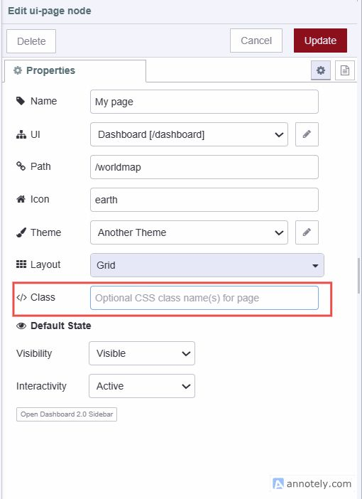
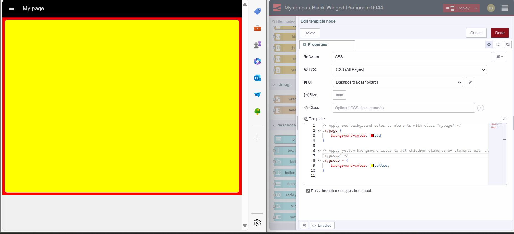

| [На головну](../) | [Розділ](README.md) |
| ----------------- | ------------------- |
|                   |                     |

# Робота з класами

[Джерело](https://flowfuse.com/blog/2024/05/node-red-dashboard-2-layout-navigation-styling/#customising-your-dashboard-2.0-further)

In Dashboard 2.0, we can add classes to almost all widgets, pages, and groups and style them using CSS.

### Додавання класів

1. Щоб додати класи до свого віджета, сторінки або групи, вам потрібно буде відкрити його конфігурацію
2. Знайдіть поле «Клас» і введіть назву класу

### Написання власного CSS

У Dashboard 2.0 вузол `ui-template` дозволяє писати власний CSS для Dashboard 2.0.

У вузлі шаблону ви можете додати CSS для двох різних областей:

- **Single Page:** Вибравши цей параметр, ви зможете вказати CSS, який буде обмежено однією сторінкою вашої інформаційної панелі.
- **All Pages:** Вибравши цей параметр, ви зможете визначити CSS, який застосовуватиметься до всієї вашої інформаційної панелі.

Щоб визначити власний CSS:

1. Перетягніть віджет `ui-template` на полотно.
2. Двічі клацніть на ньому та виберіть область у полі type.
3. Якщо ви виберете тип "CSS (Single Page)", вам потрібно буде вибрати `ui-page`, до якої застосовуватимуться ваші власні визначення класу. Якщо ви виберете тип «CSS (All Pages:)», вам потрібно буде вибрати `ui-base`, що включає ті сторінки, до яких ви хочете додати стилі.
4. Тепер ви можете написати свій власний CSS у шаблоні інтерфейсу.

