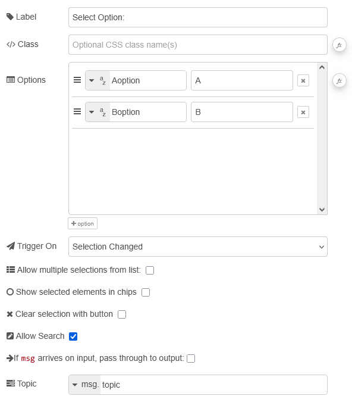
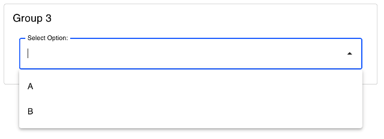
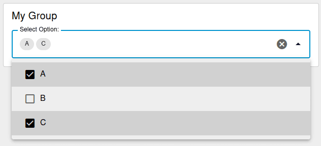

| [На головну](../) | [Розділ](README.md) |
| ----------------- | ------------------- |
|                   |                     |

# Dropdown `ui-dropdown`

https://dashboard.flowfuse.com/nodes/widgets/ui-dropdown

Додає випадаючий список (dropdown) на Dashboard, який щоразу при зміні значення передає вибране значення в Node-RED у `msg.payload`.

- `Label` (динамічна) - Текст, що відображається ліворуч від випадаючого списку. Дозволено HTML-вміст.

- `Options` (динамічна) - Список доступних опцій у випадаючому списку. Кожен рядок задає властивості 'label' (показується у списку) та `value` (передається при виборі).

- `Allow Multiple` (динамічна) - Чи може користувач вибирати кілька опцій. Якщо так, показуються чекбокси, а значення передається як масив.

- `Chips` - Показувати вибрані елементи у вигляді чипів.

- `Clearable` - Дозволяє очистити вибір кнопкою.

- `Allow Search`  - Дозволяє користувачу вводити текст для фільтрації списку можливих значень.

- `Msg trigger` - Визначає, коли потрібно надсилати вихідне повідомлення: при кожній зміні або коли випадаючий список закрито.

Ви можете динамічно встановлювати вибір у цьому випадаючому списку, передаючи відповідне значення в `msg.payload`.

- Одиночний вибір. Щоб встановити одиночний вибір, передайте значення опції як `msg.payload`, наприклад `msg.payload = "option1"`.

- Множинний вибір. Щоб встановити множинний вибір, спочатку потрібно увімкнути параметр `Allow Multiple` у вузлі. Після цього можна передати масив значень відповідних опцій у `msg.payload`, наприклад `msg.payload = ["option1", "option2"]`.
- Очищення вибору. Щоб очистити будь-який вибір у випадаючому списку, передайте порожній масив `msg.payload = []` .

Динамічні властивості – це властивості, які можуть бути перевизначені під час виконання шляхом надсилання відповідного msg до вузла. За потреби значення, задані в конфігурації Node-RED, будуть замінені значеннями з отриманих повідомлень.

| Prop           | Payload                    | Structures                                                   | Example Values |
| -------------- | -------------------------- | ------------------------------------------------------------ | -------------- |
| Label          | `msg.ui_update.label`      | `String`                                                     |                |
| Options        | `msg.ui_update.options`    | `Array<String>``Array<{value: String}>``Array<{value: String, label: String}>` |                |
| Allow Multiple | `msg.ui_update.multiple`   | `Boolean`                                                    |                |
| Class          | `msg.ui_update.class`      | `String`                                                     |                |
| Msg trigger    | `msg.ui_update.msgTrigger` | `String`                                                     |                |

Приклади:

