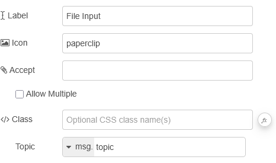
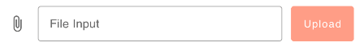
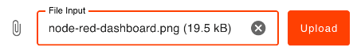

| [На головну](../) | [Розділ](README.md) |
| ----------------- | ------------------- |
|                   |                     |

# File Upload `ui-file-input` 

https://dashboard.flowfuse.com/nodes/widgets/ui-file-input

Віджет File Upload дозволяє користувачам завантажувати файли до Node-RED. Віджет можна налаштувати на приймання певних типів файлів і дозволити завантаження кількох файлів одночасно.



- `Label` - Текст, що відображається користувачеві і пояснює, які файли потрібно завантажити.

- `Icon` - Іконка зліва від поля введення. За замовчуванням використовується `paperclip`. Повний список доступних іконок наведено у відповідній документації.

- `Accept` - Рядкове представлення селекторів дозволених типів файлів. Повний перелік можливих значень наведено у документації.

- `Multiple` - Дозволяє кінцевим користувачам завантажувати кілька файлів одночасно. Кожен файл буде надіслано як окреме повідомлення.

Формат виходу:

```js
{
    payload: <Buffer>,
    file: {
        name: <String>,
        type: <String>,
        size: <Number>
    },
    topic: <String>,
}
```

Поточні обмеження. Наразі віджет File Upload обмежений максимальним розміром файлу, який визначається WebSocket-з’єднанням. Типове максимальне значення становить 5 МБ. Його можна збільшити, змінивши властивість `maxHttpBufferSize` у файлі `settings.js` в каталозі встановлення Node-RED:

```js
dashboard: {
    maxHttpBufferSize: 1e8 // розмір у байтах, приклад: 100 МБ
}
```

Планується у майбутньому покращення цієї поведінки шляхом розбиття файлів на менші частини з подальшим збиранням на стороні сервера. Це дозволить завантажувати файли більшого розміру і буде реалізовано в одному з майбутніх релізів.

Приклади



