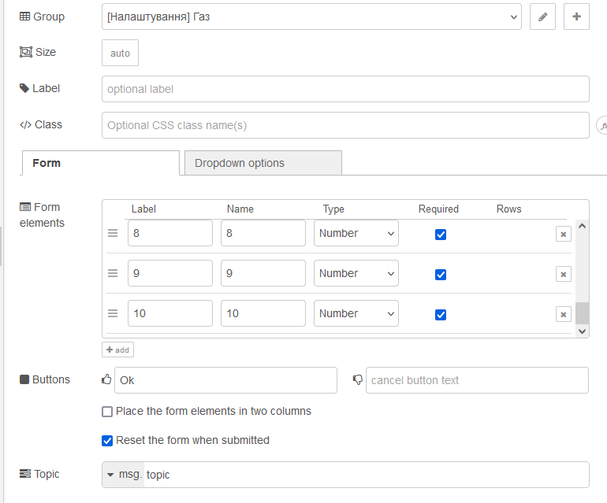
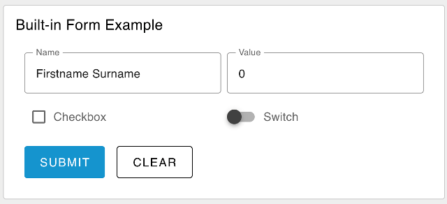

| [На головну](../) | [Розділ](README.md) |
| ----------------- | ------------------- |
|                   |                     |

# Форма `ui-form` 

https://dashboard.flowfuse.com/nodes/widgets/ui-form.html

[Спробувати демо](https://dashboard-demos.flowfuse.cloud/dashboard/form)

Додає форму до інтерфейсу користувача, яка допомагає збирати кілька значень від користувача після натискання кнопки надсилання як об’єкт у `msg.payload`.



| Prop             | Dynamic | Description                                                  |
| ---------------- | ------- | ------------------------------------------------------------ |
| Group            |         | Визначає, у якій групі UI Dashboard буде відображено цей віджет. |
| Size             |         | Керує шириною віджета відносно батьківської групи. Максимальне значення дорівнює ширині групи. |
| Label            | ✓       | Підпис, що відображається перед рядками форми.               |
| Options          | ✓       | `Label`: підпис, що відображається у рядку форми. <br />`Name`: ім’я елемента форми, яке буде використано як ключ в об’єкті msg.payload. <br />`Type`: тип поля введення. Можливі варіанти – `text / multiline / password / email / number / checkbox / switch / date / time`. <br />`Required`: визначає, чи є поле обов’язковим для заповнення перед надсиланням форми.. |
| Buttons          |         | Текст, що відображається на кнопках форми. Якщо текст для кнопки "cancel" залишити порожнім, кнопка скасування не буде показана. |
| Two Columns      |         | Відображає форму у двоколонковому макеті.                    |
| Reset on Submit  |         | Якщо увімкнено, форма буде очищена після надсилання.         |
| Topic            |         | Визначає спосіб формування topic, який включається в об’єкт `msg` під час надсилання форми. |
| Dropdown Options | ✓       | Цей список дозволяє визначити опції для кількох полів типу dropdown/select в одній формі. |

Динамічні властивості – це властивості, які можна змінити під час виконання, надіславши певне `msg` до вузла. У відповідних випадках основні значення, встановлені в Node-RED, будуть замінені значеннями, встановленими в отриманих повідомленнях.

| Prop             | Payload                         | Structures                                                   | Example Values |
| ---------------- | ------------------------------- | ------------------------------------------------------------ | -------------- |
| Label            | `msg.ui_update.label`           | `String`                                                     |                |
| Options          | `msg.ui_update.options`         | `Array<Object>`                                              |                |
| Dropdown Options | `msg.ui_update.dropdownOptions` | `Array<{ dropdown: <string>, key: <string>, label: <string> }>` |                |
| Class            | `msg.class`                     | `String`                                                     |                |

Якщо ви хочете встановити значення за замовчуванням або попередньо заповнити форму, ви можете зробити це, передавши значення `msg.payload`. Це значення має бути об’єктом, де кожен ключ представляє «ключ» елемента форми, а значення представляє значення за замовчуванням для цього елемента. Наприклад, якщо ви хочете попередньо заповнити форму полем `text` з іменем «first_name», ви можете передати такbq `msg`:

```js
msg.payload = {
    "first_name": "John"
}
```

Якщо ви хочете переозначити конфігурацію своєї `ui-form` і надати деталі своїх елементів після розгортання потоку Node-RED, ви можете зробити це, передавши значення `msg.ui_update.options`. Це значення має бути масивом об’єктів, де кожен об’єкт представляє елемент форми. Кожен об'єкт повинен мати такі властивості:

Element: Text 

```json
{
    "type": "text",
    "label": "Name",
    "key": "name",
    "required": true
}
```

Element: Multiline 

```json
{
    "type": "multiline",
    "label": "Name",
    "key": "name",
    "required": true,
    "rows": 4
}
```

Element: Password 

```json
{
    "type": "password",
    "label": "Password",
    "key": "password",
    "required": true
}
```

Element: Email 

```json
{
    "type": "email",
    "label": "E-Mail Address",
    "key": "email",
    "required": true
}
```

Element: Number 

```json
{
    "type": "number",
    "label": "Age",
    "key": "age",
    "required": true
}
```

Element: Checkbox 

```json
{
    "type": "checkbox",
    "label": "Subscribe to Newsletter",
    "key": "newsletter"
}
```

Element: Switch 

```json
{
    "type": "switch",
    "label": "Enable Notifications",
    "key": "notifications"
}
```

Element: Date 

```json
{
    "type": "date",
    "label": "Date of Birth",
    "key": "dob",
    "required": true
}
```

Element: Time 

```json
{
    "type": "time",
    "label": "Time of Birth",
    "key": "tob",
    "required": true
}
```

Element: Dropdown 

```json
{
    "type": "dropdown",
    "label": "Dropdown",
    "key": "selection"
}
```

Якщо ви хочете переозначити конфігурацію для своєї `ui-form` і надати деталі параметрів спадного меню після розгортання потоку Node-RED, ви можете зробити це, передавши значення `msg.ui_update.dropdownOptions`. Це значення має бути масивом об’єктів, де кожен об’єкт представляє спадний елемент. Кожен об'єкт повинен мати такі властивості:

```json
[{
    "dropdown": "Dropdown Name",
    "value": "1",
    "label": "Option 1"
}]
```

Приклад 



