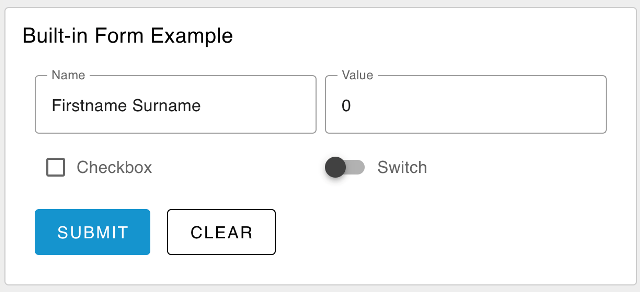

| [На головну](../) | [Розділ](README.md) |
| ----------------- | ------------------- |
|                   |                     |

# Форма `ui-form` 

https://dashboard.flowfuse.com/nodes/widgets/ui-form.html

[Спробувати демо](https://dashboard-demos.flowfuse.cloud/dashboard/form)

Додає форму до інтерфейсу користувача, яка допомагає збирати кілька значень від користувача після натискання кнопки надсилання як об’єкт у `msg.payload`.


## Властивості

| Prop             | Dynamic | Description                                                  |
| ---------------- | ------- | ------------------------------------------------------------ |
| Group            |         | Defines which group of the UI Dashboard this widget will render in. |
| Size             |         | Controls the width of the button with respect to the parent group. Maximum value is the width of the group. |
| Label            | ✓       | A label shown before the form rows.                          |
| Options          | ✓       | A list of the rows presented in the form. Each row has the following properties:     Label: A label shown in the form row.    Name: The name of the form element, which will be used as the key in the `msg.payload` object.    Type: The type of input to display. Options - `text | multiline | password | email | number | checkbox | switch | date | time`    Required: Whether the form element is required to be filled in before the form can be submitted. |
| Buttons          |         | The text shown on each of the form's buttons. If "cancel" text is left empty, then no cancel button will be shown. |
| Two Columns      |         | Will render the form as a two-column layout.                 |
| Reset on Submit  |         | If checked, the form will be reset to an empty state after the form is submitted. |
| Topic            |         | Defines how to compute the topic, included in the `msg` object, when the form is submitted. |
| Dropdown Options | ✓       | This list can define options for multiple dropdown/select field in a single form. |

## Динамічні властивості

Динамічні властивості – це властивості, які можна змінити під час виконання, надіславши певне `msg` до вузла.

У відповідних випадках основні значення, встановлені в Node-RED, будуть замінені значеннями, встановленими в отриманих повідомленнях.

| Prop             | Payload                         | Structures                                                   | Example Values |
| ---------------- | ------------------------------- | ------------------------------------------------------------ | -------------- |
| Label            | `msg.ui_update.label`           | `String`                                                     |                |
| Options          | `msg.ui_update.options`         | `Array<Object>`                                              |                |
| Dropdown Options | `msg.ui_update.dropdownOptions` | `Array<{ dropdown: <string>, key: <string>, label: <string> }>` |                |
| Class            | `msg.class`                     | `String`                                                     |                |

### Заповнення даними форми

Якщо ви хочете встановити значення за замовчуванням або попередньо заповнити форму, ви можете зробити це, передавши значення `msg.payload`. Це значення має бути об’єктом, де кожен ключ представляє «ключ» елемента форми, а значення представляє значення за замовчуванням для цього елемента.

Наприклад, якщо ви хочете попередньо заповнити форму полем `text` з іменем «first_name», ви можете передати такbq `msg`:

```js
msg.payload = {
    "first_name": "John"
}
```

### Означення елементів форми (параметри)

Якщо ви хочете переозначити конфігурацію своєї `ui-form` і надати деталі своїх елементів після розгортання потоку Node-RED, ви можете зробити це, передавши значення `msg.ui_update.options`. Це значення має бути масивом об’єктів, де кожен об’єкт представляє елемент форми. Кожен об'єкт повинен мати такі властивості:

#### Element: Text 

```json
{
    "type": "text",
    "label": "Name",
    "key": "name",
    "required": true
}
```

#### Element: Multiline 

```json
{
    "type": "multiline",
    "label": "Name",
    "key": "name",
    "required": true,
    "rows": 4
}
```

#### Element: Password 

```json
{
    "type": "password",
    "label": "Password",
    "key": "password",
    "required": true
}
```

#### Element: Email 

```json
{
    "type": "email",
    "label": "E-Mail Address",
    "key": "email",
    "required": true
}
```

#### Element: Number 

```json
{
    "type": "number",
    "label": "Age",
    "key": "age",
    "required": true
}
```

#### Element: Checkbox 

```json
{
    "type": "checkbox",
    "label": "Subscribe to Newsletter",
    "key": "newsletter"
}
```

#### Element: Switch 

```json
{
    "type": "switch",
    "label": "Enable Notifications",
    "key": "notifications"
}
```

#### Element: Date 

```json
{
    "type": "date",
    "label": "Date of Birth",
    "key": "dob",
    "required": true
}
```

#### Element: Time 

```json
{
    "type": "time",
    "label": "Time of Birth",
    "key": "tob",
    "required": true
}
```

#### Element: Dropdown 

```json
{
    "type": "dropdown",
    "label": "Dropdown",
    "key": "selection"
}
```

### Означення параметрів спадного списку

Якщо ви хочете переозначити конфігурацію для своєї `ui-form` і надати деталі параметрів спадного меню після розгортання потоку Node-RED, ви можете зробити це, передавши значення `msg.ui_update.dropdownOptions`. Це значення має бути масивом об’єктів, де кожен об’єкт представляє спадний елемент. Кожен об'єкт повинен мати такі властивості:

```json
[{
    "dropdown": "Dropdown Name",
    "value": "1",
    "label": "Option 1"
}]
```

## Приклад 



