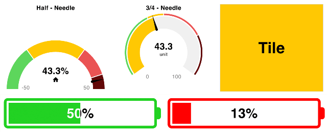
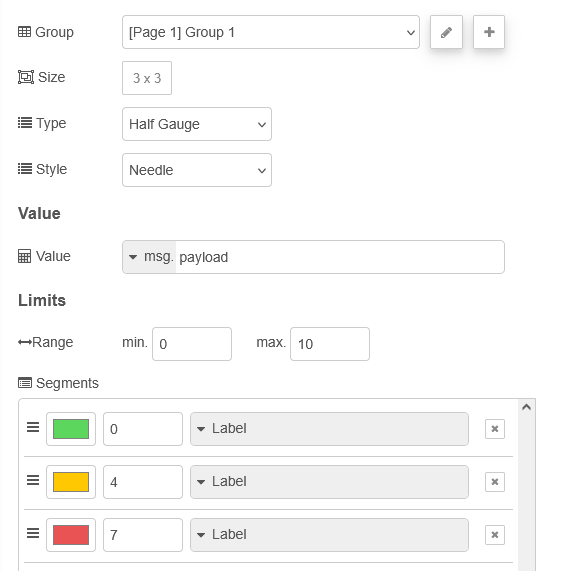
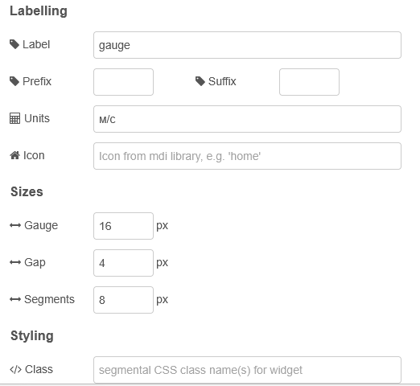

| [На головну](../) | [Розділ](README.md) |
| ----------------- | ------------------- |
|                   |                     |

# Gauge `ui-gauge`

https://dashboard.flowfuse.com/nodes/widgets/ui-gauge

## Загальні налаштування

Додає індикатор (Gauge) на Dashboard. Може бути налаштований з користувацькими типами (півколо, 3/4 кола), стилями (заокруглений, стрілка) та сегментацією. Нижче наведено приклади.



рис.1. Знімок екрана з усіма типами індикаторів.

Значення для індикатора задається шляхом надсилання числового значення в `msg.payload`. Після цього індикатор оновлюється відповідно до цього значення.



рис.2. Налаштування властивостей `ui-gauge`

- `Group` - Визначає, у якій групі UI Dashboard буде відображено цей віджет.
- `Size` - Керує шириною віджета відносно батьківської групи. Максимальне значення дорівнює ширині групи.
- `Type` (динамічна) - Визначає форму індикатора: "Tile", "Battery", "Water Tank", "Half Gauge" або "3/4 Gauge".
- `Style` (динамічна) - Визначає стиль дуги: `Needle` або `Rounded`. Застосовується лише для індикаторів 3/4 та `Half`.
- `Value` (динамічна) - Значення, яке відображається на індикаторі. Це може бути властивість повідомлення, наприклад `msg.payload` або `msg.myProperty`, змінна контексту `flow/global` або статичне значення. Також можна використати тип `JSONata` для обчислення значення, наприклад `$round(payload, 1)` для округлення до 1 знака після коми.
- `Range (min)` (динамічна) - Мінімальне значення, яке може бути показане.
- `Range (max)` (динамічна) - Максимальне значення, яке може бути показане.
- `Segments` (динамічна) - Визначає пороги, за якими дуга індикатора розфарбовується. Сегменти також можуть відображатися на самому індикаторі.
- `Label (динамічна)` - Текст над індикатором, який пояснює, що саме показується.
- `Always Show Label` - (лише для Tile) Якщо true, підпис відображається постійно.
- `Floating Label Position` - (лише для Tile) Положення підпису всередині плитки: "top-left", "top-right", "bottom-left" або "bottom-right".
- `Prefix` (динамічна) - Текст, який додається перед значенням у центрі індикатора (лише для 3/4 та Half).
- `Suffix` (динамічна) - Текст після значення у центрі індикатора (лише для 3/4 та Half).
- `Units` (динамічна) - Невеликий текст під значенням у центрі індикатора (лише для 3/4 та Half).
- `Icon` (динамічна) - Іконка під значенням у центрі індикатора. Використовуються іконки Material Design, префікс mdi- вказувати не потрібно (лише для 3/4 та Half).
- `Sizes (Gauge)` - (пікселі) Товщина дуги та фону індикатора.
- `Sizes (Gap)` - (пікселі) Розмір зазору між індикатором і сегментами.
- `Sizes (Segments)` - (пікселі) Товщина сегментів.

## Динамічні властивості

Динамічні властивості можуть бути переозначені під час виконання шляхом надсилання відповідного `msg` до вузла. За наявності значення, задані в Node-RED, будуть замінені значеннями з отриманого повідомлення.

| Prop     | Payload                  | Structures                             | Приклад Values                                               |
| -------- | ------------------------ | -------------------------------------- | ------------------------------------------------------------ |
| Label    | `msg.ui_update.label`    | `String`                               |                                                              |
| Icon     | `msg.ui_update.icon`     | `String`                               |                                                              |
| Type     | `msg.ui_update.gtype`    | `String`                               | `gauge-tile`|`gauge-battery`|`gauge-tank`|`gauge-half`|`gauge-34` |
| Style    | `msg.ui_update.gstyle`   | `String`                               |                                                              |
| Min      | `msg.ui_update.min`      | `Number`                               |                                                              |
| Max      | `msg.ui_update.max`      | `Number`                               |                                                              |
| Segments | `msg.ui_update.segments` | `Array<{color: String, from: Number}>` |                                                              |
| Prefix   | `msg.ui_update.prefix`   | `String`                               |                                                              |
| Suffix   | `msg.ui_update.suffix`   | `String`                               |                                                              |
| Units    | `msg.ui_update.units`    | `String`                               |                                                              |

`msg.enabled`: `true | false` - Дозволяє керувати тим, чи активне числове введення.

## Форматування значення

Якщо потрібно відформатувати значення перед відображенням, використовуйте властивість `Value`. Наприклад, щоб округлити значення до 1 знака після коми, встановіть тип Value як `JSONata` і використайте:

```
$round(payload, 1)
```

