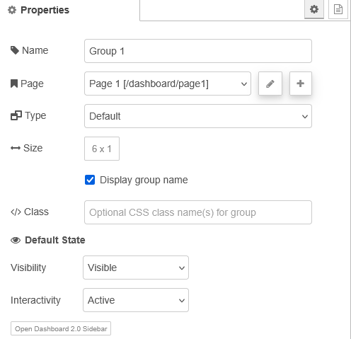

| [На головну](../) | [Розділ](README.md) |
| ----------------- | ------------------- |
|                   |                     |

# Config: UI Group `ui-group`

https://dashboard.flowfuse.com/nodes/config/ui-group

Кожна група відображається всередині `ui-page` як частина певного Layout. Конкретний макет визначає, як саме ці групи рендеряться, але в основі група є колекцією віджетів і зазвичай має мітку (label) для категоризації вмісту однієї групи.

рис.1.

| Prop          | Description                                                  |
| ------------- | ------------------------------------------------------------ |
| Name          | Описова назва групи. Відображається в редакторі Node-RED і як мітка групи в Dashboard. |
| Page          | Сторінка (ui-page), на якій буде відображатися ця група.     |
| Type          | Визначає, чи відображається група як звичайна група або як діалог, який потрібно відкривати вручну за допомогою ui-control. Доступні типи: Default і Dialog. |
| Size          | Ширина та висота групи. Значення висоти завжди враховується. Зазвичай це мінімальна висота, яка може збільшуватися відповідно до вмісту. |
| Class         | Користувацькі CSS-класи, які потрібно додати до групи.       |
| Default State | Початковий стан групи.                                       |

`Default State` включає:

- `Visibility` – визначає початкову видимість цієї групи.
- `Interactivity` – керує тим, чи група та її вміст є активними або вимкненими під час завантаження сторінки.

Обидва ці параметри можуть бути перевизначені під час виконання за допомогою вузла ui-control.

`Type` - Визначає спосіб відображення групи: як звичайної (`Default`) або як діалогової (`Dialog`). Група типу `Default` є видимою за замовчуванням, тоді як група типу `Dialog` повинна відкриватися вручну за допомогою вузла [ui-control](uictrl.md). Вибір між цими варіантами залежить від потреб макета.

рис.2. Приклад вигляду групи з типом Default.

рис.3. Приклад вигляду групи з типом Dialog.