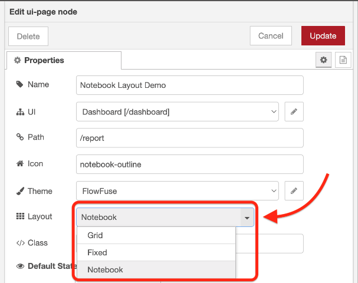
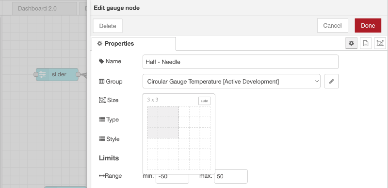
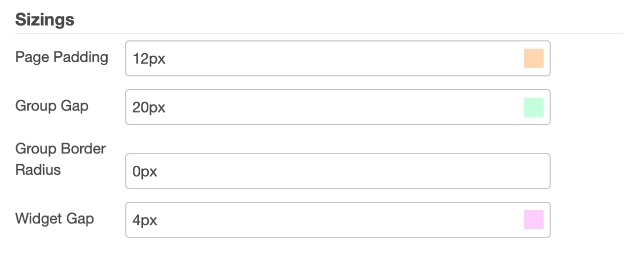
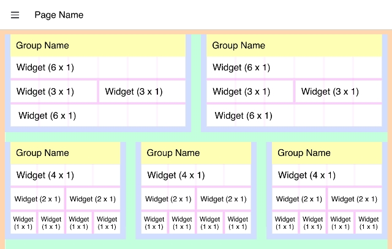
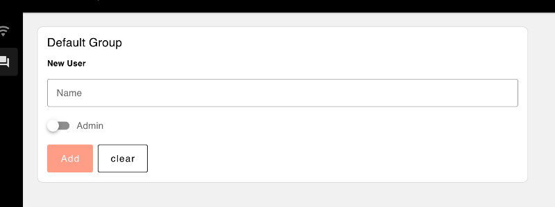
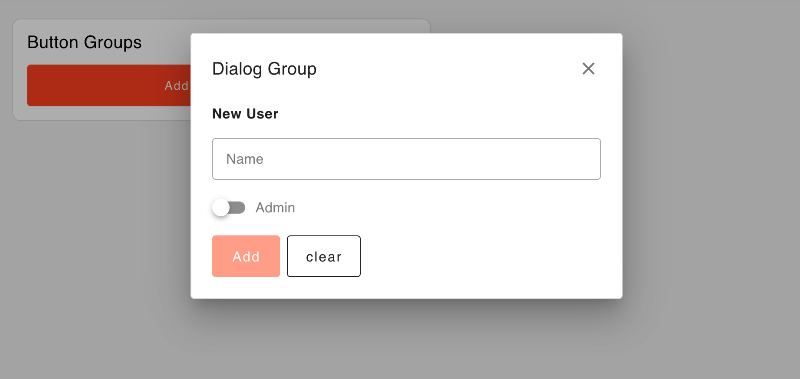

| [На головну](../) | [Розділ](README.md) |
| ----------------- | ------------------- |
|                   |                     |

# Макети (Layouts)

https://dashboard.flowfuse.com/layouts/ 

Макети – це конфігурація, доступна на основі сторінки за сторінкою. Вони контролюють, як усі Групи віджетів розташовані на даній Сторінці:

Зараз ми пропонуємо чотири різні варіанти компонування:

- [Grid](https://dashboard.flowfuse.com/layouts/types/grid.html)
- [Fixed](https://dashboard.flowfuse.com/layouts/types/fixed.html)
- [Notebook](https://dashboard.flowfuse.com/layouts/types/notebook.html)
- [Tabs](https://dashboard.flowfuse.com/layouts/types/tabs.html)

## Розмір груп і віджетів

Фундаментальним компонентом побудови макетів у Dashboard 2.0 (який дотримується принципу Dashboard 1.0) є можливість контролювати розмір кожної групи та віджета за допомогою віджета вибору розміру:

Конкретне значення цього розміру дещо відрізняється залежно від макета, який ви використовуєте, але загальний принцип полягає в тому, що розмір групи або віджета визначає, скільки місця вони займають у макеті.

Основні відмінності полягають у властивості «ширина» розміру:

- Для «Grid» та «Notebook» ширина обчислюється як частина 12 *стовпців*, тобто ширина «6» займе половину ширини макета.
- Для «Fixed» ширина обчислюється як кратне 90 *пікселів*, тобто ширина «3» займе 270 пікселів екрана.

## Точки переривання

У більшості макетів на інформаційній панелі використовується концепція «Columns», за якою ширина групи визначається як кількість стовпців, напр. 6, а потім сторінка також відображає певну кількість стовпців, наприклад. 12. Це означає, що група з шириною 6 займе половину ширини сторінки.

Точки переривання  [можна налаштувати](https://dashboard.flowfuse.com/nodes/config/ui-page.html#breakpoints) для кожної сторінки, контролюючи кількість стовпців, які відображаються на різних розмірах екрана. Це особливо корисно для адаптивного дизайну, що дозволяє контролювати кількість стовпців, які відображаються на мобільному пристрої, планшеті чи комп’ютері.

## Параметри теми

На додаток до основної структури макета, яка визначає, як упорядковано та розміщено групи, також можна керувати деякими інтервалами в макеті за допомогою сторінки  [Theme](https://dashboard.flowfuse.com/nodes/config/ui-theme.html).

### Конфігуровані параметри

Кожен колір тут відповідає відповідному розділу на наступному зображенні:

*Screenshot of the theme options available to control sizings of the layout, here showing a "Grid" layout*

- **Page Padding:** The spacing that encapsulates the full page's content, depicted above as the orange space.
- **Group Gap:** The spacing between each group, depicted above as the green space.
- **Widget Gap:** The spacing between each widget, within a group, depicted above as the pink space.

Додаткова опція, доступна для кожної групи, полягає в тому, чи показувати назву групи, зображену вище жовтим пробілом. Якщо це приховано, заповнення групи (синє) відображатиметься з усіх чотирьох сторін групи.

### Not Configurable (Currently) 

Whilst we do offer reasonable levels of customization, there are some areas not currently configurable:

- **Row Height:** A single unit of height is currently fixed at 48px. This cannot be  changed at this time. This also affects the "Fixed" layout, where a  single unit of width is driven by this value.
- **Group Padding:** The spacing that encapsulates the full group's content, depicted above as the blue space.

# Config: UI Group `ui-group` 

Each group is rendered within a `ui-page` as part of a [Layout](https://dashboard.flowfuse.com/contributing/guides/layouts.html). Each layout will differ in how those groups are rendered, but  fundamentally, a group is a collection of widgets, and generally has a  label to categorise the contents of a single group.

## Properties 

| Prop          | Description                                                  |
| ------------- | ------------------------------------------------------------ |
| Name          | Descriptive name for this group, will show in the Node-RED Editor and as a label in the Dashboard. |
| Page          | The Page (`ui-page`) that this group will render on.         |
| Type          | Керує, чи буде група відображатися як група за замовчуванням чи як діалогове вікно, яке потрібно запускати вручну за допомогою ui-control. Ви можете вибрати між типами «Default» і «Dialog». |
| Size          | The width and height of the group. Height will always be reinforced by this value, the height is generally a *minimum* height, and will extend to fit it's content. |
| Class         | Any custom CSS classes you wish to add to the Group.         |
| Default State | **Visibility** - Defines the default visibility of this group.**Interactivity** - Controls whether the group and it's contents are disabled/enabled when the page is loaded.Both of these can be overridden by the user at runtime using a `ui-control` node. |

## Type 

Визначає спосіб відображення групи. Або як звичайну (**Default**) групу, або як групу **Dialog**. Група «Default» відображається за замовчуванням, тоді як групу «Dialog» потрібно запускати вручну за допомогою вузла «ui-control» ([див. документацію](https://dashboard.flowfuse.com/nodes/widgets/ui-control.html#show-hide)). Ви можете вибрати між цими двома варіантами залежно від ваших потреб у макеті.

### Default Groups 

*Example of how the type 'Default' option looks*

### Dialog Groups 

*Example of how the type 'Dialog' option looks*

