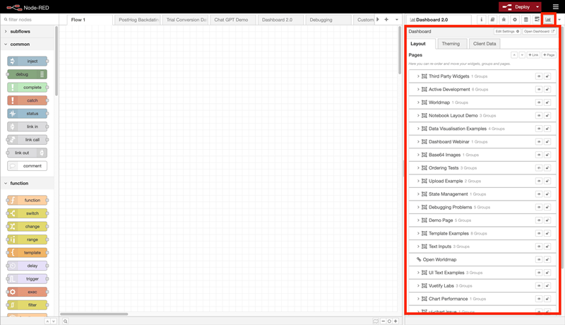
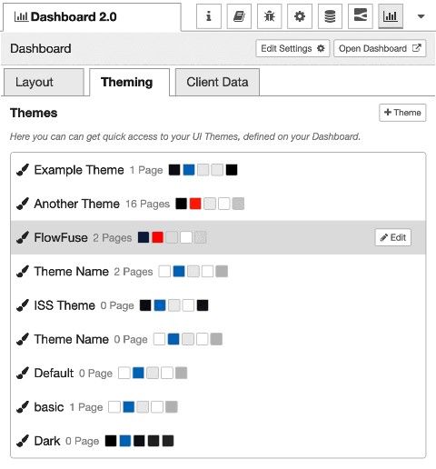
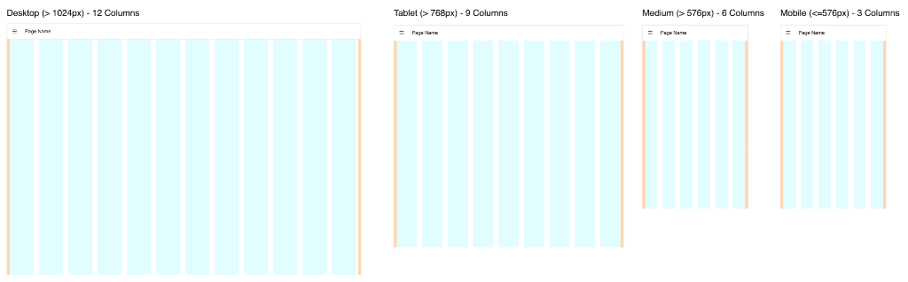
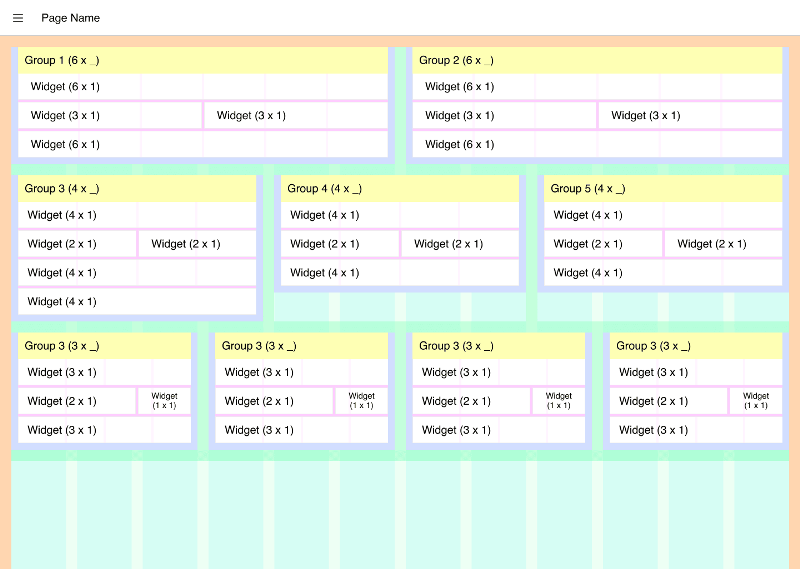
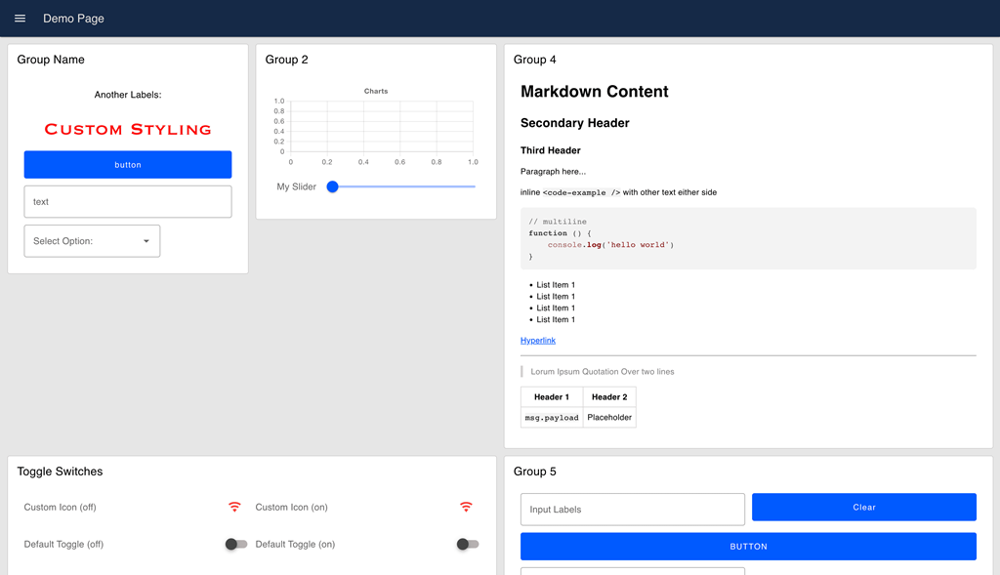
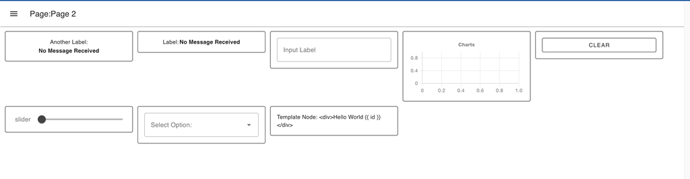
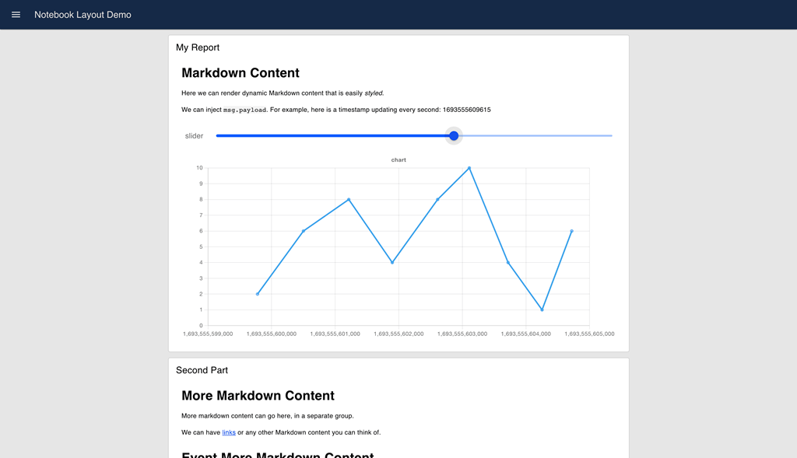
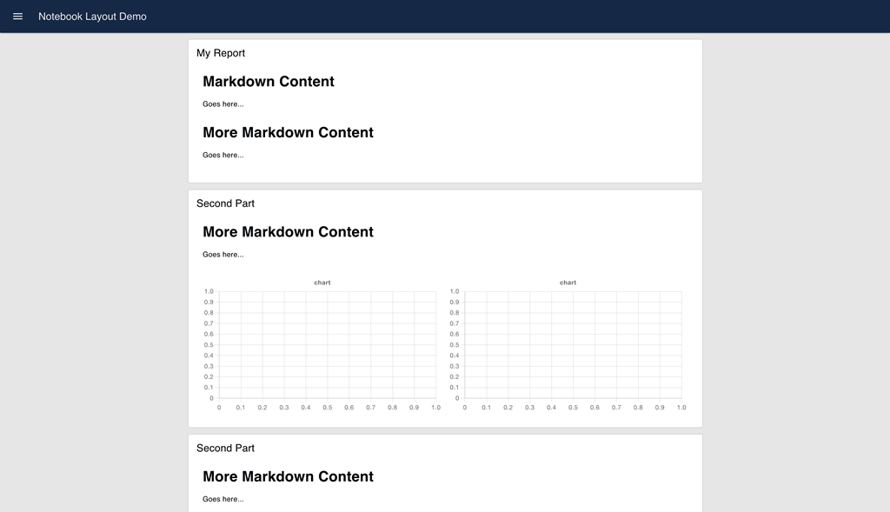
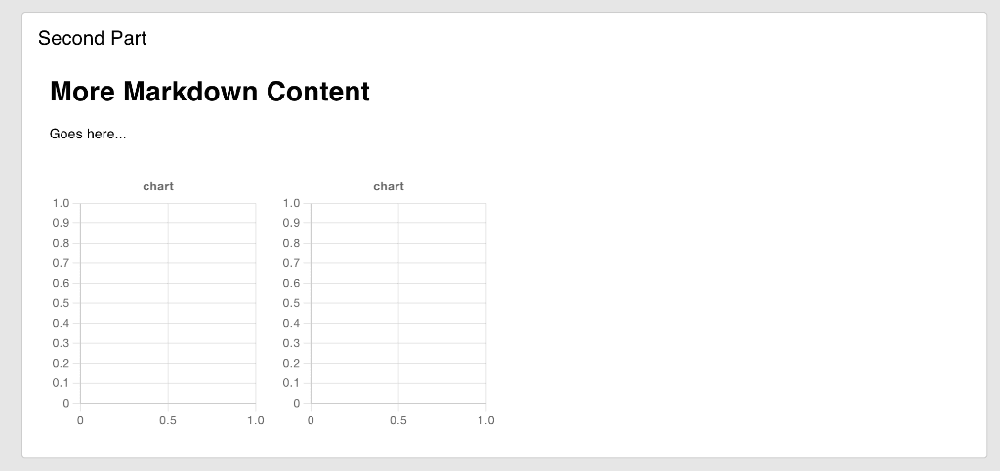
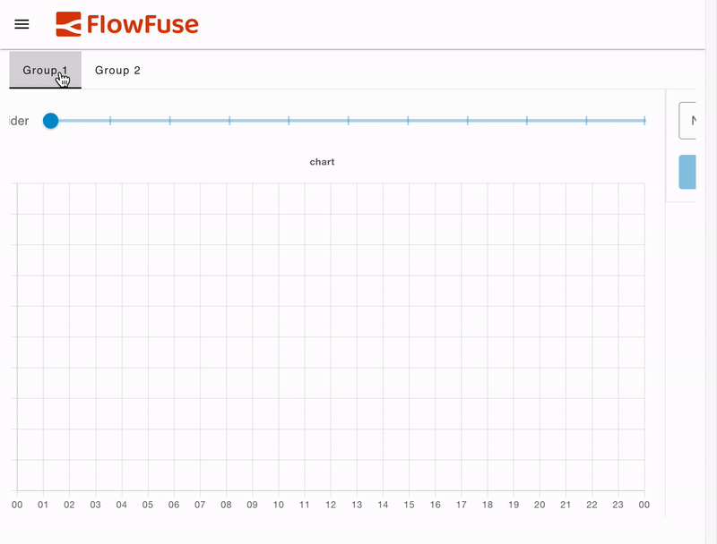

| [На головну](../) | [Розділ](README.md) |
| ----------------- | ------------------- |
|                   |                     |

# Макетування (Layouts) та бічна панель

## Загальні підходи

Кожна інформаційна панель (Dashboard) — це набір віджетів (наприклад, діаграм, кнопок, форм), які можна налаштувати та впорядкувати в нашому власному інтерфейсі користувача. Ієрархія інформаційної панелі така:

- `Base` – означує базову URL-адресу (наприклад, `/dashboard`) для вашої інформаційної панелі.
- `Page` – дана сторінка, на яку може перейти відвідувач, URL-адреса розширить базу, напр. `/dashboard/page1`. Кожна сторінка також може мати означену унікальну тему, яка керує стилем усіх груп/віджетів на сторінці.
- `Group` - колекція віджетів. Відображено на сторінці.
- `Widget` – один віджет (наприклад, діаграма, кнопка, форма), створений на інформаційній панелі.

Dashboard 2.0 додає до редактора Node-RED відповідну бічну панель «Dashboard 2.0». Ця бічна панель надає інтерфейс, за допомогою якого можна переглядати сторінки, теми, групи та віджети. Звідси можна додавати нові сторінки та групи, змінювати існуючі налаштування та змінювати порядок вмісту.

рис.1. Знімок екрана, на якому показано бічну панель Dashboard 2.0 у редакторі Node-RED.

Параметри макета в інтерфейсі користувача Dashboard 2.0 керуються двома основними налаштуваннями:

- `Page Layout:` контролює, як `ui-groups` представлені на певній сторінці у застсоунку.
- `Navigation Sidebar:` означує стиль навігації ліворуч, означений на рівні `ui-base`.

рис.2. Приклад "клітинного" макета сторінки (Grid) з навігацією бічної панелі типу "Collapsing".

## Бічна панель

https://dashboard.flowfuse.com/user/sidebar

Як вже зазначалося, вкладка Dashboard 2.0 додається до бічної панелі Node-RED. Вона призначена для швидкого огляду поточного стану Dashboard і підтримки загальної конфігурації Dashboard. Доступні наступні вкладки бічної панелі

- `Layout` - Надає огляд усіх сторінок, посилань, груп і віджетів, налаштованих для відповідного Dashboard. Звідси можна змінювати порядок, перегруповувати та редагувати будь-які з цих елементів. Також доступні швидкі дії `+ Link`, `+ Page` і `+ Group` для швидкого додавання нових структурних елементів у Dashboard.

- `Theming` - Кожна сторінка Dashboard може мати власну тему. Ця вкладка надає огляд усіх тем, визначених у Dashboard, і дозволяє редагувати наявні або створювати нові теми. На рис.3 для кожної теми показано, скільки сторінок наразі її використовують, а також попередній перегляд палітри кольорів, що допомагає відрізняти теми між собою.
- `Client Data` - Dashboard 2.0 може додавати до кожного `msg`, який генерує вузол, дані про користувача або клієнта, що взаємодіє з Dashboard.  (рис.4.). Детальніше про це написано в [Патерни проєктування](patterns.md)

рис.3.  Знімок екрана вкладки `Theming`, що показує набір тем, визначених для конкретного Dashboard.

рис.4. Знімок екрана прикладу вкладки `Client Data`.

## Сторінка за замовчуванням

Кожна сторінка в Dashboard 2.0 має унікальну URL-адресу. Якщо користувач переходить до нерозпізнаного шляху під шляхом `/dashboard/`, то для повернення використовується сторінка за замовчуванням. Зараз у Dashboard 2.0 сторінка за замовчуванням вибирається як сторінка, яка стоїть першою в списку сторінок на бічній панелі навігації:

рис.5. Знімок екрана зі списком сторінок на бічній панелі Dashboard 2.0

У цьому прикладі сторінка `Third Part Widgets` є сторінкою за замовчуванням.

## Параметри макета (Layout)

Макети – це конфігурація, доступна на основі сторінки за сторінкою. Вони контролюють, як усі Групи віджетів розташовані на даній Сторінці:

рис.6. 

Наразі є чотири різні варіанти макета сторінки:

- Grid: Макет сторінки за умовчанням. Він використовує структуру сітки з 12 стовпців для розміщення груп. Ширина кожної групи або віджета визначає кількість стовпців, у яких вони відтворюватимуться. Таким чином, «ширина» 6 дюймів відтворюватиме 50% екрана. Макети сітки повністю реагують і адаптуються до розміру екрана. .
- Fixed: Кожен компонент відтворюватиметься з фіксованою шириною, незалежно від розміру екрана. Властивість «width» перетворюється на фіксоване значення пікселів (за замовчуванням кратне 48 пікселів).
- Notebook: Цей макет розтягнеться до 100% ширини, до максимальної ширини 1024 пікселів, і буде вирівняти по центру. Це особливо корисно для розповіді історій (наприклад, статей/блогів) або користувальницьких інтерфейсів типу аналізу (наприклад, Jupyter Notebooks), де ви хочете, щоб користувач переглядав вміст у певному порядку за допомогою прокручування.
- Tabs 

### Точки переривання (breakpoints)

У більшості макетів на інформаційній панелі використовується концепція «Columns», за якою ширина групи визначається як кількість стовпців, напр. 6, а потім сторінка також відображає певну кількість стовпців, наприклад. 12. Це означає, що група з шириною 6 займе половину ширини сторінки.

Точки переривання [можна налаштувати](page.md) для кожної сторінки, контролюючи кількість стовпців, які відображаються на різних розмірах екрана. Це особливо корисно для адаптивного дизайну, що дозволяє контролювати кількість стовпців, які відображаються на мобільному пристрої, планшеті чи комп’ютері.

### Макет Grid

https://dashboard.flowfuse.com/layouts/types/grid.html

Аналогічно до Grid System у Bootstrap, цей макет надає 12 колонок (за замовчуванням), у межах яких масштабується вміст. Реалізація побудована на CSS Grid layout. Ширина кожної групи відповідає кількості колонок, які вона займає в загальній сітці сторінки. Наприклад, група з шириною 12 займає всю ширину екрана, незалежно від зміни розміру екрана. Макет автоматично переносить віджети на наступний рядок, якщо вони не поміщаються в поточному. Висота кожного рядка визначається найвищим віджетом у цьому рядку.

Залежно від розміру екрана, кількість колонок, що відображаються, може змінюватися. Нижче наведені приклади кількості колонок для різних breakpoints.

рис.7. Напрямні, що демонструють колонки у макеті Grid для різних розмірів екрана

Точні значення breakpoints можна налаштувати в параметрах сторінки.

Групи займають ширину відповідно до заданого значення, після чого всередині кожної групи формується власна внутрішня сітка. Кількість колонок у цій внутрішній сітці дорівнює ширині групи. Групи можуть мати власні внутрішні відступи та параметри, які налаштовуються окремо.

Напрямні, що демонструють колонки у макеті Grid

рис.8. Напрямні, що демонструють колонки у макеті Grid для різних розмірів екрана

Керування порожнім простором у Grid layout може бути складним. На цей момент не використовується «розумний» masonry layout. Натомість застосовується стандартний CSS Grid Layout Module. Тому висота кожного рядка віджетів визначається найвищим віджетом у цьому рядку. Більшість віджетів суворо дотримуються заданих у конфігурації ширини та висоти. Однак деякі з них, наприклад ui-template або ui-markdown, можуть збільшуватися відповідно до свого вмісту, навіть якщо це означає перевищення заданої висоти.

Нижче наведено приклад відображення Grid layout у FlowFuse Dashboard.

рис.9. Приклад UI, зрендереного з використанням макета Grid

### Макет Fixed

https://dashboard.flowfuse.com/layouts/types/fixed.html

Примітка: цей макет усе ще потребує доопрацювання, щоб стати більш гнучким і практичним, тому наразі рекомендується використовувати інший макет. Кожна «одиниця» має фіксовану ширину. Це був єдиний доступний макет у класичному Node-RED Dashboard.

Макет побудований на flexbox і складається з одного ряду віджетів. Ширина кожної групи задається у фіксованих пікселях і обчислюється як значення властивості width групи, помножене на 90 px (за замовчуванням висота рядка становить 45 px).

Самі групи дотримуються тієї ж логіки, що й в інших макетах: група з шириною «6» має 6 «колонок», а віджети масштабуються відповідно. Наприклад, віджет розміру «3 × 1» займатиме 50 % ширини групи.

Якщо віджети не поміщаються в межах поточної ширини екрана, вони автоматично переносяться на наступний рядок. Розмір елементів не змінюється залежно від ширини екрана, що часто призводить до великої кількості невикористаного простору. Висота кожного рядка визначається найвищим віджетом у цьому рядку.

рис.10. Приклад UI, зрендереного з використанням макета Fixed.

За ширини екрана менше ніж 576 px макет Fixed переходить у адаптивний режим для підтримки мобільних пристроїв. У цьому режимі він фактично перетворюється на Grid layout, де ширина кожної групи обчислюється як частка від 3 колонок, а не як фіксоване піксельне значення.

### Макет Notebook

https://dashboard.flowfuse.com/layouts/types/notebook.html

Цей макет імітує класичний Jupyter Notebook. Вміст розтягується на 100 % ширини екрана, але не більше ніж до 1024 px, і вирівнюється по центру.

Типовий сценарій використання такого макета – вставлення динамічного Markdown, таблиць даних і візуалізацій.

рис.11. Приклад UI, зрендереного з використанням макета Notebook.

Усередині Notebook властивість width підпорядковується тим самим принципам колонок, що й у Grid layout (див. відповідний розділ документації), але з повною шириною за замовчуванням, що дорівнює «6». Збільшуючи значення width групи, ви фактично збільшуєте кількість колонок, які представляє ця група, і в межах яких рендеряться віджети. Це дає змогу тонше керувати макетом UI, розміщувати більше віджетів поруч в одному рядку та покращувати адаптивність Dashboard.

За замовчуванням група має ширину «6» колонок, і весь Notebook також має ширину «6». У такій конфігурації два графіки можуть бути відображені поруч, якщо кожен із них має ширину «3» колонки.

рис.12. Приклад UI, зрендереного з використанням макета Notebook.

Тонкіше керування шириною всередині групи можна отримати, збільшивши її width. Сам Notebook не відобразить групу ширшою, але всередині групи буде використано 12 колонок. Тобто, якщо збільшити width групи до 12, то ті самі два графіки можна налаштувати так, щоб кожен займав лише половину ширини групи (по 3 колонки кожен).

рис.13. Приклад UI, зрендереного з використанням макета Notebook.

Залежно від розміру екрана, кількість колонок за замовчуванням може змінюватися. Нижче наведено приклади кількості колонок для різних breakpoints.

рис.14. Напрямні, що демонструють колонки у макеті Grid для різних розмірів екрана

Точні значення breakpoints можна налаштувати в параметрах сторінки.

Оскільки Notebook layout відображає групи на всю доступну ширину, кількість колонок усередині групи зазвичай визначається мінімальним значенням між кількістю колонок групи (width) і кількістю колонок сторінки. Наприклад, якщо група має 9 колонок, але breakpoint сторінки обмежує макет до 6 колонок, група буде відображена з 6 колонками. Якщо ж ширина групи дорівнює 6, а breakpoint сторінки визначає 12 колонок, група все одно буде відображатися з шириною 6 колонок.

### Макет Tabs 

https://dashboard.flowfuse.com/layouts/types/tabs.html

На відміну від макетів Fixed і Grid, де групи відображаються поруч, або Notebook, де вони розміщуються одна під одною, макет Tabs відображає кожну групу як окрему вкладку (Tab) у вкладковому представленні сторінки. Користувач може перемикатися між вкладками для перегляду різних груп.

рис.15. Приклад UI, зрендереного з використанням макета Tabs, де кожна група відображається як окрема вкладка.

Зауваження: наразі неможливо перейти на сторінку з уже відкритою конкретною вкладкою. Сторінка завжди відкривається з вибраною першою вкладкою.

Кожна вкладка завжди рендериться на всю ширину екрана. Параметр width кожної групи визначає кількість колонок, доступних усередині відповідної вкладки.

Наприклад, якщо група має ширину 6 і містить два графіки, кожен із шириною 3, вони будуть відображені поруч у межах вкладки, займаючи по 50 % ширини екрана. Якщо ж змінити ширину групи на 12, ті самі два графіки займатимуть лише по 25 % ширини екрана кожен.

Залежно від розміру екрана кількість колонок за замовчуванням змінюється. Нижче наведені приклади кількості колонок для різних breakpoints.

рис.16. Напрямні, що демонструють колонки у макеті Grid для різних розмірів екрана

Точні значення breakpoints можна налаштувати в параметрах сторінки.

Оскільки макет Tabs відображає групи на всю ширину екрана, кількість колонок усередині групи визначається мінімальним значенням між кількістю колонок групи (width) і кількістю колонок сторінки. Наприклад, якщо група має 9 колонок, але breakpoint сторінки обмежує макет до 6 колонок, група буде відображена з 6 колонками. Якщо ж ширина групи дорівнює 6, а breakpoint сторінки визначає 12 колонок, група все одно буде відображатися з шириною 6 колонок.

## Розмір груп і віджетів

Фундаментальним компонентом побудови макетів у Dashboard 2.0 (який дотримується принципу Dashboard 1.0) є можливість контролювати розмір кожної групи та віджета за допомогою віджета вибору розміру:

Конкретне значення цього розміру дещо відрізняється залежно від макета, який ви використовуєте, але загальний принцип полягає в тому, що розмір групи або віджета визначає, скільки місця вони займають у макеті.

Основні відмінності полягають у властивості «ширина» розміру:

- Для «Grid» та «Notebook» ширина обчислюється як частина 12 стовпців, тобто ширина «6» займе половину ширини макета.
- Для «Fixed» ширина обчислюється як кратне 90 пікселів, тобто ширина «3» займе 270 пікселів екрана.

## Параметри теми

На додаток до основної структури макета, яка визначає, як упорядковано та розміщено групи, також можна керувати деякими інтервалами в макеті за допомогою сторінки  [Theme](theme.md).

Кожен колір тут відповідає відповідному розділу на наступному зображенні:

Скріншот параметрів теми, доступних для керування розмірами макета; на прикладі показано макет типу Grid.

- `Page Padding`: відступи, які охоплюють увесь вміст сторінки. На ілюстрації показані помаранчевим кольором.
- `Group Gap`: відстань між окремими групами. На ілюстрації показана зеленим кольором.
- `Widget Gap`: відстань між віджетами всередині однієї групи. На ілюстрації показана рожевим кольором.

Додаткова опція, доступна для кожної групи, полягає в тому, чи показувати назву групи, зображену вище жовтим пробілом. Якщо це приховано, заповнення групи (синє) відображатиметься з усіх чотирьох сторін групи.

