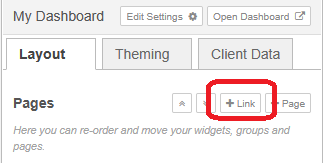
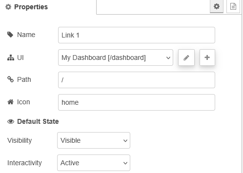

| [На головну](../) | [Розділ](README.md) |
| ----------------- | ------------------- |
|                   |                     |

# Config: UI Link `ui-link`

https://dashboard.flowfuse.com/nodes/config/ui-link

Якщо потрібно додати посилання на зовнішні ресурси з вашого Dashboard, це можна зробити за допомогою конфігураційного вузла `ui-link`. У бічному навігаційному меню буде відображено пункт, аналогічний сторінкам Dashboard, але під час вибору користувач буде безпосередньо перенаправлений за вказаним URL, навіть якщо він знаходиться поза межами FlowFuse Dashboard.

Щоб додати посилання до Dashboard, можна скористатися бічною панеллю Dashboard 2.0 у редакторі Node-RED. Натисніть кнопку `+ Link`, щоб додати новий елемент до списку, після чого налаштуйте посилання, задавши відповідні властивості (рис.1).

рис.1. 

| Prop          | Description                                                  |
| ------------- | ------------------------------------------------------------ |
| UI            | UI (ui-base), до якого буде додано це посилання.             |
| Path          | URL-адреса, на яку здійснюється перехід, коли користувач обирає це посилання. |
| Icon          | Яку іконку Material Design використовувати. Префікс mdi- вказувати не потрібно. |
| Default State | Початковий стан посилання.                                   |

Default State включає:

- `Visibility` – визначає початкову видимість посилання в бічному навігаційному меню.
- `Interactivity` – керує тим, чи пункт меню є активним або вимкненим.

Обидва ці параметри можуть бути перевизначені під час виконання за допомогою вузла ui-control.

