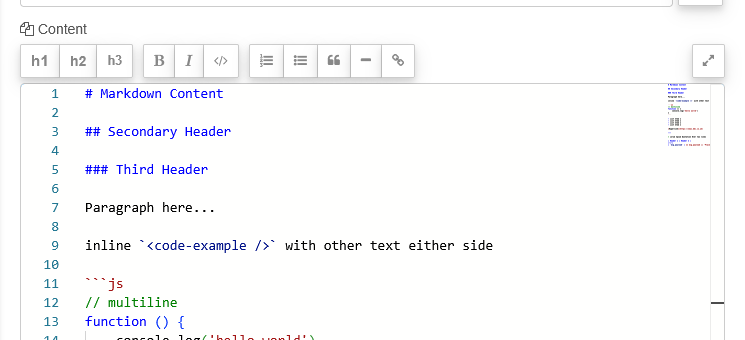
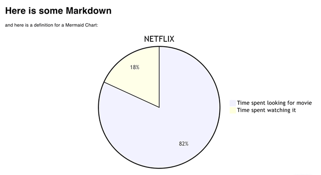

| [На головну](../) | [Розділ](README.md) |
| ----------------- | ------------------- |
|                   |                     |

# Markdown Viewer `ui-markdown`

https://dashboard.flowfuse.com/nodes/widgets/ui-markdown

Дозволяє означати Markdown безпосередньо в редакторі Node-RED і відображати його в UI. Може використовуватися для виведення підписів, заголовків або навіть повноцінних статей блогу.




Ви можете підставляти значення з msg у Markdown, використовуючи:

```js
{{ msg.payload }}
```

Цей вираз буде замінено значенням `msg.payload` під час надходження повідомлення у вузол. Якщо потрібно мати значення-заповнювач до отримання першого повідомлення, можна використати:

```js
{{ msg.payload || 'Placeholder' }}
```

Динамічні властивості – це властивості, які можуть бути перевизначені під час виконання шляхом надсилання відповідного msg до вузла. За потреби значення, задані в конфігурації Node-RED, будуть замінені значеннями з отриманих повідомлень.

| Prop  | Payload     | Structures | Example Values |
| ----- | ----------- | ---------- | -------------- |
| Class | `msg.class` | `String`   |                |

Віджет `ui-markdown` також підтримує вставку діаграм Mermaid. Для цього потрібно включити визначення Mermaid-діаграми всередину fenced-блоку Markdown-коду з типом `mermaid`.

Також можливо підставляти значення з `msg` у визначення Mermaid-діаграми, використовуючи шаблонізацію `mustache`, так само як і для стандартного Markdown, наприклад:

~~~markdown
# Here is some Markdown

and here is a definition for a Mermaid Chart:


~~~



Ви можете використати `msg` для повного перевизначення Mermaid-діаграми. Водночас у редакторі `ui-markdown` обов’язково має бути присутній початковий `fenced-блок` коду з типом `mermaid`, наприклад:

~~~markdown
```mermaid
{{ msg.payload }}
```
~~~

У такому випадку вміст `msg.payload` може бути визначенням будь-якої Mermaid-діаграми без обгортального fenced-блоку коду, наприклад:

```markdown
pie title NETFLIX
         "Time spent looking for movie" : {{ msg.payload }}
         "Time spent watching it" : 10
```

