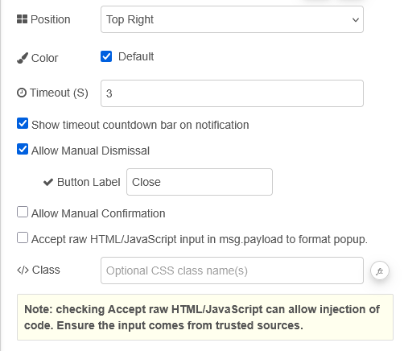
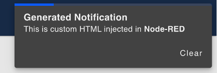

| [На головну](../) | [Розділ](README.md) |
| ----------------- | ------------------- |
|                   |                     |

# Notification `ui-notification`

https://dashboard.flowfuse.com/nodes/widgets/ui-notification

Відомий у Node-RED Dashboard як `Toast`, цей віджет відображає текст або HTML у невеликому вікні, яке з’являється на екрані на заданий проміжок часу (`timeout`) і в заданому місці екрана (position).



Якщо потрібно, щоб сповіщення відображалося необмежено довго, можна встановити timeout у 0. У такому разі сповіщення не можна буде закрити вручну, якщо додатково не увімкнути `allowDismiss` або `allowConfirm`.

- `UI` - На відміну від більшості віджетів, сповіщення прив’язані до "UI", а не до Group. Це дозволяє відображати сповіщення на всіх сторінках.

- `Position` - Положення на екрані, у якому з’являтиметься сповіщення.

- `Color` - Колір, який використовується для рамки сповіщення.

- `Timeout` - Кількість секунд до автоматичного закриття сповіщення.

- `Show Countdown Bar` - Визначає, чи показувати індикатор зворотного відліку, що зменшується і відображає час, який залишився до закриття сповіщення.

- `Allow Manual Dismissal` - Показує кнопку для закриття сповіщення користувачем. Якщо вимкнено, сповіщення закриється лише після завершення Timeout.

- `Allow Manual Dismissal – Button Label` - Якщо увімкнено `Allow Manual Dismissal`, тут задається підпис кнопки.

- `Allow Manual Confirmation` - Показує кнопку для підтвердження сповіщення користувачем. Якщо вимкнено, сповіщення закриється лише після завершення Timeout.

- `Allow Manual Confirmation – Button Label` - Якщо увімкнено Allow Manual Confirmation, тут задається підпис кнопки.

- `Accept Raw` - Визначає, чи передається необроблений HTML, який має оброблятися на стороні клієнта.

- `Class` - Додає CSS-класи до віджета.

Динамічні властивості – це властивості, які можуть бути перевизначені під час виконання шляхом надсилання відповідного msg до вузла. За потреби значення, задані в конфігурації Node-RED, будуть замінені значеннями з отриманих повідомлень.

| Prop                     | Payload                       | Structures                                                   | Example Values |
| ------------------------ | ----------------------------- | ------------------------------------------------------------ | -------------- |
| Disabled State           | `msg.enabled`                 | `Boolean`                                                    |                |
| Allow confirmation       | `msg.ui_update.allowConfirm`  | `Boolean`                                                    |                |
| Allow dismissal          | `msg.ui_update.allowDismiss`  | `Boolean`                                                    |                |
| Color                    | `msg.ui_update.color`         | `String`                                                     |                |
| Confirmation button text | `msg.ui_update.confirmText`   | `String`                                                     |                |
| Dismissal button text    | `msg.ui_update.dismissText`   | `String`                                                     |                |
| Display time(out)        | `msg.ui_update.displayTime`   | `Number`                                                     |                |
| Position                 | `msg.ui_update.position`      | `top right``top center``top left``bottom right``bottom center``bottom left``center center` |                |
| Progress bar color       | `msg.ui_update.progressColor` | `String`                                                     |                |
| Accept raw html          | `msg.ui_update.raw`           | `Boolean`                                                    |                |
| Show countdown bar       | `msg.ui_update.showCountdown` | `Boolean`                                                    |                |

`show: true | false` -  Дозволяє керувати тим, чи відображається сповіщення.

Наступне сповіщення було створене з використанням `msg.payload` такого вигляду:

```html
<h3>Generated Notification</h3><p>This is custom HTML injected into <b>Node-RED</b></p>
```



За замовчуванням сповіщення надсилаються лише одному користувачу або клієнту. У FlowFuse Dashboard це обмеження визначається через `msg._client`. Докладніше про це можна прочитати у відповідній документації. Якщо потрібно надіслати сповіщення всім підключеним клієнтам, можна видалити значення `msg._client` за допомогою вузла `change`, налаштованого на дію `Delete` для властивості `_client`.