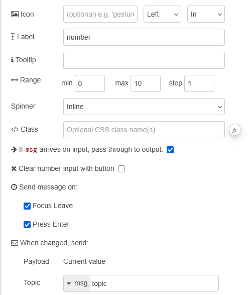
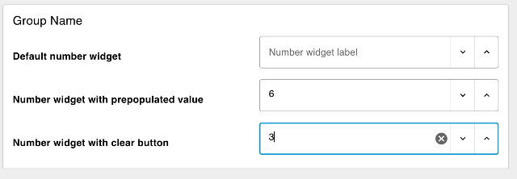

| [На головну](../) | [Розділ](README.md) |
| ----------------- | ------------------- |
|                   |                     |

# Number Input `ui-number-input`

https://dashboard.flowfuse.com/nodes/widgets/ui-number-input

Додає один рядок числового введення (Number Input) на Dashboard.

- `Icon` (динамічна) - Відображає іконку Material Design у полі числового введення. Немає потреби додавати префікс `mdi-`.

- `Icon Position` (динамічна) - Якщо задано `Icon`, визначає, з якого боку від `Label` буде відображатися іконка.

- `Icon Inner Position` (динамічна) - Якщо задано `Icon`, визначає, чи відображається іконка всередині або зовні поля числового введення.

- `Label` (динамічна) - Текст, що відображається поруч із полем числового введення. Дозволено HTML-вміст.

- `Min` (динамічна) - Визначає мінімально допустиме значення для поля числового введення.

- `Max` (динамічна) - Визначає максимально допустиме значення для поля числового введення.

- `Step` (динамічна) - Задає крок збільшення або зменшення значення у полі введення.

- `Spinner` (динамічна) - Визначає макет елементів збільшення/зменшення значення: inline або stacked.

- `Tooltip` - Текст, що відображається при наведенні курсора на поле числового введення.

- `Passthrough` - Визначає, чи має повідомлення, отримане цим вузлом у Node-RED, передаватися на вихід так, ніби в поле було введено нове значення.

- `Clear selection with button` (динамічна) - Якщо true, праворуч з’являється іконка або кнопка для очищення поля числового введення.

- `Send On "Clear Button"` - Надсилає `msg`, коли користувач очищає поле числового введення за допомогою кнопки очищення. Параметр `Clear selection with button` має бути увімкнений.

Динамічні властивості – це властивості, які можуть бути перевизначені під час виконання шляхом надсилання відповідного `msg` до вузла. За потреби значення, задані в конфігурації Node-RED, будуть замінені значеннями з отриманих повідомлень.

| Prop                | Payload                           | Structures | Example Values     |
| ------------------- | --------------------------------- | ---------- | ------------------ |
| Class               | `msg.class`                       | `String`   |                    |
| Label               | `msg.ui_update.label`             | `String`   |                    |
| Clearable           | `msg.ui_update.clearable`         | `Boolean`  |                    |
| Icon                | `msg.ui_update.icon`              | `String`   |                    |
| Icon Position       | `msg.ui_update.iconPosition`      | `String`   | `left`|`right`     |
| Icon Inner Position | `msg.ui_update.iconInnerPosition` | `String`   | `inside`|`outside` |
| Min                 | `msg.ui_update.min`               | `Number`   |                    |
| Max                 | `msg.ui_update.max`               | `Number`   |                    |
| Step                | `msg.ui_update.step`              | `Number`   |                    |
| Spinner             | `msg.ui_update.spinner`           | `String`   |                    |

`msg.control.enabled: true | false` - Дозволяє керувати тим, чи активне поле числового введення.

Приклад

