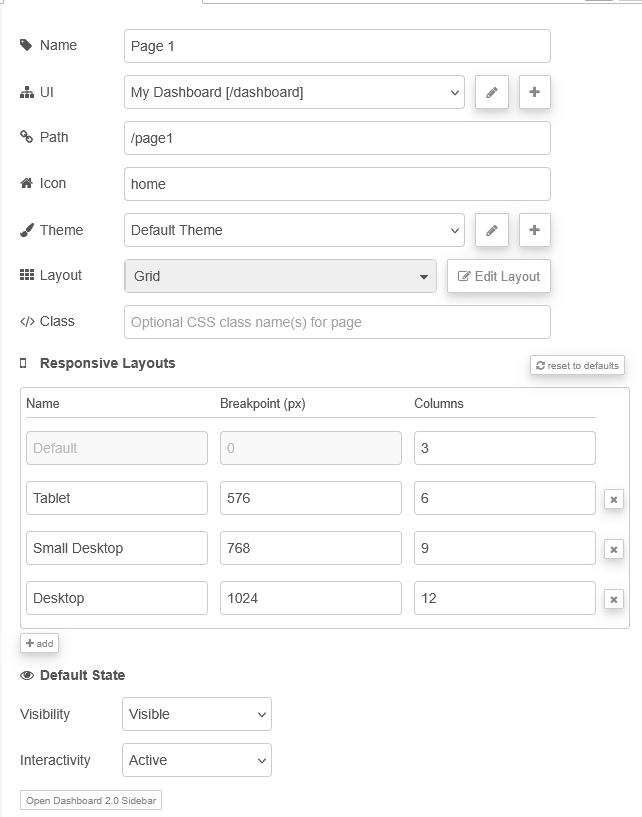
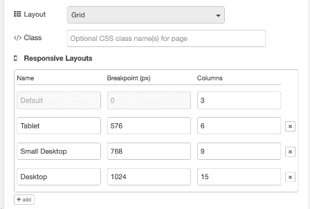

| [На головну](../) | [Розділ](README.md) |
| ----------------- | ------------------- |
|                   |                     |

# Config: UI Page `ui-page`

https://dashboard.flowfuse.com/nodes/config/ui-page

## Загальні налаштування

Кожна сторінка має власні налаштування, до яких можна добратися через бічну панель (рис.1). Детальніше про роботу макетів див. у розділі [Макетування (Layouts) та бічна панель](layouts.md).

рис.1.

| Prop          | Description                                                  |
| ------------- | ------------------------------------------------------------ |
| UI            | UI (ui-base), до якого буде додано цю сторінку.              |
| Path          | Розширює шлях батьківського UI і визначає, за якою адресою буде відображатися сторінка. |
| Icon          | Яку іконку Material Design використовувати для сторінки. Префікс `mdi-` вказувати не потрібно. |
| Theme         | Яку тему FlowFuse Dashboard використовувати для цієї сторінки. Можна також створювати і налаштовувати власні теми. |
| Layout        | Який менеджер макета використовувати для відображення віджетів. |
| Default State | Початковий стан сторінки.                                    |

`Default State` включає:

- `Visibility` – визначає початкову видимість сторінки в бічному навігаційному меню.
- `Interactivity` – керує тим, чи елемент у бічному меню є активним або вимкненим.

Обидва ці параметри можуть бути перевизначені під час виконання за допомогою вузла ui-control.

## Breakpoints

Breakpoints layouts - це Налаштування адаптивних порогів (breakpoints) для Dashboard, які визначають, скільки колонок відображається на різних розмірах екрана. Недоступно для макетів типу `Fixed`.

рис.2. Скріншот із конфігурацією breakpoints за замовчуванням.

Як описано в розділі [Макетування (Layouts) та бічна панель](layouts.md), більшість типів макетів у Dashboard використовують breakpoints. Кожен breakpoint визначає:

- значення у пікселях, тобто момент, з якого breakpoint починає діяти;
- кількість колонок, які повинні відображатися для цього breakpoint.

Чим більше колонок, тим більше груп і віджетів можна розмістити поруч на сторінці. Після заповнення колонок новий вміст буде відображатися з нового рядка.

Зауваження: для макетів типу Fixed налаштовувані breakpoints недоступні, оскільки вони не використовують колонковий підхід до відображення груп.