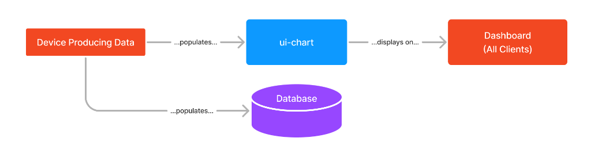
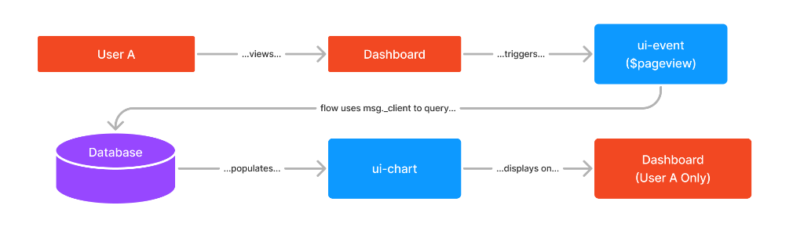
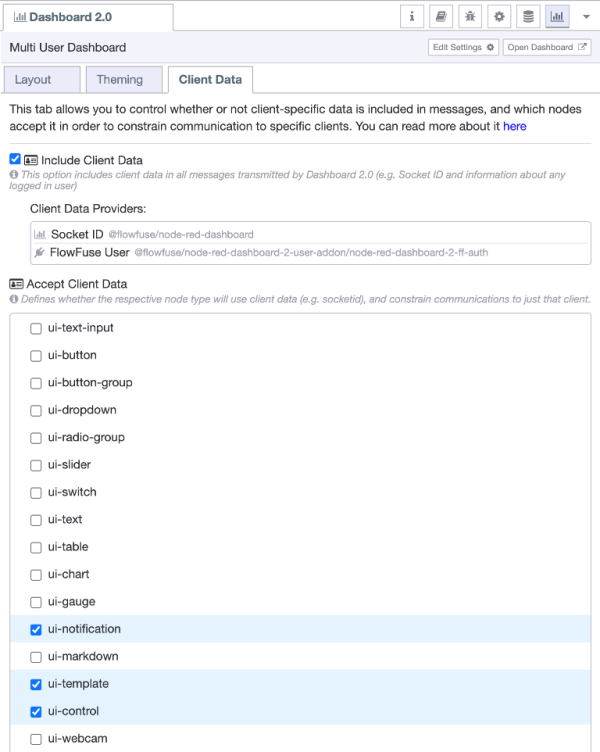
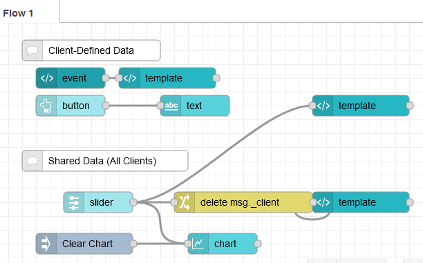

| [На головну](../) | [Розділ](README.md) |
| ----------------- | ------------------- |
|                   |                     |

# Патерни проектування

Є два основні патерни (шаблони) проектування, які можливі під час створення за допомогою Dashboard 2.0:

- Єдине джерело істини: Усі користувачі вашої інформаційної панелі бачитимуть однакові дані. Це корисно для промислових додатків IoT або домашньої автоматизації. Тобто зміни одноково відбуваються на всіх екземплярах інформаційних панелей.
- Клієнтські дані: Дані, які відображаються в конкретному віджеті, є унікальними для даного клієнта/сеансу/користувача. Це більш традиційна веб-програма, де кожен користувач має власний сеанс і пов’язані з ним дані.

Варто зазначити, що ці два шаблони можна змішувати та поєднувати в одній програмі Dashboard 2.0.



рис.1.Приклад робочого процесу для демонстрації шаблону проектування «Єдине джерело істини».

Це шаблон, який використала оригінальна інформаційна панель Node-RED. У цьому шаблоні всі користувачі інформаційної панелі бачитимуть однакові дані. Дані, які заповнюють віджет, зазвичай керуються частиною апаратного забезпечення або викликом API загального призначення. Коли користувач переходить на інформаційну панель, віджети завантажують відповідний стан і відображають його кожному користувачеві.

Прикладом цього є наступний, що якщо у вас є інтерактивні елементи, напр. повзунок, пов’язаний із діаграмою, тоді один користувач, пересуваючи повзунок, також відображатиме дані на діаграмі інформаційних панелей кожного іншого користувача.



рис.2. Приклад робочого процесу для демонстрації шаблону проектування «Client-Driven Data».

У Dashboard 2.0 ми можемо налаштувати певний тип вузла на ["Приймати дані клієнта"](https://dashboard.flowfuse.com/user/sidebar.html#client-data) на бічній панелі:



рис.3. Знімок екрану закладки "Client Data" 

Якщо «Include Client Data» увімкнуто, тоді *всі* об’єкти `msg`, випущені з *усіх* вузлів, міститимуть об’єкт `msg._client`, який буде щонайменше деталізувати `socketId` для підключеного клієнта. До цього об’єкта можна додати додаткові дані, як-от ім’я користувача, адресу електронної пошти чи інший унікальний ідентифікатор за допомогою плагінів інформаційної панелі, напр. [Плагін користувача FlowFuse](https://flowfuse.com/blog/2024/04/displaying-logged-in-users-on-dashboard/).

Таблиця «Прийняти дані клієнта» дозволяє налаштувати, які типи вузлів звертатимуть увагу на будь-яку надану інформацію `msg._client`. Будь-яке повідомлення, надіслане *до* одного з цих вузлів, може містити значення `msg._client`, щоб вказати конкретне з’єднання (наприклад, ім’я користувача, ідентифікатор сокета), до якого мають бути надіслані дані, а не всім клієнтам.

Для користувачів, які знайомі з оригінальною Node-RED Dashboard, ви впізнаєте цей шаблон за допомогою `ui-notification` і `ui-control`, тепер, у Dashboard 2.0, це можливо для *всіх* віджетів.

Ключовим тут є те, що дані зазвичай вводяться у вузол як наслідок дії користувача, наприклад. натискання кнопки, перегляд сторінки або надсилання форми, і дані відповіді надсилаються *лише* тому користувачеві.

Простим прикладом цього шаблону проектування в Dashboard 2.0 є використання вузла [UI Event](https://dashboard.flowfuse.com/nodes/widgets/ui-event.html). Вузол `ui-event` видає `msg`, коли користувач завантажує сторінку. Усередині `msg` є повний об’єкт даних `msg._client`, доступний для підключення цього клієнта. Якщо це повідомлення потім буде надіслано на інший вузол, який приймає дані клієнта, то повне `msg` буде надіслано *тільки* цьому вказаному клієнту.

Наприклад у нас є потік, який створить деякі дані, визначені клієнтом, і деякі спільні дані. Під час імпортування обов’язково переконайтеся, що на бічній панелі Dashboard 2.0 у таблиці «Accepts Client Data» позначено `ui-text` і `ui-template`.

<video width="800" height="600" autoplay="true" src ="https://dashboard.flowfuse.com/assets/demo-design-patterns.B9Lpy5Wp.mp4"> Your browser does not support the video tag. </video>

рис.4.

У відео вище ми бачимо, що в деяких випадках дані надсилаються лише тому клієнту, який їх ініціював (наприклад, натискання кнопок), а в інших дані поширюються між усіма сеансами клієнта (наприклад, візуалізація значення повзунка на діаграмі). .



рис.5.

Якщо ви хочете погратиcz з цим прикладом, можете імпортувати цей код в Node-RED.  Під час імпортування обов’язково переконайтеся, що на бічній панелі Dashboard 2.0 у таблиці «Accepts Client Data» позначено `ui-text` і `ui-template`.

```json
[{"id":"f385539f963b56ce","type":"ui-text","z":"3d8c801ff2007261","group":"2b287eac8c5a64cd","order":2,"width":"3","height":"1","name":"","label":"Your Latest Button Click:","format":"{{msg.payload}}","layout":"row-left","style":false,"font":"","fontSize":16,"color":"#717171","className":"","x":290,"y":120,"wires":[]},{"id":"ae23d23cc164d27a","type":"ui-button","z":"3d8c801ff2007261","group":"2b287eac8c5a64cd","name":"","label":"Click Me!","order":3,"width":0,"height":0,"emulateClick":false,"tooltip":"","color":"","bgcolor":"","className":"","icon":"","iconPosition":"left","payload":"","payloadType":"date","topic":"topic","topicType":"msg","x":100,"y":120,"wires":[["f385539f963b56ce"]]},{"id":"a7d3cb9fc537d9bb","type":"ui-slider","z":"3d8c801ff2007261","group":"8bee8ca608b26b77","name":"","label":"slider","tooltip":"","order":1,"width":0,"height":0,"passthru":false,"outs":"all","topic":"topic","topicType":"msg","thumbLabel":true,"min":0,"max":10,"step":1,"className":"","x":150,"y":260,"wires":[["257625ee5df3a84e","ea03c8bc066ebdf2","5ef058757d792100"]]},{"id":"257625ee5df3a84e","type":"ui-chart","z":"3d8c801ff2007261","group":"8bee8ca608b26b77","name":"","label":"chart","order":3,"chartType":"line","category":"topic","categoryType":"msg","xAxisProperty":"","xAxisPropertyType":"msg","xAxisType":"time","yAxisProperty":"","ymin":"","ymax":"","action":"append","pointShape":"circle","pointRadius":4,"showLegend":true,"removeOlder":1,"removeOlderUnit":"3600","removeOlderPoints":"","colors":["#1f77b4","#aec7e8","#ff7f0e","#2ca02c","#98df8a","#d62728","#ff9896","#9467bd","#c5b0d5"],"width":"9","height":8,"className":"","x":330,"y":320,"wires":[[]]},{"id":"ce9b4c9ec9c4ed93","type":"inject","z":"3d8c801ff2007261","name":"Clear Chart","props":[{"p":"payload"}],"repeat":"","crontab":"","once":false,"onceDelay":0.1,"topic":"","payload":"[]","payloadType":"json","x":130,"y":320,"wires":[["257625ee5df3a84e"]]},{"id":"8aefa358fdb6e177","type":"ui-event","z":"3d8c801ff2007261","ui":"c2e1aa56f50f03bd","name":"","x":100,"y":80,"wires":[["0b8294025998e4be"]]},{"id":"0b8294025998e4be","type":"ui-template","z":"3d8c801ff2007261","group":"2b287eac8c5a64cd","page":"","ui":"","name":"","order":1,"width":0,"height":0,"head":"","format":"<template>\n    <strong>msg._client:</strong>\n    <pre>{{ msg._client }}</pre>\n</template>","storeOutMessages":true,"passthru":true,"resendOnRefresh":true,"templateScope":"local","className":"","x":240,"y":80,"wires":[[]]},{"id":"c0a2283e528e663e","type":"comment","z":"3d8c801ff2007261","name":"Client-Defined Data","info":"","x":130,"y":40,"wires":[]},{"id":"c999e4c44afd670c","type":"comment","z":"3d8c801ff2007261","name":"Shared Data (All Clients)","info":"","x":150,"y":200,"wires":[]},{"id":"6de64b0ab3a086ed","type":"ui-template","z":"3d8c801ff2007261","group":"8bee8ca608b26b77","page":"","ui":"","name":"Show to All","order":2,"width":0,"height":0,"head":"","format":"<template>\n    <strong>Shared Slider Value:</strong>\n    <pre>{{ msg.payload }}</pre>\n</template>","storeOutMessages":true,"passthru":true,"resendOnRefresh":true,"templateScope":"local","className":"","x":530,"y":260,"wires":[[]]},{"id":"ea03c8bc066ebdf2","type":"change","z":"3d8c801ff2007261","name":"","rules":[{"t":"delete","p":"_client","pt":"msg"}],"action":"","property":"","from":"","to":"","reg":false,"x":350,"y":260,"wires":[["6de64b0ab3a086ed"]]},{"id":"5ef058757d792100","type":"ui-template","z":"3d8c801ff2007261","group":"2b287eac8c5a64cd","page":"","ui":"","name":"Client-Driven","order":2,"width":"3","height":"1","head":"","format":"<template>\n    Client Specific Slider: {{ msg.payload }}\n</template>","storeOutMessages":true,"passthru":true,"resendOnRefresh":true,"templateScope":"local","className":"","x":530,"y":120,"wires":[[]]},{"id":"2b287eac8c5a64cd","type":"ui-group","name":"Design Pattern - Client Driven","page":"1a43c75e8780fe2b","width":"9","height":"1","order":-1,"showTitle":true,"className":"","visible":"true","disabled":"false"},{"id":"8bee8ca608b26b77","type":"ui-group","name":"Design Pattern - Single Source of Truth","page":"1a43c75e8780fe2b","width":"9","height":"1","order":-1,"showTitle":true,"className":"","visible":"true","disabled":"false"},{"id":"c2e1aa56f50f03bd","type":"ui-base","name":"Dashboard","path":"/dashboard","includeClientData":true,"acceptsClientConfig":["ui-control","ui-notification","ui-text","ui-template"],"showPathInSidebar":true,"navigationStyle":"temporary","titleBarStyle":"fixed"},{"id":"1a43c75e8780fe2b","type":"ui-page","name":"Design Pattern Examples","ui":"c2e1aa56f50f03bd","path":"/design-patterns","icon":"home","layout":"grid","theme":"c2ff5ba1f92a0f0e","order":1,"className":"","visible":"true","disabled":"false"},{"id":"c2ff5ba1f92a0f0e","type":"ui-theme","name":"Default","colors":{"surface":"#ffffff","primary":"#0094ce","bgPage":"#eeeeee","groupBg":"#ffffff","groupOutline":"#cccccc"},"sizes":{"pagePadding":"12px","groupGap":"12px","groupBorderRadius":"4px","widgetGap":"12px"}}]
```

Трохи більше про сам потік.

**Client-Driven Data**

Для цього випадку ми встановили параметри `ui-text` і `ui-template`, налаштовані на бічній панелі, як «Accept Client Constraints».

У верхній половині вузол `ui-event` видасть повідомлення, коли користувач завантажить сторінку. Це повідомлення міститиме об’єкт `msg._client`, унікальний для підключення цього користувача. Потім це повідомлення надсилається до вузла `ui-template`, який відображатиме ідентифікатор сокета конкретного користувача.

Подібним чином у нас є кнопка, яка також видаватиме дані `msg._client` (як і всі вузли), але цього разу вони будуть надіслані до вузла `ui-text`. `ui-text` покаже мітку часу останнього натискання клієнтом/користувачем цієї кнопки.

**Shared Data  (усі клієнти)**

У цьому розділі потоку демонструється, як можна використовувати повзунок для керування діаграмою. Зауважте, що ми підключаємо повзунок безпосередньо до діаграми, оскільки `ui-chart` не налаштовано на «Accept Client Constraints».

Ми також підключаємо `ui-slider` до двох вузлів `ui-template`. Враховуючи, що вузли `ui-template` *налаштовані* на «Accept Client Data», ми можемо продемонструвати як спільні, так і клієнтські дані в одному потоці, видаливши дані `msg._client` на шляху до наступного `ui-template`. Якщо видалити це, будь-які дані повзунка, надіслані сюди, надсилатимуться до *всіх* з’єднань, оскільки `msg` не вказує `_client`. Верхній `ui-template` оновлюватиметься лише для клієнта, який перемістив повзунок.