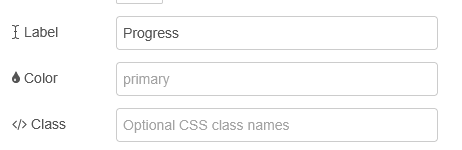
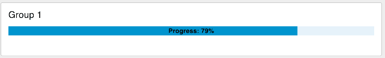

| [На головну](../) | [Розділ](README.md) |
| ----------------- | ------------------- |
|                   |                     |

# Progress `ui-progress`

https://dashboard.flowfuse.com/nodes/widgets/ui-progress

Відображає візуальний індикатор прогресу для показу стану виконання або поточних процесів на Dashboard.




- `Label` (динамічна) - Текст, що відображається поруч із відсотком виконання. Якщо задано, відображається у вигляді «Label: XX%» безпосередньо всередині індикатора прогресу.

- `Color` (динамічна) - Колір індикатора прогресу. Допустимі значення включають кольори теми Vuetify (primary, secondary, success, error, warning, info) або користувацькі кольори (наприклад, green).

- `Class` - Необов’язкові імена CSS-класів, які застосовуються до індикатора прогресу для додаткового стилізування.

`msg.control.enabled: true | false` - Дозволяє керувати тим, чи активне поле числового введення.

Динамічні властивості – це властивості, які можуть бути перевизначені під час виконання шляхом надсилання відповідного msg до вузла.За потреби значення, задані в конфігурації Node-RED, будуть замінені значеннями з отриманих повідомлень.

| Prop  | Payload               | Structures | Example Values |
| ----- | --------------------- | ---------- | -------------- |
| Label | `msg.ui_update.label` | `String`   |                |
| Color | `msg.ui_update.color` | `String`   |                |

Вхідні дані:

Індикатор прогресу приймає числові значення через `msg.payload`:

- Тип payload: `Number` (0–100)
- Опис: відображає відсоток виконання. Значення автоматично обмежуються діапазоном 0–100.
- Приклад: `msg.payload = 75` відображає індикатор прогресу з рівнем 75%.

Приклад відображеного індикатора прогресу на Dashboard з рівнем виконання 79%.



Індикатор прогресу можна оновлювати в реальному часі, надсилаючи повідомлення з числовим `payload`. Також можна динамічно змінювати підпис і колір:

```js
// Оновити прогрес до 80%
msg.payload = 80;
return msg;

// Оновити прогрес і змінити підпис/колір
msg.payload = 45;
msg.ui_update = {
    label: "Loading Data",
    color: "warning"
};
return msg;
```

Індикатор прогресу зазвичай використовується для:

- прогресу завантаження або вивантаження файлів;
- відображення стану виконання задач;
- індикації процесів обробки даних;
- показників стану системи;
- відображення рівня заряду батареї.

