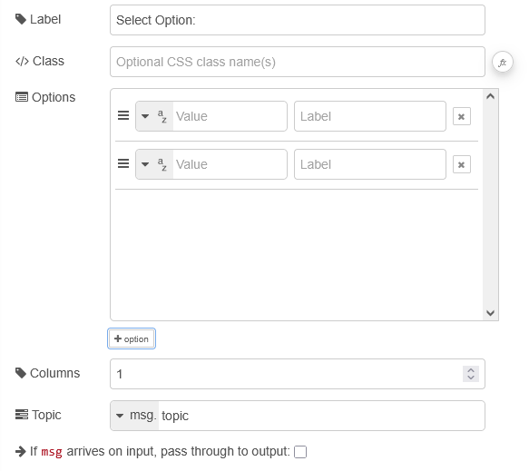

| [На головну](../) | [Розділ](README.md) |
| ----------------- | ------------------- |
|                   |                     |

# Radio Group `ui-radio-group`

https://dashboard.flowfuse.com/nodes/widgets/ui-radio-group

Додає групу радіокнопок (Radio Group) на Dashboard, яка щоразу при виборі значення передає його в Node-RED через `msg.payload`.

- `Label` (динамічна) - Текст, що відображається над групою радіокнопок і пояснює користувачу доступні варіанти. Дозволено HTML-вміст.

- `Options` (динамічна) - Список доступних опцій у групі радіокнопок. Кожен рядок задає властивості `label` (відображається поруч із кожною радіокнопкою) та `value` (передається при виборі).

- `Columns` (динамічна) - Кількість колонок сітки, у межах яких відображається група радіокнопок. Корисно, якщо потрібно розмістити опції горизонтально або зекономити вертикальний простір при великій кількості варіантів.

- `Topic` - Значення `msg.topic`, яке буде включене в усі передані повідомлення.

Ви можете динамічно встановлювати вибір, передаючи відповідне значення в `msg.payload`, наприклад `msg.payload = "option1"`.

Щоб очистити будь-який вибір у групі радіокнопок, передайте порожній рядок `msg.payload=""`.

Динамічні властивості – це властивості, які можуть бути перевизначені під час виконання шляхом надсилання відповідного `msg` до вузла. За потреби значення, задані в конфігурації Node-RED, будуть замінені значеннями з отриманих повідомлень.

| Prop    | Payload                 | Structures                                                   | Example Values |
| ------- | ----------------------- | ------------------------------------------------------------ | -------------- |
| Label   | `msg.ui_update.label`   | `String`                                                     |                |
| Options | `msg.ui_update.options` | `Array<String>``Array<{value: String}>``Array<{value: String, label: String}>` |                |
| Class   | `msg.ui_update.class`   | `String`                                                     |                |
| Columns | `msg.ui_update.columns` | `Number`                                                     |                |

Приклад

