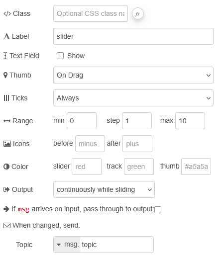
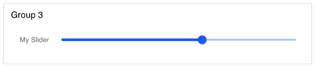
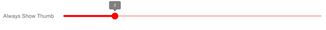
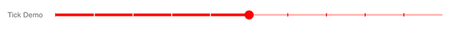
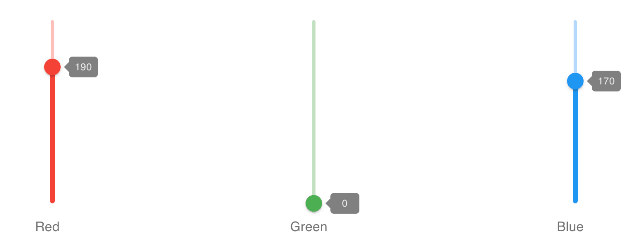

| [На головну](../) | [Розділ](README.md) |
| ----------------- | ------------------- |
|                   |                     |

# Slider `ui-slider`

https://dashboard.flowfuse.com/nodes/widgets/ui-slider

Додає повзунок (Slider) на Dashboard, який щоразу при зміні значення передає його в Node-RED через `msg.payload`.



рис.1.

- `Label` (динамічна) - Текст, що відображається ліворуч від повзунка. Дозволено HTML-вміст.

- `Thumb Label` (динамічна) - Визначає, коли відображається підпис на бігунку повзунка. Типово – «On Drag».

- `Show Ticks` (динамічна) - Визначає, коли відображаються поділки на доріжці повзунка. Типово – «Always».

- `Range` (динамічна)

  - `min` – мінімальне значення, до якого можна перемістити повзунок. Якщо `min > max`, напрямок повзунка буде інверсним;

  - `max` – максимальне значення, до якого можна перемістити повзунок;

  - `step` – крок збільшення або зменшення значення під час переміщення повзунка.

- `Color` (динамічна) - Може бути назва кольору (`red`, `green`, `blue` тощо) або HEX-код (`#b5b5b5`):

  - `main` – колір повзунка і бігунка;

  - `track` – колір доріжки повзунка;

  - `thumb` – колір бігунка.

- `Icons` (динамічна) - Додає mdi-іконки перед і після повзунка, наприклад `minus`. Префікс `mdi-` вказувати не потрібно, лише назву іконки.

- `Output` - Визначає, коли формується `msg`: під час переміщення повзунка або після його відпускання.

Динамічні властивості – це властивості, які можуть бути перевизначені під час виконання шляхом надсилання відповідного `msg` до вузла. За потреби значення, задані в конфігурації Node-RED, будуть замінені значеннями з отриманих повідомлень.

| Prop            | Payload                       | Structures                | Example Values |
| --------------- | ----------------------------- | ------------------------- | -------------- |
| Label           | `msg.ui_update.class`         | `String`                  |                |
| Thumb Label     | `msg.ui_update.thumbLabel`    | `true | false | 'always'` |                |
| Show Ticks      | `msg.ui_update.showTicks`     | `true | false | 'always'` |                |
| Range (min)     | `msg.ui_update.min`           | `Number`                  |                |
| Range (step)    | `msg.ui_update.step`          | `Number`                  |                |
| Range (max)     | `msg.ui_update.max`           | `Number`                  |                |
| Icon Prepend    | `msg.ui_update.iconPrepend`   | `String`                  |                |
| Icon Append     | `msg.ui_update.iconAppend`    | `String`                  |                |
| Color           | `msg.ui_update.color`         | `String`                  |                |
| Color Track     | `msg.ui_update.colorTrack`    | `String`                  |                |
| Color Thumb     | `msg.ui_update.colorThumb`    | `String`                  |                |
| Class           | `msg.ui_update.class`         | `String`                  |                |
| Show Text Field | `msg.ui_update.showTextField` | `true | false`            |                |

Ви можете встановити значення повзунка, передавши відповідне значення в `msg.payload`.

`msg.enabled: true | false` дозволяє керувати тим, чи є повзунок активним (доступним для взаємодії).

Приклади:



рис.2. Приклад відображеного повзунка на Dashboard.



рис.3. Приклад повзунка з параметром «Show Thumb», встановленим у значення «Always».

рис.4. Приклад повзунка з поділками (ticks), встановленими у значення «Always».

Поділки можна налаштовувати, перевизначаючи CSS для повзунка. Зовнішній вигляд поділок можна змінювати за допомогою таких CSS-змінних:

- `--tick-scaleX` – масштаб поділок по горизонталі
- `--tick-scaleY` – масштаб поділок по вертикалі
- `--tick-color` – колір поділок

Зауважте, що може знадобитися створити окремі CSS-класи для горизонтального та вертикального повзунків.

```css
.my-slider-horizontal.nrdb-ui-slider{
    --tick-scaleX: 0.25;
    --tick-scaleY: 4;
    --tick-color: rgba(var(--v-theme-primary),0.7);
}
.my-slider-vertical.nrdb-ui-slider{
    --tick-scaleX: 4;
    --tick-scaleY: 0.25; 
    --tick-color: orange;
}
```

Для поділок у заповненій частині повзунка також можна застосовувати окремі стилі.

```css
.my-slider-horizontal.nrdb-ui-slider .v-slider-track__tick--filled{
    --tick-color: violet;
}
```

Повзунки автоматично переходять у вертикальну орієнтацію, коли їх висота перевищує ширину.

*Example of a vertical slider in a Dashboard.*

рис.5. Приклад вертикального повзунка на Dashboard.