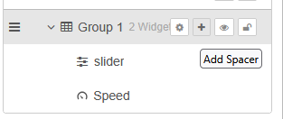
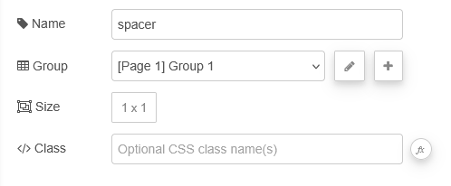

| [На головну](../) | [Розділ](README.md) |
| ----------------- | ------------------- |
|                   |                     |

# Spacer `ui-spacer`

https://dashboard.flowfuse.com/nodes/widgets/ui-spacer

Цей віджет дозволяє додати простий розділювач (spacer) до груп Dashboard, що допомагає у компонуванні елементів інтерфейсу.

Редагування розділювача можливе лише з бічної панелі Dashboard 2.0, а не з панелі конфігурації Node-RED. У бічній панелі Dashboard 2.0 наведіть курсор на групу, до якої потрібно додати розділювач, і натисніть кнопку `+` `Add  spacer`. Після цього розділювач буде додано до групи, і його можна перетягнути у потрібне місце. Відкриття діалогу редагування розділювача дозволяє задати його розмір.

 

- `Group` - Визначає, у якій групі UI Dashboard буде відображено цей віджет.

- `Size` - Керує шириною та висотою розділювача відносно батьківської групи. Максимальне значення дорівнює ширині групи.

Віджети spacer належать до глобального потоку і не експортуються разом із групою, якщо не експортується весь flow. Це означає, що для експорту групи з розділювачами потрібно або експортувати весь flow, або додавати spacer-віджети вручну після імпорту групи;