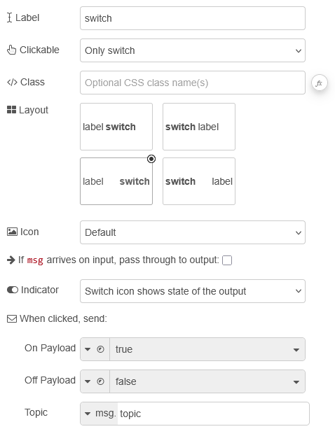
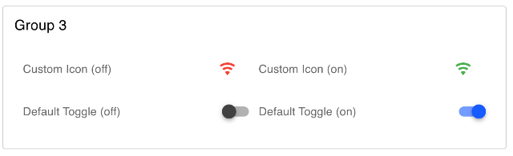

| [На головну](../) | [Розділ](README.md) |
| ----------------- | ------------------- |
|                   |                     |

# Toggle Switch `ui-switch`

https://dashboard.flowfuse.com/nodes/widgets/ui-switch

Додає тумблер (перемикач) до користувацького інтерфейсу.

- `Label` (динамічна) - Текст, що відображається поруч із перемикачем. Дозволено HTML-вміст.

- `Layout` (динамічна) - Визначає, як розташовані підпис і перемикач. Користувач може обрати різні варіанти компонування, наприклад вирівнювання елементів ліворуч, ліворуч у зворотному порядку, рівномірний розподіл або рівномірний розподіл у зворотному порядку.

- `Clickable` (динамічна) - Визначає клікабельну область, взаємодія з якою призводить до перемикання стану.

- `On Icon` (динамічна) - Якщо задано, ця іконка Material Design замінює стандартний вигляд перемикача у стані «on». Префікс `mdi` вказувати не потрібно.

- `Off Icon` (динамічна) - Якщо задано, ця іконка Material Design замінює стандартний вигляд перемикача у стані «off». Префікс `mdi` вказувати не потрібно.

- `On Color` (динамічна) - Якщо використовуються іконки, цей колір застосовується до іконки у стані «on».

- `Off Color` (динамічна) - Якщо використовуються іконки, цей колір застосовується до іконки у стані «off».

- `Passthrough` - Якщо увімкнено, віджет передає вхідне повідомлення без змін на вихід.

- `Indicator` - Доступно лише коли `Passthrough` вимкнено. Визначає, чи перемикач відображає стан вихідного сигналу, чи будь-який вхідний стан, переданий через `msg.payload`.

- `On Payload` - Тип і значення, які передаються в `msg.payload`, коли перемикач увімкнено.

- `Off Payload` - Тип і значення, які передаються в `msg.payload`, коли перемикач вимкнено.

Динамічні властивості – це властивості, які можуть бути перевизначені під час виконання шляхом надсилання відповідного `msg` до вузла. За потреби значення, задані в конфігурації Node-RED, будуть замінені значеннями з отриманих повідомлень.

| Prop        | Payload                       | Structures | Example Values |
| ----------- | ----------------------------- | ---------- | -------------- |
| Class       | `msg.ui_update.class`         | `String`   |                |
| Label       | `msg.ui_update.label`         | `Boolean`  |                |
| Layout      | `msg.ui_update.layout`        | `String`   |                |
| Clickable   | `msg.ui_update.clickableArea` | `String`   |                |
| Passthrough | `msg.ui_update.passthru`      | `Boolean`  |                |
| Indicator   | `msg.ui_update.decouple`      | `Boolean`  |                |
| On Color    | `msg.ui_update.oncolor`       | `String`   |                |
| Off Color   | `msg.ui_update.offcolor`      | `String`   |                |
| On Icon     | `msg.ui_update.onicon`        | `String`   |                |
| Off Icon    | `msg.ui_update.officon`       | `String`   |                |

`msg.enabled: true | false` - Дозволяє керувати тим, чи може перемикач бути змінений користувачем через UI.

Приклад

