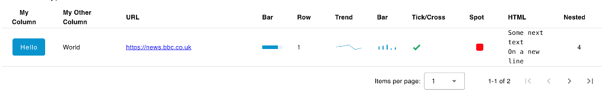
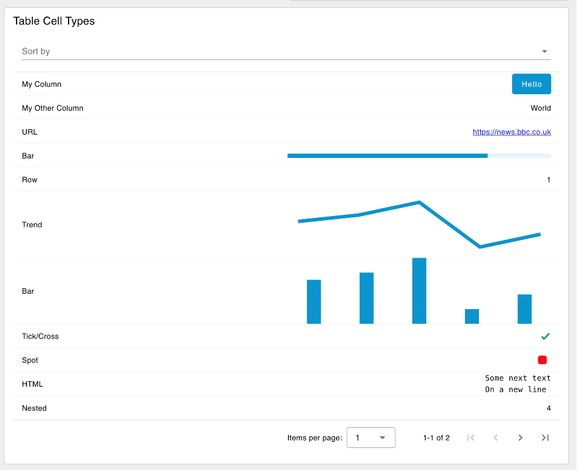
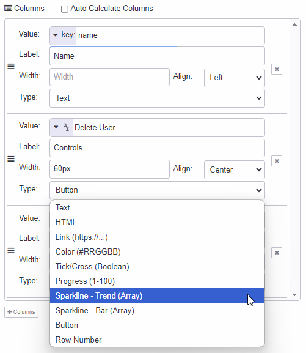
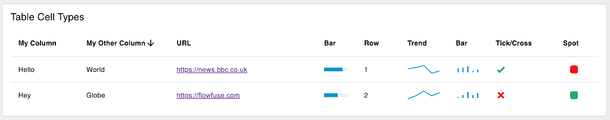
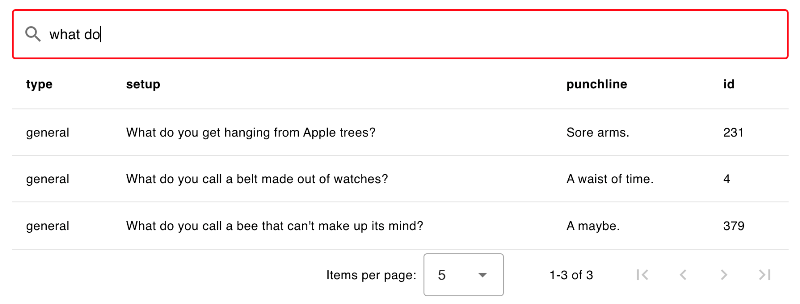
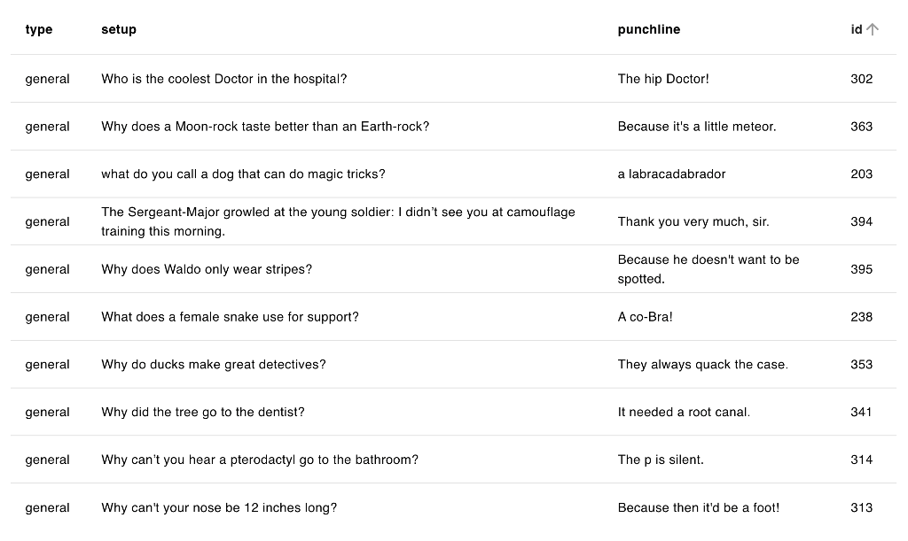
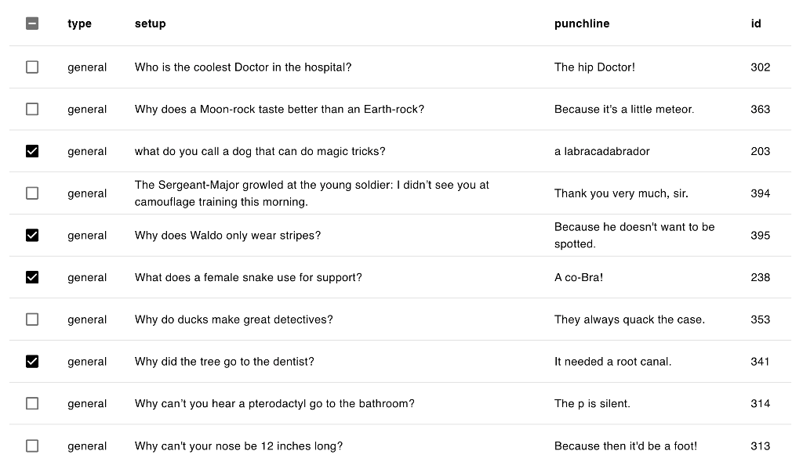
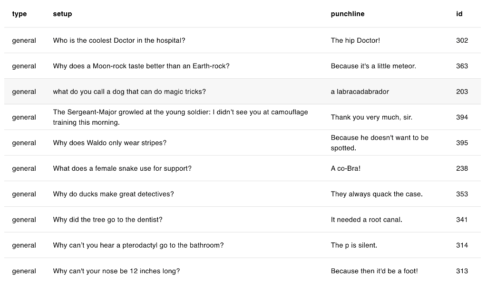
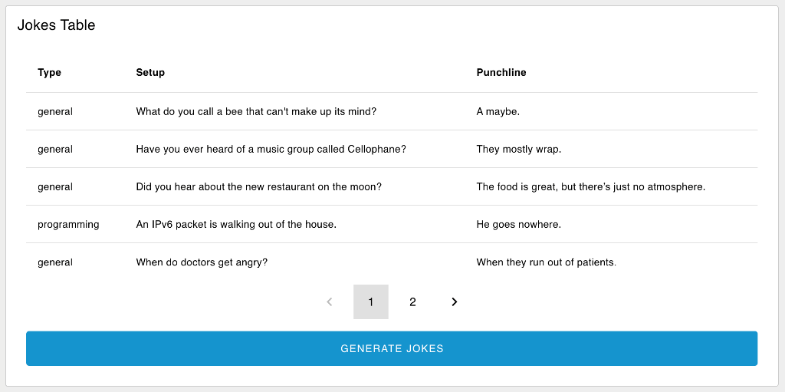

| [На головну](../) | [Розділ](README.md) |
| ----------------- | ------------------- |
|                   |                     |

# Таблиця даних `ui-table` 

https://dashboard.flowfuse.com/nodes/widgets/ui-table.html

[Демо](https://dashboard-demos.flowfuse.cloud/dashboard/table)

## Надсилання даних

Відтворює набір даних у табличному форматі. Очікує введення (`msg.payload`) у форматі:

```json
[{
    "colA": "A",
    "colB": "Hello",
    "colC": 3
}, {
    "colA": "B",
    "colB": "World",
    "colC": 5
}]
```

Таблиця відтворюватиметься зі стовпцями `colA`, `colB` і `colC`, якщо «Columns» не визначено явно на вузлі, а «Автоматичні стовпці» вимкнено.

Ви також можете надіслати окремий фрагмент даних для додавання до існуючої таблиці, у цьому випадку `ui-table` очікує введення (`msg.payload`) у форматі:

```json
{
    "colA": "A",
    "colB": "Hello",
    "colC": 3
}
```

Ви можете надіслати порожній масив, щоб очистити таблицю.

```json
[]
```

## Властивості 

| Prop         | Dynamic | Description                                                  |
| ------------ | ------- | ------------------------------------------------------------ |
| Group        |         | Означує, у якій групі інформаційної панелі інтерфейсу відображатиметься цей віджет. |
| Size         |         | Керує шириною кнопки відносно батьківської групи. Максимальне значення – ширина групи. |
| Label        |         | Текст, який відображається над таблицею, позначає, що відображає таблиця. |
| Max Rows     |         | Означує максимальну кількість рядків даних для відтворення в таблиці. Зайві рядки будуть доступні через контроль розбивки сторінок. Встановіть значення "0", щоб не розбивати сторінки. |
| Breakpoint   |         | Керує, коли таблиця відтворюватиметься як картка, де кожен стовпець із рядка відтворюватиметься як рядок у більшому розмірі, міститиме рядок для одного запису. Точка зупину вимірюється на основі ширини таблиці , а не ширина екрана. |
| Selection    |         | Надає три варіанти взаємодії з таблицею - "None", "Click" and "Checkbox" |
| Show Search  |         | Означує, чи показувати панель пошуку над таблицею. Дозволить пошук і фільтрацію в усіх стовпцях. |
| Auto Columns |         | Якщо позначено, стовпці обчислюються автоматично на основі вмісту отриманих повідомлень. |
| Columns      |         | Якщо для параметра "Auto Columns" встановлено значення «false», ці стовпці використовуються під час візуалізації таблиці. |

### Selection (Вибір) 

- **None**: вибір заборонено. Таблиця просто відображатиме дані.
- **Click**: повний рядок стає об’єктом, який можна натиснути, а вузол `ui-table` *виведе повний об’єкт*, пов’язаний із рядком, коли натиснути.
- **Checkbox**: кожен рядок має прапорець, а вузол `ui-table` *виводитиме масив об’єктів*, пов’язаних із позначеними рядками, коли прапорець встановлено.

Відповідні події виведуть наступне:

```json
{
    "payload": <full row object>,
    "action": "row_click" | "multiselect"
}
```

Ви також можете додати тип клітинки Кнопка і таким чином створювати події.

### Responsiveness 

Властивість *"Breakpoint"* для таблиці інтерфейсу користувача дає вам контроль над тим, коли таблиця перейде в "мобільний" режим, і відображатиме рядок даних охоплення як картку. Це корисно, коли у вас багато стовпців, а таблиця занадто широка, щоб поміститися на екран мобільного. Точка зупину вимірюється на основі **ширини таблиці**, а не ширини екрана.



Вигляд робочого столу прикладу таблиці інтерфейсу користувача



*Mobile View of the same UI Table*

Точку переривання (breakpoint ) можна означити одним із трьох способів: 

- **defaults**: виберіть одну з попередньо означених точок зупину (xs, sm, md, lg).
- **px**: вручну означте значення `px`, щоб таблиця перемикала в мобільний режим, коли вона виходить за цю ширину..
- **none**:  завжди відображати як рядки даних у таблиці, ніколи не перемикатися на "Мобільний" режим

### Configuring Columns 



*Screenshot of the configuration options available for column types in Node-RED*

Якщо ви вимкнете параметр «Auto Columns», ви матимете більше можливостей для означення стовпців для вашої таблиці. Для кожного стовпця можна означити наступне:

- **Value**: значення для відтворення елемента керування. Зазвичай ви надаєте ключ до значення в об’єкті рядка даних, але його можна змінити, щоб надати фіксоване значення рядка.
- **Label**: текст для відображення в заголовку стовпця.
- **Width**: ширина стовпця може бути в пікселях, % або будь-якому іншому допустимому розмірі CSS.
- **Align:** Вирівнювання тексту в стовпці. Може бути `Left`, `Center` або `Right`. Зауважте, що деякі стовпці виглядають дивно з вирівнюванням по центру, оскільки заголовок також містить місце для значка сортування.
- **Type**: означує тип комірки та контролює спосіб відображення даних у цьому стовпці.

### Cell Types 



*An example of a ui-table displaying various of the cell types available*

- **Text**: відображає комірку як звичайний текст.
- **HTML**: враховуватиме нові розриви рядків (наприклад, `\n`) і базові теги HTML.
- **Link**: відображає клітинку як гіперпосилання. Поле `Link` має містити URL-адресу, на яку потрібно зробити посилання.
- **Color**:  відтворює комірку як кольорову рамку. Поле  `Color`  має містити дійсний колір CSS.
- **Tick/Cross**: візуалізація клітинки у вигляді галочки або хрестика. Поле `Значення` має містити логічне значення (`true`/`false`).
- **Progress**: візуалізація комірки як індикатора виконання. Поле `Value` має містити число від 0 до 100.
- **Sparkline - Trend**: відображає комірку як невелику лінійну діаграму без осей. Поле `Value` має містити масив чисел для побудови.
- **Sparkline - Bar**: візуалізація комірки у вигляді невеликої гістограми без осей. Поле `Значення` має містити масив чисел для побудови.
- **Button**: : відображає кнопку, яку можна натиснути, у комірці. Позначкою кнопки буде або `row[key]`, або фіксований рядок, введений у конфігурації стовпця вручну.
- **Row Number**: відображає номер рядка в клітинці.
- **Image**: рендерить клітинку як зображення. Надане значення "Image" має бути дійсною URL-адресою. URL-адреса даних також підтримується для зображень у кодуванні base64. Якщо вказано недійсну URL-адресу, з’явиться порожнє місце.

#### Interaction: Buttons 

Тип комірки `Button` відображатиме кнопку, яку можна натиснути, у комірці. Мітка кнопки буде відповідним значенням у вашому рядку для наданого `key`. Після натискання кнопки вузол `ui-table` виведе:

```json
{
    "payload": <full row object>
    "column": <column key>
    "action": "button_click"
}
```

За допомогою клавіш `action` і `column` ви можете означити, яку кнопку було натиснуто, і використати `payload`, щоб означити, з яким рядком вона була пов’язана.

## Dynamic Properties 

Динамічні властивості – це властивості, які можна змінити під час виконання, надіславши певне `msg` до вузла.

У відповідних випадках основні значення, встановлені в Node-RED, будуть замінені значеннями, встановленими в отриманих повідомленнях.

| Prop  | Payload     | Structures | Example Values |
| ----- | ----------- | ---------- | -------------- |
| Class | `msg.class` | `String`   |                |

## Table Configuration 

### Search & Filter 

Вузол `ui-table` можна налаштувати для включення панелі пошуку над таблицею. Це дозволить користувачам шукати та фільтрувати всі стовпці, а також автоматично здійснювати пошук у всіх стовпцях під час введення.

#### Example 



*Example of a Data Table with Search & Filter" enabled.*

### Interaction 

Приклад, який показує, як виглядатиме таблиця з вибраними різними типами вибору.

#### Default - No Selection Events 



*Example of a rendered data table in a Dashboard.*

#### Multi-Selection 



*Example of a table that has "Multi Selection" enabled.*

#### Single Row Selection 



*Example of a data table that enables a row to be selected/clicked.*

### Pagination 



*Example of a paginated table which has 10 rows of data, but with "Max Rows" set to 5.*

Якщо ви хочете приховати параметри розбивки на сторінки ("Items per page"), ви можете встановити "Max Rows" на 0.

## Custom Styling & Content 

Якщо ви бажаєте додати більше налаштувань до того, як відображаються ваші дані, ви можете зробити це, створивши власну таблицю даних у `ui-template`. Перегляньте [цей приклад](https://dashboard.flowfuse.com/user/template-examples.html#custom-tables), щоб дізнатися більше.
