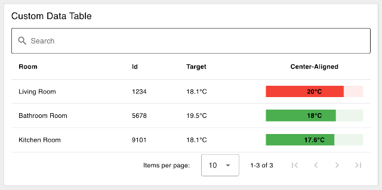
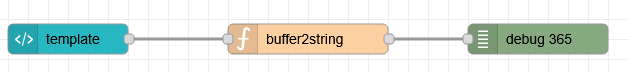

| [На головну](../) | [Розділ](README.md) |
| ----------------- | ------------------- |
|                   |                     |

# Таблиця даних `ui-table` 

https://dashboard.flowfuse.com/nodes/widgets/ui-table.html

[Демо](https://dashboard-demos.flowfuse.cloud/dashboard/table)

## Надсилання даних

Відтворює набір даних у табличному форматі. Очікує введення (`msg.payload`) у форматі:

```json
[{
    "colA": "A",
    "colB": "Hello",
    "colC": 3
}, {
    "colA": "B",
    "colB": "World",
    "colC": 5
}]
```

Таблиця відтворюватиметься зі стовпцями `colA`, `colB` і `colC`, якщо «Columns» не визначено явно на вузлі, а «Автоматичні стовпці» вимкнено.

Ви також можете надіслати окремий фрагмент даних для додавання до існуючої таблиці, у цьому випадку `ui-table` очікує введення (`msg.payload`) у форматі:

```json
{
    "colA": "A",
    "colB": "Hello",
    "colC": 3
}
```

Ви можете надіслати порожній масив, щоб очистити таблицю.

```json
[]
```

## Властивості 

| Prop         | Dynamic | Description                                                  |
| ------------ | ------- | ------------------------------------------------------------ |
| Group        |         | Означує, у якій групі інформаційної панелі інтерфейсу відображатиметься цей віджет. |
| Size         |         | Керує шириною кнопки відносно батьківської групи. Максимальне значення – ширина групи. |
| Label        |         | Текст, який відображається над таблицею, позначає, що відображає таблиця. |
| Max Rows     |         | Означує максимальну кількість рядків даних для відтворення в таблиці. Зайві рядки будуть доступні через контроль розбивки сторінок. Встановіть значення "0", щоб не розбивати сторінки. |
| Breakpoint   |         | Керує, коли таблиця відтворюватиметься як картка, де кожен стовпець із рядка відтворюватиметься як рядок у більшому розмірі, міститиме рядок для одного запису. Точка зупину вимірюється на основі ширини таблиці , а не ширина екрана. |
| Selection    |         | Надає три варіанти взаємодії з таблицею - "None", "Click" and "Checkbox" |
| Show Search  |         | Означує, чи показувати панель пошуку над таблицею. Дозволить пошук і фільтрацію в усіх стовпцях. |
| Auto Columns |         | Якщо позначено, стовпці обчислюються автоматично на основі вмісту отриманих повідомлень. |
| Columns      |         | Якщо для параметра "Auto Columns" встановлено значення «false», ці стовпці використовуються під час візуалізації таблиці. |

### Selection (Вибір) 

- **None**: вибір заборонено. Таблиця просто відображатиме дані.
- **Click**: повний рядок стає об’єктом, який можна натиснути, а вузол `ui-table` *виведе повний об’єкт*, пов’язаний із рядком, коли натиснути.
- **Checkbox**: кожен рядок має прапорець, а вузол `ui-table` *виводитиме масив об’єктів*, пов’язаних із позначеними рядками, коли прапорець встановлено.

Відповідні події виведуть наступне:

```json
{
    "payload": <full row object>,
    "action": "row_click" | "multiselect"
}
```

Ви також можете додати тип клітинки Кнопка і таким чином створювати події.

### Responsiveness 

Властивість *"Breakpoint"* для таблиці інтерфейсу користувача дає вам контроль над тим, коли таблиця перейде в "мобільний" режим, і відображатиме рядок даних охоплення як картку. Це корисно, коли у вас багато стовпців, а таблиця занадто широка, щоб поміститися на екран мобільного. Точка зупину вимірюється на основі **ширини таблиці**, а не ширини екрана.


Вигляд робочого столу прикладу таблиці інтерфейсу користувача


*Mobile View of the same UI Table*

Точку переривання (breakpoint ) можна означити одним із трьох способів: 

- **defaults**: виберіть одну з попередньо означених точок зупину (xs, sm, md, lg).
- **px**: вручну означте значення `px`, щоб таблиця перемикала в мобільний режим, коли вона виходить за цю ширину..
- **none**:  завжди відображати як рядки даних у таблиці, ніколи не перемикатися на "Мобільний" режим

### Configuring Columns 


*Screenshot of the configuration options available for column types in Node-RED*

Якщо ви вимкнете параметр «Auto Columns», ви матимете більше можливостей для означення стовпців для вашої таблиці. Для кожного стовпця можна означити наступне:

- **Value**: значення для відтворення елемента керування. Зазвичай ви надаєте ключ до значення в об’єкті рядка даних, але його можна змінити, щоб надати фіксоване значення рядка.
- **Label**: текст для відображення в заголовку стовпця.
- **Width**: ширина стовпця може бути в пікселях, % або будь-якому іншому допустимому розмірі CSS.
- **Align:** Вирівнювання тексту в стовпці. Може бути `Left`, `Center` або `Right`. Зауважте, що деякі стовпці виглядають дивно з вирівнюванням по центру, оскільки заголовок також містить місце для значка сортування.
- **Type**: означує тип комірки та контролює спосіб відображення даних у цьому стовпці.

### Cell Types 


*An example of a ui-table displaying various of the cell types available*

- **Text**: відображає комірку як звичайний текст.
- **HTML**: враховуватиме нові розриви рядків (наприклад, `\n`) і базові теги HTML.
- **Link**: відображає клітинку як гіперпосилання. Поле `Link` має містити URL-адресу, на яку потрібно зробити посилання.
- **Color**:  відтворює комірку як кольорову рамку. Поле  `Color`  має містити дійсний колір CSS.
- **Tick/Cross**: візуалізація клітинки у вигляді галочки або хрестика. Поле `Значення` має містити логічне значення (`true`/`false`).
- **Progress**: візуалізація комірки як індикатора виконання. Поле `Value` має містити число від 0 до 100.
- **Sparkline - Trend**: відображає комірку як невелику лінійну діаграму без осей. Поле `Value` має містити масив чисел для побудови.
- **Sparkline - Bar**: візуалізація комірки у вигляді невеликої гістограми без осей. Поле `Значення` має містити масив чисел для побудови.
- **Button**: : відображає кнопку, яку можна натиснути, у комірці. Позначкою кнопки буде або `row[key]`, або фіксований рядок, введений у конфігурації стовпця вручну.
- **Row Number**: відображає номер рядка в клітинці.
- **Image**: рендерить клітинку як зображення. Надане значення "Image" має бути дійсною URL-адресою. URL-адреса даних також підтримується для зображень у кодуванні base64. Якщо вказано недійсну URL-адресу, з’явиться порожнє місце.

#### Interaction: Buttons 

Тип комірки `Button` відображатиме кнопку, яку можна натиснути, у комірці. Мітка кнопки буде відповідним значенням у вашому рядку для наданого `key`. Після натискання кнопки вузол `ui-table` виведе:

```json
{
    "payload": <full row object>
    "column": <column key>
    "action": "button_click"
}
```

За допомогою клавіш `action` і `column` ви можете означити, яку кнопку було натиснуто, і використати `payload`, щоб означити, з яким рядком вона була пов’язана.

## Dynamic Properties 

Динамічні властивості – це властивості, які можна змінити під час виконання, надіславши певне `msg` до вузла.

У відповідних випадках основні значення, встановлені в Node-RED, будуть замінені значеннями, встановленими в отриманих повідомленнях.

| Prop  | Payload     | Structures | Example Values |
| ----- | ----------- | ---------- | -------------- |
| Class | `msg.class` | `String`   |                |

## Table Configuration 

### Search & Filter 

Вузол `ui-table` можна налаштувати для включення панелі пошуку над таблицею. Це дозволить користувачам шукати та фільтрувати всі стовпці, а також автоматично здійснювати пошук у всіх стовпцях під час введення.

#### Example 


*Example of a Data Table with Search & Filter" enabled.*

### Interaction 

Приклад, який показує, як виглядатиме таблиця з вибраними різними типами вибору.

#### Default - No Selection Events 


*Example of a rendered data table in a Dashboard.*

#### Multi-Selection 


*Example of a table that has "Multi Selection" enabled.*

#### Single Row Selection 


*Example of a data table that enables a row to be selected/clicked.*

### Pagination 


*Example of a paginated table which has 10 rows of data, but with "Max Rows" set to 5.*

Якщо ви хочете приховати параметри розбивки на сторінки ("Items per page"), ви можете встановити "Max Rows" на 0.

## Спеціальний стиль і вміст за допомогою  `ui-template`

Якщо ви бажаєте додати більше налаштувань до того, як відображаються ваші дані, ви можете зробити це, створивши власну таблицю даних у `ui-template`. Перегляньте наступний приклад, який взятий з [цього ресурсу](https://dashboard.flowfuse.com/user/template-examples.html#custom-tables).

Вузол `ui-table` досить простий у своїй функціональності та не дозволяє багато налаштовувати комірки та стилі. У Dashboard 1.0 існував популярний сторонній віджет `ui-table`, який пропонував ширші налаштування, але для Dashboard 2.0 ми застосували дещо інший підхід. Замість того, щоб означувати специфікацію, у яку ви повинні вставити свої дані, щоб використовувати встановлену кількість функцій у бібліотеці, у Dashboard 2.0 ви можете використовувати `ui-template`, щоб налаштувати таблицю даних у будь-який спосіб і з будь-яким форматом даних.



*Приклад спеціального заголовка та вмісту комірки з використанням шаблону інтерфейсу користувача та таблиці даних Vuetify*

Тут ми розглянемо, як ви можете використовувати вузол UI Template та [таблицю даних Vuetify](https://vuetifyjs.com/en/components/data-tables/basics/#usage) (це те, що ми все одно використовуємо під обкладинками в `ui-table`), щоб створювати таблиці даних з необмеженими налаштуваннями:

```vue
<template>
    <!-- Provide an input text box to search the content -->
    <v-text-field v-model="search" label="Search" prepend-inner-icon="mdi-magnify" single-line variant="outlined"
    hide-details></v-text-field>
    <v-data-table v-model:search="search" :items="msg?.payload">
      <template v-slot:header.current>
        <!-- Override how we render the header for the "current" column -->
        <div class="text-center">Center-Aligned</div>
      </template>

      <template v-slot:item.target="{ item }">
        <!-- Add a custom suffix to the value for the "target" column -->
        {{ item.target }}°C
      </template>

      <template v-slot:item.current="{ item }">
        <!-- Render a Linear Progress Bar for the "current" column -->
        <v-progress-linear v-model="item.current" min="15" max="25" height="25" :color="getColor(item)">
          <template v-slot:default="{ value }">
            <strong>{{ item.current }}°C</strong>
          </template>
        </v-progress-linear>
      </template>
    
    </v-data-table>
</template>

<script>
    export default {
    data () {
      return {
        search: ''
      }
    },
    methods: {
        // add a function to determine the color of the progress bar given the row's item
      getColor: function (item) {
        if (item.current > item.target) {
          return 'red'
        } else {
          return 'green'
        }
      }
    }
  }
</script>
```

Куди ми передаємо такі дані, як:

```json
[
    {
        "room": "Living Room",
        "id": "1234",
        "target": 18.1,
        "current": 20
    },
    {
        "room": "Bathroom Room",
        "id": "5678",
        "target": 19.5,
        "current": 18
    },
    {
        "room": "Kitchen Room",
        "id": "9101",
        "target": 18.1,
        "current": 17.6
    }
]
```

Таблиця даних Vuetify автоматично відобразить стовпець для кожного елемента в наданих даних; за замовчуванням вона просто відобразить його як текст (як ми робимо в `ui-table`). Однак ми також можемо використати синтаксис `<template v-slot:item.property />`, щоб замінити те, як ми візуалізуємо конкретну клітинку.

### Важлива примітка: чутливість до регістру

Це актуально, лише якщо ви бажаєте використовувати переозначення `<template>` у своїй `v-data-table`, щоб налаштувати зовнішній вигляд комірки або заголовка. Через обмеження у способі візуалізації HTML ви не можете використовувати великі літери в шаблонах DOM. Це означає, що якщо у ваших даних є властивість під назвою `myProperty` або `My_Property`, тоді нам потрібно перетворити її на формат, зручний для HTML, перш ніж ми зможемо включити її в `<template v-slot:item.property="{ item }">`.

Цю трансформацію можна здійснити за допомогою опції `headers` у `v-data-table`, яка дозволяє нам зіставляти значення та ключі.

```vue
<template>
    <div id="app">
        <v-text-field v-model="search" label="Search" prepend-inner-icon="mdi-magnify" single-line variant="outlined"
            hide-details></v-text-field>
        <v-data-table v-model:search="search" :headers="headers" :items="msg?.payload" class="elevation-1" :items-per-page="20">
            <template v-slot:header.lowercase>
                <div>custom <b>html</b> title</div>
            </template>
            <template v-slot:item.snake_case="{ item }">
                ${{ 3 * item.snake_case }}
            </template>
        </v-data-table>
    </div>
</template>

<script>
    export default {
    data () {
      return {
        search: '',
        headers: [
            // a basic header definition
            { title: 'kebab-case', key: 'kebab-case' },
            { title: 'slithering', key: 'snake_case'},
            // we can also skip defining a title here,
            // and use v-slot (see in HTML above) instead
            { key: 'lowercase' },
            // if we need to transform due to case sensitivity, we can do so like this:
            { title: 'Date & Time', key: 'camel-case', value: item => item['camelCase']},
            // we can also add JS transformation to our values too
            { title: 'All Caps', key: 'macro-case', value: item => item['MACRO_CASE'].toUpperCase()}
        ],
      }
    },
  }
</script>
```

Підводячи підсумок, можна сказати, що чутливість до регістру є різними способами:

| Type         | Transform Required |
| ------------ | ------------------ |
| `kebab-case` | No                 |
| `snake_case` | No                 |
| `lowercase`  | No                 |
| `camelCase`  | Yes                |
| `MACRO_CASE` | Yes                |

Ви можете спробувати наведений вище приклад за допомогою цього потоку:



```vue
<template>
    <!-- Card for uploading binary file -->
    <v-card raised color="white">
        <!-- Card Title -->
        <v-card-title>Upload binary file to Node-Red</v-card-title>
        <br>
        <v-card-text>
            <!-- File Input -->
            <v-file-input label="Click here to select a file" show-size v-model="uploadFile">
            </v-file-input>
            <!-- Progress Indicator -->
            <div>Progress: {{ progress }} bytes loaded</div>
        </v-card-text>
        <v-card-actions>
            <v-spacer></v-spacer>
            <!-- Upload Button -->
            <v-btn right @click="startUpload">Upload File</v-btn>
        </v-card-actions>
    </v-card>
</template>

<script>
    export default {
        data() {
            return {
                uploadFile: null, // Holds the selected file
                progress: 0 // Progress indicator for file upload
            }
        },
        methods: {
            // Method triggered when Upload File button is clicked
            startUpload() {
                // Check if a file is selected
                if (!this.uploadFile) {
                    console.warn('No file selected');
                    return;
                }

                // Log the selected file information to console
                console.log('File selected:');
                console.log(this.uploadFile);

                // Create a FileReader instance to read the file
                const reader = new FileReader();

                // When the file is read, send it to Node-RED
                reader.onload = () => {
                    // Prepare the payload to send
                    const payload = {
                        topic: 'upload', // Topic for Node-RED
                        payload: this.uploadFile, // File content
                        file: {
                            name: this.uploadFile.name, // File name
                            size: this.uploadFile.size, // File size
                            type: this.uploadFile.type // File type
                        }
                    };
                    
                    // Send the payload to Node-RED (assuming 'send' method is defined)
                    this.send(payload);
                };

                // Track progress of file reading
                reader.onprogress = (event) => {
                    this.progress = event.loaded; // Update progress
                };

                // Read the file as an ArrayBuffer
                reader.readAsArrayBuffer(this.uploadFile);
            }
        },
    }
</script>
```

```js
msg.payload = msg.payload.toString()
return msg;
```

Крім того, майте на увазі, що під час використання цього прикладу з налаштуваннями Node-RED за замовчуванням він прийматиме лише файли розміром до 1 МБ. Інформаційна панель використовує для зв’язку `socket.io`, який має обмеження за замовчуванням у 1 МБ. Ви можете збільшити цей ліміт, змінивши наступне значення у файлі `settings.js`. Для отримання додаткової інформації зверніться до Налаштувань.

```js
dashboard: {
    maxHttpBufferSize: 1e8 // size in bytes, example: 100 MB
}
```

