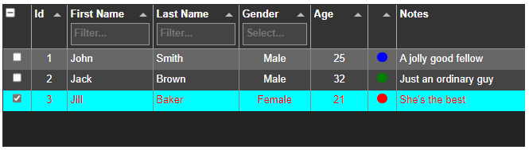
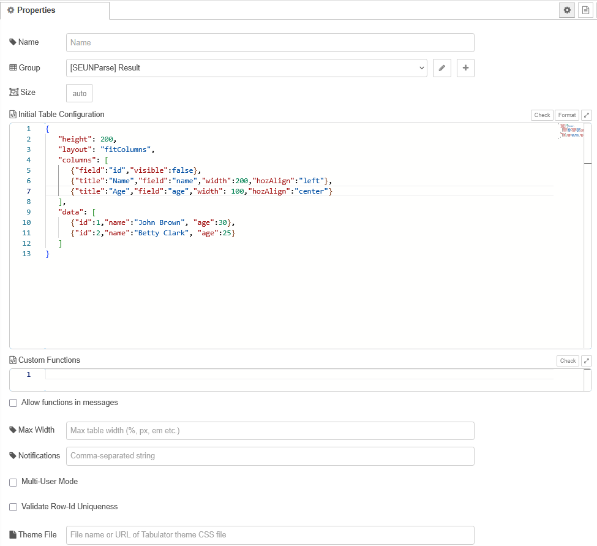

| [На головну](../) | [Розділ](README.md) |
| ----------------- | ------------------- |
|                   |                     |

# ui-tabulator

<https://github.com/omrid01/node-red-dashboard-2-table-tabulator>

Вузол таблиці (з використанням Tabulator) для Node-RED Dashboard 2.0. 




Спеціальний вузол `ui-tabulator` використовує популярний пакет JavaScript [Tabulator](https://www.tabulator.info) для оновлення, представлення та запитів до таблиць інтерфейсу користувача.

> Примітка: цей вузол доповнюється, а не замінює рідний вузол таблиці інформаційної панелі V2.0 на основі vue.

## Загальний огляд

- Вузол служить розумною оболонкою, що містить об’єкт Tabulator (таблиця). Здебільшого він викликає API Tabulator як є (як визначено в [Документації Tabulator](https://tabulator.info/docs/6.2)).
- Вузол дозволяє автоматично створювати екземпляри таблиці (із визначеною користувачем конфігурацією та початковими даними), а також динамічно створювати/змінювати/знищувати таблиці під час виконання.
- Інтерфейс до вузла здійснюється через повідомлення (звичайні об’єкти Node-red msg). Повідомлення вказує команду (і аргументи) і повертає відповідь таблиці
- Таблиця приймає команди налаштування даних (наприклад, setData, addData, updateData, deleteData тощо), а також команди запиту даних (getData, searchData тощо), а також редагування даних у клітинці (з інтерфейсу користувача).
- Крім того, таблиця може надсилати незапитувані повідомлення про події для вибраних подій таблиці (клацання комірки та рядка/подвійне клацання, редагування комірки тощо)
- За замовчуванням таблиця працює в спільному режимі, тобто спільне зображення таблиці (дані + стиль) у всіх одночасних клієнтах інформаційної панелі. Зображення таблиці також кешується в сховищі даних Node-RED і перезавантажується після відкриття браузера, оновлення тощо.
 Вузол також підтримує режим Багатокористувацький  режим , який підтримує незалежні, специфічні для клієнта дані таблиці з «приватними» повідомленнями.

Приклад налаштування команди на встановлення даних

```js
msg.tbCmd  = "addData";
msg.tbArgs = [
   [
      {id:1, name:"bob", gender:"male"},
      {id:2, name:"Jenny", gender:"female"}
   ],
   true
];
```

Приклад команди отримання даних

```js
msg.tbCmd  = "searchData";
msg.tbArgs = [ "age", ">", 12 ];
```

Приклад події

```js
{
    topic: "tbNotification",
    event: "cellEdited",
    payload: {
        id: 2,
        field: "name",
        newValue: "Jack Brown",
        oldValue: "John Doe"
    },
    _client: {
        socketId: "uXRxjY9yO-Hya1vtAAAB"
    },
    _msgid:"6d9d7a97666f2783"
}
```


## Архітектурні концепції в багатоклієнтському середовищі

Таблиці створюються як віджети на сторінці клієнта (браузера). Отже, у випадку кількох клієнтів інформаційної панелі один вузол `ui-tabulator` пов’язується з кількома віджетами таблиці. Відповідно до структури Node-RED, кожне повідомлення, надіслане до вузла `ui-tabulator` у потоці, реплікується на всі його віджети. Якщо об’єкт таблиці відповідає, потік отримає кілька ідентичних відповідей (по одній на клієнта). Щоб увімкнути спільний режим, де всі віджети таблиці синхронізовані та мають загальне зображення даних, ми робимо наступне:

- Команди налаштування даних і стилів, що надсилаються з вузла `ui-tabulator` до всіх віджетів таблиці паралельно, таким чином застосовуючи однакові зміни до віджетів
- (Ідентичні) відповіді таблиці на повідомлення команд групуються за `msgid`, і лише одна відповідь повертається до потоку
- Коли користувач змінює дані таблиці безпосередньо в інтерфейсі користувача будь-якого клієнта, сповіщення про оновлення автоматично надсилається всім іншим клієнтам
- Поточне зображення даних таблиці завжди зберігається в сховищі даних Node-RED, автоматично відновлюючи зображення таблиці після відкриття/оновлення клієнта.

Зважаючи на вищесказане, деякі аспекти представлення таблиці (поверх загального зображення даних) за своєю природою пов’язані з користувачем і не синхронізуються. Наприклад, користувачі можуть захотіти встановити власну фільтрацію/сортування або вибрати певні рядки для подальших дій. У таких випадках кожна клієнтська таблиця може повертати різну відповідь на команди запиту даних. Для цього команду слід присвоїти певному віджету таблиці (вказавши ідентифікатор клієнта або запустивши команду з об’єкта інформаційної панелі, наприклад кнопки, на тому самому клієнті)

Після перезапуску, розгортання та повторного підключення сервера інколи прослуховувачі сокетів клієнта у структурі Node-RED не відновлюються належним чином. Як тимчасовий обхідний шлях, доки це не буде виправлено в Node-RED, кожна сторінка клієнта автоматично перезавантажується один раз після повторного підключення (показує невелике «мерехтіння»).

## Деталі роботи вузла

### Конфігурування



Властивості конфігурації вузла (в редакторі):

- `Name`, `Group`, `Size`: - те саме, що й у всіх вузлах dashboard 2.0


#### `Initial Table Configuration`

Це об’єкт JSON з усіма визначеннями таблиць і стовпців і (необов’язково) початковими даними

Наприклад:

```js
{
   "height": 200,
   "layout": "fitColumns",
   "columns": [
      {"field":"id","visible":false},
      {"title":"Name","field":"name","width":200,"hozAlign":"left","editor":"input"},
      {"field":"status","width": 20,"hozAlign":"center",formatter:"traffic"}
   ],
   "data": [
      {"id":1,"name":"John Brown", "status":3},
      {"id":2,"name":"Jill Clark", "status":1}
   ]
}
```

Опції описані в  [Tabulator Setup](https://tabulator.info/docs/6.3/options)

Якщо залишити порожнім, вузол завантажиться без створення таблиці (таблицю можна створити пізніше під час виконання за допомогою команди `tbCreateTable`).

#### `Custom Functions`

логічні вирази для користувацьких або динамічних налаштувань таблиці, напр. умовне форматування, визначені користувачем фільтри/валідатори тощо.

```js
function funcName(param1,param2,...){function body}
```

Наприклад:

```js
function AddCelsius (cell) {return cell.getValue() + (cell.getValue()!=='' ? '°C' : '')}
function func2 (...) {...}
// etc.
```

Визначення функцій мають відповідати точному відповідному прототипу, очікуваному Tabulator, а їхні назви чутливі до регістру.
При вказівці функції в конфігурації таблиці перед нею має стояти спеціальний маркер `@F:`. Нижче наведено приклад налаштування умовного форматування в стовпці:

Означення функцій  в Custom Functions: 

```js
function ageColor (cell,params) {
   if (cell.getValue() < params.minAge)
      cell.getElement().style.color='red';
   return cell.getValue()
}
```

Посилання на функцію в конфігурації таблиці:

```js
"columns": [
      {"title":"Age", "field":"age", "formatter":"@F:ageColor", "formatterParams":{"minAge": 18}},
]
```

Таким же чином функції також можна вказати в (деяких) командах таблиці. Наприклад:

```js
msg.tbCmd = "setSort";
msg.tbArgs = [
   "@F:mySortFunction",
];
```

Користувальницькі функції наразі підтримуються лише для команд конфігурації та вигляду таблиці (групування, фільтрування, сортування тощо). Їх не можна встановити в даних таблиці (наприклад, `{ "id": 2, "price": @F:calcPrice }` БУДЕ ІГНОРУВАТИСЯ. Ключове слово `function` зарезервовано для оголошення функції. Не вказуйте це більше ніде в тілі функції, навіть у коментарях

Ту саму функцію можна повторно використовувати в багатьох місцях Також можна визначити безіменні (вбудовані) функції безпосередньо в аргументах таблиці у форматі `@F:(параметр1,параметр2,...)=>{тіло функції}`. Наприклад:

```js
msg.tbCmd = "setFilter";
msg.tbArgs = [
   "@F:(rowData,params)=>{return rowData.age > params.minAge}",
   {"minAge": msg.age}
];
```

Під час розробки або усунення несправностей радимо відкрити консоль браузера клієнта, щоб переглянути синтаксичні помилки та винятки. Ви також можете використовувати онлайн-тестер JS (наприклад, [myCompiler](https://www.mycompiler.io/new/nodejs)), щоб протестувати та перевірити свої функції.

#### Інші налаштування

- `Allow functions in messages`: (Так/Ні) - параметр безпеки для блокування впровадження функції під час виконання. Якщо цей прапорець знято, повідомлення під час виконання, які містять визначення функцій, блокуються, і дозволені лише посилання на попередньо Custom Functions (у користувацьких функціях вузла).
- `Max Width`: встановлює максимальну видиму ширину таблиці. Якщо ширина або висота таблиці перевищує видиму область, з’являться смуги прокручування. Ширину слід надати у форматі стилю CSS, наприклад. 500px (пікселі), 100em (розмір шрифту) тощо.
- `Notifications`: вибір подій таблиці, які викликають сповіщення, наприклад

```
cellEdited,rowDblClick
```

Список підтримуваних подій наведено в розділі «Сповіщення таблиці».

- `Multi-user mode`: (Так/Ні)

За замовчуванням (не позначено), вузол працює в спільному режимі, де всі екземпляри таблиці в одночасних клієнтах інформаційної панелі синхронізуються та показують одне й те саме зображення таблиці (дані та стиль). Крім того, зображення таблиці автоматично кешується в сховищі даних Node-RED і перезавантажується після відкриття/оновлення браузера.

Зауважте, що деякі дії користувача (наприклад, фільтрування, сортування, вибір рядків тощо) вважаються «специфічними для клієнта» і не впливають на інших клієнтів або сховище даних.

 Якщо виставлено (багатокористувацький режим), кожна клієнтська таблиця є незалежною та підтримує власний образ даних без збереження/перезавантаження сховища даних. Див. додаткові відомості в розділі «Робота в багатоклієнтському середовищі» нижче.

- `Row-Id validation/duplication check` (Y/N). Якщо позначено, оновлення даних перевіряються, щоб переконатися, що немає відсутніх, недійсних або повторюваних ідентифікаторів рядків. Якщо таблиця містить дуже великий обсяг даних, ця перевірка може дещо уповільнити оновлення даних.

- `CSS theme`: вибір додаткової таблиці стилів CSS табулятора (наприклад, Midnight, Modern тощо). Файл можна вибрати зі списку попередньо визначених тем табулятора за допомогою префікса `@CSS:`, наприклад:

```
@CSS:tabulator_midnight.min.css
```

Якщо не має префікса `@CSS:`, вважається, що це повне ім’я файлу (включаючи шлях) у файловій системі сервера.

Примітка: вибір теми застосовується на рівні сторінки, тобто застосовується до всіх вузлів таблиці, які знаходяться на одній сторінці. Перегляньте додаткові способи стилізації в розділі «Стилі таблиць» нижче.

- `DIV Override`: необов’язково: дозволяє вказати ідентифікатор HTML DIV, у якому буде створено таблицю, замінюючи автоматично виділений за замовчуванням DIV. За замовчуванням таблиця генерується в автоматично створеному DIV (HTML-контейнері). Вказівка ідентифікатора DIV дає змогу створити таблицю у формі інтерфейсу користувача, визначеній в іншому вузлі шаблону, і керувати її стилем, видимістю тощо. Ідентифікатор має бути унікальним, містити лише буквено-цифрові символи, «-» та «_» і не починатися з цифри. Наприклад:

```vue
<template>
   <h2>My Form</h2>
   <div class="my-form">
      <label>Name: </label><input type="text" id="name"><br>
      <label>Age: </label><input type="text" id="age"><br>

      <div id="MyTable1234"></div>         <!-- Table will come here -->

      <br><button onClick="insertTable()">Insert to Table</button>
  </div>
</template>
```

У наведеному вище прикладі, якщо встановити перевизначення DIV на "MyTable1234", таблицю буде створено всередині форми.

### Inputs

-  `tbCmd` string - Команда, надіслана до вузла. Може викликати API Tabulator (для налаштування/отримання даних або зміни зовнішнього вигляду) або додаткові функції.

-  `tbArgs` array - Загальний контейнер вхідних аргументів для команд API Tabulator, структурованих як масив аргументів.

### Outputs

- `payload` various - Дані, отримані з таблиці. Якщо таблиця не повертає жодних даних, оригінальний `msg.payload` залишається незмінним

- `error` string - опціональна властивість, що вказує на помилку команди, з відповідним повідомленням про помилку

- `topic` string - опціональна властивість. Значення `tbNotification` вказує на спонтанне повідомлення, ініційоване подією таблиці (з `msg.event`, що вказує на тип події, і `msg.payload`, що містить пов’язану інформацію про подію) у аргументах для команд `Tabulator API`, структурованих як масив аргументів.

### Загальні примітки

- Табулятор вимагає, щоб кожен рядок таблиці мав унікальний ідентифікатор. Зазвичай це поле `id`, але може бути й інше поле, визначене властивістю `index` конфігурації таблиці.

- Повідомлення, надіслані до вузла, повертаються без змін (за винятком `payload` і потенційно `error`). Якщо користувач не хоче отримувати відповідь на повідомлення, він може позначити це повідомлення прапорцем `msg.tbDoNotReply = true`.

- Сховище даних, яке кешує зображення таблиці, очищається після перезапуску сервера Node-RED, тому збереження даних таблиці є відповідальністю розробника потоку.

- Під час роботи з великими наборами даних (у спільному режимі) рекомендується напряму запитувати сховище даних (за допомогою таких команд, як `tbGetDsData` (описано пізніше), щоб уникнути впливу на продуктивність. Якщо ви використовуєте звичайні команди табулятора (наприклад, `getData`), вам може знадобитися збільшити максимальний розмір вихідного повідомлення панелі інструментів, який за замовчуванням становить 1 МБ. Його можна встановити в `settings.js` наступним чином:

  ```js
  dashboard: {
     maxHttpBufferSize: 1e8 // size in bytes, example: 100 MB
  }
  ```

### Команди

Команди, які надсилає `ui-tabulator`, діляться на 3 типи:

- Команди API Tabulator - безпосередньо зіставлені з API Tabulator
- Команди віджетів - обробляються у віджеті інформаційної панелі та застосовують додаткову обробку/аналіз викликів API Tabulator
- Команди вузла (сервера) – обробляються вузлом (як частина потоку) і не надсилаються на інформаційну панель, тому не потрібно, щоб клієнти інформаційної панелі були відкриті. Застосовується лише в спільному режимі.

Короткий опис команд API Tabulator:

- Data update

  ```
  setData, replaceData, updateData, addData, updateOrAddData, addRow, updateRow, deleteRow, updateOrAddRow, clearData
  ```

- Data Retrieval

  ```
  getData, getDataCount, getRow, searchData, getSelectedData
  ```

- Data Selection

  ```
  selectRow, deselectRow
  ```

- Table Appearance

  ```
  showColumn, hideColumn, setSort, setFilter, getFilters, addFilter, removeFilter, clearFilter
  ```

- Misc.

  ```
  download
  ```

Короткий опис команд віджетів

- Table Instantiation

  ```
  tbCreateTable, tbDestroyTable, tbResetTable
  ```

- Table Appearance

  ```
  tbSetStyles, tbClearStyles, tbSetGroupBy
  ```

Зведення команд вузла (сервера).

- Datastore Query

  ```
  tbGetDsData, tbGetDsDataCount
  ```

Існують також додаткові тестові та службові команди, перелічені в розділі Тестування та налагодження.

#### Команди API Tabulator

Команди API Tabulator використовують точні (з урахуванням регістру) аргументи введення/виведення, як визначено в документації [Tabulator](https://tabulator.info/docs/6.3). 

Приклади Tabulator наведені [за посиланням](https://tabulator.info/examples/6.3)

Вхідні аргументи мають бути надані як масив у властивості `msg.tbArgs`. Якщо API не потребує аргументів, властивість `tbArgs` може бути порожнім масивом (`[]`) або взагалі виключена з повідомлення. приклади:

```js
msg.tbCmd = "searchData";
msg.tbArgs = ["age", ">", 10];
//-----------------------------------------
msg.tbCmd  = "addData";
msg.tbArgs = [
   [
      {id:1, name:"bob", gender:"male"},
      {id:2, name:"Jenny", gender:"female"}
   ],
   true
];
```

Властивість `msg.tbArgs` завжди має бути масивом. Один аргумент все одно має бути наданий як масив з одним елементом (навіть якщо цей елемент сам по собі є масивом), наприклад:

```js
msg.tbCmd  = "updateData";
msg.tbArgs = [
   [
      {id:1, name:"bob"}
   ]
];
```

Для API Tabulator, які приймають аргументи «функції», ви можете надати посилання на список Custom Functions таблиці, використовуючи префікс `@F:`. Наприклад:

```js
tbCmd  = setFilter;
tbArgs = [
    @F:myFilterFunction,
    {height:3}
  ];
```

Повернуті повідомлення про помилки передає Tabulator. У деяких випадках Tabulator ігнорує недійсні виклики API, не повертаючи помилки, або повертає помилку після часткового успіху (наприклад: команда оновлення даних, яка містить неіснуючі рядки, оновить дійсні рядки, але все одно поверне помилку

##### Оновлення даних

Дані рядка табулятора означуються як масив об’єктів, які можна передати як масив або отримати як рядок у форматі JSON за допомогою AJAX з URL-адреси. Дані можуть містити більше стовпців, означених у параметрах стовпців, вони зберігатимуться разом з рештою даних, але не відображатимуться на екрані. Приклад набору даних JSON:

```js
[
    {id:1, name:"Billy Bob", age:"12", gender:"male", height:1, col:"red", dob:"", cheese:1},
    {id:2, name:"Mary May", age:"1", gender:"female", height:2, col:"blue", dob:"14/05/1982", cheese:true}
]
```

Примітка: якщо ви визначили будь-які мутаційні функції у своєму масиві визначення стовпця, вони будуть застосовані до ваших даних під час аналізу в таблиці. (додаткову інформацію дивіться в Мутатори).

Унікальне значення індексу повинно бути присутнім для кожного рядка даних, якщо ви хочете мати можливість програмно змінити ці дані пізніше, це має бути число або рядок. За замовчуванням Tabulator шукатиме це значення в полі `id`. Якщо ви бажаєте використовувати інше поле як індекс, установіть це за допомогою параметра `index`.

###### setData

Ви можете передати масив безпосередньо в таблицю за допомогою методу setData.

```js
msg.tbCmd = "setData";
msg.tbArgs = [[{id:1, name:"bob"}]];
```

###### replaceData

Функція replaceData дає змогу замінити всі дані в таблиці без оновлення позиції прокручування, сортування чи фільтрації та без запуску спливаючого вікна завантаження ajax. Вона приймає ті самі аргументи, що й функція setData, і поводиться так само під час завантаження даних (тобто, може робити запити Ajax, аналізувати JSON тощо)

###### updateData

###### addData 

###### updateOrAddData 

###### addRow

###### updateRow 

###### deleteRow

###### updateOrAddRow

###### clearData

##### Отримання даних

###### getData

###### getDataCount

###### getRow

###### searchData

###### getSelectedData

##### Вибір даних

###### selectRow

###### deselectRow

##### Зовнішній вигляд таблиці

###### showColumn

###### hideColumn

###### setSort

###### setFilter

###### getFilters

###### addFilter

###### removeFilter

###### clearFilter

##### download

#### Команди віджетів

Команди віджетів мають префікс `tb` і не включені в документацію Tabulator. Зазвичай вони мають власні аргументи, що стосуються команд, як описано нижче:

##### `tbCreateTable`

Створює нову таблицю після знищення попередньої (якщо існувала). Аргументи:

- `tbInitObj` - Об’єкт конфігурації таблиці з такою самою структурою, як і вузол `Initial Table Configuration` (описаний в  [Tabulator Setup](https://www.tabulator.info/docs/6.3/quickstart#setup)).

- `tbFuncs` - Додатковий рядок із означенням `Custom Functions`, такий самий, як у конфігурації таблиці вузла. Якщо не надано, вузол використовуватиме функції, означені в конфігурації вузла.


Повертає рядок успіху в `payload`, коли таблицю створено та готово, або властивість `error` у разі помилки. Примітка: під час створення таблиці за допомогою `tbCreateTable` (у спільному режимі) нова конфігурація таблиці кешується в сховищі даних і замінює початкову конфігурацію таблиці та спеціальні функції вузла (до наступного перезапуску Node-RED).

##### `tbDestroyTable` 

Destroys the existing table. Arguments: none. Returns an `error` property upon failure.

##### `tbResetTable`

Discards all changes and recreates the table from the node's initial configuration property. Arguments: none. Returns a success string in `payload` once table is recreated and ready, or an `error` property upon failure.

##### `tbSetStyle` 

Sets a formatting style (color, size, font etc.) to a specified scope of cells. Arguments: 

- `tbScope` - An object with 2 optional fields: `rowId` and `field`
  
  - `rowId` - indicates the row index (the value of  `id` , or a row index field specified by  `index` in the table configuration). `rowId`

    with the reserved value `tbHeader` indicates the header row. 

  - `field` - indicates the column name. The scope is derived as follows: 
  
  ```js
  msg.tbScope = {rowId:2,field:"name"};         // affects the cell in row 2, column "name"
  msg.tbScope = {rowId:2};                      // affects all row 2
  msg.tbScope = {field:"name"};                 // affects the whole column "name"
  msg.tbScope = {rowId:"tbHeader",field:"name"};// affects the header of column "name"
  msg.tbScope = {rowId:"tbHeader"};             // affects all the headers
  msg.tbScope = {};                             // affects the whole table
  ```
  
- `tbStyles` - an object specifying one or more CSS styles. For example:

  ```js
  msg.tbStyles = {
      backgroundColor: "cyan",
      color: "red"
  };
  ```


​	Returns an `error` property upon failure.

##### `tbClearStyles`

Discards all the dynamic styling which were applied by `tbSetStyle`. Arguments: none

##### `tbSetGroupBy` 

Enables grouping the table by one or more fields. Arguments: 

- `tbFields` - A field name, or array of field names, for grouping the table.  Omitting this argument or providing an empty string will clear the  current grouping. The field name(s) can also be functions.
  
- `tbGroupHeader`- Optional header-formatting expression (or array of expressions), which can be either: 	
  
  - Reference to a function from the node's Custom Functions list (prefixed by `@F:`)
  - Unnamed inline function (prefixed by `@F:`)
  - A formatting string, which can include 3 pre-defined tokens: 		
    - `$field` - the name of the grouping field
    - `$value` - the grouping value of the current group
    - `$count` - the number of rows in the group
  
  For example: 

```
msg.tbFields = "name" msg.tbGroupHeader = "$field=$value, ($count items)"
name=John, (5 items)
```

​			The formatting string can be further customized by CSS styling. For example: 	

`msg.tbGroupHeader="$field=<span style="color:red">$value</span>, (<b>$count</b> items)"`

#### Команди вузла (серверу)

The node commands are also prefixed with "tb", and not included in the Tabulator documentation.

- `tbGetDsData` - Queries the datastore and returns the table data (applicable for Shared mode only). Useful for tables with large data sets. Output is in same format as in `getData`.  Arguments: none
  
- `tbGetDsDataCount` - Returns the table's row count from the datastore (Applicable for Sharedmode only).  Arguments: none

### Повідомлення в таблиці

Окрім відповіді на команди, вузол може надсилати спорадичні сповіщення про вибрані події таблиці, визначені у властивості конфігурації `Notifications`. Для вихідних сповіщень `msg.topic` має значення `tbNotification`, `msg.event` з типом події та `msg.payload` з даними події. Наприклад:

```js
{
   topic: "tbNotification",
   event: "cellEdited",
   payload: {
      id: 2,
      field: "name",
      newValue: "Jack Brown",
      oldValue: "John Doe"
   },
   notificationId: "4a1a59ca-ca8f-45a5-ae30-aa72fe06e5c5",
   _client: {
      socketId: "uXRxjY9yO-Hya1vtAAAB"
    },
   _msgid:"6d9d7a97666f2783"
}
```

Підтримувані події

- Table Creation

  ```
  tableBuilt, tableDestroyed
  ```

- UI Interaction

  ```
  rowClick, rowDblClick, rowTap, rowDblTap, rowTapHold, rowSelected, rowDeselected, rowMoving, rowMoved, rowMoveCancelled, columnMoved, cellClick, cellDblClick, cellTap, cellDblTap, cellTapHold
  ```

- Cell Change (by user in-cell editing) 

  ```
  cellEdited
  ```

- Data Change

  ```
  rowAdded, rowUpdated, rowDeleted, dataChanged
  ```

Примітка: сповіщення про взаємодію інтерфейсу користувача (наприклад, `cellClick`) запускаються один раз від свого клієнта. Однак сповіщення, викликані командами створення таблиці та зміни даних (наприклад, сповіщення `rowAdded` після команди `addRow`), надсилатимуться для кожного екземпляра таблиці (тобто від кожного клієнта)

### Робота в багатоклієнтському середовищі

У Node-RED кожен вузол інформаційної панелі (кнопка, список, таблиця тощо) має відповідний Widget (інтерфейс користувача) на сторінці інформаційної панелі. Отже, у багатоклієнтському середовищі кожен екземпляр вузла інформаційної панелі асоціюється з декількома віджетами, а вхідні повідомлення до цих вузлів транслюються Node-RED до їхніх віджетів для всіх клієнтів.

Повідомлення до `ui-tabulator` можна надсилати з:

- Вузли Server (не інформаційної панелі) (наприклад, inject, http-in тощо): отримуватимуть усі клієнти (незалежно від загального/багатокористувацького режиму)
- Віджети інформаційної панелі (наприклад, кнопки, спадні списки): отримуватиме лише власний клієнт (окрім випадків, коли надсилається команда зміни даних у спільному режимі)

Це дає змогу надсилати повідомлення користувача до віджету табулятора інтерфейсу користувача (наприклад, сортування, фільтрування, вибір рядків), не впливаючи на інших клієнтів, навіть у спільному режимі. Щоб примусово надсилати клієнтське повідомлення всім клієнтам, або видаліть ідентифікатор клієнта (властивість `msg._client`), або встановіть властивість `msg.tbClientScope = 'tbAllClients'`.

### Стилізація таблиць

Setting table styles can be done in several ways:

1. Theme file: specifying a Tabulator CSS stylesheet in the node configuration, from either the predefined theme-file list (prefixed by `@CSS:`) or a file on the server file system. Note: the theme selection is page-scoped, i.e. applies to all table nodes which are on the same page.

2. Page-level CSS - custom CSS classes defined in a related  `template` styling node, which either override the native  Tabulator CSS Classes, or use built-in predefined class names:

   - `ui-tabulator-class` - applied to the DIV containing the ui-tabulator widget
   - `ui-tabulator-wrapper` - applied to a wrapper DIV containing the above widget DIV

   These classes are page-scoped, i.e. apply to all ui-tabulator nodes on the page. For example:

   ```js
   .ui-tabulator-class {
     border: 4px solid red !important;
   }
   .tabulator-table .tabulator-cell { / applies to all table cells (page-scoped) /
     color: #CC3A82;
     font-weight: bold;
   }
   ```

6. Custom CSS in the table configuration e.g. in column properties such as `cssClass` , `formatter`

     and `titleFormatter`.

   For example:
   
   ```js
   columns [
       {"field":"name",...,"cssClas":"myClass1"},
    {"field":"age",...,"formatter":"@F:setClass2"}
   ]
   ```
   

where the  `setClass2` function is defined as:

```js
   function setClass2(cell) {
       cell.getElement().classList.add('myClass2');
       return cell.getValue();
}
```

   These classes are applied per table widget, allowing each table on the page to have its own styles.

8. `Runtime (dynamic) styling`: using the `tbSetStyle` command. This is also widget-scoped, and the applied styles are saved in the datastore (when in Shared mode).

### Тестування та налагодження

- During development/testing it is recommended to open both server  & client browser console windows, to view runtime log messages & errors (from both Tabulator itself & the ui-tabulator node).

- Setting an environment variable TBDEBUG=TRUE in the server (Node-RED) process, will enable verbose console log messages in both server & client.

- Available test/debug commands:

  - `tbShowDatastore`: retrieves the table image stored in the Node-RED datastore. Arguments:
  
    - `msg.tbOutput` - a string with either: 

      -  `msg`  - datastore image will be sent in `msg.payload`
  
    -  `log` - image will be printed to the Node-RED console
  

    ​	If `msg.tbOutput` is not specified, the image will be sent to both. 
  
  - `tbTestConnection`: tests the socket listeners between the Node-RED server and dashboard clients. Arguments: `msg.listener` - can be either `tbSendMessage` or `tbClientCommands`

  - `tbGetClientCount`: returns the nuber of connected dashboard clients. Arguments: None. Note: the returned number is of all connected clients, regardless if they include `ui-tabulator` widgets or not
