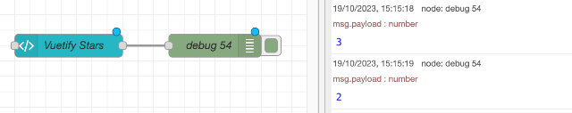

| [На головну](../) | [Розділ](README.md) |
| ----------------- | ------------------- |
|                   |                     |

# Template `ui-template` 

https://dashboard.flowfuse.com/nodes/widgets/ui-template.html

Надайте власний JS і HTML (включно з будь-якими [компонентами Vuetify](https://vuetifyjs.com/en/components/all/)) для відтворення на інформаційній панелі.

- Визначте власні компоненти Vue
- Завантажувати зовнішні залежності JS
- Напишіть необроблений JavaScript
- Використовуйте компоненти Vuetify

## Властивості

| Prop     | Dynamic | Description                                                  |
| -------- | ------- | ------------------------------------------------------------ |
| Group    |         | Визначає, у якій групі інформаційної панелі інтерфейсу відображатиметься цей віджет. |
| Scope    |         | Вузли шаблону можна використовувати для 3 цілей/областей: <br />**Widget (Group-Scoped):** Стандартний віджет HTML/Vue, що відображається в групі на інформаційній панелі. <br />**Widget (Page-Scoped):** Віджет HTML/Vue, який відображатиметься на сторінці поза будь-якими існуючими групами. Зауважте, що ці віджети відображатимуться після будь-яких груп. Прикладом використання цього може бути, якщо ви хочете мати фіксований нижній колонтитул на певній сторінці.<br />**Widget (UI-Scoped):**Віджет HTML/Vue відображається на кожній сторінці інформаційної панелі. Найчастіше використовується в поєднанні з  [Teleports](https://dashboard.flowfuse.com/nodes/widgets/ui-template.html#teleports)<br />**CSS (All Pages):** Означте власні класи/стилі CSS, які застосовуються до всієї інформаційної панелі. <br />**CSS (Single Page):** Означте власні класи/стилі CSS, які застосовуються лише до однієї сторінки вашої інформаційної панелі. |
| Class    |         | Додає класи CSS до віджета                                   |
| Template |         | Вміст віджета або CSS `<style>`. Якщо ви використовуєте це для CSS, вам не потрібно включати теги `<style>`, оскільки вони будуть додані автоматично. |

## Написання власних віджетів

UI Template аналізуватиме різні теги та відображатиме їх на інформаційній панелі. Доступні теги:

- `<template>` - будь-який HTML-код тут буде відображено на інформаційній панелі.
- `<script>` - будь-який код JavaScript тут буде виконано під час завантаження віджета. Ви також можете [означити повний компонент VueJS](https://dashboard.flowfuse.com/nodes/widgets/ui-template.html#building-full-vue-components) тут.
- `<style>` - будь-який CSS-код, що міститься тут, буде вставлено на інформаційну панель.

### Робота зі змінними

Будь-які змінні, які ви хочете відобразити у своєму `<template />`, можна зробити одним із двох способів:

- **Attribute Binding** - Використовуйте `:` щоб зв'язати змінну з атрибутом. Будь-що всередині `" "` тут розглядається як JavaScript, наприклад:

```html
<p :class="msg.payload">Hello World</p>
```

або, якщо ви хочете використовувати `msg.payload` як частину значення, ви можете зробити це:

```html
<!-- Change color based on msg.payload. Expects payload to be either "error", "warning" or "info" -->`
<p :class="'text-' + msg.payload">Hello World</p>
<!-- or with string literals: -->
<p :class="`text-${msg.payload}`">Hello World</p>
```

або навіть використовуйте `msg.payload` як умову:

```html
<!-- 
  Change color based on the value of msg.payload: 
  * When msg.payload equals "error", set text to the predefined `text-error` color. 
  * Otherwise, set text to the predefined `text-info` color.
-->
<p :class="msg.payload === 'error' ? 'text-error' : 'text-info'">Hello World</p>
```

- **Text Interpolation** - Використовуйте `{{ }}`, щоб вставити змінну в текст елемента. Усе, що знаходиться у фігурних дужках, розглядається як JavaScript. Наприклад:

```html
<p>Hello {{ msg.payload }}</p>
```


```html
<p>Percentage {{ msg.payload * 100 }}%</p>
```

### Вбудовані змінні

Ви маєте доступ до ряду вбудованих змінних у вузлі `ui-template`:

- `id` - ідентифікатор вузла `ui-template`, призначений Node-RED.
- `msg` - останнє повідомлення, отримане вузлом `ui-template`.
- `$socket` - з'єднання [socket.io](https://socket.io/docs/v4/client-api/#socket), яке використовується для зв'язку з серверною частиною Node-RED.

Під час доступу до змінної `msg` всередині тегу `<script />` вам потрібно додати до назви змінної префікс `this.` (наприклад, `this.msg.payload`), щоб вона знала, що ви отримуєте доступ до компоненто-пов'язаної змінної `msg`.

***Важлива примітка:*** Під час першого завантаження `msg.payload` може мати значення `null` або `undefined`, і спроба отримати доступ до вкладеної властивості призведе до помилки. Використання оператора **додаткового ланцюжка** (?.), напр. `msg.payload?.nested?.property` запобігає виникненню цих помилок.

#### Доступ до глобального/потокового контексту Node-RED

Контекстні сховища `flow`/`global` недоступні в Dashboard UI, тому найкраще використовувати вузол `Change` перед вузлом `ui-template`, щоб призначити властивість `msg.< >` до відповідного значення зі сховища `flow.` або `global.`:


*Приклад використання вузла Change для призначення значення `msg.payload`.*

### Вбудовані функції

Ми також пропонуємо деякі допоміжні функції для інтеграції Node-RED:

#### Надсилання даних

- `this.send(msg)` - Надіслати повідомлення до потоку Node-RED. Якщо надіслано значення, відмінне від Object, інформаційна панель автоматично оберне його в об’єкт `msg.payload`.

#### Отримання даних

Існує два способи відповіді на повідомлення, отримані вашим вузлом `ui-template`:

Варіант 1:

У VueJS ми можемо `watch` змінну за будь-якими змінами та відповідно реагувати.

Як зазначено вище, ми маємо доступ до змінної `msg` у нашому вузлі `ui-template`. Ми можемо спостерігати за цією змінною для будь-яких змін і відповідно реагувати:

```js
watch: {
    msg: function () {
        // do stuff with this.msg
        // runs onLoad and onInput
    }
}
```

Варто зауважити, що хоча він оновлюється, коли надходять нові повідомлення, він *також* оновлюється, коли віджет завантажується вперше, і у віджет завантажується останній `msg`.

Варіант 2:

Крім того, ми можемо додати настроюваний слухач сокетів до події `msg-input:<id>`. Це корисно, якщо ви хочете прослуховувати повідомлення *лише* під час їх отримання, а не під час першого завантаження віджета.

```js
this.$socket.on('msg-input:' + this.id, (msg) => {
    // do stuff with msg
    // runs only when messages are received
})
```

Це можна додати до обробника `mounted () { }` віджета

### Приклад (Сирий JavaScript)

Зібравши це разом, ось простий початковий віджет, який сповістить користувача, коли він натисне кнопку, і надішле повідомлення в Node-RED.

```vue
<template>
    <!-- Any HTML can go here -->
    <button class="my-class" onclick="onClick()">My Button</button>
</template>

<script>
    /* Write any JavaScript here */
    // add our onClick function to the window object to make it accessible by the HTML <button>
    window.onClick = function () {
        alert('Button has been clicked')
    }

    // Use send() function to pass on data back into Node-RED:
    this.send('Component has loaded')

    // Subscribe to the incoming msg's
    this.$socket.on('msg-input:' + this.id, function(msg) {
        // do stuff with the message
        alert('message received: ' + msg.payload)
    })
</script>

<style>
    /* define any styles here - supports raw CSS */
    .my-class {
        color: red;
    }
</style>
```

### Завантаження зовнішніх залежностей

Можна завантажити зовнішні залежності у ваш вузол `ui-template`. Це корисно, якщо ви хочете використовувати бібліотеку, яка не входить до основних вузлів Node-RED Dashboard 2.0.

Для цього вам потрібно буде завантажити залежність у розділ `<script>` вашого шаблону. Наприклад, щоб завантажити бібліотеку [Babylon.js](https://www.babylonjs.com/), ви повинні зробити наступне:

```html
<script src="https://cdn.babylonjs.com/babylon.js"></script>
```

Тоді ви можете мати *інший* тег `<script />` у тому самому `ui-template`, який використовує цю бібліотеку.

Важливим застереженням є те, що, хоча це вставляється в `<head />` інформаційної панелі, оскільки наші віджети завантажуються після початкового завантаження сторінки, бібліотека не завжди доступна одразу після завантаження вашого віджета та HTML .

Якщо вам потрібен доступ до бібліотеки, щойно вона стане доступною, хитрістю для цього є запустити `setInterval()` і спостерігати за об’єктом `window`, щоб бібліотека завантажувалася.

Наприклад:

```vue
<template>
    <!-- Template Content Here -->
</template>

<script src="https://cdn.babylonjs.com/babylon.js"></script>

<script>
function init () {
    alert('Babylon.js is loaded')
}

// run this code when the widget is built
let interval = setInterval(() => {
    if (window.BABYLON) {
        // call an init() to use BABYLON
        init();
        // Babylon.js is loaded, so we can now use it
        clearInterval(interval);
    }
}, 100);
</script>
```

## Створення повних компонентів Vue

Ви можете створювати повні компоненти Vue у вузлі `ui-template`, використовуючи  [Options API](https://vuejs.org/api/#options-api) VueJS. Це дозволяє створювати власну індивідуальну поведінку та дає більше контролю над інтерфейсом користувача.

Повний список властивостей VueJS Options API, які ми наразі підтримуємо:

- `name` - назва вашого компонента
- `data` – функція, яка повертає дані, які ви хочете отримати у вашому компоненті (в розділах `<template>` і `<script>`)
- `watch` - запускати функцію кожного разу, коли змінна певного компонента змінюється
- `computed` - обчислення змінної на основі інших змінних у вашому компоненті
- `methods` - визначте функції, які можна викликати з ваших розділів `<template>` або `<script>`
- `mounted` - запускати код під час першого завантаження компонента
- `unmounted` - запускати код, коли компонент видаляється з інформаційної панелі

### Приклад (повний компонент Vue)

Тут ми означуємо віджет лічильника та використовуємо властивості `data`, `watch`, `computed` і `methods` Vue. Цей віджет автоматично оновлюватиме змінну `formattedCount` щоразу, коли змінна `count` змінюється, і надсилатиме повідомлення до Node-RED щоразу, коли змінна `count` досягне значення, кратного 5.

```vue
<template>
    <div>
        <h2>Counter - loaded: {{ loaded }}</h2>
        <p>Current Count: {{ count }}</p>
        <p class="my-class">Formatted Count: {{ formattedCount }}</p>
        <v-btn @click="increase()">Increment</v-btn>
    </div>
</template>

<script>
    export default {
        data() {
            // define variables available component-wide
            // (in <template> and component functions)
            return {
                loaded: false,
                count: 0
            }
        },
        watch: {
            // watch for any changes of "count"
            count: function () {
                if (this.count % 5 === 0) {
                    this.send({payload: 'Multiple of 5'})
                }
            }
        },
        computed: {
            // automatically compute this variable
            // whenever VueJS deems appropriate
            formattedCount: function () {
                return `${this.count} Apples`
            }
        },
        methods: {
            // expose a method to our <template> and Vue Application
            increase: function () {
                this.count++
            }
        },
        mounted() {
            // code here when the component is first loaded
            this.loaded = true
        },
        unmounted() {
            // code here when the component is removed from the Dashboard
            // i.e. when the user navigates away from the page
        }
    }
</script>
<style>
    /* define any styles here - supports raw CSS */
    .my-class {
        color: red;
    }
</style>
```

Все, що повертається функцією `data`, автоматично стає доступним для `<template>`. Це означає, що ми можемо використовувати змінну `count` у нашому шаблоні, і вона автоматично оновлюватиметься у міру зміни змінної.

Ми також можемо`watch`  за будь-якою з цих змінних «даних» і відповідним чином реагувати. Наприклад, вище ми надсилаємо повідомлення до Node-RED кожного разу, коли змінна `count` досягає числа, кратного 5.

Ми використовуємо змінну `computed`, яка автоматично оновлюватиметься щоразу, коли змінна `count` змінюється. Це дозволяє нам відформатувати змінну `count` у спосіб, який буде більш корисним для відображення, не впливаючи на базову змінну `count`.

### Телепорти

Ви можете використовувати функцію [Vue's Teleport](https://v3.vuejs.org/guide/teleport.html), щоб відтворити вміст у певному місці в DOM.

Код можна записати у вузол `ui-template`, а область дії встановити на "group", "page" або "UI" залежно від того, коли ви хочете, щоб цей `<Teleport>` був активним.

Ми пропонуємо кілька попередньо визначених місць, якими ви можете скористатися:

#### Page Name (`#app-bar-title`) 

Додайте вміст ліворуч від заголовка інформаційної панелі. `<Teleport>` можна використовувати наступним чином:

```vue
<template>
    <Teleport v-if="mounted" to="#app-bar-title">
        <v-btn>Button 1</v-btn>
        <v-btn>Button 2</v-btn>
    </Teleport>
</template>
<script>
    export default {
        data() {
            return {
                mounted: false
            }
        },
        mounted() {
            this.mounted = true
        }
    }
</script>
```

Це призведе до:

*

*Приклад телепортації вмісту до заголовка панелі програми, додавання до існуючої назви сторінки*

Ми також можемо вимкнути візуалізацію назви сторінки в основних налаштуваннях інформаційної панелі, тому під час використання телепорту це буде єдиний вміст, який відображається у верхньому лівому куті.

Тут ми можемо відобразити зображення (введене через `msg.payload`) замість назви сторінки:

```vue
<template>
    <Teleport v-if="mounted" to="#app-bar-title">
        </img>
    </Teleport>
</template>
<script>
    export default {
        data() {
            return {
                mounted: false
            }
        },
        mounted() {
            this.mounted = true
        }
    }
</script>
```

Це призведе до:

*Example of Teleporting content to the App Bar Title, and hiding hte page name*

#### App Bar - Actions (`#app-bar-actions`) 

Відтворює вміст у правій частині панелі додатків на інформаційній панелі. Щоб використовувати цей телепорт, ви можете використовувати такий синтаксис:

```vue
<template>
    <Teleport v-if="mounted" to="#app-bar-actions">
        <v-btn>My Action</v-btn>
    </Teleport>
</template>
<script>
    export default {
        data() {
            return {
                mounted: false
            }
        },
        mounted() {
            this.mounted = true
        }
    }
</script>
```

Це призведе до:


Зверніть увагу на використання `v-if="mounted"` у тезі `<Teleport />`. Чомусь Vue скаржиться, коли намагається відобразити телепорт всередині нашого `ui-template`, до того, як компонент буде повністю змонтовано. Включення цього оператора `v-if` запобігає цій помилці.

### URL Parameters 

Vue має вбудований об’єкт `this.$route`, який містить детальну інформацію про активний маршрут. Це включає будь-які параметри запиту, включені в URL-адресу (наприклад, `/dashboard/my-page?query=param`), які можна визначити за допомогою [Керування інтерфейсом користувача](https://dashboard.flowfuse.com/nodes/widgets/ui-control.html#change-page) або під час прямого переходу на сторінку.

Приклад того, як отримати доступ до цих параметрів:

```vue
<template>
    <div>
        <p>Query Parameter: {{ $route.query }}</p>
    </div>
</template>
```

## Додаткові приклади

Будь-які компоненти Vue, які ви означуєте в `ui-template`, розширюють основний компонент Vue `ui-template`. Це включає колекцію вбудованих методів, даних і підтримуваних віджетів. Ви також можете відтворювати динамічний вміст за допомогою будь-яких виразів зв’язування даних VueJS (наприклад, `v-if`, `v-for`).

### Читання Node-RED Input

Щоразу, коли `ui-template` отримує `msg` у Node-RED, це автоматично призначається змінній `msg` у шаблоні. Таким прикладом може бути:

```html
<template>
    <div>
        <h2>Latest <code>msg</code> received:</h2>
        <pre>{{ msg }}</pre>
    </div>
</template>
```


### Надсилання повідомлень на Node-RED

Два відкритих методи, `send` і `submit`, дозволяють надсилати повідомлення з інформаційної панелі до потоку Node-RED.

- `send` - виводить повідомлення (означене вхідними даними для виклику цієї функції) з цього вузла в потоці Node-RED.
- `submit` - надсилати об’єкт `FormData`, коли він приєднаний до елемента `<form>`. Створений об’єкт складатиметься з атрибутів `name` для кожного елемента форми, відповідних їхнім відповідним атрибутам `value`.

#### Надсилання по кліку

Тут ми викликаємо це, коли хтось натискає кнопку "Send Hello World" :

```vue
<v-btn @click="send({payload: 'Hello World'})">Send Hello World</v-btn>
```

#### Надсилання при зміні

Або інший приклад, де корисне навантаження автоматично надсилається щоразу, коли змінюється `v-model`:


```vue
<v-rating hover :length="5" :size="32" v-model="value"
    active-color="primary" @update:model-value="send({payload: value})"/>
```

`v-model` у Vue — це спосіб двостороннього прив’язування змінної до віджета. Тут ми прив’язуємо змінну `value` до віджета `v-rating`. Потім ми спостерігаємо за змінами цього значення за допомогою `@update:model-value` і надсилаємо змінну `value` до потоку Node-RED через `msg.payload`.

Після зміни, якщо підключено до вузла «Налагодження», ми можемо побачити наступний результат:



### Віджети Vuetify

Вузол `ui-template` також має доступ до [бібліотеки компонентів Vuetify](https://vuetifyjs.com/en/components/all/) за умовчанням. Бібліотека надає велику кількість готових віджетів, які можна використовувати на інформаційній панелі.

Вони особливо корисні, оскільки забезпечують легкий доступ до великої кількості попередньо створених віджетів, які не обов’язково включені в основні вузли Node-RED Dashboard 2.0.

Деякі приклади віджетів, які можуть бути вам корисними:

- [Введення файлу](https://vuetifyjs.com/en/components/file-inputs/) - дозволяє вибрати файл із локальної файлової системи користувача.
- [Віджет рейтингу зірок](https://vuetifyjs.com/en/components/ratings/) - Віджет рейтингу зірок, де користувачі можуть вибрати рейтинг із 1-n зірок.
- [Прогрес Лінійний](https://vuetifyjs.com/en/components/progress-linear/) - Горизонтальна панель для відображення прогресу завдання або візуалізації окремого типу гістограми.

# Статті та посібники

## Building a Custom Video Player in Dashboard 2.0

- [Building a Custom Video Player with UI Template](https://flowfuse.com/blog/2023/12/dashboard-0-10-0/)

надамо короткий огляд елементи з "компонента" Vue, які ми тут використаємо:

```vue
<template>
    <!-- Our HTML content will go here -->
</template>

<script>
export default {
  name: 'MyComponent',
  methods: {
    // JS methods we want to use across our component will go here
  },
  mounted () {
    // Code we want to run when our component is loaded will go here
  },
  unmounted () {
    // Code we want to run when our component is unloaded will go here
  }
}
</script>

<style>
    /* We can define custom CSS here too */
</style>
```

Деякі швидкі моменти, на які слід звернути увагу:

- `<div>{{ msg }}</div>` - це приклад того, як ви відтворюєте змінні в HTML.
- `<div v-if="myVar"></div>` - дозволяє умовно показувати/приховувати вміст на основі змінної.
- `<div v-for="item in items"></div>` - дозволяє циклічно переглядати масив елементів і відтворювати їх у HTML.
- `<div @click="myMethod"></div>` -  дозволяє прив’язати метод до події, у цьому випадку, коли користувач клацає на div.
- `<div :class="{ 'my-class': isActive }"></div>` - `:`  це спосіб визначення "зв'язаної" властивості. У цьому випадку клас `my-class` буде застосовано, якщо `isActive` має значення true.
- `console.log(this.myVar)` -`this`. коли ви пишете код усередині тегів `<script />`, ви можете отримати доступ до змінних компонентів і методів за допомогою `this`.

Окрім створення компонента з нуля, ми також використаємо деякі вбудовані функції `ui-template`. Це будуть:

- Variables:
  - `id` - Унікальний ідентифікатор для цього вузла в Node-RED
  - `msg` - Повідомлення, яке останнє було отримано на вузол
  - `$socket` - Базове підключення SocketIO до Node-RED. Використовуйте це, щоб прослуховувати будь-які вхідні події та надсилати нові назад.
- Functions:
  - `send(payload)` - Надішліть повідомлення Node-RED


Ми збираємося почати з додавання базового відеопрогравача HTML:

```html
<template>
    <video ref="my-video" style="width: 100%" controls @play="onPlay" @pause="onPause">
        <source src="http://commondatastorage.googleapis.com/gtv-videos-bucket/sample/BigBuckBunny.mp4" type="video/mp4">
        Your browser does not support the video tag.
    </video>
</template>
```

Тут варто звернути увагу на кілька важливих речей:

- `ref` є заміною Vue для `document.getElementById()`. Це копіюється в кожен екземпляр компонента, тобто ми можемо викликати `this.$refs['my-video']` для доступу до елемента відео, і це не порушується, коли віджет дублюється кілька разів на інформаційній панелі.
- `style=""` необхідний тут, щоб переконатися, що відео заповнює групу/обгортку, в якій воно міститься.
- `@play=` — це спосіб прив’язки Vue до стандартного прослуховувача подій `onplay`, доступного у відеопрогравачах HTML. Ми визначимо метод `onPlay` у наступному розділі.
- `@pause=` є нашим прослуховувачем подій, коли відео призупинено користувачем. Як і у випадку з `onPlay`, ми незабаром визначимо це.

Визначивши *тільки* вище, ми отримаємо стандартний відеопрогравач:


Тепер ми починаємо створювати наш компонент Vue. Повертаючись до нашого попереднього набору функцій, ми розглянемо їх по черзі.

1. Передача подій на Node-RED під час відтворення/паузи

Ми можемо використовувати `methods`, щоб визначити наші функції `onPlay` і `onPause`, які називаються `@play`/`@pause` відповідно.

```html
<script>
export default {
  name: 'MyVideoPlayer',
  methods: {
    capture (eventType) {
        // давайте визначимо нашу власну функцію, яку можна назвати onPlay/onPause
        // це запобігає дублюванню коду в обох методах

        // get the Video's DOM element
        const video = this.$refs['my-video']

        // send a msg to Node-RED using built-in "send" fcn
        this.send({
            // specify which action is taking place
            event: eventType,
            // use Vue's $refs to get the video's currentTime
            time: video.currentTime
        })
    },
    onPlay () {
        this.capture('play')
    },
    onPause () {
        this.capture('pause')
    }
  }
}
</script>
```

За допомогою цієї функції ми можемо підключити вузол `ui-template` до вузла `debug` і бачити наступне, коли відтворюємо/призупиняємо відео:


2. Дистанційне керування відтворенням/паузою від Node-RED

Ми можемо використовувати вбудовану змінну `$socket` для прослуховування вхідних подій від Node-RED. Коли вузли Dashboard 2.0 отримують `msg` всередині Node-RED, вони надсилають подію `msg-input:<node-id>` клієнту Dashboard. Ми можемо прослухати цю подію, а потім викликати методи `play()` і `pause()` для елемента video, залежно від будь-яких властивостей цього повідомлення, у цьому випадку значення `msg.payload.event`.

```html
<script>
export default {
  name: 'MyVideoPlayer',
  methods: {
    // ...
  },
  mounted () {
    // listen for incoming msg's from Node-RED
    // note our topic is "msg-input" + the node's unique ID
    this.$socket.on('msg-input:' + this.id, (msg) => {
        // get the Video's DOM element
        const video = this.$refs['my-video']

        // if the event is "play", call the video's play() method
        if (msg.payload?.event === 'play') {
            video.play()
        }

        // if the event is "pause", call the video's pause() method
        if (msg.payload?.event === 'pause') {
            video.pause()
        }
    })
  },
  unmounted () {
    // make sure we remove our listeners when the widget is destroyed
    this.$socket.off(`msg-input:${this.id}`)
  }
}
</script>
```

3. Перехід до певної точки відео з Node-RED 

За допомогою прослухувача `on('msg-input')` тепер ми можемо розширити наш обробник для обробки пошуку до певної точки у відео.

```html
<script>
export default {
  name: 'MyVideoPlayer',
  methods: {
    // ...
  },
  mounted () {
    // ...
    this.$socket.on('msg-input:' + this.id, (msg) => {
        // ... other handlers

        // if the event is "seek", call the video's currentTime() method
        if (msg.payload?.event === 'seek') {
            video.currentTime = msg.payload.currentTime
        }
    })
  },
  unmounted () {
    // ...
  }
}
</script>
```

і разом з цим ми тепер маємо віджет Dashboard 2.0 для відображення відео, яким можна керувати з Node-RED, і реєструє деталі активності користувача назад у Node-RED.