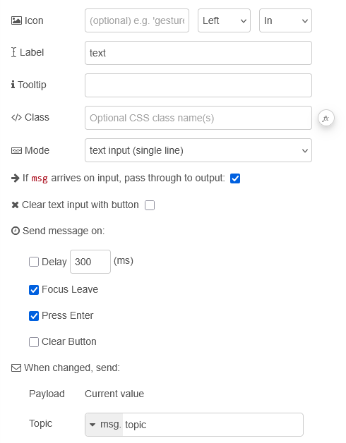
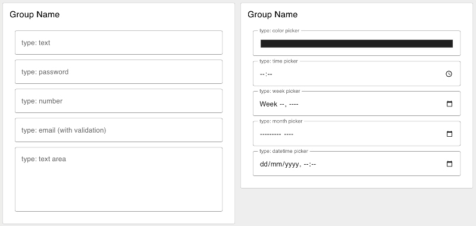

| [На головну](../) | [Розділ](README.md) |
| ----------------- | ------------------- |
|                   |                     |

# Text Input `ui-text-input`

https://dashboard.flowfuse.com/nodes/widgets/ui-text-input

- `Icon` (динамічна) - Відображає іконку Material Design у полі текстового введення. Префікс "mdi-" вказувати не потрібно.

- `Icon Position` (динамічна) - Якщо задано Icon, визначає, з якого боку від Label буде відображатися іконка.

- `Icon Inner Position` (динамічна) - Якщо задано Icon, визначає, чи відображається іконка всередині або зовні поля текстового введення.

- `Label` (динамічна) - Текст, що відображається у полі текстового введення. Дозволено HTML-вміст.

- `Tooltip` -  Текст, що відображається при наведенні курсора на поле текстового введення.

- `Mode` (динамічна) - Тип HTML-поля введення. Доступні варіанти: `text | password | email | number | tel | color | date | time | week | month | datetime-local`

- `Passthrough` - Визначає, чи має повідомлення, отримане цим вузлом у Node-RED, передаватися на вихід так, ніби в поле було введено нове значення.

- `Send On "Delay"` - Якщо увімкнено, msg буде надіслано після затримки, заданої параметром "Delay (ms)".

- `Delay` - Якщо "Send On Delay" увімкнено, значення з поля текстового введення буде надіслано після вказаної затримки (у мілісекундах).

- `Clear selection with button` (динамічна) - Якщо true, праворуч з’являється іконка або кнопка для очищення поля текстового введення.

- `Send On "Focus Leave"` - Надсилає msg, коли поле текстового введення втрачає фокус. Повідомлення надсилається завжди, навіть якщо значення не змінилося.

- `Send On "Press Enter"` - Надсилає msg, коли користувач натискає клавішу Enter. Повідомлення надсилається завжди, навіть якщо значення не змінилося.

- `Send On "Clear Button"` - Надсилає msg, коли користувач очищає поле текстового введення за допомогою кнопки очищення. Параметр "Clear selection with button" має бути увімкнений.

Динамічні властивості – це властивості, які можуть бути перевизначені під час виконання шляхом надсилання відповідного `msg` до вузла. За потреби значення, задані в конфігурації Node-RED, будуть замінені значеннями з отриманих повідомлень.

| Prop                | Payload                           | Structures | Example Values     |
| ------------------- | --------------------------------- | ---------- | ------------------ |
| Class               | `msg.class`                       | `String`   |                    |
| Mode                | `msg.ui_update.mode`              | `String`   |                    |
| Label               | `msg.ui_update.label`             | `String`   |                    |
| Icon                | `msg.ui_update.icon`              | `String`   |                    |
| Icon Position       | `msg.ui_update.iconPosition`      | `String`   | `left`|`right`     |
| Icon Inner Position | `msg.ui_update.iconInnerPosition` | `String`   | `inside`|`outside` |
| Clearable           | `msg.ui_update.clearable`         | `Boolean`  |                    |

`msg.enabled: true | false` - Дозволяє керувати тим, чи активне поле текстового введення.

Приклад

