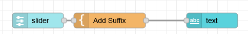
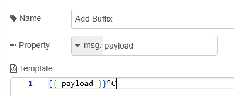
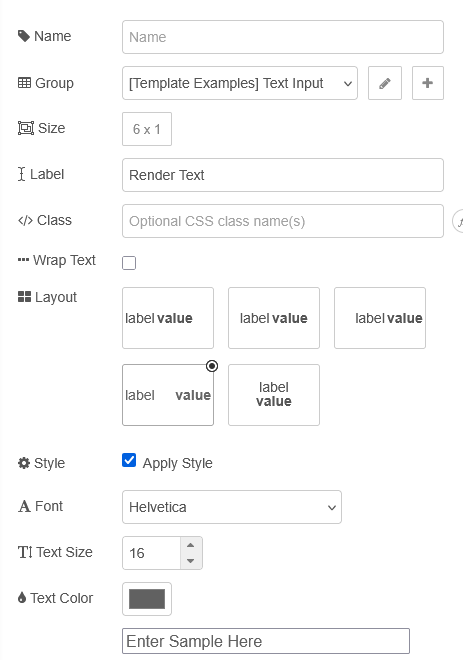
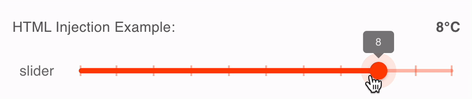
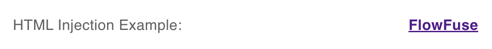
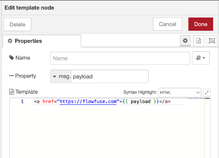

| [На головну](../) | [Розділ](README.md) |
| ----------------- | ------------------- |
|                   |                     |

# Text `ui-text`

https://dashboard.flowfuse.com/nodes/widgets/ui-text.html

Відображає в інтерфейсі користувача текстове поле, яке не можна редагувати. Кожен отриманий `msg.payload` оновлюватиме значення, показане поряд із (необов’язковою) міткою.

## Властивості

| Prop       | Dynamic | Description                                                  |
| ---------- | ------- | ------------------------------------------------------------ |
| Group      |         | Defines which group of the UI Dashboard this widget will render in. |
| Size       |         | Controls the width of the button with respect to the parent group. Maximum value is the width of the group. |
| Label      |         | The text shown within the button.  Html content is allowed.  |
| Layout     |         | Choose how to layout your label (if defined) & value.        |
| Style      |         | Checkbox to define whether or not to include custom styling for the text. Enabling this will then show the below options. |
| Font       |         | If "style" is enabled, this will define the font of the text. |
| Text Size  |         | If "style" is enabled, this will define the size of the text. |
| Text Color |         | If "style" is enabled, this will define the color of the text. |

## Додавання префіксів і суфіксів

У Dashboard 1.0 існував параметр під назвою `valueFormat`, який дозволяв вам додавати префікс або суфікс до віджета `ui-text` у конфігурації вузла. Незважаючи на те, що це було цінно, воно мало багато вразливостей у безпеці, тому з Dashboard 2.0 ми прийняли рішення видалити його.

Замість цього ми використовуємо інший підхід і використовуємо вбудований вузол «шаблон» Node-RED:








Що відображає:



Ми робимо це тому, що цей підхід можна використовувати далеко за межі простого віджета `ui-text` і його можна використовувати для введення вмісту HTML у будь-який віджет за допомогою [динамічних властивостей](https://dashboard.flowfuse.com/user/dynamic-properties.html).

## Візуалізація HTML

Віджет `ui-text` підтримує вміст HTML (через `msg.payload`). Це дозволяє відтворювати форматований текст, посилання, зображення тощо.

### Статичний HTML

Наприклад, введення:

```html
<a href="https://flowfuse.com" target="_blank">FlowFuse</a>
```

як `msg.payload` відобразить:



### Відтворення вмісту `msg.`

Якщо ви хочете відобразити вміст `msg.` і все одно обернути його в HTML, ви можете використовувати стандартний `шаблон` Node-RED, щоб означити структуру HTML:

З вмістом вузла `template` встановлено значення:



## Динамічні властивості

Динамічні властивості – це властивості, які можна змінити під час виконання, надіславши певне `msg` до вузла.

У відповідних випадках основні значення, встановлені в Node-RED, будуть замінені значеннями, встановленими в отриманих повідомленнях.

| Prop      | Payload                  | Structures                                                   | Example Values |
| --------- | ------------------------ | ------------------------------------------------------------ | -------------- |
| Label     | `msg.ui_update.label`    | `String`                                                     |                |
| Layout    | `msg.ui_update.layout`   | `String<'row-left', 'row-center', 'row-right', 'row-spread', 'col-center'>` |                |
| Font      | `msg.ui_update.font`     | `String`                                                     |                |
| Font Size | `msg.ui_update.fontSize` | `String`                                                     |                |
| Color     | `msg.ui_update.color`    | `String`                                                     |                |
| Class     | `msg.class`              | `String`                                                     |                |

## Наприклад


