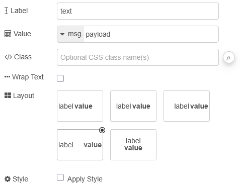
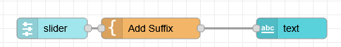
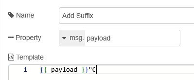
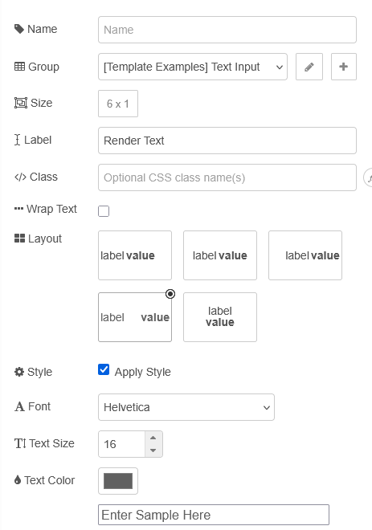
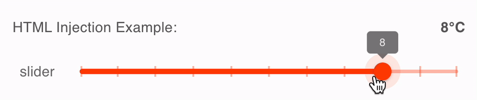
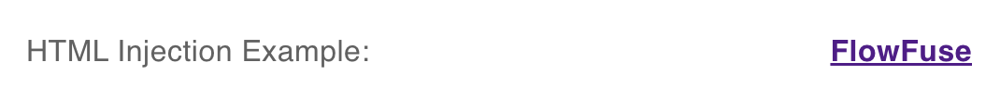
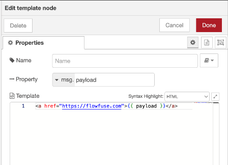
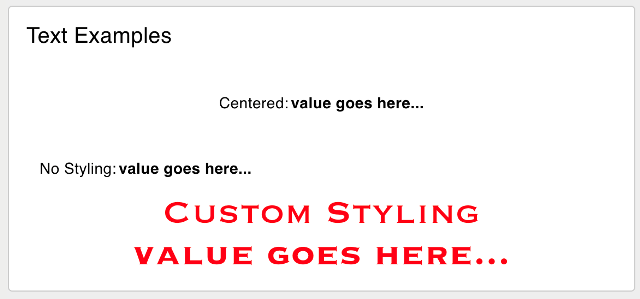

| [На головну](../) | [Розділ](README.md) |
| ----------------- | ------------------- |
|                   |                     |

# Text `ui-text`

https://dashboard.flowfuse.com/nodes/widgets/ui-text.html

Відображає в інтерфейсі користувача текстове поле, яке не можна редагувати. Кожен отриманий `msg.payload` оновлюватиме значення, показане поряд із (необов’язковою) міткою.



рис.1.

- `Label` - Текст, що відображається як підпис віджета. Дозволено HTML-вміст.

- `Layout` -  Визначає спосіб компонування підпису (якщо задано) та значення.

- `Style`  - Прапорець, який визначає, чи використовувати користувацьке стилізування тексту. Якщо увімкнено, стають доступними наведені нижче параметри.

- `Font` -  Якщо "Style" увімкнено, визначає шрифт тексту.

- `Text Size` - Якщо "Style" увімкено, визначає розмір тексту.

- `Text Color` - Якщо "Style" увімкено, визначає колір тексту.

- `Value`  (динамічна) - Значення, яке відображається текстовим віджетом. Може бути властивістю повідомлення, наприклад `msg.payload` або `msg.myProperty`, змінною контексту `flow/global` або статичним значенням. Також можна використати тип `JSONata` для обчислення значення, наприклад $round(payload, 1) для округлення до 1 знака після коми.

## Додавання префіксів і суфіксів

У Dashboard 1.0 існував параметр під назвою `valueFormat`, який дозволяв вам додавати префікс або суфікс до віджета `ui-text` у конфігурації вузла. Незважаючи на те, що це було цінно, воно мало багато вразливостей у безпеці, тому з Dashboard 2.0 ми прийняли рішення видалити його.

Замість цього ми використовуємо інший підхід і використовуємо вбудований вузол «шаблон» Node-RED:



рис.2.



рис.3.



рис.4.

Що відображає:



рис.5.

Ми робимо це тому, що цей підхід можна використовувати далеко за межі простого віджета `ui-text` і його можна використовувати для введення вмісту HTML у будь-який віджет за допомогою [динамічних властивостей](https://dashboard.flowfuse.com/user/dynamic-properties.html).

## Візуалізація HTML

Віджет `ui-text` підтримує вміст HTML (через `msg.payload`). Це дозволяє відтворювати форматований текст, посилання, зображення тощо.

Наприклад, введення:

```html
<a href="https://flowfuse.com" target="_blank">FlowFuse</a>
```

як `msg.payload` відобразить:



рис.6.

Якщо ви хочете відобразити вміст `msg.` і все одно обернути його в HTML, ви можете використовувати стандартний `шаблон` Node-RED, щоб означити структуру HTML:

З вмістом вузла `template` встановлено значення:



рис.7.

## Динамічні властивості

Динамічні властивості – це властивості, які можна змінити під час виконання, надіславши певне `msg` до вузла.

У відповідних випадках основні значення, встановлені в Node-RED, будуть замінені значеннями, встановленими в отриманих повідомленнях.

| Prop      | Payload                  | Structures                                                   | Example Values |
| --------- | ------------------------ | ------------------------------------------------------------ | -------------- |
| Label     | `msg.ui_update.label`    | `String`                                                     |                |
| Layout    | `msg.ui_update.layout`   | `String<'row-left', 'row-center', 'row-right', 'row-spread', 'col-center'>` |                |
| Font      | `msg.ui_update.font`     | `String`                                                     |                |
| Font Size | `msg.ui_update.fontSize` | `String`                                                     |                |
| Color     | `msg.ui_update.color`    | `String`                                                     |                |
| Class     | `msg.class`              | `String`                                                     |                |

Наприклад



рис.8.

