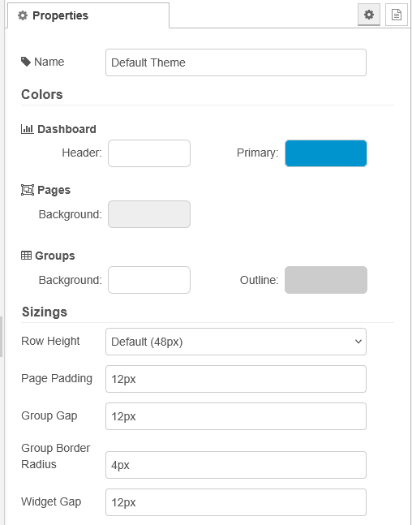
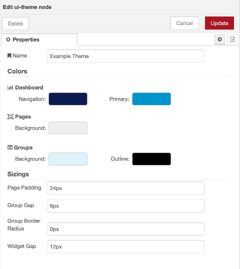
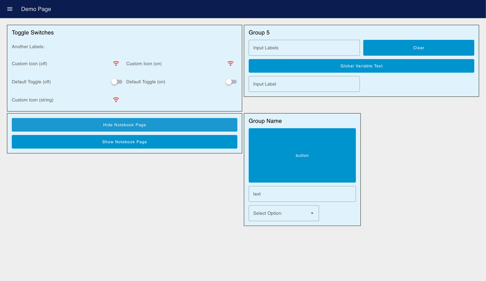
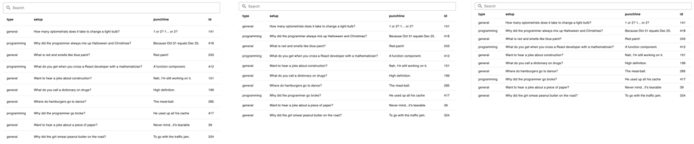

| [На головну](../) | [Розділ](README.md) |
| ----------------- | ------------------- |
|                   |                     |

# Config: UI Theme `ui-theme`

https://dashboard.flowfuse.com/nodes/config/ui-theme

Кожній сторінці можна призначити тему, яка використовується для її відображення. Тема є набором кольорів і розмірів, що визначають зовнішній вигляд і поведінку віджетів.

рис.1.

`Colors` - Кольори

| Prop                | Description                                                  |
| ------------------- | ------------------------------------------------------------ |
| Header              | Керує кольором шапки та бічних навігаційних меню.            |
| Primary             | Колір для всіх інтерактивних елементів, зокрема кнопок, повзунків і стану фокусу полів введення. |
| Pages – Background  | Колір фону всієї сторінки.                                   |
| Groups – Background | Колір фону всіх груп, що відображаються на сторінці.         |
| Groups – Outline    | Колір рамки груп, що відображаються на сторінці.             |

`Sizes` - Розміри

| Prop                | Description                                                  |
| ------------------- | ------------------------------------------------------------ |
| Row Height          | Визначає висоту одного рядка (одиниці висоти) в Dashboard. Доступні варіанти: `Default (48 px)`, `Comfortable (36 px)` і `Compact (32 px)`. |
| Page Padding        | Відступи навколо всіх груп на сторінці. Застосовується для макетів `Grid` і `Fixed`, а також для макетів `Notebook`, коли ширина екрана менша за `1024 px`. Для `Page Padding` можна окремо задати відступи з кожного боку сторінки, використовуючи скорочений CSS-запис (CSS shorthand). |
| Group Gap           | Відстань між групами в макеті. За замовчуванням: 12 px.      |
| Group Border Radius | Радіус заокруглення рамки кожної групи на сторінці. За замовчуванням: 4 px. |
| Widget Gap          | Відстань між віджетами всередині групи. За замовчуванням: 12 px. |

Приклади

рис.2. Приклад конфігурації вузла ui-theme у Node-RED.

рис.3. Результуючий Dashboard із застосованою темою.

Зауваження: у наведеному прикладі кольори були підібрані для кращого розрізнення груп, а не з міркувань естетики.

Порівняння висоти рядків для елемента UI Table:

рис.4. `Default` (ліворуч), `Comfortable` (посередині), `Compact` (праворуч).

Параметр `Row Height` визначає, якої висоти буде один рядок (одиниця висоти) в Dashboard. Доступні значення: `Default (48 px)`, `Comfortable (36 px)` і `Compact (32 px)`.